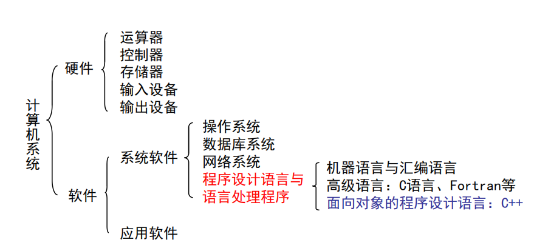
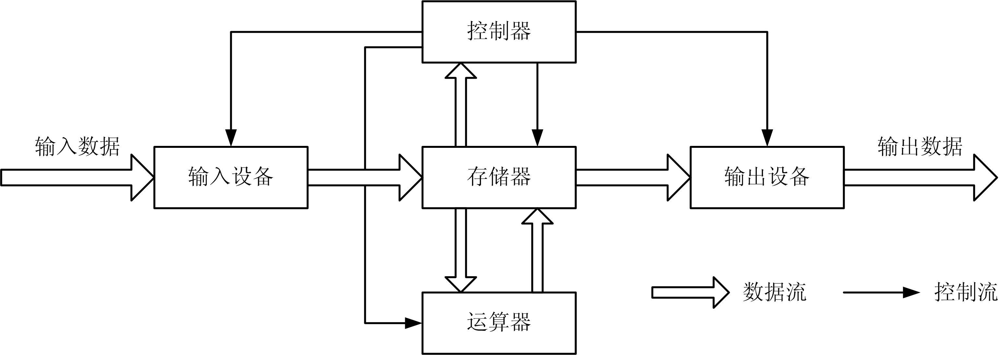

### 1.1 计算机系统的组成


* 计算机系统的硬件组成： 
    >1.运算器  
    >2.控制器  
    >3.存贮器  
    >4.输入设备  
    >5.输出设备  

* 图1.1 计算机的基本结构



### 1.2 指令与程序
* 指令：  
    * 指令是计算机执行某种操作的机器命令，它可以被计算机硬件直
接识别和执行。  
    * 计算机指令用二进制代码表示，一条指令通常由两个部分组成：  
        |     |   |    
        |  ----  | ----  |    
        | 操作码  | 操作数 |    
        |    |   |   

* 计算机程序（computer program）  
    > 计算机程序是指**完成一定功能的指令的有序集合**。  
* 软件（software）  
    > 软件是指程序、程序运行所需要的数据以及开发、使用和维护这些程序所需要的文档的集合。  


### 1.3 程序设计语言的发展  
> 1.程序设计语言是用来编写计算机程序的工具。  
> 2.只有用机器语言编写的程序才能被计算机直接执行，其他任何语言编写的程序都需要翻译成机器语言。  
> 3.按照程序设计语言的发展历程，大致可分为**机器语言**、**汇编语言**、**高级语言**3类。  

* 机器语言  
    > 机器语言是由二进制0和1按一定规则组成的、能被计算机直接理解和执行的指令集合。机器语言中的每一条语句实质是一条指令。  

    ```
    10110000 00010000 ;往寄存器AL送16（10H）
    00000100 00001010 ;寄存器AL加10（0AH），且送回AL中
    11110100          ;结束，停机
    ```
* 汇编语言  
    > 汇编语言，将机器指令的代码用英文助记符来表示，如MOV表示数据传送、ADD表示加、JMP表示程序跳转、HLT表示停机等。  
    ```
    MOV AL,10 ;往寄存器AL送16（10H）  
    ADD AL,0A ;寄存器AL加10（0AH），且送回到AL中  
    HLT       ;结束，停机  
    ```

* 高级语言  
    > 高级语言是一种接近人的自然语言和数学公式的程序设计语言。
    ```
    a=10 ;往变量aL送10
    ```

### 1.4 C++语言  
> ►1972年C语言诞生；  
> ►20世纪80年代出现面向对象的程序设计方法；  
> ►Bjarne Stroustrup于20世纪80年代初在C语言的基础上开发出了C++；  


* C++语言发展的里程碑：  
    > ►1979年 Bjarne Stroustrup开发设计  
    > ►1998年 ANSI/ISO C++标准建立  
    > ►1998年 《The C++ Programming Language》第三版  
    > ►2003年 ISO-IEC 14882-2003（简称C++03版本）  
    > ►2011年 ISO/IEC 14882-2011（简称C++11版本）  

* C++和C的关系：  
    > ►C++保留了C语言原有的所有优点，增加了面向对象的机制；  
    > ►C++是由C发展而来的，与C兼容，C++是C的超集；  
    > ►用C语言写的程序基本上可以不加修改地用于C++；   
    > ►C++既可用于面向过程的结构化序设计，又可用于面向对象的程序设计，是一种功能强大的混合型的程序设计语言。  

* C++对C的“增强”，表现在两个方面：  
    > ►(1) 在原来面向过程的机制基础上，对C语言的功能做了不少扩充。  
    > ►(2) 增加了面向对象的机制。  
    > ►所以，初学C++也有学习C的过程。


* C++字符集  
    > C++语法允许使用的字符的集合称为C++字符集。C++03标准的字符集如下：  
    ```
    ①小写字母26个： a b c d e f g h i j k l m n o p q r s t u v w x y z  
    ②大写字母26个： A B C D E F G H I J K L M N O P Q R S T U V W X Y Z  
    ③数字字符10个： 0 1 2 3 4 5 6 7 8 9  
    ④符号29个： _ { } [ ] # ( ) < > % : ; . ? * + - / ^ & | ~ ! = , \ " ’  
    ⑤空白符5个： 空格 TAB 回车换行 CTRL+L CTRL+K  
    ```

* 关键字又称为保留字，是C++规定的有特定含义的词语。C++03标准定义了63个关键字，主要是关于数据类型和语句的词语。[c++63个关键字](https://blog.csdn.net/tainys/article/details/85289043 'c++63个关键字')  

    |     |     |     |     |     |     
    | --- | --- | --- | --- | --- |     
    | asm | do | if | return | typedef |   
    | auto | double | inline | short | typeid |   
    | bool | dynamic_cast | int | signed | typename |   
    | break | else | long | sizeof | union |   
    | case | enum | mutable | static | unsigned |   
    | catch | explicit | namespace | static_cast | using |   
    | char | export | new | struct | virtual |   
    | class | extern | operator | switch | void |   
    | const | false | private | template | volatile |   
    | const_cast | float | protected | this | wchar_t |   
    | continue | for | public | throw | while |   
    | default | friend | register | true |  |   
    | delete | goto | reinterpret_cast | try |  |   
    |     |     |     |     |     |   


* C++标识符：  
    * ① 标识符只能由大小写字母、数字和下划线组成，且第一个字符必须是字母或下划线；  
    * ② 字母是大小写区分的，即大写字母和小写字母被认为是两个不同的字符；  
    * ③ 标识符不能是C++语言的关键字。  

    * 合法的标识符：
        ```
        a,b,sum,tagDATA,Student,nCount  
        MAX_SIZE,_LABEL,foo,func,DATE  
        ```
    * 不合法的标识符：  
        ```
        john@nwpu.edu.cn,8849,#123,3abc,a>b
        ```

* 简单的C++程序： 
    * 【例1.1】  
    ```cpp{.line-numbers}  
    #include <iostream>
    using namespace std; /*使用标准命名空间*/
    int main() /*主函数*/
    {
    cout << "hello,world" << endl; /*输出*/
    return 0; /*主函数正常结束返回0*/
    }
    ```

    * 【例1.2】  
    ```
    #include <iostream> //标准输入输出函数库
    using namespace std; //使用标准命名空间
    int main() //主函数
    {
    int a, b, sum; //定义3个变量
    cin >> a >> b; //输入两个数
    sum=a+b; //计算两个数之和
    cout << "a+b=" << sum << endl; //输出结果
    return 0; //主函数正常结束返回0
    }
    ```

    * 【例1.3】  
    ```
    #include <iostream> //标准输入输出函数库
    #include <cmath> //数学函数库
    using namespace std; //使用标准命名空间
    double root(double x, double y) //root函数求x-y的平方根
    { if(x>=y) return sqrt(x-y);//只有在x大于等于y时计算x-y的平方根
    else return 0; //否则返回0
    }
    int main() //主函数
    { double a, b; //定义两个浮点型变量
    cin >> a >> b ;//输入两个数
    cout << root(a,b) << endl; //输出a-b的平方根
    return 0; //主函数正常结束返回0
    }
    ```

* C++程序的特点：  
    > ►（1）C++程序总是从main函数开始执行。  
    > ►（2）书写格式自由。  
    > ►（3）分号是语句的组成部分，表示语句结束。  
    > ►（4）程序中可以加注释，便于阅读。  

**”C++的目标是——在保证效率与C语言相当的情况下，加强程序的组织性，保证同样功能的程序，C++更短小。”**