## 1、进位计数制

* 各种信息进入计算机，都要转换成“0”和“1”的二进制形式。计算机采用二进制的原因是：  
    > （1）物理上容易实现，可靠性高。  
    > （2）运算简单，通用性强。  
    > （3）便于表示和进行逻辑运算。  

* 进位计数制的特点：  
    > （1）采用进位的方式进行计数；  
    > （2）使用位置表示法。 
 
    例如：  
        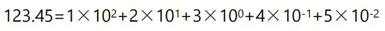

    > 表2-1 计算机中常用的数字系统
    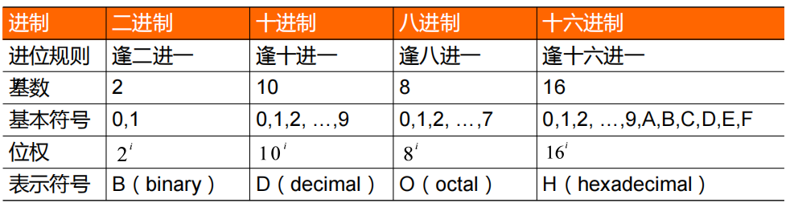

## 2、数制间的转换
1. 十进制数转换成二进制数  
2. 二进制数转换成十进制数  
3. 二、八、十六进制数相互转换  

* 十进制数转换成二进制数 
    > 【例2.1】将十进制数转换成二进制数。
    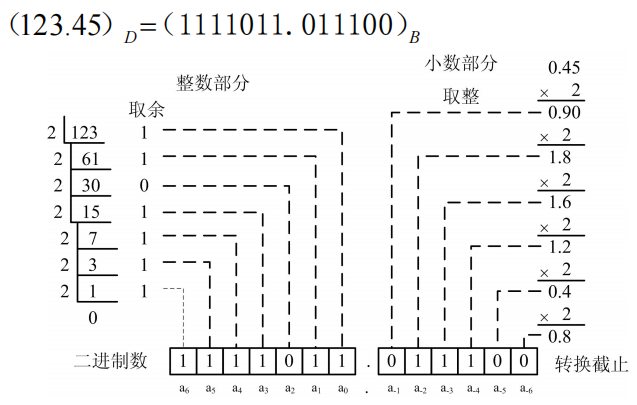

    > 【例2.2】将十进制数转换成二进制数。  
    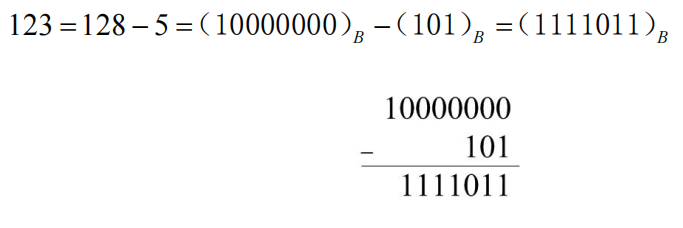

* 二进制数转换成十进制数
    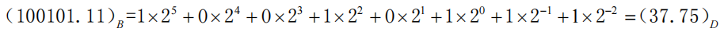

* 八、十六进制数相互转换  
    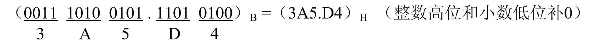
    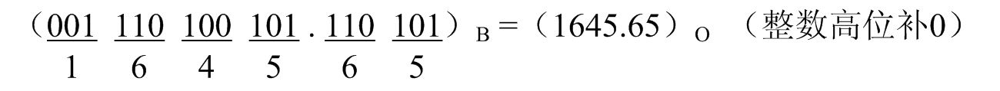
    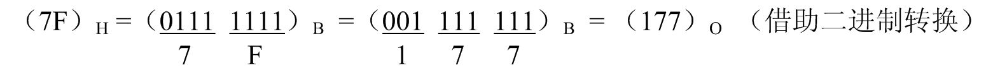

## 3、数值数据在计算机中的表示

* 整数在计算机中的表示   
    * 由于计算机只有0和1的数据形式，因此数的正（+）、负（–）号也要用0和1编码。通常将一个数的高二进制位定义为符号位，称为数符，用0表示正数、1表示负数，其余位表示数值。  
    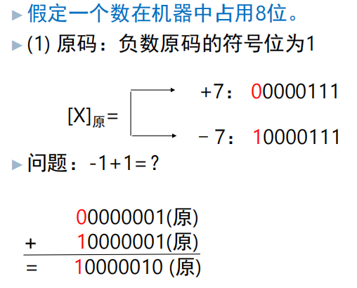
    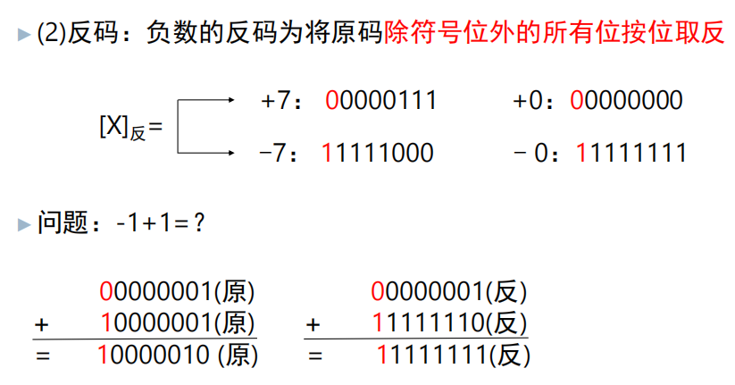
    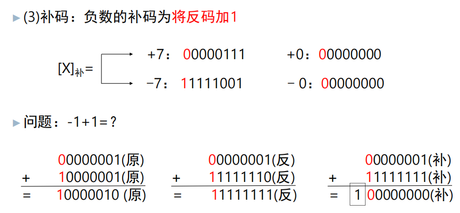
    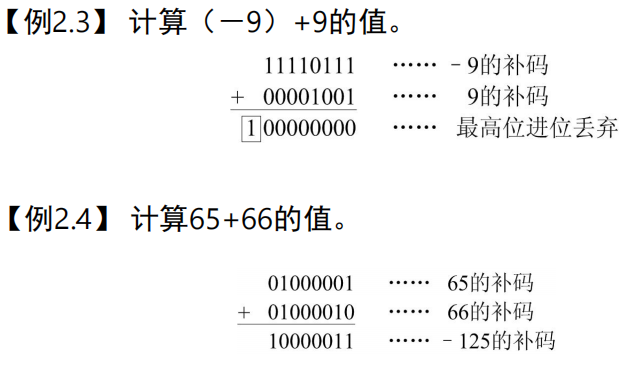

* 浮点数在计算机中的表示  
    > 数学中的实数在计算机中称为浮点数，是指小数点不固定的数。浮点数在计算机中的表示方法比整数复杂得多。  
    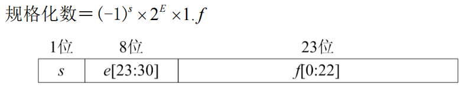
    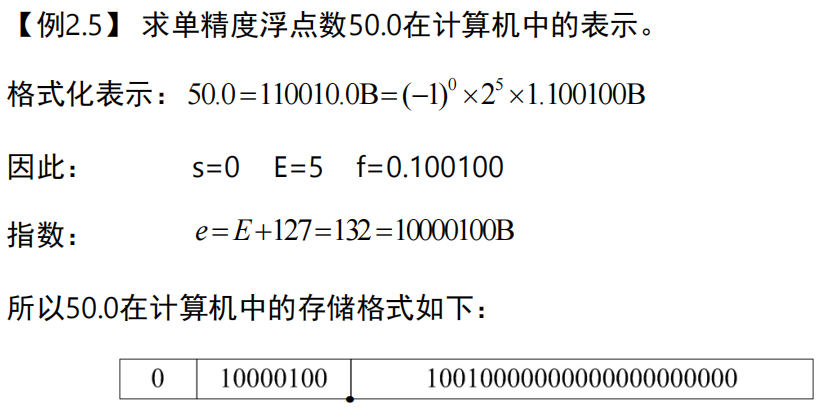

## 4、非数值数据在计算机中的表示

* 西文字符  
> 西文字符包含英文字符、数字、各种符号。  
> 最常用的西文字符集是美国信息交换标准代码ASCII（american standard code for information interchange）。ASCII码使用7位二进制编码，编码值从0到127，可以表示即128个字符。  
> 表2-3 ASCII码表  
> 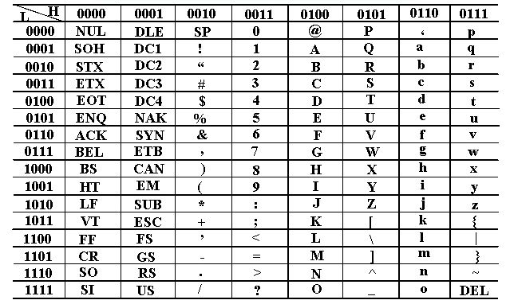

