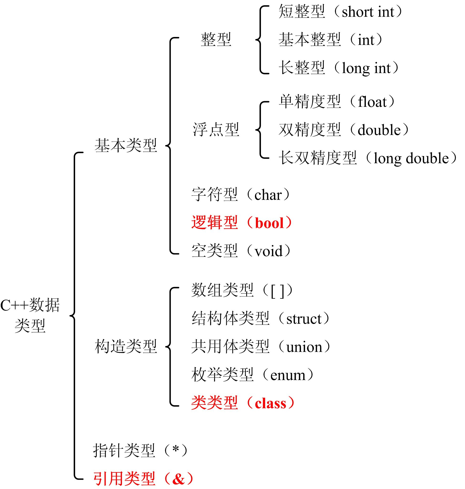

# 程序中数据的表示

## 1、数据类型
* 利用计算机求解问题，首先要做的就是将数据引入到计算机中。
* 在程序语言中是通过数据类型来描述不同的数据形式的，数据类型不同，求解问题的方法也会不同。
    

* 表3-1 基本类型数据的内存长度和数值范围

| 类型 | 类型标识符 | 内存长度 | 数值范围 | 精度 |  
| - | - | - | - | - |  
| 整型 | [signed] int | 4 | -2147483648 ～ +2147483647 |  |  
| 无符号整型 | unsigned [int] | 4 | 0 ～ 4294967295 |  |  
| 短整型 | [signed] short [int] | 2 | -32768 ～ +32767 |  |  
| 无符号短整型 | unsigned short [int] | 2 | 0 ～ 65535 |  |  
| 长整型 | [signed] long [int] | 4 | -2147483648 ～ +2147483647 |  |  
| 无符号长整型 | unsigned long [int] | 4 | 0 ～ 4294967295 |  |  
| 字符型 | [signed] char | 1 | -128 ～ +127 |  |  
| 单精度型 | float | 4 | 3.4×10^-38～3.4×10^38 | 7 |  
| 双精度型 | double | 8 | 1.7×10^-308～1.7×10^308 | 16 |  
| 长双精度型 | long double | 同上 | 同上 | 19 |  
| 逻辑型 | bool | 1 | 0或1 |  |  


### 1．整形
* C++语言整型分为长整型（long int）、基本整型（int）和短整型（short int）
* long int可以简写为long、short int可以简写为short。
* short ≤ int ≤ long

* 不同的数据类型规定了不同的机器数长度，决定了对应数据的数值范围，当一个整数超出此范围时计算机会将其转换为数值范围内所允许的一个数，称为**整型数据的溢出处理**。

* 一般地，超过最大值的有符号整型数值会向上溢出变成负数，超过最小值的数据会向下溢出变成正数。

* 图3.1 short型的溢出
    


### 2．浮点型
* C++语言浮点型又称实型，分为单精度（float）、双精度（double）和长双精度（long double）3种。
* 在C++中规定**float型**在内存中占用4个字节，提供**7位有效数字**；
* **double型和long double型**在内存中占用8个字节，提供**16位有效数字**。

* 因为浮点型数据长度是有限的，所以浮点数存在计算误差。
* 虽然浮点数精度越高计算结果越精确，但其处理时间也长。
* 一个较大的浮点数与一个很小的浮点数做加法时，由于精度限制使得很小的浮点数被忽略了，从而使得这样的加法无意义。


* 【例3.1】
    ```cpp
    #include <iostream>
    #include <iomanip>
    using namespace std;
    int main()
    {
        float a=0.00000678f;
        double b=0.00000678;
        a = a + 111111.111f;
        b = b + 111111.111;
        cout<<setiosflags(ios::fixed)<<setprecision(16);
        cout<<"a="<<a<<",b="<<b<<endl;
        return 0;
    }
    ```
    运行结果：  
    ```cpp
    a=111111.1093750000000000,b=111111.1110067800036632
    ```


### 3．字符型
* C++语言字符型分为有符号（signed char）和无符号（unsigned char）两种，其中signed书写时可以省略。
* 字符型数据在内存中占用1个字节，采用二进制形式存储。
* 字符型数据可以存储单字节字符，如ASCII码，此时在内存中的数据是字符的ASCII码值。例如字符'A'在内存中的存储形式为  
      

* 在C++语言中**字符型数据和整型数据之间可以通用**。一个字符数据可以赋给整型变量，一个整型数据也可以赋给字符型变量，还可以对字符型数据进行算术运算。

* 【例3.2】
    ```cpp
    #include <iostream>
    using namespace std;
    int main()
    {
        int i, j;
        char c1,c2;
        c1='a'; //字符数据赋值给字符型
        c2=98; //整数数据赋值给字符型
        i='A'; //字符数据赋值给整型
        j=66; //整数数据赋值给整型
        cout<<"i="<<i<<",j="<<j<<",c1="<<c1<<",c2="<<c2<<endl;
        cout<<"c1-32="<<c1-32<<endl; //字符型可以进行减法运算
        return 0;
    }
    ```
    运行结果：  
    ```cpp
    i=65 , j=66 , c1=a , c2=b
    c1-32=33
    ```

## 2、常量
* 常量（constant）是指程序中其值不能被修改的数据。分为**字面常量**和**符号常量**。

* 从字面形式即可识别的常量称为字面常量（literal constant），例如64、3.1415926和‘A’等。

* 每个字面常量都具有数据类型，由它的书写形式和值来决定。

### 1. 整型常量
1. 十进制整数。以非零十进制数1～9组成的整数，例如13579,-680等。
2. 八进制整数。以0开头和八进制数0～7组成的整数，例如012，0177等。
3. 十六进制整数。以0x或0X开头和十六进制数0～9、A～F或a～f组成的整数（字母大小写任意），例如0x1234，0xab，0xCF等。


### 2. 浮点型常量
1. **小数形式**。由小数点、十进制整数和小数组成的浮点数。整数和小数可以省略其中之一，但不能省略小数点。  
    > 如： .123、123. 、0.0等。  
2. 指数形式，又称科学记数法表示。以f E n或 f e n格式组成的浮点数，其中E或e表示以10为底的幂，f可以是整数或小数，n为指数且必须是整型。  
    > 如： 0.31415926e+1、314.15926E-2等。

**浮点型常量默认为double型。若在浮点数后面加一个字母f或F，则它是float型。**


### 3. 字符常量

* 以一对单引号（' '）括起来的一个字符表示字符常量，如：'A'、'0'、'&'、**'ab' 错误！**
* 字符常量表示的是一个字符，存储的是该字符的ASCII码值。例如'A'表示英文字符A，数据值是65；'2'表示数字字符2，数据值是50。
* 注意区别字符'2'和整数2的写法。  

### 4. 用转义字符表示字符常量
* 以反斜线（`\`）开头，后跟一个或几个字符序列表示的字符称为**转义字符**，如`\n`表示换行符。
* 采用转义字符可以表示ASCII字符集中不可打印或不方便输入的控制字符和其他特定功能的字符。
* 表3-1 转义字符及其含义  
  
| 转义字符形式 | 含义 | ASCII码值 |  
| - | - | - |   
| `\a` | 响铃符 | 7 |  
| `\b` | 退格符 | 8 |  
| `\f` | 进纸符，将光标位置移到下页开头 | 12 |  
| `\n` | 换行符，将光标位置移到下一行开头 | 10 |  
| `\r` | 回车符，将光标位置移到本行开头 | 13 |  
| `\t` | 水平制表符，光标跳到下一个TAB位置 | 9 |  
| `\v` | 垂直制表符 | 11 |  
| `\'` | 单引号 | 39 |  
| `\"` | 双引号 | 34 |  
| `\\` | 反斜线 | 92 |  
| `\?` | 问号 | 63 |  
| `\0` | 空字符 | 0 |  
| `\ooo` | 用1～3位八进制数ooo为码值所对应的字符 | ooo（八进制） |  
| `\xhh` | 用1～2位十六进制数hh为码值所对应的字符 | hh（十六进制） |  


* `\ooo`和`\xhh`称为通用转义字符，其中`ooo`表示可以用1至3位八进制数作为码值表示一个ASCII字符，`hh`表示可以用1至2位十六进制数作为码值表示ASCII字符。  
    > 如："\1234" "\123和4"，"\128" "\12和8"，"\19" "\1和9"，  
    > **\9 错误！ ，\0xFE 错误！**

* 由于字符型数据在内存中只占用1个字节，即使按无符号处理其最大值也仅是255（八进制为377），因此`ooo`的数值范围为0～377（八进制），其他值使得字符型数据溢出。同理，`hh`的数值范围为0～FF。

* 【例3.3】转义字符应用举例
    ```cpp
    #include <iostream>
    using namespace std;
    int main()
    { 
        cout<<"ab c\t de\rf\tg"<<endl;
        cout<<"h\ti\b\bj k\n123\'\"\\\x41\102CDE"<<endl;
        return 0;
    }
    ```
    运行结果：  
    ```cpp
    f└┘└┘└┘└┘└┘└┘└┘g d e
    h└┘└┘└┘└┘└┘└┘ j└┘k
    123'"\ABCDE
    ```
    

### 5. 字符串常量
* 以一对双引号（" "）括起来的零个或多个字符组成的字符序列称为**字符串常量**，ASCII字符集或多字节字符集（如汉字、日韩文字等）都可以组成字符串。

* 双引号是字符串常量的边界符，不是字符串的一部分，如果在字符串中要出现双引号应使用转义字符（`\"`）。

    ```cpp
    "" //空字符串（0个字符）
    " " //包含一个空格的字符串
    "Hello,World\n" //包含Hello,World 和 换行符的字符串
    "xyz\101\x42" //包含x y z AB的字符串
    "\\\'\"\n" //包含反斜线（\\） 单引号（\'）和双引号（\"）的字符串
    ```

### 6. 符号常量

* 符号常量定义形式为：
    ```cpp
    #define 标识符 常量
    ```

* 其中#define是宏定义命令，作用是将标识符定义为常量值，在程序中所有出现该标识符的地方均用常量替换。
    > 例：#define PRICE 30

* 【例3.4】符号常量应用举例 
    ```cpp
    #include <iostream>
    using namespace std;
    #define PI 3.1415926 //3.1415926即为圆周率π
    int main()
    {
        double r=5.0;
        cout<<"L="<<2*PI*r<<",S="<<PI*r*r<<endl; //PI为3.1415926
        return 0;
    }
    ```


## 3、变量

* 在程序运行期间其值可以改变的量称为变量（variable）。

* 变量实际上就是计算机中的一个内存单元。
* C++语言规定变量应该有一个名字，用变量名代表内存单元。
* C++语言通过定义变量时指定其数据类型来确定内存单元的大小，不同的数据类型有不同的数据形式和存储形式，需要一定数量（单位为字节）的内存单元。


### 1. 变量的使用
* C++语言变量必须“先定义，后使用”，定义变量的一般形式是：  
    ```cpp
    变量类型 变量名列表;
    ```
    ```cpp
    double a , b , c , d; //定义实型变量
    int i , j , k; //一次定义多个int型变量
    int a, char c; //错误
    ```
* 变量定义后，变量值是未确定的（除了静态存储情形），即变量值是随机的。直接使用此时的变量参与运算，运算结果也是随机的。

* 在变量定义的同时给变量一个初值，称为变量初始化（initialized），一般形式为：
    ```cpp
    变量类型 变量名=初值;
    ```
    ```cpp
    变量类型 变量名1=初值1, 变量名2=初值2, ... ;
    ```
    ```cpp
    double pi=3.1415926; //正确，初始化pi为3.1415926
    int x , y , k=10; //正确，可以只对部分变量初始化
    int a=1 , b=1 , c=1; //正确，可以同时初始化多个变量
    int d=a , e=a+b; //错误，初值不能是变量或表达式
    int m=n=z=5; //错误，不能对变量连续初始化
    ```

* 定义变量后，可以通过赋值语句为变量赋予新的数据，一般形式为：
    ```cpp
    变量名 = 表达式;
    ```
* 赋值后，无论变量原来的值是多少，都将被新值替代。
    ```cpp
    int k; k=5; //给k赋值5
    ...... //k保持不变
    k=10; //重新给k赋值10，k已改变不再是5
    ```
### 2. 变量的const限定

* 在变量定义前加上const修饰，这样的变量称为只读变量（read-only variable）或常变量（constant variable）

* 它在程序运行期间的值不能被修改。其定义的一般形式为  
    ```cpp
    const 变量类型 变量名列表;
    ```
    ```cpp
    int x;
    const int i=6 , j=10; 
    x=i+1; //正确，可以使用const变量
    i=10; //错误，不可以给const变量赋值
    const int i=6; //正确
    const int m; //错误
    ```
* const限定过的变量在编译过程中若发现有修改的操作时会报编译错误，从而“阻止”对变量的修改。

* 使用const限定强制实现对象最低访问权限，是现代软件开发的设计原则之一。
* 【例3.5】  
    ```cpp
    #include <iostream> //标准输入输出函数库
    #include <cmath> //数学函数库
    using namespace std; 
    double root(const double x, const double y) //root函数求x-y的平方根
    { 
        if (x>=y) return sqrt(x-y); //只有在x大于等于y时计算x-y的平方根
        else return 0; //否则返回0
    }
    int main() //主函数
    { 
        double a, b; //定义两个浮点型变量
        cin>>a>>b; //输入两个数
        cout<<root(a,b)<<endl; //输出a-b的平方根
        return 0; //主函数正常结束返回0
    }

    ```


