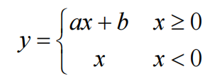
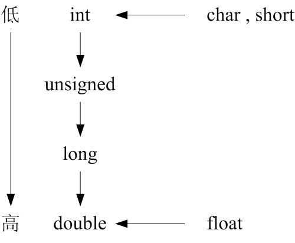
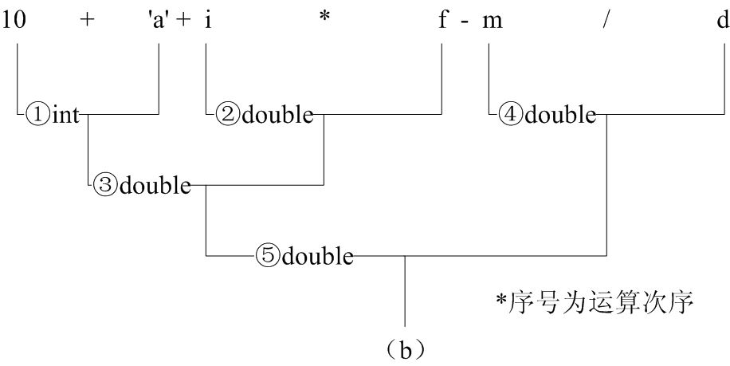

# 运算符与表达式

## 1、常用的运算符
* 求解问题的基本操作是运算。
* 通过C++语言丰富的运算符及其表达式构成实现算法的基本步骤，在不同程序结构的控制下有机地组织在一起形成程序。

1. 运算对象的数目
    > 单目运算符、双目运算符、三目运算符  

2. 运算符的优先级
    > 同一个式子中不同的运算符进行计算时，其运算次序存在先后之分，称为运算符的优先级。

3. 运算符的结合性
    > 在一个式子中如果有两个以上同一优先级的运算符，其运算次序是按运算符的结合性来处理的。  
    > C++语言运算符分为左结合（方向）和右结合（方向）。

* 表4-1 算术运算符

| 运算符 | 功能 | 目 | 结合性 | 用法 |  
| - | - | - | - | - |  
| + | 取正值 | 单目 | 自右向左 | +expr |  
| - | 取负值 | 单目 | 自右向左 | -expr |  
| * | 乘法 | 双目 | 自左向右 | expr1 * expr2 |  
| / | 除法 | 双目 | 自左向右 | expr1 / expr2 |  
| % | 整数求余/模数运算 | 双目 | 自左向右 | expr1 % expr2 |  
| + | 加法 | 双目 | 自左向右 | expr1 + expr2 |  
| - | 减法 | 双目 | 自左向右 | expr1 - expr2 |  

```cpp
-6 //结果为-6
5+7 //结果为12
35%7 //结果为0
8.5%3 //错误，因为求余运算符的两个操作数都必须是整数
```

* 表4-2 自增自减运算符

| 运算符 | 功能 | 目 | 结合性 | 用法 |  
| - | - | - | - | - |  
| ++ | 后置自增 | 单目 | 自右向左 | lvalue++ |  
| -- | 后置自减 | 单目 | 自右向左 | lvalue-- |  
| ++ | 前置自增 | 单目 | 自右向左 | ++lvalue |  
| -- | 前置自减 | 单目 | 自右向左 | --lvalue |  

```cpp
int m=4, n; 
n = ++m; //m先增1，m为5，然后表达式使用m的值，赋值给n，n为5 
n = --m; //m先减1，m为4，然后表达式使用m的值，赋值给n，n为4 
n = m++; //表达式先使用m的值，赋值给n，n为4，然后m增1，m为5 
n = m--; //表达式先使用m的值，赋值给n，n为5，然后m减1，m为4
```
* **注意**：自增自减运算符只能用于变量，而不能用于常量和表达式


* 表4-3 关系运算符 
 
| 运算符 | 功能 | 目 | 结合性 | 用法 |  
| - | - | - | - | - |  
| < | 小于比较 | 双目 | 自左向右 | expr1 < expr2 |  
| <= | 小于等于比较 | 双目 | 自左向右 | expr1 <= expr2 |  
| > | 大于比较 | 双目 | 自左向右 | expr1 > expr2 |  
| >= | 大于等于比较 | 双目 | 自左向右 | expr1 >= expr2 |  
| == | 相等比较 | 双目 | 自左向右 | expr1 == expr2 |  
| != | 不等比较 | 双目 | 自左向右 | expr1 != expr2 |  

```cpp
int a=5,b=6,c=6,k;
3>4 //结果为假
a<b //结果为真
k= b!=c //k为0
k= b>=c //k为1
```
```cpp
若a=5, b=0, c=-5
a>b>c //表达式为真
若a=5 , b=0 , c=2
a>b>c //表达式为假
```

* 表4-4 逻辑运算符

| 运算符 | 功能 | 目 | 结合性 | 用法 |  
| - | - | - | - | - |  
| `!` | 逻辑非 | 单目 | 自右向左 | `!expr` |  
| `&&` | 逻辑与 | 双目 | 自左向右 | `expr1 && expr2` |  
| `||` | 逻辑或 | 双目 | 自左向右 | `expr1 || expr2` |  


* 表4-5 真值表

| `expr1` | `expr2` | `expr1 && expr2` | `expr1 || expr2` | `!expr1` | `!expr2` |  
| - | - | - | - | - | - |  
| 假（0） | 假（0） | 假（0） | 假（0） | 真（1） | 真（1） |  
| 假（0） | 真（非0） | 假（0） | 真（1） | 真（1） | 假（0） |  
| 真（非0） | 假（0） | 假（0） | 真（1） | 假（0） | 真（1） |  
| 真（非0） | 真（非0） | 真（1） | 真（1） | 假（0） | 假（0） |  

* 在给出一个逻辑运算或关系运算结果时，以"0"代表"假"，以"1"代表"真"，在判断一个量为真假时，以"0"代表"假"，以"非0"代表"真"。

* C++在**逻辑表达式求解**时，并不一定是所有的运算都被执行，当刚开始求解或求解的中途就可以确定整个逻辑表达式的值时，其余的运算将不再进行。
    ```cpp
    int a=1 , b=2, c=3, d=4, m=n=1, k; 
    k=(m=a>b) && (n=c>d); //m的值为0，n的值为1，k的值为0
    ```
* 问题：表达式执行完后n和m的值为多少？


* 表4-5 赋值运算符

| 运算符 | 功能 | 目 | 结合性 | 用法 |  
| - | - | - | - | - |  
| `=` | 赋值 | 双目 | 自右向左 | `lvalue = expr` |  
| `+=` `-=` `*=` `/=` `%=` `&=` `^=` `|=` `<<=` `>>=` | 复合赋值 | 双目 | 自右向左 | `value+=expr` `lvalue-=expr` `lvalue*=expr` `lvalue/=expr` `lvalue%=expr` `lvalue&=expr` `lvalue^=expr` `lvalue|=expr` `lvalue<<=expr` `value>>=expr` |  


```cpp
int k=95,a=6,b=101; b-a=k; //错误
5=b-a; //错误
b*=k; //正确
```


* 表4-6 条件运算符

| 运算符 | 功能 | 目 | 结合性 | 用法 |  
| - | - | - | - | - |  
| `?:` | 条件运算 | 三目 | 自右向左 | `expr1 ? expr2 : expr3` |  


* 【例4.1】写出分段函数的C语言表达式。
      


```cpp
y = x>=0 ? a*x+b : x ;
```


* 表4-7 逗号运算符

| 运算符 | 功能 | 目 | 结合性 | 用法 |  
| - | - | - | - | - |  
| `,` | 逗号运算 | 双目 | 自左向右 | `expr1, expr2` |  

```cpp
int i=3,j=5;
k=i++,i+1,j++,j+1; //k为3（i++的值）
k=(i++,i+1,j++,j+1); //k为7（j+1的值）
```

## 2、表达式
* 由运算符和运算对象组成的式子称为**表达式**。

1. 表达式的运算对象可以是常量、变量、函数调用和嵌套的表达式等。
    ```cpp
    12 + a + max(x,y) + ( x + y ) //常量、变量、函数调用、嵌套的表达式
    ```
2. 表达式的计算是按步骤执行的，成为表达式求值顺序。
    ```cpp
    x > y && x < z //先计算x>y，若结果为假则运算结束，然后计算x<z
    ```
3. 表达式的运算需要考虑参与运算的数据对象是否具有合法的数据类型以及是否需要进行类型转换。
    ```cpp
    k = 10 + 'a' + i * 5.0 - d / 100.5 //数据类型不同，需要进行类型转换
    ```
4. 每个表达式的结果除了确定的值之外，还有确定的数据类型。  

## 3、类型转换

* C++表达式是否合法，以及合法表达式的含义，都是由运算对象的数据类型决定的。
* 不同类型的数据混合运算时需要进行类型转换（conversion），即将不同类型的数据转换成相同类型的数据后再进行计算。
* 类型转换有两种：**显式类型转换**和**隐式类型转换**。

### 1. 显示类型转换

* 表4-8 显式类型转换运算符

| 运算符 | 功能 | 目 | 结合性 | 用法 |  
| - | - | - | - | - |  
| (type) | 显式类型转换 | 单目 | 自右向左 | (type)expr |  

```cpp
(int)x+y //将x转换成整型
(int)(x+y) //将x+y转换成整型
(int)x%3 //x的类型和数据值不变，表达式引用转换成int后的x值
```

### 2. 隐式类型转换
* 隐式类型转换（implicit type conversion）又称自动类型转换，它是由编译器自动进行的。
      

* 【例4.2】已知：int i; float f; double d; long m;   
   表达式10 + ‘a' + i * f - m / d的运算步骤如下图所示：  
      

* 赋值运算中的隐式类型转换
    1. 将浮点型数据赋给整型变量时，舍弃浮点数的小数部分。
        > 如：int n=6.18; n的值为6。 
    2. 将整型数据赋给浮点型变量时，数值不变，但以浮点数形式存储到变量中。
        > 如：double f=78; 将78按78.0处理。
    3. 将double型数据赋给float变量时，截取前面7位有效数字存储到float变量。将float型数据赋给double变量时，数值不变，有效数字扩展到16位。
