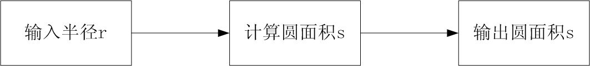

# 顺序结构的程序设计

## 1、简单语句和复合语句

* C++程序是由一条条语句组成，程序运行过程就是语句逐条执行的过程，而语句执行的次序称之为**流程**。有了求解问题的算法，还需要用程序将算法实现出来。多数情况下，这种实现表现为一定数量的语句和执行流程。

* C++语言语句分为简单语句、复合语句和控制语句

* 简单语句：
    1. 表达式语句。如：
        ```cpp
        x=a+b; t=a,a=b,b=t;
        ```
    1. 函数调用语句。如：
        ```cpp
        print(a,b);
        ```
    1. 空语句。分号。


* 复合语句（compound statement），又称语句块，简称块（block）
    ```cpp
    { //复合语句
        double s, a=5, b=10, h=8; //局部声明
        s=(a+b)*h/2.0;
        cout<<“area=”<<s<<endl;
    } //复合语句不需要分号结尾
    ```
* 控制语句  
    > 如：if语句、switch语句、循环语句等。  


## 2、注释及语句的写法

1. 注释
    * 可以在程序中编写注释（comments），有两种形式：
        1. /*......*/块注释语法形式：
            ```cpp
            /*
            ......注释内容
            */
            ```
        2. //行注释语法形式：
            ```cpp
            //......注释内容
            ```

2. 语句的写法
    1. 多数情况下，在一个程序行里只写一个语句，这样的程序写法清晰，便于阅读、理解和调试。  
    2. 注意使用空格或TAB来作合理的间隔、缩进、对齐，使程序形成逻辑相关的块状结构，养成优美的程序编写风格。
    3. C++语言允许在一行里写多个语句 。

* 【例1.1】 
    ```cpp
    #include <iostream>
    using namespace std; /*使用标准命名空间*/
    int main() /*主函数*/
    {
        cout << "hello,world" << endl; /*输出*/
        return 0; /*主函数正常结束返回0*/
    }
    ```


## 3、C++的输入与输出

* 所谓**输入**是指从外部输入设备（如键盘、鼠标等）向计算机输入数据，**输出**是指从计算机向外部输出设备（如显示器、打印机等）输出数据。

* C++语言输入输出操作是用流对象（stream）实现的。若在程序中使用流对象cin和cout，应该将标准输入输出流库的头文件`<iostream>`包含到源文件中。
    ```cpp
    #include <iostream>
    using namespace std;
    ```
### 1. cout和cin对象的使用
```cpp
cout<<表达式1<<表达式2<<……;
```
```cpp
cin>>变量1>>变量2>>……;
```
```cpp
int x,y;
cin>>x>>y; //键盘输入
cout<<“x=”<<x<<“,y=”<<y<<endl; //输出到显示器上
```
* cin输入时，为了分隔多项数据，默认要求在键盘输入数据之间使用空格、Tab键、回车作为分隔符。
    ```cpp
    #include <iostream>
    using namespace std;
    int main()
    {
        int c1,c2,c3;
        cin>>c1>>c2>>c3;
        cout<<"c1="<<c1<<",c2="<<c2<<",c3="<<c3<<endl;
        return 0;
    }
    ```


### 2. 格式控制
* 可以在输入输出流中使用控制符进行格式控制。使用这种方法，需要在程序中加入`<iomanip>`头文件。
* 【例5.1】使用cin和cout输入输出数据。  
    ```cpp
    #include <iostream>
    #include <iomanip>
    using namespace std;
    int main()
    {
        bool v; int a,m,n;
        double x,y,z,p,f; float f1;
        cin>>boolalpha>>v; //输入：true
        cin>>oct>>a>>hex>>m>>dec>>n;//输入：144 46 -77
        cin>>p>>f>>f1>>x>>y>>z;//输入：3.14 3.14 3.14 3.14159 0.1 0.1e1
        cout<<v<<' '<<boolalpha<<v<<' '<<noboolalpha<<v<<endl;//输出：1 true 1
        cout<<a<<' '<<p<<' '<<a*p<<endl;//输出：100 3.14 314
        cout<<hex<<m<<' '<<oct<<m<<' '<<dec<<m<<endl;//输出：46 106 70
        cout<<showbase<<hex<<m<<' '<<oct<<m<<' '<<dec<<m<<endl;//输出：0x46 0106 70
        cout.precision(5); cout<<x<<' '<<y<<' '<<z<<endl;//输出：3.1416 0.1 1 
        cout<<fixed<<x<<' '<<y<<' '<<z<<endl;//输出：3.14159 0.10000 1.00000
        cout<<scientific<<x<<' '<<y<<' '<<z<<endl;  //输出：3.14159e+000 1.00000e-001 1.00000e+000
        cout<<left<<setw(6)<<n<<endl; //输出：-77
        cout.width(6); cout<<right<<n<<endl; //输出：_ _ _-77
        cout<<setw(10)<<77<<' '<<setfill('0')<<setw(10)<<77<<endl; //输出：_ _ _ _ _ _ _77 0000000077
        cout<<fixed<<setprecision(5)<<f<<' '<<setprecision(9)<<f<<endl;  //输出：3.14000 3.140000000
        cout<<showpos<<1<<' '<<0<<' '<<-1<<endl; //输出：+1 +0 -1
        cout<<noshowpos<< 1<<' '<<0<<' '<<-1<<endl; //输出：1 0 -1
        return 0;
    }
    ```


### 3. 顺序结构

* 所谓顺序结构是指：语句以其出现的顺序执行。
* 一个语句执行完会自动转到下一个语句开始执行，这样的执行称为顺序执行。
* 顺序执行的次序是佷重要的

* 图5.1 求圆面积的执行次序
      

* 【例5.2】编程输入圆的半径，求圆面积。
    ```cpp
    #include <iostream>
    using namespace std;
    #define PI 3.1415926 //定义符号常量PI
    int main()
    {
        double r,area; //定义圆半径r，圆面积area
        cin>>r; //输入圆半径
        area=PI*r*r; //求圆面积
        cout<<"area="<<area<<endl; //输出圆面积
        return 0;
    }
    ```
