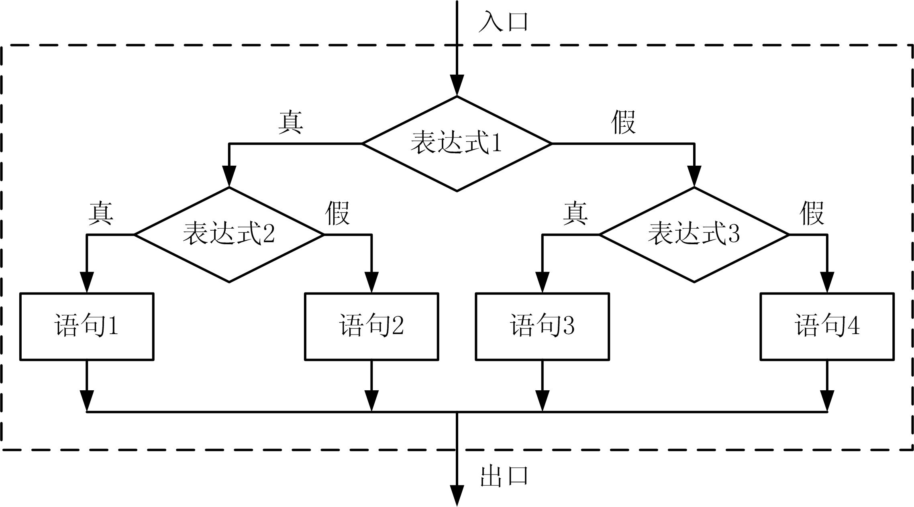

# 选择结构的程序设计


## 1、if语句
* if语句的作用是计算给定的表达式，根据结果选择执行相应的语句。语句形式有两种：
    1. if形式：
        ```cpp
        if (表达式) 语句1;
        ```
        ```cpp
        if ( a>b ) t=a, a=b, b=t;
        ```
    2. if-else形式：
        ```cpp
        if (表达式) 语句1; 
        else 语句2;
        ```
        ```cpp
        if ( x>=y ) cout<<x<<endl;
        else cout<<y<<endl;
        ```

1. if语句中的子语句既可以是简单语句，又可以是复合语句或控制语句，但必须是“一个语句”的语法形式
    ```cpp
    if (a>b) //此段程序代码编译有错误
        x=a+b; y=a-b;
    else
        x=a-b; y=a+b;
    ```
    ```cpp
    if (a>b) { //此段程序代码正确
        x=a+b; y=a-b;
    }
    else {
        x=a-b; y=a+b;
    }
    ```
2. if语句的表达式一般为关系、逻辑运算表达式，但也可以为其他表达式，但按逻辑值来理解：
    ```cpp
    a=5,b=2;
    if ( a ) x=a*10; //等价于a!=0
    ```

* 【例6.1】计算三角形的面积。
    ```cpp
    #include <iostream>
    #include <cmath>
    using namespace std;
    int main()
    {
        double a,b,c;
        cin>>a>>b>>c; //输入三角形三边长
        //判断三边长是否构成三角形
        if (a+b>c && a+c>b && b+c>a) {
            double s,t;
            t=(a+b+c)/2.0;
            s=sqrt(t*(t-a)*(t-b)*(t-c)); //Heron公式计算三角形面积
            cout<<"area="<<s<<endl;
        }
        else cout<<"error"<<endl;
        return 0;
    }

    ```

## 2、switch语句

* switch语句的作用是计算给定的表达式，根据结果选择从哪个分支入口执行，语句形式为：
```cpp
switch ( 表达式 ) {
    case 常量表达式1 : … 语句序列1
    case 常量表达式2 : … 语句序列2
    ┇
    case 常量表达式n : … 语句序列n
    default : … 默认语句序列
}
```
* 图6.1 switch语句执行流程

```cpp
switch ( 表达式 ) {
    case 常量表达式1 :语句序列1
    case 常量表达式2 :语句序列2
    ┇
    case 常量表达式n :语句序列n
    default : 默认语句序列
}
```
  


* switch语句的使用说明：
    1. switch语句中case分支的语句序列可以是一个语句，也可以是任意多的语句序列，也可以没有语句；  
    2. 如果case后没有语句，则一旦执行到这个case分支，什么也不做，继续往下执行。  
    ```cpp
    switch (n) {
        case 7 : cout<<“step5”<<endl;
        case 6 : 
        case 5 : cout<<“step4”<<endl;
        case 4 :
        {
            cout<<“step3”<<“step2”<<endl;
        }
        case 2 : cout<<“step1”<<endl;
        default: cout<<“step0”<<endl;
    }
    ```
    3. switch语法中各个case分支和default分支的出现次序在语法上没有规定，但次序的不同安排会影响执行结果。
        ```cpp
        //①程序A
        switch (n) {
            case 1 : cout<<"1";
            case 2 : cout<<"2";
            default: cout<<"0";
        }
        ```
        ```cpp
        //②程序B
        switch (n) {
            default: cout<<"0";
            case 1 : cout<<"1";
            case 2 : cout<<"2";
        }
        ```
    4. switch语法中default分支是可选的，若没有default分支且没有任何case标号的值相等时，switch语句将什么也不做，直接执行后续语句。  
    5. switch语句的分支表达式可以是C++语言的任意表达式，但其值必须是整数（含字符类型）、枚举类型。  
    6. switch语法中的case后的表达式必须是常量表达式且互不相同，即为整型、字符型、枚举类型的常量值，但不能包含变量。
        > 例如：若c是变量，如 :“case c>=‘a’ && c<=‘z’：”的写法是错的。  
    7. 在switch语句中任意位置上，只要执行到break语句，就结束switch语句的执行，转到后续语句。  
        ```cpp
        break;
        ```

* 更常见的switch结构应该如下，它提供了程序多分支选择执行流程。
    ```cpp
    switch ( 表达式 ) {
        case 常量表达式1: … 语句序列1; break;
        case 常量表达式2: … 语句序列2; break;
        ┇
        case 常量表达式n: … 语句序列n; break;
        default : … 默认语句序列
    }
    ```

* 图6.2 结构化的switch流程
      

* 【例6.2】按照考试成绩的等级输出百分制分数段
    ```cpp
    #include <iostream>
    #include <cmath>
    using namespace std;
    int main()
    {
        int g;
        cin>>g; //输入成绩等级
        switch(g)
        {
            case 'A':cout<<"85～100\n"; break;
            case 'B':cout<<"70～84\n"; break;
            case 'C':cout<<"60～69\n"; break;
            case 'D':cout<<"<60\n"; break;
            default: cout<<"error\n";
        }
        return 0;
    }
    ```


## 3、if语句的嵌套
1. 第一种形式，在else分支上嵌套if语句，语法形式为：  
    ```cpp
    if ( 表达式1 ) 语句1
    else if ( 表达式2 ) 语句2
    else if ( 表达式3 ) 语句3
    ......
    else if ( 表达式n ) 语句n
    else 语句m
    ```
* 图6.3 嵌套if语句第一种形式的执行流程
      

* 【例6.3】编程输出成绩分类。
    ```cpp
    #include <iostream>
    using namespace std;
    int main()
    {
        int score;
        cin>>score;
        if (score >= 90 ) cout<<"A"<<endl; //90分以上
        else if (score >= 80 ) cout<<"B"<<endl; //80～89分
        else if (score >= 70 ) cout<<"C"<<endl; //70～79分
        else if (score >= 60 ) cout<<"D"<<endl; //60～69分
        else cout<<"E"<<endl; //60分以下
        return 0;
    }
    ```

1. 第二种形式，在if和else分支上嵌套if语句，语法形式为：
    ```cpp
    if ( 表达式1 )
        if ( 表达式2 ) 语句1
        else 语句2
    else
        if ( 表达式3 ) 语句3
        else 语句4
    ```

* 图 6.4 嵌套if语句第二种形式的执行流程
      

* 注意：嵌套的if语句可以实现多路分支。在结构上else语句总和距离自己最近的if相匹配。我们可以通过加“{}”来改变else的层位，从而改变程序的执行流程。
      

* 【例6.4】计算分段函数：
      

    ```cpp
    #include <iostream>
    #include <cmath>
    using namespace std;
    int main( )
    {
        double x, y;
        cin>>x;
        if(x<-3.0) y=x-1.0;
        else
        if(x>= -3.0 && x<=3.0)
        y=sqrt(9.0-x*x);
        else
        y=x+1;
        cout<<"x="<<x<<",y="<<y<<endl;
        return 0;
    }
    ```


## 4、switch语句的嵌套

* switch语句是可以嵌套的，如：
    ```cpp
    int a=15, b=21, m=0;
    switch(a%3) {
        case 0: m++;
        switch(b%2) {
            default: m++;
            case 0 : m++; break;
        }
        case 1: m++;
    }
    ```

* 【例6.5】输入某天的日期，输出第二天的日期。
```cpp
#include <iostream>
using namespace std;
int main()
{
    int y,m,d,Days; 
    cin>>y>>m>>d; //输入日期
    switch(m) { //计算每月的天数
        case 2 :
            Days=28;
            if((y%4==0&&y%100!=0)|| (y%400==0)) Days++; //闰年天数加1
            break;
        case 4 : case 6 : 
        case 9 : case 11 : Days=30;break;
        default: Days=31; //其余月份为31天
    }
    d++;
    if (d>Days) d=1,m++; //判断月末
    if (m>12) m=1,y++; //判断年末
    cout<<y<<“-”<<m<<“-”<<d<<endl; //输出第二天的日期
    return 0;
}

```


