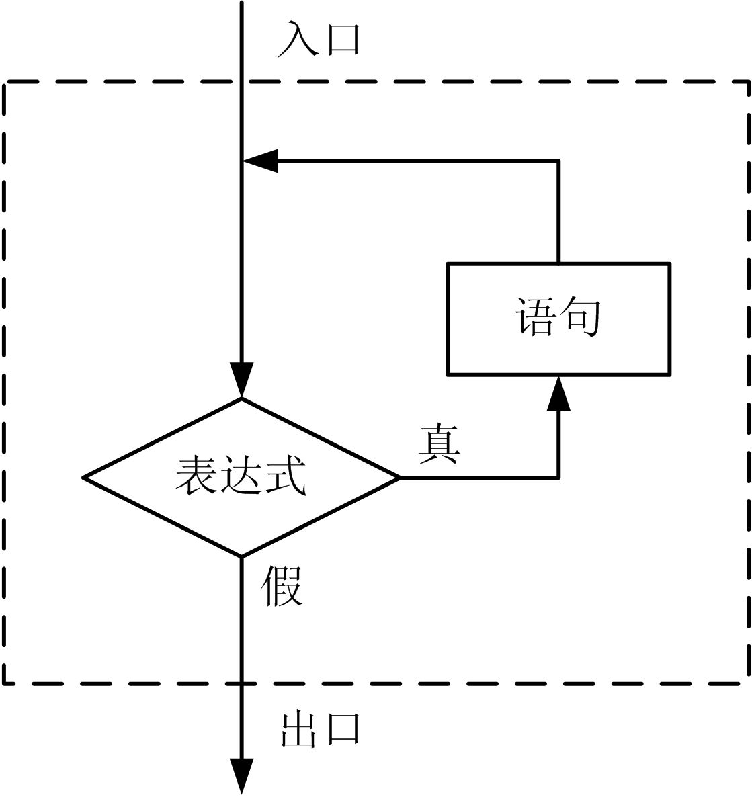
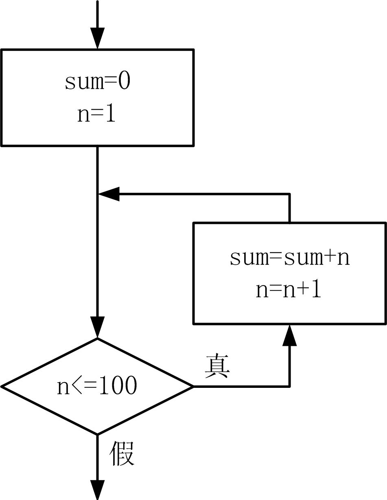
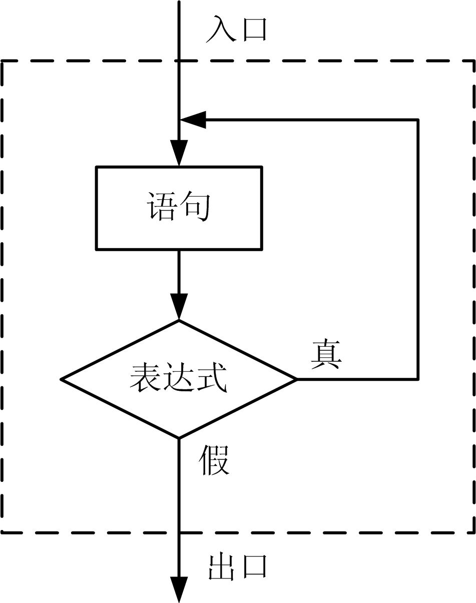
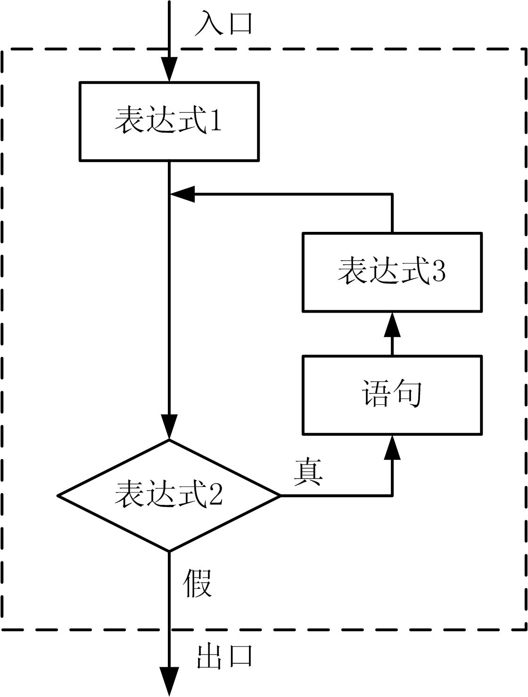

# 循环结构的程序设计

* 循环：就是在满足一定条件时，重复执行一段程序。
    > ① while语句
    > ② do while语句
    > ③ for语句

## 1、while语句
* while语句的语法形式：
    ```cpp
    while ( 表达式 ) 语句;
    ```

* 其中的语句称为子语句，又称循环体，圆括号内的表达式称为循环条件。

      

* 【例7.1】求 S = 1 + 2 + 3 + ... + 100 
      

    ```cpp
    #include <iostream>
    using namespace std;
    int main()
    {
        int n=1,sum=0;
        while (n<=100) {
            sum=sum+n; 
            n=n+1;
        }
        cout<<“sum=”<<sum<<endl;
        return 0;
    }
    ```
* **注意：**
    1. 若循环体包含一条以上的语句，应以复合语句形式出现。  
    2. 循环前，必须给循环控制变量赋初值。  
    3. 在循环体里面，必须有改变循环控制变量值的语句。  

* while语句的说明。
    1. 由于while语句先计算表达式的值，再判断是否循环，所以如果表达式的值一开始就为假，则循环一次也不执行，失去了循环的意义。  
    2. while语句循环条件可以是C++语言的任意表达式。通常情况下，循环条件是关系表达式或逻辑表达式，应该谨慎出现别的表达式。  


## 2、do while语句

* do while语句的语法形式：
```cpp
do 语句 while ( 表达式 );
```

* 其中的语句即为循环体，圆括号内的表达式称为循环条件。
      


* do语句的说明。
    1. do语句的最后必须用分号（；）作为语句结束，循环体的复合语句形式为：
        ```cpp
        do {
            … //复合语句
        } while ( 表达式 );
        ```
    2. do语句先执行后判定，while语句则是先判定后执行；do语句至少要执行循环体一次，而while语句可能一次也不执行。  
    3. do语句结构和while语句结构是可以相互替换的。  


* 【例7.2】连续输入多个数据，计算它们的乘积，当输入0时结束。
    ```cpp
    #include <iostream>
    using namespace std;
    int main()
    {
        int n=1,k=1;
        do {
            k=k*n;
            cin>>n;
        } while (n!=0); //输入0时结束循环
        cout<<k; //输出乘积
        return 0;
    }
    ```


## 3、for语句
* for语句的语法格式为：
    ```cpp
    for (表达式1; 表达式2; 表达式3) 语句;
    ```

* for语句有循环初始和循环控制功能，语句形式为：
      

* for语句的说明。
    1. 整个循环过程中表达式1只求解一次；作用是给循环控制变量赋初值。  
    2. 表达式2相当于是for的循环条件。  
    3. 表达式3是重复执行的内容；通常是改变循环控制变量值的语句。   

* for语句的应用格式
    ```cpp
    for(循环初始; 循环条件; 循环控制) 循环体;
    ```

* 如：求1+2+3+……+100
    ```cpp
    for (n=1,sum=0 ; n<=100 ; n++) sum=sum+n;
    ```
    ```cpp
    int n=1,sum=0;
    while(n<=100) {
        sum=sum+n; 
        n=n+1;
    }
    ```

* 省略表达式1。
    ```cpp
    n=1, sum=0;
    for ( ; n<=100 ; n++) sum=sum+n;
    ```

* 省略表达式3。
    ```cpp
    for (n=1,sum=0;n<=100;)sum=sum+n, n++;
    ```

* 表达式1和表达式3都省略
    ```cpp
    n=1,sum=0
    for (; n<=100 ; ) sum=sum+n, n++;
    ```


## 4、break语句

* break语句的作用是结束switch语句和循环语句的运行，转到后续语句，语法形式为：
    ```cpp
    break;
    ```

* break语句只能用在switch语句和循环语句（while、do、for）中，
不得单独使用。

* 【例7.3】判断一个数m是否是素数。 
    ```cpp
    #include <iostream>
    using namespace std;
    int main()
    {
        int i,m;
        cin>>m;
        //从2到m-1之间逐一检查是否被m整除
        for (i=2 ; i<=m-1 ; i++)
        if (m % i==0) break; //如果整除则结束检查
        if (i==m) cout<<"Yes"<<endl; //根据循环结束位置判断是否素数
        else cout<<"No"<<endl;
        return 0;
    }
    ```

* 如此，循环语句的结束就有两个手段了：
    > 一是循环条件   
    > 二是应用break语句。  

## 5、continue语句

* continue语句的作用是在循环体中结束本次循环，直接进入下一次循环，语句形式为：
    ```cpp
    continue;
    ```
*  continue语句只能用在循环语句（while、do、for）中，不能单独使用。

* 在while语句和do语句循环体中执行continue语句，程序会转到“表达式”继续运行，在for语句循环体中执行continue语句，程序会转到“表达式3”继续运行，循环体中余下的语句被跳过了。  
    ```cpp
    for (n=1,sum=0 ; n<=100 ; n++) {
        if(n%2==0) break;
        sum=sum+n;
    }
    ```
    ```cpp
    for (n=1,sum=0 ; n<=100 ; n++) {
        if(n%2==0) continue;
        sum=sum+n;
    }
    ```
