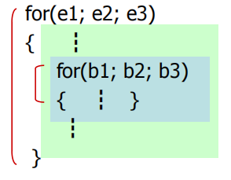
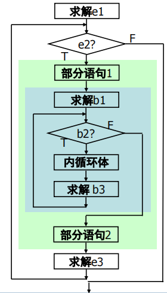
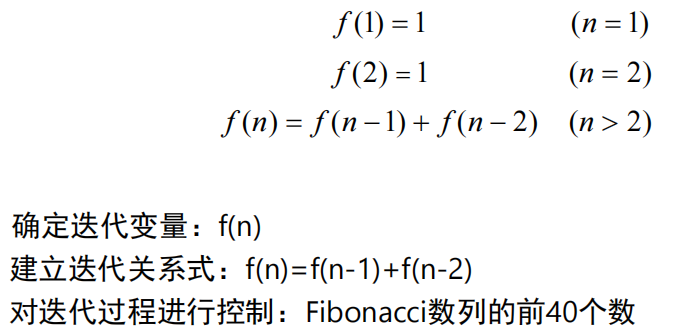

# 循环结构的设计


##　1、循环的嵌套

* 如果一个循环体内包含又一个循环语句时，就构成了**循环的嵌套**。
* C++语言的循环语句（while、do、for）可以互相嵌套，循环嵌套的层数没有限制，可以形成多重循环。  
* 使用多重循环的时候，嵌套的循环控制变量不能相同。  
* 如：for循环嵌套  
      
      


* 【例8.1】 打印九九乘法表
    ```cpp
    #include <iostream>
    using namespace std;
    int main()
    {
        int i,j;
        for (i=1; i<=9; i++) { //控制行
        for (j=1; j<=i; j++) //控制每行
            cout<<i<<"x"<<j<<"="<<i*j<<" ";
            cout<<endl; //每行末尾输出1个换行
        }
        return 0;
    }

    ```
    ```cpp
    ① i=1
        j=1
    ② i=2
        j=1, j=2
    ③ i=3
        j=1, j=2, j=3
    ④ i=4
        j=1, j=2, j=3, j=4
    ……
    ```
    运行结果：
    ```cpp
    1x1=1
    2x1=2 2x2=4
    3x1=3 3x2=6 3x3=9
    4x1=4 4x2=8 4x3=12 4x4=16
    5x1=5 5x2=10 5x3=15 5x4=20 5x5=25
    6x1=6 6x2=12 6x3=18 6x4=24 6x5=30 6x6=36
    7x1=7 7x2=14 7x3=21 7x4=28 7x5=35 7x6=42 7x7=49
    8x1=8 8x2=16 8x3=24 8x4=32 8x5=40 8x6=48 8x7=56 8x8=64
    9x1=9 9x2=18 9x3=27 9x4=36 9x5=45 9x6=54 9x7=63 9x8=72 9x9=81
    ```


## 2、循环语句的选用

### 计数型循环
* 计数型循环用于处理已知循环次数的循环过程。  
* 控制变量在每次循环时都要发生规律性变化（递增或递减），当控制变量达到预定的循环次数时，循环就结束。  
* 计数型循环常使用for语句。  

* 【例8.1】 求S=1!+2!+3!+……+10！
    ```cpp
    #include <iostream>
    using namespace std;
    int main()
    {
        int s,n,t;
        for (s=0,t=1,n=1; n<=10; n++)
            t = t * n, s = s + t; //t=n!
        cout<<s<<endl;
        return 0;
    }
    ```
    ```cpp
    ① t=1!, s=1!, n=2
    ② t=2!, s=1!+2!, n=3
    ③ t=3!, s=1!+2!+3!, n=4
    ④ t=4!, s=1!+2!+3!+4!, n=5 
    ……
    ```

### 条件型循环
* 条件型循环用于处理循环次数未知的循环过程，称为“不定次数循环”。   
* 在条件型循环中，由于事先不能准确知道循环的次数，因此循环控制是由条件来判定的。在每次循环时检测这个条件，当条件一旦满足，循环就结束。  
* 条件型循环常使用while语句和do while语句。  

* 【例8.2】求π的近似值 π/4≈1-1/3+1/5-1/7+1/9-…，直到最后一项的绝对值小于10^-7为止。
    ```cpp
    #include <iostream>
    #include <cmath>
    using namespace std;
    int main()
    {
        double s=1,pi=0,n=1,t=1;
        while (fabs(t)>1e-7)
            pi=pi+t, n=n+2, s=-s, t=s/n;
        cout<<pi*4<<endl;
        return 0;
    }
    ```
    ```cpp
    ① pi=1, n=3, s=-1, t=-1/3
    ② pi=1-1/3, n=5, s=1, t=1/5
    ③ pi=1-1/3+1/5, n=7, s=-1, t=-1/7 
    ……
    ```


## 3、循环语句应用举例


1. 利用循环实现枚举算法：
    * 枚举法，也称为穷举法，是指从可能的集合中一一枚举各个元素，用给定的约束条件判定哪些是无用的，哪些是有用的。能使命题成立者，即为问题的解。  
    * 采用枚举算法求解问题的基本思路为：
        1. 确定枚举对象、枚举范围和判定条件；  
        2. 一一枚举可能的解，验证是否是问题的解。  

    * 【例8.3】百钱买百鸡问题：有人有一百块钱，打算买一百只鸡。公鸡一只5元，母鸡一只3元，小鸡3只1元，求应各买多少？  
        ```cpp
        #include <iostream>
        using namespace std;
        int main()
        {
            int x,y,z;
            for (x=0; x<=20; x++) //枚举公鸡的可能数量，最多为20
            for (y=0; y<=33; y++) //枚举母鸡的可能数量，最多为33
            for (z=0; z<=100; z++)//枚举小鸡的可能数量，最多为100
            if(z%3==0&&x+y+z==100&&5*x+3*y+z/3==100)//约束条件
                cout<<"公鸡="<<x<<",母鸡="<<y<<",小鸡="<<z<<endl;
            return 0;
        }
        ```

    * 二重循环实现百钱百鸡问题：
        ```cpp
        #include <iostream>
        using namespace std;
        int main()
        {
            int x,y,z;
            for (x=0; x<=20; x++) //枚举公鸡的可能数量，最多为20
            for (y=0; y<=33; y++) { //枚举母鸡的可能数量，最多为33
                z=100-x-y; //小鸡的数量根据约束条件求得
                if (z%3==0 && 5*x+3*y+z/3==100) //约束条件
                    cout<<"公鸡="<<x<<",母鸡="<<y<<",小鸡="<<z<<endl;
            }
            return 0;
        }
        ```

2. 利用循环实现**迭代算法**：
* 迭代法是一种不断用变量的旧值递推新值的求解方法。

* 采用迭代算法求解问题的基本思路为：
    1. 确定迭代变量。  
    2. 建立迭代关系式。  
    3. 对迭代过程进行控制。  


* 【例8.4】求斐波那契(Fibonacci)数列前40个数。斐波那契数列公式为：
      
    ```cpp
    #include <iostream>
    using namespace std;
    int main()
    {
        int i, f1=0, f2=1, fn; //迭代变量
        for(i=1; i<=40; i++) { //迭代次数 
            fn = f1 + f2; //迭代关系式
            f1 = f2 , f2 = fn; //f1和f2迭代前进
            cout<<f1<<endl;
        }
        return 0;
    }
    ```
    ```cpp
    ① i=1, fn=1, f1=1, f2=1
    ② i=2, fn=2, f1=1, f2=2
    ③ i=3, fn=3, f1=2, f2=3
    ④ i=4, fn=5, f1=4, f2=5
    ……
    ```


