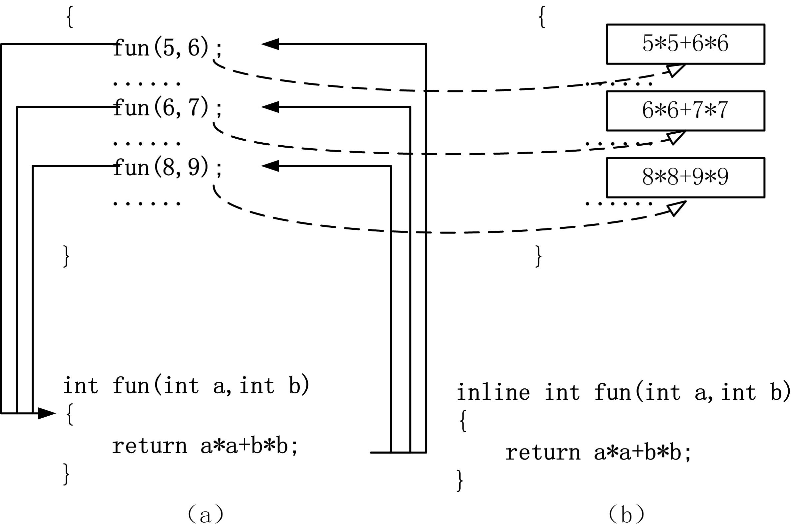

# 函数的定义和使用


## 1、函数的定义

* 我想设计一个程序完成下面的计算，该如何设计程序最有效？


* 函数定义的一般形式为：
    ```cpp
    返回类型 函数名(形式参数列表) 
    { 
        函数体声明部分 
        函数体执行语句 
    }
    ```


1. 函数名: 实现函数需要确定函数名，以便使用函数时能够按名引用。

2. 形式参数列表: 形式参数列表是函数与调用者进行数据交换的途径，一般形式为：
    ```cpp
    类型1 参数名1,类型2 参数名2, 类型3 参数名3 , …
    ```
    ```cpp
    int fun(int x, int y, double m) 
    { 
        return m>12.5 ? x : y; 
    }
    ```
    * 函数可以没有形式参数，定义形式为：
        ```cpp
        返回类型 函数名() 
        { 
            函数体声明部分 
            函数体执行语句 
        }
        ```
        ```cpp
        返回类型 函数名(void) 
        { 
            函数体声明部分 
            函数体执行语句 
        }
        ```
3. 返回类型: 返回类型可以是C++除数组之外的内置数据类型或自定义类型。
    * 函数可以不返回数据，此时返回类型应写成void，表示没有返回值， 其形式为：
        ```cpp
        void 函数名(形式参数列表) 
        { 
            函数体声明部分 
            函数体执行语句 
        }
        ```

   * 没有返回值的函数，在调用处是不能按表达式来调用函数的，只能按语句形式调用函数，因为函数没有返回值也就不能参与表达式运算。
       ```cpp
       m=max(a,b); //以表达式的方式调用max函数 
       print( ); //以语句的形式调用print函数
       ```
   * 当函数的返回类型不是void，表明函数有返回值。如果函数体内没有return语句，此时函数返回的值是与返回类型相同但内容却是随机的一个值。


4. 函数体: 实现函数最重要的是编写函数体。函数体（function body）包含声明部分和执行语句，是一组能实现特定功能的语句序列的集合。
    * 编写函数体是为了实现函数功能。故称函数定义为函数实现，简称**实现**。  
    * 而函数头简称**接口**。

* 【例9.1】使用函数实现判断一个数是否是素数。
    ```cpp
    #include <iostream> 
    using namespace std; 
    int IsPrime(int m) //求素数函数 
    { //枚举法求m是否素数 
        int i; 
        for (i=2 ; i<=m-1 ; i++) 
        if (m % i==0) return 0; //不是素数返回0 
        return 1; //是素数返回1 
    } 
    int main() 
    { 
        int m; 
        cin>>m; 
        if (IsPrime(m)) cout<<"Yes"<<endl; //是素数输出Yes 
        else cout<<"No"<<endl; //不是素数输出No 
        return 0; 
    }

    ```

## 2、函数的参数

* 函数参数是实现函数时的重要内容，是函数接口的首要任务，围绕这个目标需要研究：
    > ①形式参数的定义与实际参数的对应关系。   
    > ②函数参数的数据传递机制，包括主调函数与被调函数的双向数据传递。   


* 形式参数: 函数定义中的形式参数列表（parameters），简称形参。例如：
    ```cpp
    int max(int a, int b) 
    { 
        return a>b ? a : b; 
    }
    ```
    第1行a和b就是形参。   

* 形式参数相关说明：
    1. 函数定义时指定的形参，在未进行函数调用前，并不实际占用内存中的存储单元。  
    2. 只有在发生函数调用时，形参才分配实际的内存单元，接受从主调函数传来的数据。  
    3. 当函数调用结束后，形参占用的内存单元被自动释放。

* 实际参数: 函数调用时提供给被调函数的参数称为实际参数（arguments）， 简称实参。
    * 实参必须有确定的值，因为调用函数会将它们传递给形参。实参可以是常量、变量或表达式，还可以是函数的返回值。例如：
        ```cpp
        x = max(a,b); //max函数调用，实参为a,b 
        y = max(a+3,128); //max函数调用，实参为a+3,128 
        z = max(max(a,b),c); //max函数调用，实参为max(a,b),c
        ```
* 实参相关说明
    1. 实参的类型、次序和数目要与形参一致。  
    2. 如果参数数目不一致，则出现编译错误；  
    3. 如果参数次序不一致，则传递到被调函数中的数据就不合逻辑，难有正确的程序结果；  
    4. 如果参数类型不一致时，则函数调用时按形参类型隐式类型转换实参；


* 程序通常有两种函数参数传递机制——值传递和引用传递。
    * **值传递（pass-by-value）**过程中，形参作为被调函数的内部变量来处理，即开辟内存空间以存放由主调函数复制过来的实参的值，从而成为实参的一个副本。  
    * **值传递的特点**是被调函数对形参的任何操作都是对内部变量进行，不会影响到主调函数的实参变量的值。  
    * 值传递时，实参数据传递给形参是单向传递，即只能由实参传递给形参，而不能由形参传回给实参。
    ```cpp
    void fun(int x, int y, int m) 
    { m = x>y ? x : y; //仅修改函数内部的m 
    }
    void caller( ) //主调函数，调用者 
    { 
        int a=10, b=5, k=1; 
        fun(a,b,k); //实参值传递 
    }
    ```

## 3、函数的声明
* 当要调用函数时，C++语言规定在调用一个函数之前必须有该函数的声明。
* C++规定函数的定义既是函数定义，也是函数声明。换言之，只要函数调用是写在函数定义的后面，就自然有了函数声明。
* 声明的作用是程序向编译器提供函数的接口信息，因而多次提供接口信息是允许的，但不能提供相互矛盾、语义不一致的接口信息。

* 如：
    ```cpp
    #include <iostream> //标准输入输出函数库 
    #include <cmath> //数学函数库 
    using namespace std; //使用标准命名空间 
    double root(double x, double y) //root函数求x-y的平方根 
    { 
        if(x>=y) return sqrt(x-y);//只有在x大于等于y时计算x-y的平方根 
        else return 0; //否则返回0 
    } 
    int main() //主函数 
    { 
        double a, b; //定义两个浮点型变量 
        cin >> a >> b ;//输入两个数 
        cout << root(a,b) << endl; //输出a-b的平方根 
        return 0; //主函数正常结束返回0 
    }

    ```

### 1. 函数原型
* 函数原型（function prototype）的作用是提供函数调用所必须的接口信息，使编译器能够检查函数调用中可能存在的问题，有两种形式：
    1. 第一种形式：
        ```cpp
        返回类型 函数名(类型1 形参1,类型2 形参2,……);
        ```
    2. 第二种形式：
        ```cpp
        返回类型 函数名(类型1 ,类型2 ,……);
        ```
    ```cpp
    #include <iostream> 
    using namespace std; 
    int gcd(int m, int n); //gcd函数原型，gcd函数声明在前 
    int main() 
    { 
        int m,n; 
        cin>>m>>n; 
        cout<<gcd(m,n)<<endl; //调用时已有gcd函数声明 
        return 0; 
    }
    int gcd(int m, int n) //求最大公约数，gcd函数实现在后 
    { 
        int r; 
        while (n!=0) { //欧几里德算法，原理是： 
            r = m % n ; //r为m/n的余数 
            m = n ; //则gcd(m,n)=gcd(n,r)=... 
            n = r ; //r=0时n即是gcd 
        } 
        return m; 
    }

    ```

### 2. 函数调用
* 有了函数声明，就可以调用函数，有参数函数调用的形式为：
    ```cpp
    函数名(实参列表)
    ```

* 实参可以是常量、变量、表达式和函数调用，各实参之间用逗号（，）分隔。实参的类型、次序、个数应与形参一致。

* 在C++语言中，可以用以下几种方式调用函数。
    1. 函数表达式。 
    ```cpp
    z = max(x,y);
    ``` 
    2. 函数调用语句。  
    ```cpp
    max(x,y);
    ``` 
    3. 函数实参。  
    ```cpp
    m=max(max(x,y),z);
    ``` 

## 4、内联函数
* C++提供一种提高函数效率的方法，即在编译时将被调函数的代码直接嵌入到主调函数中，取消调用这个环节。这种嵌入到主调函数中的函数称为内联函数（inline function）。

* 内联函数的声明是在函数定义的类型前加上inline修饰符，定义形式为：
    ```cpp
    inline 返回类型 函数名(形式参数列表) 
    { 
        函数体 
    }
    ```

* 内联函数中不允许用循环语句和switch语句。 

* 内联函数的声明必须出现在内联函数第一次被调用之前。

* 【例9.2】内联函数实例。
    ```cpp
    #include <iostream> 
    using namespace std; 
    inline int fun(int a,int b) //内联函数 
    { 
        return a*a+b*b; 
    } 
    int main() 
    { 
        int n=5,m=8,k; 
        k = fun(n,m); //调用点嵌入 a*a+b*b 代码 
        cout<<"k="<<k<<endl; 
        return 0; 
    }

    ```

* 图9.1 内联函数调用示意
      


