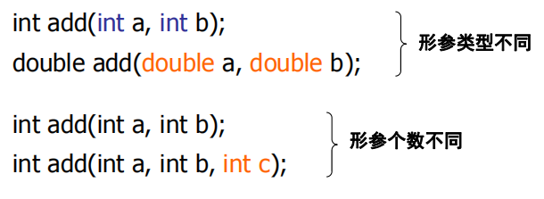

# 函数的设计

## 1、默认参数

* C++允许在函数定义或函数声明时，为形参指定默认值，这样的参数称为默认参数（default argument），一般形式为：
    ```cpp
    返回类型 函数名(...,类型 默认参数名=默认值) 
    { 
        函数体 
    }
    ```
    ```cpp
    int add(int x=5,int y=6) 
    { 
        return x+y; 
    }
    int main() 
    { 
        add(10,20); //10+20 
        add(10); //10+6 
        add(); //5+6 
        return 0;
    }
    ```

1. 如果在函数定义时设置了默认参数，那么就不能在函数声明中再次设置，反之亦然。
    ```cpp
    int volume(int L, int W , int H=1); 
    int volume(int L, int W , int H=1) //定义再次设置，错误 
    { 
        return length * width * height; 
    }
    ```
    ```cpp
    int volume(int L, int W , int H=1); 
    int volume(int L, int W , int H) // 正确 
    { 
        return length * width * height; 
    }
    ```
2. 可以设置多个默认参数，设置的顺序为自右向左，换言之，要为某个参数设置默认值，则它右边的所有参数必须都是默认参数。
    ```cpp
    int volume(int L, int W , int H=1); //H为默认参数，正确 
    int volume(int L, int W=1 , int H=1); //W,H为默认参数，正确 
    int volume(int L=1, int W=1 , int H=1); //L,W,H为默认参数，正确 
    int volume(int L=1, int W , int H); // 错误 
    int volume(int L, int W=1 , int H); // 错误
    ```
3. 默认值可以是常量、全局变量，甚至是一个函数调用（调用实参必须是常量或全局变量的表达式），不可以是局部变量。
    ```cpp
    int p1=2 , p2=10 ; 
    int max(int a,int b) 
    { 
        return a>b ? a : b; 
    }
    int volume(int L, int W , int H=1); //允许常量 
    int volume(int L, int W , int H=p1+p2); //允许全局变量及表达式 
    int volume(int L, int W , int H=max(5,6)); //允许函数调用 
    int volume(int L, int W , int H=max(p1,p2)) //允许全局变量函数调用    
    ```

* 默认参数函数的调用
    默认参数本质上是编译器根据函数声明或函数定义时的默认参数设置，对函数调用中没有给出来的实参自动用默认值表达式“补齐” 再进行编译。

* 【例10.1】带默认参数的函数举例。
    ```cpp
    #include <iostream> 
    using namespace std; 
    int p1=2 , p2=10 ; 
    int max(int a,int b) 
    { 
        return a>b ? a : b; 
    } 
    int volume(int L=1, int W=p1+p2 , int H=max(p1,p2)) 
    { 
        return L * W * H ; 
    } 
    int main() 
    { 
        cout << "v0=" << volume() <<endl; 
        cout << "v1=" << volume(5) <<endl; 
        cout << "v2=" << volume(5,10) <<endl; 
        cout<<"v3="<<volume(5,10,15) <<endl; 
        return 0; 
    }

    ```


## 2、函数重载

* 函数重载（function overloading）是在同一个域中用同一个函数名来定义多个函数，但函数参数列表应彼此有不同，或者是参数个数不同，或者是参数类型不同，或者两者均有不同。
  

* 【例10.2】函数重载举例。
```cpp
#include <iostream> 
using namespace std; 
int max(int a, int b) //整型版本 
{ 
    return (a>b ? a : b); 
} 
double max(double a, double b) //双精度版本 
{ 
    return (a>b ? a : b); 
} 
long max(long a, long b) //长整型版本 
{ 
    return (a>b ? a : b); 
}
int main() 
{ 
    int i=12 , j=-12 , k; 
    k = max(i,j) ; //调用整型版本max 
    cout << "int max=" << k << endl; 
    double x=123.4 , y=65.43 , z; 
    z = max(x,y) ; //调用双精度版本max 
    cout << "double max=" << z << endl; 
    long a=7654321 , b=1234567, c; 
    c = max(a,b) ; //调用长整型版本max 
    cout << "long max=" << c << endl; 
    return 0; 
}

```

* 【例10.3】函数重载举例。  
```cpp
#include <iostream> 
using namespace std; 
int max(int a, int b) //两个参数版本 
{ 
    return (a>b ? a : b); 
} 
int max(int a, int b, int c) //三个参数版本 
{ 
    a = a>b ? a : b ; 
    a = a>c ? a : c ; 
    return (a); 
} 
int main() 
{ 
    int a , b, i=10, j=8 , k=12; 
    a = max(i,j) ; //调用两个参数版本max 
    b = max(i,j,k) ; //调用三个参数版本max 
    return 0; 
}

```

* 函数重载的使用说明：
    1. 重载函数的形参必须不同（个数不同或类型不同）。  
    2. 编译程序将根据实参和形参的类型及个数的最佳匹配来选择调用哪一个函数。  
    3. 不要将不同功能的函数声明为重载函数，以免出现调用结果的误解、混淆。  


## 3、函数模板

* 函数模板（function template）是一个独立于类型的函数，可作为一种模式，产生函数的特定类型版本。
    ```cpp
    int abs( int x ) 
    { 
        return x<0?-x:x; 
    } 
    double abs( double x ) 
    { 
        return x<0?-x:x; 
    }
    ```
* 使用函数模板可以设计通用型的函数，这些函数与类型无关并且只在需要时自动实例化，从而形成“批量型”的编程方式。

* 函数模板定义的语法形式为：
    ```cpp
    template<模板形参表>返回类型 函数名(形参列表) 
    { 
        函数体 
    }
    ```
    ```cpp
    template<typename T> T abs(T x) 
    { 
        return x<0?-x:x; 
    }
    int main() 
    { 
        int n=-5; 
        double d=-5.5; 
        cout<<abs(n)<<','<<abs(d)<<endl; 
        return 0; 
    }
    ```

* 模板形参表（template parameter list）是用一对尖括号括< >括起来的一个或多个模板形参的列表，不允许为空，形参之间以逗号分隔，其形式有两种。
    1. 第一种形式
        ```cpp
        typename 类型参数名1,typename 类型参数名2,......
        ```
    2. 第二种形式
        ```cpp
        class 类型参数名1, class 类型参数名2,......
        ```

* 【例10.4】函数模板举例。
    ```cpp
    #include <iostream> 
    using namespace std; 
    template <class T> T add(T a,T b) 
    { 
        return a+b; 
    } 
    int main() 
    { 
        cout<<"int_add="<<add(10,20)<<endl; //生成整型版本的add函数 
        cout<<"double_add="<<add(10.2,20.5)<<endl;//生成实型版本的add函数 
        cout<<"char_add="<<add('A','\2')<<endl;//生成字符型版本的add函数 
        cout<<"int_add="<<add(100,200)<<endl; 
        return 0; 
    }

    ```

## 4、库函数的调用

* 所谓**库函数**是指事先由程序员编制好的函数。

* 多数情况下，基于各种理由，如保护知识产权，这些库函数仅提供二进制形式的目标代码给调用者链接，却没有提供源码形式的函数定义。

1. 在程序中添加库函数声明
    * 多数库函数将自己的函数原型和特殊数据等放在头文件（.h）中，所以应首先使用文件包含命令将这些头文件包含到程序中。例如欲使用数学库函数，文件包含命令为：
        ```cpp
        #include <cmath>
        ```
        从而使得程序有函数声明，例如：`y=sin(x);`调用就能够通过编译。

2. 将库函数目标代码连接到程序中。
    * 在连接时，例如使用了sin函数，就必须要有sin函数的实现代码才能生成可执行文件，否则连接出错。要将库函数的目标代码能够连接到程序中，主要是配置好开发环境的相关参数，然后由连接器处理。

* 标准库函数的连接在开发环境中是默认的，一般可以不用特别设置。


