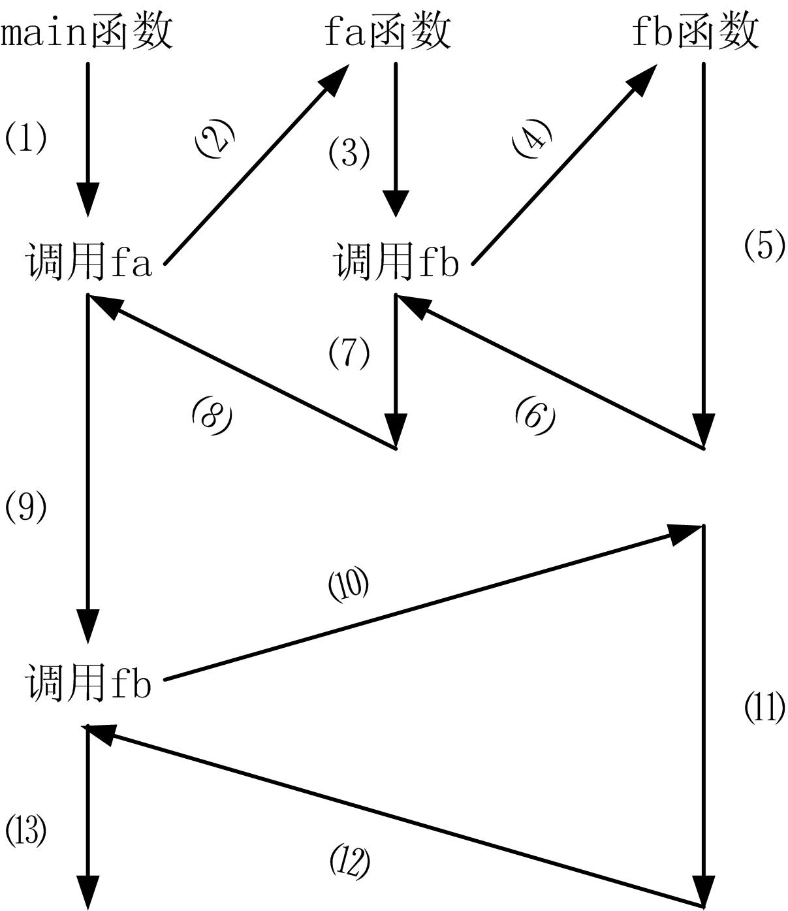
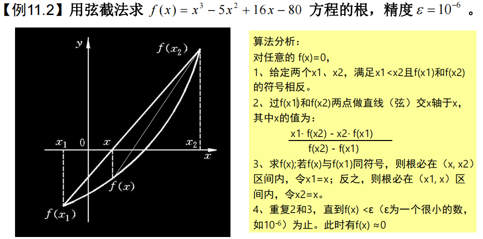
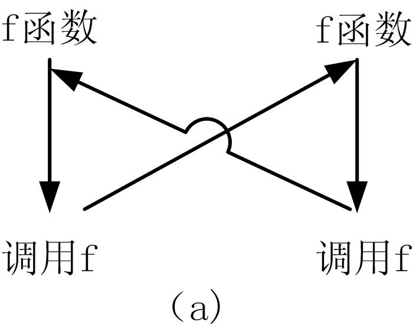
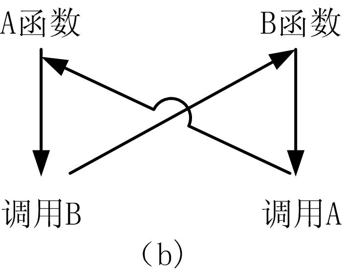
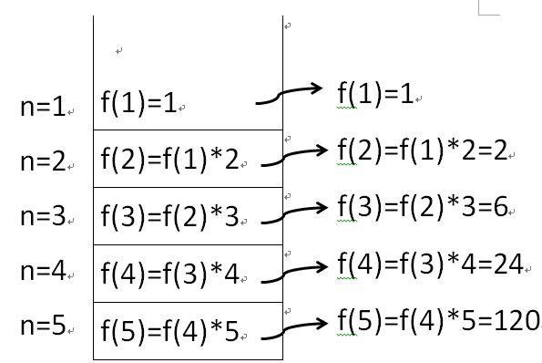
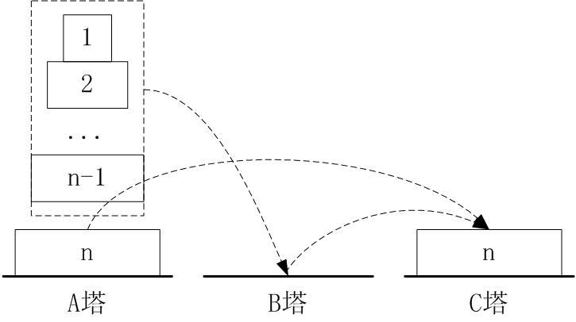
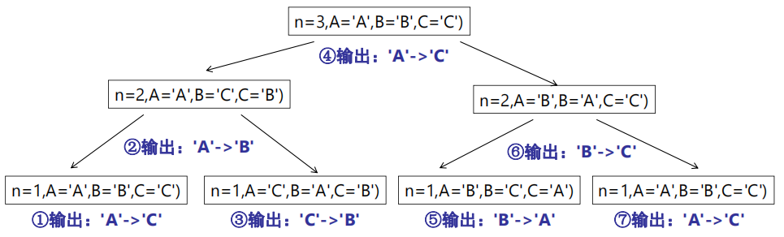

# 函数的调用


## 1、函数的嵌套调用

* 在调用一个函数的过程中，又调用另一个函数，称为函数的嵌套调用，C++允许函数多层嵌套调用，只要在函数调用前有函数声明即可。

* 【例11.1】函数的嵌套调用举例。
    ```cpp
    #include <iostream> 
    using namespace std; 
    int fa(int a,int b); //fa函数原型 
    int fb(int x); //fb函数原型 
    int main() 
    { 
        int a=5,b=10,c; 
        c = fa(a,b); cout<<c<<endl; 
        c = fb(a+b); cout<<c<<endl; 
        return 0; 
    }
    int fa(int a,int b) 
    { 
        int z; 
        z= fb(a*b); 
        return z; 
    } 
    int fb(int x) 
    { 
        int a=15,b=20,c; 
        c=a+b+x; 
        return c; 
    }

    ```
* 图11.1 嵌套调用示意
      


  

    ```cpp
    #include <iostream> 
    #include <cmath> 
    using namespace std; 
    double f(double x) 
    { //所要求解的函数公式，可改为其他公式 
        return x*x*x-3*x-1; 
    } 
    double point(double a,double b) 
    { //求解弦与x轴的交点 
        return (a*f(b)-b*f(a))/(f(b)-f(a)); 
    }
    double root(double a, double b) 
    { //弦截法求方程[a,b]区间的根 
        double x,y,y1; 
        y1=f(a); 
        do { 
            x=point(a,b); //求交点x坐标 
            y=f(x);//求y 
            if (y*y1>0) y1=y, a=x; 
            else b=x; 
        } while (fabs(y)>=0.00001); //计算精度E 
        return x; 
    }
    int main() 
    { 
        double a,b; 
        cin>>a>>b; 
        cout<<"root="<<root(a,b)<<endl; 
        return 0; 
    }

    ```

## 2、函数的递归调用

* 函数直接或间接调用自己称为递归调用。C++语言允许函数递归调用，如图（a）所示为直接递归调用，如图（b）所示为间接递归调用。
      
      


* 【例11.3】使用函数的递归求n的阶乘的函数。
    ```cpp
    #include <iostream> 
    using namespace std; 
    int f(int n) 
    { 
        if (n>1) return f(n-1)*n; //递归调用 
        return 1; 
    } 
    int main() 
    { 
        cout<<f(5)<<endl; 
        return 0; 
    }

    ```
     


* 【例11.4】Hanoi塔问题。设有A、B、C三个塔座，在塔座A上有n个圆盘，这些圆盘自上而下由小到大的叠在一起。现在要将塔座A上的这叠盘子移到塔座C上，并仍按同样顺序放置，且在移动的过程中遵循规则：
    > ①每次只能 移动一个圆盘；②不能将较大的圆盘压在较小的圆盘之上；  
    > ③移动中可以 使用A、B、C任一塔座。  

* 图11.2 Hanoi塔求解示意
    


    ```cpp
    void Hanoi(int n, char A, char B, char C) 
    { 
        if (n==1) cout<<A<<"->"<<C<<" "; 
        else { 
            Hanoi(n-1, A, C, B); 
            cout<<A<<"->"<<C<<" "; 
            Hanoi(n-1, B, A, C); 
        } 
    }
    int main(void) 
    { 
        ……
        Hanoi(n, 'A', 'B', 'C'); 
        …… 
    }
    ```
    运行结果：  
    ```cpp
    3
    A->C A->B C->B A->C B->A B->C A->C
    ```


* 图11.3 Hanoi塔递归示意 
    ```cpp
    void Hanoi(int n, char A, char B, char C) 
    { 
        if (n==1) cout<<A<<"->"<<C<<" "; 
        else { 
            Hanoi(n-1, A, C, B); 
            cout<<A<<"->"<<C<<" "; 
            Hanoi(n-1, B, A, C); 
        } 
    }
    ```
      


