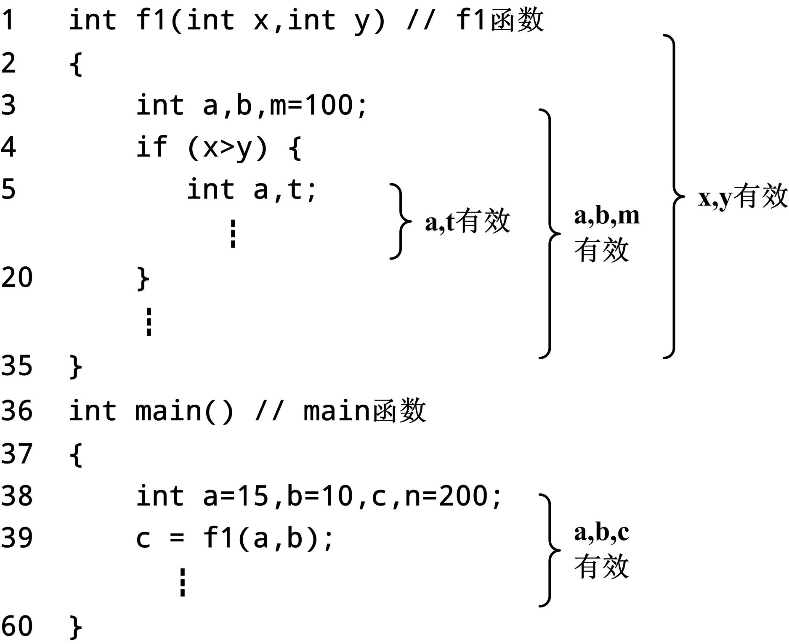
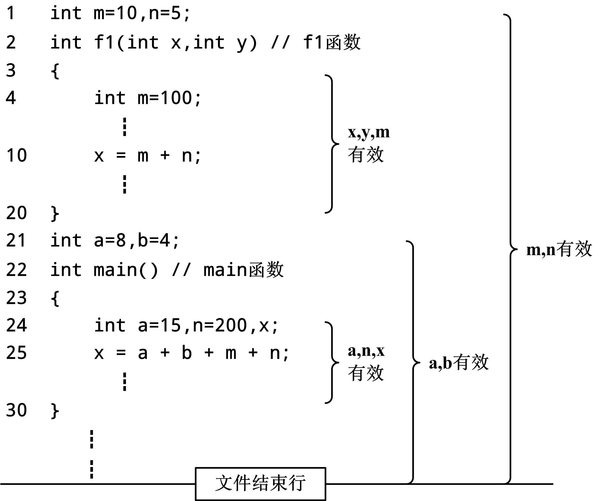

# 作用域、生命期和程序的组织结构


## 1、局部变量和全局变量

* 在函数内部或复合语句中（简称区域）定义的变量，称为局部变量（local variable），又称为内部变量。

* 下列变量是局部变量：
    1. 在一个函数内部定义的变量  
    2. 函数的形式参数  
    3. 在某个复合语句中定义的变量

      

  * 局部变量的说明。
      1. 局部变量只能在定义它的区域及其子区域中使用。
      2. 在同一个区域中不能定义相同名字的变量。
      3. 在不同区域中允许定义相同名字的变量，但本质上它们是不同的变量
      4. 如果一个变量所处区域的子区域中有同名的变量，则该变量在子区域无效，有效的是子区域的变量，称为定义屏蔽。


* 在源文件中，但在函数外部定义的变量，称为**全局变量**（global variable），全局变量的有效区域是从定义变量的位置开始到源文件结束。
      

* 函数之间数据传递尽管可以利用全局变量，但这样一来也导致两个函数彼此分不开，违背模块化的原则，所以结构化程序设计**提倡少用或不用全局变量**。


* 【例12.1】编写一个函数swap用于交换两个整数的值——方法1
    ```cpp
    #include <iostream> 
    using namespace std; 
    void swap(int x,int y) 
    { 
        int t; t=x; x=y; y=t; 
    } 
    int main( ) 
    { 
        int a,b; 
        cin>>a>>b; swap(a,b); 
        cout<<"a="<<a<<",b="<<b<<endl; 
        return 0; 
    }

    ```
    运行结果： 
    ```cpp
    3 4 
    a=3, b=4
    ```

* 【例12.1】编写一个函数swap用于交换两个整数的值——方法2
    ```cpp
    #include <iostream> 
    using namespace std; 
    int x,y; 
    void swap() 
    { 
        int t; t=x; x=y; y=t; 
    } 
    int main( ) 
    { 
        int a,b; cin>>a>>b; 
        swap(a,b); cout<<"a="<<a<<",b="<<b<<endl; 
        return 0; 
    }

    ```
    运行结果： 
    ```cpp
    3 4 
    a=4, b=3
    ```


## 2、作用域

* C++的实体通常有三类：
    1. 变量或对象。例如变量、数组等；  
    2. 函数； 
    3. 类型。包含结构体类型、共用体类型、类类型。  

* 作用域是程序中的一段区域。在同一个作用域上，C++程序中每个名字都与唯一的实体对应；如果在不同的作用域上，程序中可以多次使用同一个名字，对应不同作用域中的不同实体。 

* 作用域分有：
    1. 文件作用域（file scope）
    2. 函数作用域（function scope）
    3. 块作用域（block scope）
    4. 类型声明作用域（declaration scope）
    5. 函数原型作用域（function prototype scope）

* 实体在作用域内可以使用称为可见（visible），又称有效。可见的含义是指实体在作用域上可以使用。

* 下面给出C++实体可见规则。
    1. 规则一。同一个作用域内不允许有相同名字的实体，不同作用域的实体可以有相同名字。  
    2. 规则二。实体在包含它的作用域内，从定义或声明的位置开始，按文件行的顺序往后（往下）直到该作用域结束均是可见的，包含作用域内的所有子区域及其嵌套。   
    3. 规则三。若实体A在包含它的作用域内的子区域中出现了相同名字的实体B，则实体A被屏蔽。  
        ```cpp
        int main() 
        { 
            int a,b,c; 
            c=2; 
            { 
                int c; 
                ……… 
                c=a+b; 
                ……… 
            }
            c=c+1; 
            return 0; 
        }
        ```
    4. 规则四。可以使用extern声明将变量或函数实体的可见区域往前延伸，称为前置声明（forward declaration）。
        * extern声明变量实体的形式为：
            ```cpp
            extern 类型 变量名, ......
            ```
        * extern声明函数原型的形式为：
            ```cpp
            extern 返回类型 函数名(类型1 参数名1, ......); 
            extern 返回类型 函数名(类型1,......);
            ```
    5. 规则五。在全局作用域中，变量或函数实体若使用static修饰，则该实体对于其他源文件是屏蔽的，称为私有的（private）。
        * static修饰变量实体的形式为：
            ```cpp
            static 类型 变量名[=初值], ......
            ```
        * static修饰函数原型的形式为：
            ```cpp
            static 返回类型 函数名(类型1 参数名1, ......); 
            static 返回类型 函数名(类型1, ......) ;
            ```

* 【例12.2】作用域举例。
    ```cpp
    // FILE1.CPP 全局作用域 
    int a=1 , b=2; //全局变量 
    int c=10 , d=11; //全局变量 
    void f1(int n,int m) //f1函数作用域 
    { 
        int x=21, y=22,z=23; //f1局部变量 
        extern int h,k;//正确，h=60 k=61 规则四 
        n = n + t ; //错误，t 违反规则二 
        if (n>100) { //块作用域 
            int x=31,t=20; //复合语句局部变量 
            n=x+y; //正确，n=31+22 规则二 规则三 
            if (m>10) { //嵌套块作用域 
                int y=41;//嵌套的复合语句局部变量 
                n=x+y;//正确，n=31+41 规则二 规则三 
            } 
        }
        n = a + x ; //正确，n=1+21 规则二 
        m = e + f ; //错误，e,f 违反规则二 
        n = h + k ; //正确，n=60+61 规则四 
    } 
    int e=50 , f=51; //全局变量 
    int h=60 , k=61; //全局变量 
    void f2(int n,int m) //f2函数作用域 
    { 
        n=a+b+e+f; //正确，n=1+2+50+51 规则二 
        m=z; //错误，z 违反规则一 
    } 
    int f3(int n,int m) //f3函数作用域 
    { 
        return n+m; //正确，规则二 
    }
    int f4(int n,int m) //f4函数作用域 
    { 
        return n-m; //正确，规则二 
    } 
    // FILE1.CPP 文件结束
    ```

    ```cpp
    // FILE2.CPP 全局作用域 
    int a=201 , b=202; //错误，连接时与FILE1.CPP的同名 违反规则一 
    void f1(int n,int m) //错误，连接时与FILE1.CPP的同名 违反规则一 
    { 
        n=n*m; 
    } 
    static int c=210 , d=212; //正确，规则五 
    static void f2(int n,int m) //正确，规则五 
    { 
        n=n/m; 
    }
    extern int h , k; //正确，规则四 
    extern int f4(int n,int m); //正确，规则四 
    int main() 
    { 
        int p,q,r;//main函数局部变量 
        p = c + d;//正确，p=210+212 规则二 
        f2(-1,-2);//正确，不是FILE1.CPP的 规则二 
        q=e+f;//错误，试图使用FILE1.CPP违反规则一 
        f3(-10,-12); 
        r = h + k; //正确，r=60+61 规则四 
        f4(-20,-22); //正确，规则四 
        return 0; 
    } 
    // FILE2.CPP 文件结束
    ```

## 3、生命期

* C++中，每个名字都有作用域，即可以使用名字的区域，而每个对象都有生命期（lifetimes），即在程序执行过程中对象存在的时间。


### 1. 动态存储
* 动态存储（dynamic storage duration）是指在程序运行期间，系统为对象动态地分配存储空间。动态存储的特点是存储空间的分配和释放是动态的，要么由函数调用来自动分配释放，要么由程序指令来人工分配释放，这个生命期是整个程序运行期的一部分。
* **动态存储的优点**是对象不持久地占有存储空间，释放后让出空闲空间给其他对象的分配。
* 动态存储在分配和释放的形式有两种，一种是由函数调用来自动完成的，称为自动存储（automatic storage），一种是由程序员通过指令的方式来人工完成的，称为自由存储（free storage）。

### 2. 静态存储
* 静态存储（static storage duration）是指对象在整个程序运行期持久占有存储空间，其生命期与程序运行期相同。**静态存储的特点**是对象的数据可以在程序运行期始终保持直到修改为止，或者程序结束为止，静态存储的分配和释放在编译完成时就决定好了。
* 现代程序设计的观点是，**除非有必要尽量少地使用静态存储**。


### 3. 自动对象
* 默认情况下，函数或复合语句中的对象（包含形参）称为自动对象（automatic objects），其存储方式是自动存储，程序中大多数对象是自动存储。
    ```cpp
    auto 类型 变量名[=初值], ......
    ```

### 4. 寄存器变量
* C++语言允许用CPU的寄存器来存放局部变量，称为寄存器变量。在局部变量前加上register存储类别修饰来定义的，其形式为：
    ```cpp
    register 类型 变量名[=初值], ......
    ```

### 5. 静态局部对象
* 在局部对象的前面加上static存储类别修饰用来指明对象是静态局部对象（static local object），一般形式为：
    ```cpp
    static 类型 变量名[=初值] , ......
    ```

* 【例12.3】局部静态变量举例。
    ```cpp
    #include <iostream> 
    using namespace std; 
    int fun() 
    { 
        static int cnt=0; //静态局部变量会保持其值 
        cnt++; 
        return cnt; 
    } 
    int main() 
    { 
        int i,c; 
        for (i=1;i<=10;i++) c=fun(); 
        cout<<c<<endl; 
        return 0; 
    }

    ```

## 4、内部函数与外部函数

### 内部函数
* 函数本质上是全局的，在多文件的程序中，在连接时会检查函数在全局作用域内是否名字唯一，如果不是则出现连接错误。
* 在函数定义前加上static修饰，则函数称为内部函数，定义形式为：
    ```cpp
    static 返回类型 函数名(形式参数列表) 
    { 
        函数体 
    }
    ```

* 按照前面的实体可见规则，内部函数仅在包含它的文件中有效。
* 之所以使用内部函数的原因是该函数逻辑上仅限定在一个文件中使用，其他文件不会用到。而且希望连接检查时永远不可能出现该函数名不唯一的连接错误，这在多人编写同一个程序的软件开发模式中是常用的策略。

### 外部函数
* 在函数定义前加上extern声明，则函数称为外部函数，定义形式为：
    ```cpp
    extern 返回类型 函数名(形式参数列表) 
    { 
        函数体 
    }
    ```
* C++中所有的函数本质上都是外部函数。因此，上面的extern都可以省略。


## 5、头文件与工程文件
* 为什么要使用头文件呢？
    * 我们现在已经知道，如果是多文件结构程序，欲在文件中调用别的文件中的函数，需要有函数的声明，而且每个文件均是如此。如果是函数声明比较多的情况下，在每个文件中都写上函数声明不是好办法，很难管理。例如：某个函数定义有变动，那么所有含有这个函数声明的调用文件都需要找出来，逐一修改。
    * 使用头文件可以解决这个问题，其工作原理是通过将每个源文件中外部函数的函数声明等信息集中写到一个文件中，称为头文件（有别于源文件），而别的源文件只需用文件包含命令将这个头文件包含，则编译时编译器自然就有了函数声明。

* 工程文件
    * 多文件结构程序在编译时需要工程文件来管理，不同的编译器有不同的工程文件格式。


## 6、多文件编译

* 【例12.4】编写sin(x)、cos(x)、sqrt(x)数学函数演示程序。
    ```cpp
    //a.h文件 
    double fsin(double x);
    ```
    ```cpp
    //a.cpp文件 
    #include <cmath> 
    #include "main.h" 
    double fsin(double x) 
    { 
        return sin(x*PI/180.0); 
    }
    ```
    ```cpp
    //⑥b.h文件 
    double fcos(double x);
    ```
    ```cpp
    //⑤b.cpp文件 
    #include <cmath> 
    #include "main.h" 
    double fcos(double x) 
    { 
        return cos(x*PI/180.0); 
    }
    ```

    ```cpp
    //⑧c.h文件 
    double fsqrt(double x);
    ```
    ```cpp
    //⑦c.cpp文件 
    #include <cmath> 
    double fsqrt(double x) 
    { 
        return sqrt(x); 
    }
    ```
    ```cpp
    //②main.h文件 
    #define PI 3.1415926
    ```
    ```cpp
    //①main.cpp文件 
    #include <iostream> 
    using namespace std; 
    #include "a.h" 
    #include "b.h" 
    #include "c.h" 
    int main() 
    { 
        int n; double x; 
        cout<<"1. sin(x)\n2. cos(x)\n3. sqrt(x)\ninput select(1-3):"; 
        cin>>n; //选择 
        cout<<"input x:"; cin>>x;
        switch (n) { //根据n分别调用a.c、b.c、c.c的函数 
            case 1:cout<<"sin="<<fsin(x)<<endl;break; 
            case 2:cout<<"cos="<<fcos(x)<<endl;break; 
            case 3:cout<<"sqrt="<<fsqrt(x)<<endl;break; 
        } 
        return 0; 
    }

    ```
    运行结果：  
    ```cpp
    3
    input x：9 
    sqrt=3
    ```
