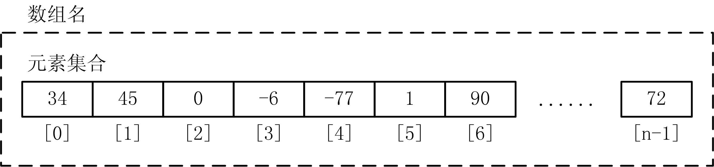
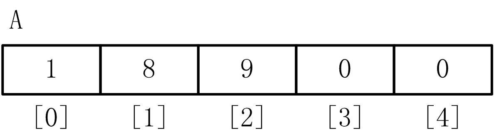
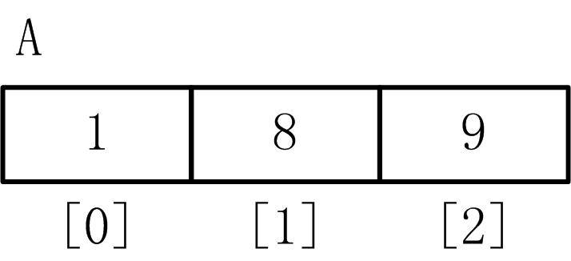
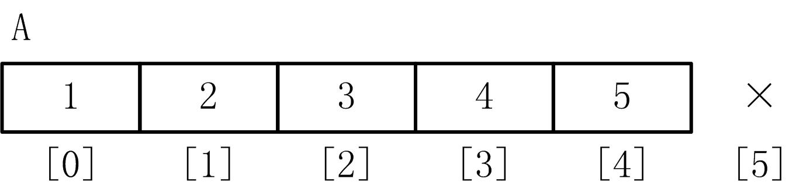
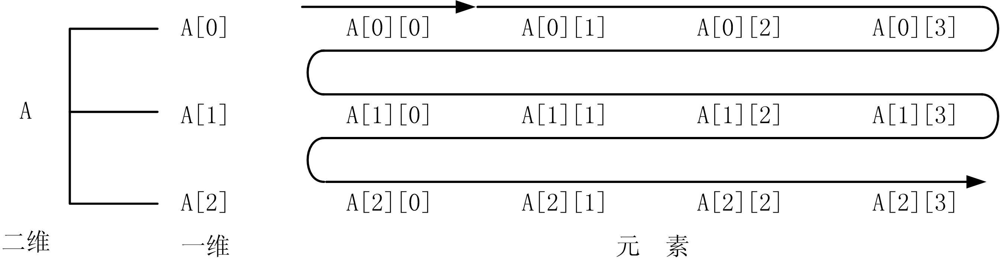
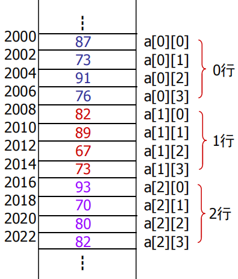
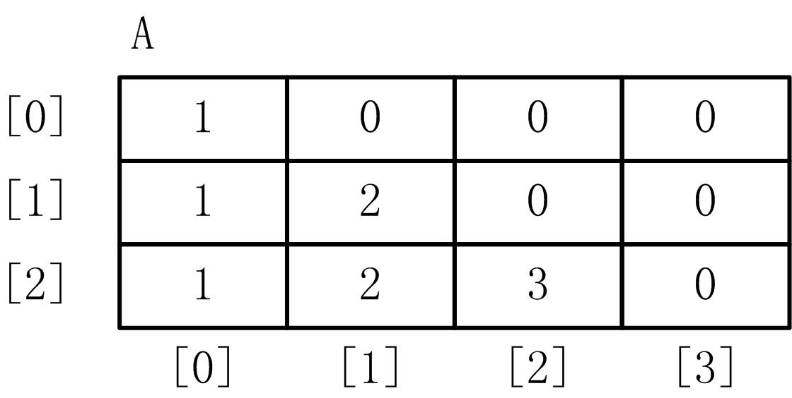
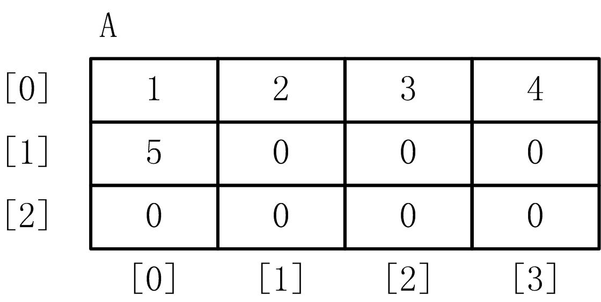
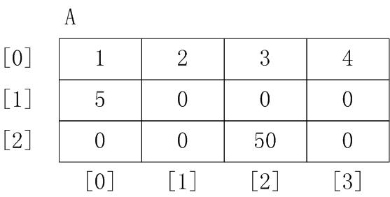
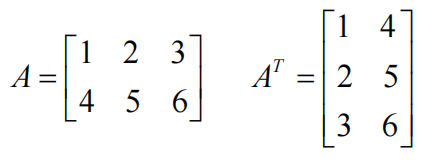

# 数组的定义和使用

## 1、一维数组的定义、初始化

* 简单问题的求解：
* 对一个学生的成绩进行输入输出？
    `int score; cin>>score; cout<<score;`

* 对100个学生成绩进行输入输出？
    ```cpp
    int s1,s2, … ,s100;
    cin>>s1>>s2>> … >>s100;
    cout<<s1<<' '<<s2<<' '<< … <<s100;
    ```

* 在现实应用问题中，总会使用到大批量的数据，这样的数据用变量来处理效率是底下的。

* **数组用来表示一组数据的集合**。使用数组，可以方便地定义一个名字（数组名）来表示大批量数据，并能够**通过循环批处理大量数据**。


1. 一维数组的定义
    * 数组就是一组相同类型数据的集合。
    * 一维数组的定义形式为：
        ```cpp
        元素类型 数组名[常量表达式];
        ```
        ```cpp
        int A[10]; 
        int B[10], C[15]; //多个数组定义 
        int E[10], m, n, F[15]; //数组和变量混合在一起定义
        ```
        1. 一维数组是由元素类型、数组名和长度组成的构造类型。例如： 
            ```cpp
            int A[10], B[20]; // 元素是整型 
            double F1[8], F2[10]; //元素是双精度浮点型 
            char S1[80], S2[80]; //元素是字符型
            ``` 
        2. 数组名必须符合C++标识符规则。  
        3. 常量表达式表示数组中元素的个数，称为数组长度。常量表达式的值必须为正整数且大于等于1。  
        4. 数组一经定义，数组长度就始终不变。
            ```cpp
            int n; 
            cin>>n; 
            int a[n]; // 错误！
            ```
2. 一维数组的内存形式
    * C++规定数组元素是连续存放的，即在内存中一个元素紧跟着一个元素线性排列。
          

3. 一维数组的初始化
    * 可以在一维数组定义时对它进行初始化，初始化的语法形式如下：
        ```cpp
        元素类型 数组名[常量表达式]={初值列表};
        ```
        ```cpp
        int A[5]={1,2,3,4,5} , B[3]={7,8,9}; //一维数组初始化
        ```
        1. 初值列表提供的元素个数不能超过数组长度，但可以小于数组长度。如果初值个数小于数组长度，则只初始化前面的数组元素，剩余元素初始化为0。例如：   
            ```cpp
            int A[5]={1,8,9};
            ```
              
        2. 在提供了初值列表的前提下，数组定义时可以不用指定数组长度，编译器会根据初值个数自动确定数组的长度。例如：  
            ```cpp
            int A[]={1,8,9};
            ```
              
            可以用下面的表达式计算出数组A的长度：  
            ```cpp
            sizeof(A) / sizeof(int)
            ```
        3. 若数组未进行初始化，静态数组的元素均初始化为0；在函数体内定义的动态数组，其元素没有初始化，为一个随机值。
            ```cpp
            static int A[10]; //默认各元素的值为0 
            int A[10]; //各元素的值为随机数
            ```

## 2、一维数组的引用

* 数组必须先定义后使用，且**只能逐个引用数组元素的值而不能一次引用整个数组全部元素的值**。

* 数组元素引用是通过下标得到的，一般形式为：
    ```cpp
    数组名[下标表达式]
    ```
    1. 注意下标的表示形式
        * 下标表达式可以是常量、变量、表达式，但必须是正整数，不允许为负。  
        * 数组元素下标总是从0开始。
            ```cpp
            int A[5]={1,2,3,4,5}, x,i=3; 
            x = A[2] ; 
            A[1+2]=10; 
            A[i]++;
            ```
    2. 下标值不能超过数组长度，否则导致数组下标越界的严重错误。例如：   
        ```cpp
        int A[5]={1,2,3,4,5}; 
        A[5]=10; //错误，没有A[5]元素
        ```
          
    3. 整个数组不允许进行赋值运算、算术运算等操作，只有元素才可以，例如：
        ```cpp
        int A[10], B[10], C[10]; 
        A = B; //错误 
        A = B + C; //错误 
        A[0] = B[0]; //正确，数组元素赋值 
        A[2] = B[2]+C[2]; //正确，数组元素赋值
        ```


* 从数组的内存形式来看，数组元素的下标是有序递增的，这个特点 使得可以利用循环来批量处理数组元素。

* 【例13.1】对数组中的所有元素进行输入输出。
    ```cpp
    #include <iostream> 
    using namespace std; 
    int main() //一维数组的输入输出 
    { 
        int i, A[100]; 
        for(i=0;i<100;i++) cin>>A[i]; 
        for(i=100-1;i>=0;i--) cout<<A[i]<<" "; 
        return 0; 
    }

    ```

* 【例13.2】将一个一维数组的元素赋给另一个等长的一维数组。
    ```cpp
    #include <iostream> 
    int main() 
    { 
        int A[5]={1,2,3,4,5} , B[5] , i; 
        for (i=0; i<5; i++) 
        B[i] = A[i]; //元素一一复制 
        return 0; 
    }
    ```

## 3、多维数组的定义、初始化

### 1. 多维数组的定义
* C++允许定义多维数组，其定义形式为：
    ```cpp
    元素类型 数组名[常量表达式1][常量表达式2];
    ```
    ```cpp
    元素类型 数组名[常量表达式1][常量表达式2] …[常量表达式n] ; 
    ```
    ```cpp
    int A[3][4]; //定义二维数组 
    int B[3][4][5]; //定义三维数组 
    int C[3,4,5,6]; //错误！
    ```
* 多维定义实际上是反复递归一维定义：即一维数组的每一个元素又是一个一维数组，就构成了二维数组。

* 本质上，C++的多维数组都是一维数组，这是由内存形式的线性排列决定的。因此，不能按几何中的概念来理解多维，多维数组不过是借用“维”的数学说法表示连续内存单元。

* 图13.1 二维数组的内存结构
      

* 例：`int a[3][4];`假设每个元素占2个字 节的存储空间，则存储结构图示:
      


### 2. 多维数组的初始化
* 可以在多维数组定义时对它进行初始化，这里以二维数组来说明，初始化有两种形式。
    1. 初值按多维形式给出：
        ```cpp
        元素类型 数组名[常量表达式1][常量表达式2] ={{初值列表 1},{初值列表2},...};
        ```
        ```cpp
        int A[2][3]={ {1,2,3},{4,5,6}};//初值按二维形式
        ```
    2. 初值按一维形式给出：
        ```cpp
        元素类型 数组名[常量表达式1][常量表达式2] ={初值列表};
        ```
        ```cpp
        int A[2][3]={ 1,2,3,4,5,6 };//初值按一维形式
        ```

* 初值列表提供的元素个数不能超过数组长度，但可以小于数组长度。如果初值个数小于数组长度，则只初始化前面的数组元素；剩余元素初始化为0。这个规则两种初始化形式都适用，例如：
    ```cpp
    //只对每行的前若干个元素赋初值 
    int A[3][4]={{1},{1,2},{1,2,3}};
    ```
      

    ```cpp
    //一维形式部分元素赋初值 
    int A[3][4]={1,2,3,4,5};
    ```
    


* 在提供了初值列表的前提下，多维数组定义时可以不用指定第1维的数组长度，但其余维的长度必须指定，编译器会根据列出的元素个数自动确定第1维的长度。例如：
    ```cpp
    int A[][2][3]={1,2,3,4,5,6,7,8,9,10,11,12}; //正确 
    int B[2][][3]={1,2,3,4,5,6,7,8,9,10,11,12}; //错误，只能省略第1维 
    int C[2][2][]={1,2,3,4,5,6,7,8,9,10,11,12}; //错误，只能省略第1维
    ```


## 4、多维数组的引用

* 多维数组元素的引用与一维类似，也只能逐个引用数组元素的值而不能一次引用整个数组，引用的一般形式为：
    ```cpp
    数组名[下标表达式1][下标表达式2] …[下标表达式n]
    ```
    ```cpp
    int b[3][4], i, j, sum=0; 
    b[0][0]=10; 
    b[1][2]=b[0][0]+10; 
    b[2-1][2*2-1]= 5
    ```
    ```cpp
    int A[3][4]={1,2,3},x; 
    x = A[0][1]; //x=2 
    A[2][2] = 50; //则数组A变为
    ```
    


* 【例13.3】给二维数组输入数据，并以行列形式输出
    ```cpp
    #include <iostream> 
    using namespace std; 
    int main() 
    { 
        int A[3][4],i,j; 
        for (i=0;i<3;i++) 
        for (j=0;j<4;j++) cin >> A[i][j]; 
        for (i=0;i<3;i++) { 
        for (j=0;j<4;j++) //内循环输出一行 
            cout<<A[i][j]<<" "; 
            cout<<endl; //每输出一行换行 
        } 
        return 0; 
    }

    ```

* 【例13.4】求矩阵的转置矩阵
      

    ```cpp
    #include <iostream> 
    using namespace std; 
    int main() 
    { 
        int A[2][3]={{1,2,3},{4,5,6}},AT[3][2], i, j; 
        for (i=0; i<2; i++) //求矩阵A的转置 
        for(j=0;j<3;j++) AT[j][i]=A[i][j]; 
            cout<<"A="<<endl; 
        for (i=0; i<2; i++) { //输出矩阵A 
            for(j=0;j<3;j++) cout<<A[i][j]<<" "; 
            cout<<endl; 
        } 
        cout<<"AT="<<endl; 
        for (i=0; i<3; i++) { //输出转置矩阵AT 
            for(j=0;j<2;j++) cout<<AT[i][j]<<" "; 
            cout<<endl; 
        } 
        return 0; 
    }
    ```


