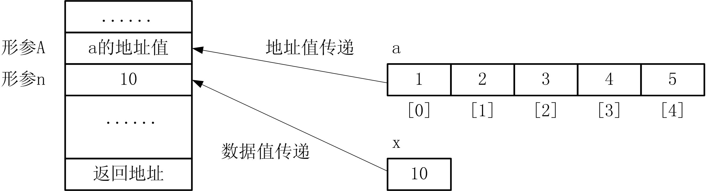

# 数组与函数

## 1、数组作为函数的参数

```cpp
#include<iostream> 
using namespace std; 
int m(int x, int y) 
{ 
    int max,min; 
    max=(x>y)? x:y; 
    min=(x<y)?x:y; 
    return(max); 
}
int main() 
{ 
    int a,b,c; 
    cin>>a>>b; 
    c=m(a,b); 
    cout<<c<<endl; 
    return 0; 
}
```

* 我希望函数m的功能为求出最大值和最小值，程序应该如何改动？


### 1. 数组元素作为函数的参数
* 一维数组元素可以直接作为函数实参使用，其用法与变量相同。
    ```cpp
    int max(int a,int b); 
    int A[5]={1,2,3,4,5} , c=2, x; 
    x=max(c,-10); //使用变量作为函数实参 
    x=max(A[2],-10); //使用数组元素作为函数实参
    ```

### 2. 整个数组作为函数的参数
* 数组作为函数的形参，基本形式为：
    ```cpp
    返回类型 函数名(类型 数组名[常量表达式],...) 
    { 
        函数体 
    }
    ```
    ```cpp
    double average(double A[100],int n) 
    { 
        … //函数体 
    }
    ```

* 数组参数的传递机制
    ```cpp
    void fun(int A[10],int n) 
    { 
        ……
        A[0]=10; 
    }
    int main() 
    { 
        int a[10]={1,2,3,4,5} , x=5; 
        fun(a,x); //实参分别是数组和整型变量 
    }
    ```

* 如果实参使用数组名调用，本质上是**将这个数组的首地址传递到形参中**。

* 尽管数组数据很多，但它们均从一个首地址连续存放，这个首地址对应的正是数组名。
      


* 数组实参a传的是数组首地址，形参A定义为数组形式，它现在的地址与实参数组a一样，则本质上形参数组A就是实参数组a（内存中两个对象所处位置相同，则它们实为同一个对象）。
    ```cpp
    void fun(int A[10],int n) 
    { 
        ……
        A[0]=10; 
    }
    int main() 
    { 
        int a[10]={1,2,3,4,5} , x=5; 
        fun(a,x); //实参分别是数组和整型变量 
    }
    ```


* 【例14.1】编写函数求两个数的最大值和最小值。
    ```cpp
    #include<iostream> 
    using namespace std; 
    void m(int b[2],int x,int y) 
    { 
        b[0]=(x>y)? x:y; 
        b[1]=(x<y)?x:y; 
    } 
    int main() 
    { 
        int x,y,a[2]; 
        cin>>x>>y; 
        m(a,x,y); 
        cout<<"max="<<a[0]<<",min="<<a[1]<<endl; 
        return 0; 
    }

    ```

## 2、数组参数的传递机制
* **数组作为函数的参数，传递的是数组的地址。**
* 这样的传递机制使得当数组作为函数参数时，有下面的特殊性。
    1. 由于形参数组就是实参数组，所以在被调函数中使用形参就是在间接使用实参，这点与变量作为函数参数的情况是不同的。
        ```cpp
        void fun(int A[5],int n) 
        { 
            A[1]=100; //A[1]实质就是实参a[1] 
            n=10; //赋值给形参n，不影响实参x 
        }
        void caller() 
        { 
            int a[5]={1,2,3,4,5},x=5; 
            fun(a,x); 
            cout<<a[1]<<","<<x<<endl; //a[1]=100,x=5 
        }
        ```
        * 【例14.2】编写函数求一个二维数组中最大的元素及其下标。
        * 分析：
            > 用max存放元素最大值，采用枚举法逐一比较二维数组中的每一个元素A[i][j]和max，若A[i][j]大于max说明有一个更大的值出现，则令max=A[i][j]且记录r=i和c=j，遍历完所有元素，则A[r][c]就是最大的元素。  
            > 由于max必然是数组中的一个元素值，故设置max的初值为A中一个元素值，例如A[0][0]。  
            > 由于函数需要返回最大元素值及下标行、列三个数据，而函数返回只能是一个数据，所以使用数组B传递到函数中，将下标行、列值“带回”。

            ```cpp
            #include <iostream> 
            using namespace std; 
            int findmax(int A[3][4],int B[2]) 
            { 
            int i,j,max,r=0,c=0; 
            max=A[r][c]; //max初值设为A[0][0] 
            for (i=0; i<3; i++) //枚举二维数组所有元素 
            for (j=0; j<4; j++) 
            if (A[i][j]>max) { 
            r = i , c = j; //记录此时的下标 
            max = A[r][c]; //新的最大元素值; 
            } 
            B[0]=r, B[1]=c; //下标行、列通过B数组返回到主调函数中 
            return max; //最大值通过函数值返回到主调函数中 
            }
            int main() 
            { 
            int A[3][4]={{7,5,-2,4},{5,1,9,7},{3,2,-1,6}},B[2],max; 
            max=findmax(A,B); 
            cout<<"max:A["<<B[0]<<"]["<<B[1]<<"]="<<max<<endl; 
            return 0; 
            }
            ```
    2. 既然形参数组就是实参数组，所以函数调用时不会为形参数组分配存储空间。
        * 形参数组不过是用数组定义这样的形式来表明它是个数组，能够接收实参传来的地址，形参数组的长度说明也无实际作用。因此形参数组甚至可以不用给出长度。
        * 假设有函数调用：
            ```cpp
            int a[15]; 
            f(a);
            ```
            则以下函数定义：
            ```cpp
            void f(int A[100]); //形参数组长度完全由实参数组确定，因此函数中并不 能按100个元素处理 
            void f(int A[10]); //形参数组长度完全由实参数组确定，因此函数中并不 能按10个元素处理 
            void f(int A[]); //表明形参是数组形式即可
            ```
            均是正确的。

    3. 虽然实参数组将地址传到了被调函数中，但被调函数并不知道实参数组的具体长度，那么假定的大小对于实参数组来说容易数组越界。
        * 实际编程中可以采用以下方法来解决： **函数调用时再给出一个参数来表示实参数组的长度。**
        * 【例14.3】编写函数，求数组所有元素的平均值。
            ```cpp
            #include <iostream> 
            using namespace std; 
            double average(double A[],int n) 
            { 
                int i; double s=0; //累加初值为0 
                for (i=0; i<n; i++) s=s+A[i]; //先累加 
                return n!=0 ? s/n : 0.0; //计算平均值 
            } 
            int main() 
            { 
                double A[3]={1,2,3}; 
                double B[5]={1,2,3,4,5}; 
                cout<<"A="<<average(A,3)<<endl; //传递数组长度即可正确计算 
                cout<<"B="<<average(B,5)<<endl; //传递数组长度即可正确计算 
                return 0;
            }
            ```

    4. 多维数组作为函数的参数，形参数组第1维可以与实参相同， 也可以不相同；可以是任意长度，也可以不写长度；但其他维的长度需要相同。
        * 例如有函数调用：
            ```cpp
            int a[5][10];
            f(a);
            ```
            则函数定义：
            ```cpp
            void f(int A[5][10]); //正确 
            void f(int A[2][10]); //正确 
            void f(int A[][10]); //正确 
            void f(int A[][]); //错误，第2维长度必须给出 
            void f(int A[5][5]); //错误，第2维长度必须相同 
            void f(int A[50]); //错误，必须是二维数组
            ```


