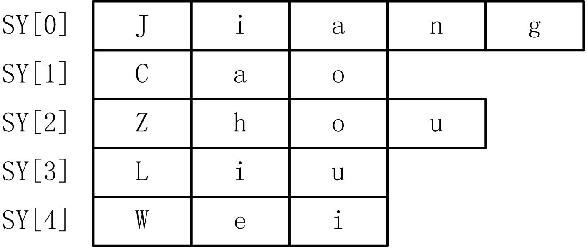

# 字符串的处理

## 1、字符数组

### 1. 字符数组
* 用来存放字符型数据的数组称为字符数组，其元素是一个个的字符。
* 字符数组的定义形式为：
    ```cpp
    char 字符数组名[常量表达式], ......;
    ```
    ```cpp
    char s[20]; //定义字符数组 
    char s[4]={'J','a','v','a'}; //字符数组初始化
    ```

### 2. 字符串的概念
* C++语言规定字符串是**以'\0'（ASCII值为0）字符作为结束符的字符数组**。

* 在程序中可以通过判断数组元素是否为空字符来判断字符串是否结束，换言之，**只要遇到数组元素是空字符，就表示字符串在此位置上结束**。

* 由于字符串实际存放在字符数组中，所以定义字符数组时**数组的长度至少为字符串长度加1**（空字符也要占位）。

* 字符串常量是字符串的常量形式，它是以一对双引号括起来的字符序列。

* C++总是在编译时为字符串常量自动在其后增加一个空字符。

* 区分"a"和'a'和a
    ```cpp
    char c; 
    char s[10]="hello."; 
    c='a'; //正确 
    c="a"; //错误
    ```
* C++语言总是在编译时为字符串常量自动在其后增加一个空字符，例如"Hello"的存储形式为：
      

* 如果在字符串常量中插入空字符，则字符串常量的长度会比看到的字符数目少，例如"ABC\0DEF"的存储形式为：
      

### 3. 字符串的输入和输出
1. 使用标准输入输出流，将整个字符串一次输入或输出。
    ```cpp
    char str[80]; 
    cin >> str; //输入字符串 
    cout << str; //输出字符串
    ```

2. 使用字符串输入输出函数
    * gets函数
    ```cpp
    char *gets(char *s);
    ```
    * gets函数输入一个字符串到字符数组s中。s是字符数组或指向字符数组的指针，其长度应该足够大，以便能容纳输入的字符串。
    ```cpp
    char str[80]; 
    gets(str); //输入字符串
    ```

    * puts函数
        ```cpp
        int puts(char *s);
        ```
    * puts函数输出s字符串，遇到空字符结束，输完后再输出一个换行（'\n'）。s是字符数组或指向字符数组的指针，返回值表示输出字符的个数。  
    * puts输出的字符不包含空字符。
        ```cpp
        char str[80]="Programming"; 
        puts(str); //输出字符串
        ```

## 2、字符串处理函数

* C++标准库提供了兼容C语言的字符串处理函数，其头文件为`string.h`。

1. 字符串复制函数strcpy
    ```cpp
    char str1[10],str2[]="Computer"; 
    strcpy(str1,str2); //复制str2到str1
    ```
2. 字符串复制函数strncpy
    ```cpp
    char str1[10], str2[]="Computer"; 
    strncpy(str1,str2,4);//复制str2的前4个字符到str1
    ```
3. 字符串连接函数strcat
    ```cpp
    char str1[10]="ABC", str2[]="123"; 
    strcat(str1,str2);//在str1后面连接str2,str2未变化
    ```
4. 字符串连接函数strncat
    ```cpp
    char str1[10]="ABC",str2[]="123456"; 
    strncat(str1,str2,4);//将str2前4个字符连接到str1后面
    ```
5. 字符串比较函数strcmp
    ```cpp
    if (strcmp(str1,str2)==0)...... //比较字符串相等 
    if (strcmp(str1,str2)>0)......//比较str1大于str2
    ```
6. 计算字符串长度函数
    ```cpp
    n=strlen("Language"); //n=8 
    char str[20]="Visual Basic"; 
    n=strlen(str); //n=12
    ```
7. 字符串转换成数值函数
    ```cpp
    f=atof("123.456"); //f=123.456 
    i=atoi("-456"); //i=-456
    ```

## 3、字符串对象

* C++为字符串提供了一种新的自定义类型：字符串类string。
* 采用类来实现字符串，具有如下特点：
    1. 采用动态内存管理，不必担心存储空间是否足够，甚至都不用有字符数组的概念；  
    2. 能够检测和控制诸如越界之类的异常，提高使用的安全性；  
    3. 封装字符串多种处理操作，功能增强；  
    4. 可以按运算符形式操作字符串，使用简单。

* **C++程序中使用string类型，比使用C风格字符串更方便、更安全。**

* 使用string类需要将其头文件包含到程序中，预处理命令为：
    ```cpp
    #include <string> //不能写为string.h
    ```

### 1．字符串对象的定义和初始化
* 定义和初始化字符串对象，与变量的方法类似。如果string对象没有初始化则一律是空字符串。需要注意的是C++字符串对象不需要NULL字符结尾。
    ```cpp
    char S1[20]; //C风格字符串 
    string str1; //定义string对象 
    string sx , sy , sz; //定义多个string对象 
    char S2[20]="Java"; //C风格字符串初始化 
    string str2="Java"; //string对象复制初始化 
    string str3("C++"); //string对象直接初始化
    ```

### 2．字符串对象的引用
* 与变量类似，直接使用string对象名就表示它的引用
    ```cpp
    str1 = "Pascal"; //使用string对象
    ```

### 3．字符串对象的输入和输出
* 可以在输入输出语句中直接使用string对象来输入输出字符串
    ```cpp
    cin >> str1; //输入字符串到str1对象中存放 
    cout << str2; //输出str2对象中的字符串 
    gets(S1); //输入C风格字符串到字符数组中存放 
    puts(S2); //输出C风格字符串
    ```

### 4．字符串对象与C风格字符串的转换
    ```cpp
    str1="Java"; //C风格字符串可以直接赋给string 
    str1.c_str(); //string转换为C风格字符串，返回char指针 
    str1.copy(S1,n,pos); //把str1中从pos开始的n个字符复制到S1字符数组
    ```


## 4、字符串对象的操作  
* string对象允许使用运算符进行操作，实现类似C风格字符串的处理。如复制（strcpy）、连接（strcat）、比较（strcmp）等。

### 字符串赋值
* string对象可以使用赋值运算，其功能是字符串复制。可以将字符串常量赋给string对象
    ```cpp
    str1 = "Pascal"; //字符串常量复制到string对象中 
    strcpy(S1,"Pascal"); //C风格字符串复制到字符数组中 
    str1.assign(S1,n); //将C风格字符串S1开始的n个字符赋值给str1
    ```

### 字符串连接运算
* string对象允许使用加号（+）和复合赋值（+=）运算符来实现两个字符串连接操作。
    ```cpp
    str1="12" , str2="AB" , str3="CD"; 
    str1 = str2 + str3; //str1结果为ABCD 
    str1 = str1 + "PHP"; //str1结果为12PHP 
    str1 += str3; //str1结果为12CD
    ```

### 字符串关系运算
* string对象可以使用关系运算符来对字符串进行比较
    ```cpp
    str1="ABC" , str1="XYZ"; 
    str1 > str2; //结果为假 
    str1 == str2; //结果为假 
    str1 == "ABC"; //结果为真
    ```

### 其他操作
* string对象可以调用其成员函数来实现字符串处理，这里列举一些重要的操作，更详细的内容可以查阅C++标准库手册。
    ```cpp
    str1="ABCDEFGHIJK"; //获取字符串的长度 
    n = str1.size(); //n为11 
    n = str1.length(); //n为11 //检查字符串是否为空字符串 
    b = str1.empty(); //b为假
    ```
    ```cpp
    //得到子字符串 
    str2 = str1.substr(2,4); //从下标2开始的4个字符，str2为CDEF 
    //查找子字符串 
    n = str1.find("DEF",pos); //从pos开始查找字符串"DEF"在str1中的位置，n为 3
    //删除字符 
    str1.erase(3,5); //从下标3开始往后删5个字符，str1变为ABCIJK 
    //增加字符 
    str1.append("12345",1,3); //在str1末尾增加"12345"下标从1开始的3个字符， 即"234" 
    //字符串替换和插入操作 
    str1.replace(p0,n0,S1,n); //删除从p0开始的n0个字符，然后在p0处插入字符串 S1前n个字符 
    str1.replace(p0,n0,str2,pos,n); //删除从p0开始的n0个字符，然后在p0处插 入字符串str2中pos开始的前n个字符
    str1.insert(p0,S1,n); //在p0位置插入字符串S1前n个字符 
    str1.insert(p0,str2,pos,n); //在p0位置插入字符串str2中pos开始的 前n个字符
    ```

### 字符串对象数组
* 可以定义字符串对象数组，即数组元素是字符串对象，定义形式与数组类似，例如：
    ```cpp
    string SY[5]={"Jiang","Cao","Zou","Liu","Wei"}; //定义字符串对象数组且初始化
    ```
    

    ```cpp
    string SY[5]={"123","12","1234","1","12345"}; //长度 3,2,4,1,5 
    char SA[5][20]={"123","12","1234","1","12345"}; //长度均是20
    ```