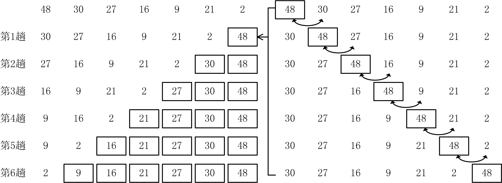
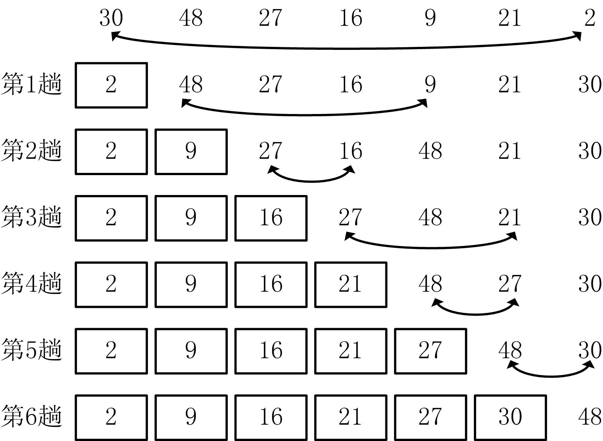

# 数组的应用


## 1、冒泡排序

* 排序问题是程序设计中的典型问题，它有很广泛的应用，其功能是将一个数据元素序列的无序序列调整为有序序列。

* **冒泡排序法（bubble sort）的基本思想**是通过相邻两个记录之间的比较和交换，使关键码较小的记录逐渐从底部移向顶部（上升），关键码较大的记录逐渐从顶部移向底部（沉底），冒泡由此得名。设由A[1]～A[n]组成的n个数据，冒泡排序的过程可以描述为：

* 图16.1 冒泡排序
      

* 【例16.1】冒泡排序  
    ```cpp
    #include <iostream> 
    using namespace std; 
    #define N 10 //数组元素个数 
    int main() 
    { 
        int A[N], i, j, t; //注意数组下标从0开始 
        for (i=0; i<N; i++) cin>>A[i]; //输入N个数 
        for(j=0 ; j<N-1 ; j++) //冒泡排序法 
        for(i=0 ; i<N-1-j; i++) //一趟冒泡排序 
        if(A[i] > A[i+1]) //A[i]与A[i+1]比较 <升序 >降序 
        t=A[i], A[i]=A[i+1], A[i+1]=t; //交换 
        for (i=0; i<N; i++) cout<<A[i]<<" "; //输出排序结果 
        return 0; 
    }
    ```
    ```cpp
    j=0: i=0～8 
    j=1: i=0～7 
    j=2: i=0～6 
    ……
    j=8: i=0
    ```

## 2、选择排序
* **选择排序法（selection sort）的基本思想**是第i趟选择排序通过n-i次关键码的比较，从n-i+1个记录中选出关键码最小的记录，并和第i个记录进行交换。设由A[1]～A[n]组成的n个数据，选择排序的过程可以描述为：

* 图16.2 选择排序
    

* 【例16.2】选择排序
```cpp
#include <iostream> 
#include <ctime> 
using namespace std; 
void SelectionSort(int A[],int n) //选择排序 n为数组元素个数 
{ 
    int i,j,k,t; 
    for(i=0; i<n-1; i++) { //选择排序法 
        k=i; 
        for(j=i+1; j<n; j++) //一趟选择排序 
            if (A[j] < A[k]) k=j; //<升序 >降序 
        if(i!=k) t=A[i], A[i]=A[k], A[k]=t; 
    } 
}
#define N 10 
int main() 
{ 
    int A[N],i; 
    srand((unsigned int)time(0)); //设置随机数种子 
    for(i=0; i<N; i++) { //随机产生N个数 
        A[i] = rand()%100; 
        cout<<A[i]<<" "; 
    } 
    cout<<endl; 
    SelectionSort(A,N); 
    for(i=0; i<N; i++) cout<<A[i]<<" "; //输出排序结果 
    return 0; 
}

```

## 3、顺序查找法
* **顺序查找**的基本思想是让关键字与序列中的数逐个比较，直到找出与给定关键字相同的数为止或序列结束，一般应用于无序序列查找。
* 【例16.3】顺序查找
    ```cpp
    #include <iostream> 
    using namespace std; 
    int Search(int A[],int n,int find) 
    { //顺序查找 n=序列元素个数 find=欲查找数据 
        int i; 
        for (i=0; i<n ; i++) if (A[i]==find) return i; 
        return -1; //未找到 
    } 
    #define N 10 
    int main() 
    { 
        int A[N]={18,-3,-12,34,101,211,12,90,77,45}, i,find; 
        cin>>find; 
        i=Search(A,N,find); 
        if(i>=0) cout<<"A["<<i<<"]="<<find<<endl; 
        else cout<<"not found"<<endl; 
        return 0; 
    }
    ```

## 4、二分查找法

* 对于有序序列，可以采用二分查找法进行查找。**它的基本思想是**：升序排列的n个元素集合A分成个数大致相同的两部分，取`A[n/2]`与欲查找的find作比较，如果相等则表示找到find，算法终止。如果`find<A[n/2]`，则在A的前半部继续搜索find，如果`find>A[n/2]`，则在A的后半部继续搜索find。

* 【例16.4】二分查找
    ```cpp
    #include <iostream> 
    using namespace std; 
    int BinarySearch(int A[],int n,int find) 
    { //二分查找 n=序列元素个数 find=欲查找数据 
        int low,upper,mid; 
        low=0 , upper=n-1; //左右两部分 
        while(low<=upper) { 
            mid = low + (upper-low)/2; //不用(upper+low)/2，避免upper+low溢出 
            if( A[mid] < find) low = mid+1; //右半部分 
            else if (A[mid] > find) upper = mid - 1; //左半部分 
            else return mid; //找到 
        } 
        return -1; //未找到 
    }
    #define N 10 
    int main() 
    { 
        int A[N]={8,24,30,47,62,68,83,90,92,95},i,find; 
        cin>>find; 
        i=BinarySearch(A,N,find); 
        if(i >= 0) cout<<"A["<<i<<"]="<<find<<endl; 
        else cout<<"not found"<<endl; 
        return 0; 
    }
    ```
