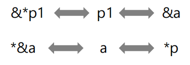

# 指针的定义与使用

## 1、指针的概念

* 在程序设计过程中，无论是存入数据还是取出数据都需要与内存单元打交道，计算机通过地址编码来表示内存单元。指针类型就是为了处理计算机的地址数据的。

* 指针除了能够提高程序的效率，更重要的作用是能使一个函数访问另一个函数的局部变量，因此**指针是两个函数进行数据交换必不可少的工具**。

### 1. 地址和指针的概念
* 程序中的数据对象总是存放在内存中，在生命期内这些对象占据一定的存储空间，有确定的存储位置。
* 实际上，每个内存单元都有一个地址，即以字节为单位连续编码。编译器将程序中的对象名转换成机器指令能识别的地址，通过地址来存取对象值。
    ```cpp
    int i; //定义整型变量 
    double f; //定义双精度浮点型变量
    ```
      
* 按对象名称存取对象的方式称为对象直接访问。如：`i=100; f=3.14`  
* 通过对象地址存取对象的方式称为**指针间接访问**。


## 2、指针的定义
* C++将专门用来存放对象地址的变量称为指针变量，定义形式如下：
    ```cpp
    指针类型 *指针变量名, ......
    ```
    例如：
    ```cpp
    int *p, i; //定义p为指针变量，i为整型变量  
    p = &i ; //指针变量p指向i
    ```
    

* 表17-1 取地址运算符

| 运算符 | 功能 | 目 | 结合性 | 用法 |  
| - | - | - | - | - |  
| & | 取地址 | 单目 | 自右向左 | &expr |  

* 假定指针变量p的值是4000，下面三种写法：
    1. char *p;
    2. int *p;
    3. double *p;

    

* 指针的间接访问: 通过间接引用运算（*）可以访问指针所指向的对象或内存单元
* 表17-2 间接引用运算符

| 运算符 | 功能 | 目 | 结合性 | 用法 |  
| - | - | - | - | - |  
| * | 间接引用 | 单目 | 自右向左 | *expr |  

```cpp
int a, *p=&a; 
a=100; //直接访问a（对象直接访问） 
*p=100; //*p就是a，间接访问a（指针间接访问） 
*p=*p+1; //等价于a=a+1
```


* 【例17.1】已知：
    ```cpp
    int a, b, *p1=&a, *p2;
    ```
    * 则
    > ①&*p1的含义是什么？  
    > ②*&a的含义是什么？

    


* 【例17.2】指针举例。
    ```cpp
    int main() 
    { 
        int i=100, j=200; 
        int *p1, *p2; 
        p1=&i, p2=&j; //p1指向i，p2指向j 
        *p1 = *p1 + 1; //等价于i=i+1 
        p1=p2; //将p2的值赋值给p1，则p1指向j 
        *p1 = *p1 + 1; //等价于j=j+1 
        return 0; 
    }
    ```


* 指针的初始化
    * 可以在定义指针变量时对其初始化，一般形式为：
        ```cpp
        指针类型 *指针变量名=地址初值,......
        ```
        ```cpp
        int a; 
        int *p=&a; //p的初值为变量a的地址 
        int b, *p1=&b; //正确，p1初始化时变量b已有地址值
        ```

    * 由于指针数据的特殊性，其初始化和赋值运算是有约束条件的，只能使用以下四种值：
        1. 0值常量表达式，例如：  
            ```cpp
            int a, z=0; 
            int *p1=a; //错误，地址初值不能是变量 
            p1=z;//错误，整型变量不能作为指针，即使值为0 
            p1=4000; //错误，整型数据不能作为指针 
            p1=null; //正确，指针允许0值常量表达式 
            p1=0; //正确，指针允许0值常量表达式
            ```
        2. 相同指向类型的对象的地址。例如：  
            ```cpp
            int a, *p1; 
            double f, *p3; 
            p1=&a; //正确 
            p3=&f; //正确 
            p1=&f; //错误，p1和&f指向类型不相同
            ```
        3. 相同指向类型的另一个有效指针。例如：  
            ```cpp
            int x, *px=&x; //正确 
            int *py=px; //正确，相同指向类型的另一个指针
            ```
        4. 对象存储空间后面下一个有效地址，如数组下一个元素的地 址。
            ```cpp
            int a[10], *px=&a[2]; //正确 
            int *py=&a[++i]; //正确，相同指向类型的另一个指针
            ```


##　3、指针的有效性

* 指针指向一个有确定存储空间的对象（称为已知对象），则该指针是**有效**的。

* 若一个指针不指向程序中任何已知对象，称其指向未知对象。未知对象的指针是**无效**的，无效的指针使用间接引用运算几乎总会导致崩溃性的异常错误。

1. 如果指针的值为0，称为0值指针，又称空指针（null pointer），空指针是无效的。
    ```cpp
    int *p=0; 
    *p=2; //空指针间接引用将导致程序产生严重的异常错误
    ```
2. 如果指针未经初始化，或者没有赋值，或者指针运算后指向未知对象，那么该指针是无效的。  
    ```cpp
    int *p; 
    *p=100; //错误，p为无效指针，不能间接引用
    ```
3. 一个指针曾经指向一个已知对象，在对象的内存空间释放后，虽然该指针仍是原来的内存地址，但指针所指已是未知对象，称为“**迷途指针**”（dangling pointer）。
    ```cpp
    char *p=NULL; //p是空指针，全局变量 
    void fun() 
    { 
        char c; //局部变量 
        p = &c; //指向局部变量c，函数调用结束后，c的空间释放，p就成了 迷途指针 
    }
    void caller() 
    { 
        fun(); 
        *p=2; //p现在是迷途指针 
    }
    ```

## 4、指针的运算

* 指针的运算都是作用在连续存储空间上才有意义。

1. 指针加减整数运算
    ```cpp
    int x[10], n=3 , *p=&x[5]; 
    p+1 //指向存储空间中x[5]后面的第1个int型存储单元 
    p+n //指向存储空间中x[5]后面的第n(3)个int型存储单元 
    p-1 //指向存储空间中x[5]前面的第1个int型存储单元 
    p-n //指向存储空间中x[5]前面的第n(3)个int型存储单元
    ```

2. 指针变量自增自减运算
* 设p是一个指针变量，其自增自减运算包括p++、++p、p--、--p形式。
    ```cpp
    int x[10], *p=&x[5]; 
    p++ //p指向x[5]后面的第1个int型内存单元 
    ++p //p指向x[5]后面的第1个int型内存单元 
    p-- //p指向x[5]前面的第1个int型内存单元 
    --p //p指向x[5]前面的第1个int型内存单元
    ```

3. 两个指针相减运算
* 设p1、p2是**相同类型**的两个指针（常量或变量），则p2-p1的结果为两个指针之间对象的个数，如果p2的地址值大于p1结果为正，否则为负。
    ```cpp
    int x[5], *p1=&x[0],*p2=&x[4]; 
    int n; 
    n=p2-p1;//n的值为4
    ```

4. 指针的关系运算
* 设p1、p2是同一个指向类型的两个指针（常量或变量），则p2和p1可以进行关系运算，用于比较这两个地址的位置关系。
    ```cpp
    int x[5], *p1=&x[0],*p2=&x[4]; 
    p2>p1 //表达式值为真
    ```

###　指针的const限定
1. 一个指针变量可以指向只读型对象，称为指向const对象的指针，定义形式为：  
    ```cpp
    const 指向类型 *指针变量,......;
    ```
    * 即在指针变量定义前加const限定符，其含义是**不允许通过指针来改变所指向的const对象的值**。
        ```cpp
        const int a=10, b=20; 
        const int *p; 
        p=&a; //正确，p不是只读的 
        p=&b; //正确，p不是只读的 
        *p = 42; //错误，*p是只读的
        ```

    * 把一个const对象的地址赋给一个非const对象的指针变量是错误的，例如：
        ```cpp
        const double pi = 3.14; 
        double *ptr = &pi; //错误，ptr是非const指针变量 
        const double *cptr=&pi;//正确，cptr是const指针变量
        ```

    * 允许把非const对象的地址赋给指向const对象的指针；不能使用指向const对象的指针修改指向对象，然而如果该指针指向的是一个非const对象，可用其他方法修改其所指的对象。例如：  
        ```cpp
        const double pi = 3.14; 
        const double *cptrf = &pi; //正确 
        double f = 3.14; //f是double型，f是非const 
        cptrf = &f; //正确，允许将f的地址赋给cptrf 
        f=1.618; //正确，可以修改f的值 
        *cptrf = 10.1; //错误，不允许通过引用cptrf修改f的值
        ```


   * 实际编程中，指向const的指针常用作函数的形参，以此确保传递给函数的实参对象在函数中不被修改。
       ```cpp
       void fun( const int *p) 
       { 
           …… 
       }
       int main() 
       { 
           int a; 
           fun(&a); 
       }
       ```

2. const指针
   * 一个指针变量可以是只读的，称为const指针，定义形式为：
        ```cpp
        指向类型 * const 指针变量,......;
        ```
        ```cpp
        int a=10, b=20; 
        int *const pc = &a; //pc是const指针 
        pc = &b; //错误，pc是只读的 
        pc = pc; //错误，pc是只读的 
        pc++; //错误，pc是只读的 
        *pc=100; //正确，a被修改
        ```

3. 指向const对象的const指针
    * 可以定义指向const对象的const指针，形式为：
        ```cpp
        const 指向类型 * const 指针变量,......;
        ```
        ```cpp
        const double pi = 3.14159; 
        const double * const cpc = &pi; //cpc为指向const对象的const指针
        ```
