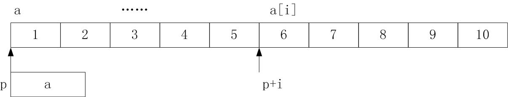
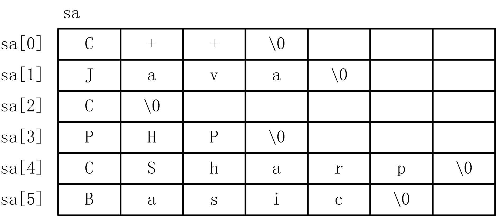

# 指针与数组

## 1、一维数组与指针
* C++程序员更偏爱使用指针来访问数组元素，这样做的好处是运行效率高、写法简洁。


### 1. 一维数组的地址
* 数组由若干个元素组成，每个元素都有相应的地址，通过取地址运算（&）可以得到每个元素的地址。
    ```cpp
    int a[10]; 
    int *p=&a[0]; //定义指向一维数组元素的指针 
    p=&a[5]; //指向a[5]
    ```
* C++规定，数组名既代表数组本身，又代表整个数组的地址，还是是数组首元素的地址值，即a与第0个元素的地址`&a[0]`相同。例如下面两个语句是是等价的。
    ```cpp
    p=a; 
    p=&a[0];
    ```
* 数组名是一个指针常量，因而它不能出现在左值和某些算术运算中，例如：
    ```cpp
    int a[10], b[10], c[10]; 
    a=b; //错误，a是常量不能出现在左值的位置 
    c=a+b; //错误，a、b是地址值，不允许加法运算 
    a++; //错误，a是常量不能使用++运算
    ```

### 2. 指向一维数组的指针变量
* 定义指向一维数组元素的指针变量时，指向类型应该与数组元素类型一致，例如：
    ```cpp
    int a[10], *p1; 
    double f[10], *p2; 
    p1=a; //正确 
    p2=f; //正确 
    p1=f; //错误，指向类型不同不能赋值
    ```

### 3. 通过指针访问一维数组
* 由于数组元素的地址是规律性增加的，根据指针算术运算规则，可以利用指针及其运算来访问数组元素。
* 设有如下定义：
    ```cpp
    int *p, a[10]={1,2,3,4,5,6,7,8,9,10}; 
    p=a; //p指向数组a 
    p++;
    ```

* 图18.1 指向一维数组的指针
      

* 设：a是一维数组名，p是指针变量且p=a。
* 根据以上叙述，访问一个数组元素`a[i]`，可以用：
    1. 数组下标法：`a[i]`；
    2. 指针下标法：`p[i]`；
    3. 地址引用法：`*(a+i)`；
    4. 指针引用法：`*(p+i)`。


* 【例6.1】用多种方法遍历一维数组元素
    1. 下标法。
        ```cpp
        #include <iostream> 
        using namespace std; 
        int main() 
        { 
            int a[10], i; 
            for (i=0;i<10;i++) cin>>a[i]; 
            for (i=0;i<10;i++) cout<<a[i]<<" "; 
            return 0; 
        }
        ```
    2. 通过地址间接访问数组元素。
        ```cpp
        #include <iostream> 
        using namespace std; 
        int main() 
        { 
            int a[10], i; 
            for (i=0;i<10;i++) cin>>*(a+i); 
            for (i=0;i<10;i++) cout<<*(a+i)<<" "; 
            return 0; 
        }
        ```
    3. 通过指向数组的指针变量间接访问元素。
        ```cpp
        #include <iostream> 
        using namespace std; 
        int main() 
        { 
            int a[10], *p; 
            for (p=a;p<a+10;p++) cin>>*p; 
            for (p=a;p<a+10;p++) cout<<*p<<" "; 
            return 0; 
        }
        ```

### 4．数组元素访问方法的比较
1. 使用下标法访问数组元素，程序写法比较直观，能直接知道访问的是第几个元素。
2. 而使用指针引用法，指针变量直接指向元素，不必每次都重新计算地址，能提高运行效率。
3. 将自增和自减运算用于指针变量十分有效，可以使指针变量自动向前或向后指向数组的下一个或前一个元素。

## 2、指针与字符串

* 可以利用一个字符型的指针处理字符串，其过程与通过指针访问数组元素相同。使用指针可以简化字符串的处理，是程序员处理字符串常用的编程方法。

* C++允许定义一个字符指针，初始化时指向一个字符串常量，一般形式为：
    ```cpp
    char *p="C Language";
    ```
    ```cpp
    char *p; 
    p="C Language";
    ```
* 初始化时，p存储了这个字符串首字符地址4000，而不是字符串常量本身，称p指向字符串。


* 通过字符指针可以访问字符串。例如：
    ```cpp
    char str[]="C Language", *p=str; //p指向字符串的指针 
    cout<<p<<endl; //输出：C Language 
    cout<<p+2<<endl; //输出：Language 
    cout<<&str[7]<<endl; //输出：age
    ```

* 通过字符指针遍历字符串。
    ```cpp
    char str[]="C Language", *p=str; //p指向字符串的指针 
    while (*p!='\0') cout<<*p++;
    ```

* 【例18.2】指针访问字符串举例
    ```cpp
    #include <iostream> 
    using namespace std; 
    int main() 
    { 
        char str[100],*p=str; 
        cin>>str; //输入字符串 
        while (*p) p++; //指针p指向到字符串结束符 
        cout<<"strlen="<<p-str<<endl; 
        return 0; 
    }
    ```
    运行结果： 
    ```cpp
    JavaScript ↙ 
    strlen=10
    ```

* 请记住，指针可以指向数组，使得数组的访问多了一种途径，但指针并不能替代数组来存储大批量数据。
    ```cpp
    char s[100]="Computer"; 
    char *p="Computer";
    ```
    1. 存储内容不同
    2. 运算方式不同
    3. 赋值操作不同

* 如果字符串数组是一个二维字符数组，例如：
    ```cpp
    char sa[6][7]={"C++","Java","C","PHP", "CSharp","Basic"};
    ```
    则字符串数组的内存形式为：  
      
