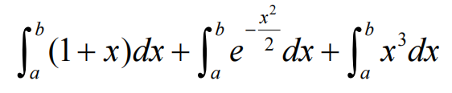
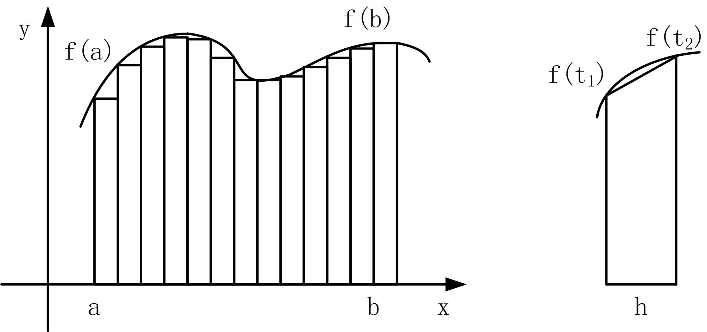

# 指针与函数

## 1、指针作为函数的参数
* 指针最重要的应用是作为函数参数，它使得被调函数除了返回值之外，能够将更多的运算结果返回到主调函数中。

* 因此：**指针是函数参数传递的重要工具。**

* 函数形参可以是指针类型，一般形式为：
    ```cpp
    返回类型 函数名(指向类型 *指针变量名,...) 
    { 
        函数体 
    }
    ```

* 【例19.1】设计一个函数swap，用于交换两个变量的值。
    ```cpp
    #include <iostream> 
    using namespace std; 
    void swap(int *p1, int *p2) 
    { 
        int t; 
        t=*p1 , *p1=*p2, *p2=t; //交换*p1和*p2 
    } 
    int main() 
    { 
        int a, b; 
        cin>>a>>b; //输入 
        if (a>b) swap(&a, &b); 
        cout<<"min="<<a<<",max="<<b; //输出 
        return 0; 
    }
    ```

* 【例19.1】以下方法是错误的。
    ```cpp
    #include <iostream> 
    using namespace std; 
    void swap(int p1, int p2) 
    { 
        int t; 
        t=p1 , p1=p2, p2=t; 
    } 
    int main() 
    { 
        int a, b; 
        cin>>a>>b; 
        swap(a, b); 
        cout<<"min="<<a<<",max="<<b; 
        return 0; 
    }
    ```

* 通过将指针作为函数参数的方法，既可以返回多个运算结果，又避免了使用全局变量。

* 【例19.2】计算a和b的平方和、自然对数和、几何平均数、和的平方根。
    ```cpp
    #include <iostream> 
    #include <cmath> 
    using namespace std; 
    double fun(double a, double b, double *sqab, double *lnab, double *avg) 
    { 
        *sqab=a*a+b*b; //*sqab返回平方和 
        *lnab=log(a)+log(b); //*lnab返回自然对数和 
        *avg=(a+b)/2; //*avg返回几何平均数 
        return (sqrt(a+b)); //函数返回和的平方根 
    } 
    int main() 
    { 
        double x=10,y=12,fsq,fln,favg,fsqr; 
        fsqr=fun(x, y, &fsq, &fln, &favg); 
        cout<<x<<","<<y<<","<<fsq<<","<<fln<<","<<favg<<","<<fsqr<<endl; 
        return 0; 
    }
    ```

## 2、数组作为函数的参数

### 1. （一维或多维）数组作为函数的形参，例如：
    ```cpp
    double average(double *a, int n) 
    { 
        … //函数体 
    }
    ```
* 函数调用形式如下：
    ```cpp
    double X[100], f; 
    f = average(X, 100);
    ```

* 【例19.3】编写函数average，返回数组n个元素的平均值。
    ```cpp
    #include <iostream> 
    using namespace std; 
    double average(double *a, int n) 
    { //等价于average(double a[], int n) 
        double avg=0.0, *p=a; 
        int i; 
        for (i=1;i<=n;i++,p++) avg=avg+*p ; //等价于avg=avg+p[i] 
        return n<=0 ? 0 : avg/n ; 
    } 
    int main() 
    { 
        double x[10]={66,76.5,89,100,71.5,86,92,90.5,78,88}; 
        cout<<"average="<<average(x,10)<<endl; 
        return 0; 
    }
    ```

* 要想在子函数中改变主调函数中的数组元素，实参与形参的对应关系有如下4种，这4种情况作用相同。
    1. 形参和实参都用数组名，例如：
        ```cpp
        void fun(int x[100], int n); //函数原型 
        int a[100]; 
        fun(a, 100); //函数调用
        ```
    2. 形参用指针变量，实参用数组名，例如：
        ```cpp
        void fun(int *x, int n); //函数原型 
        int a[100]; 
        fun(a, 100); //函数调用
        ```
    3. 形参与实参都用指针变量，例如：
        ```cpp
        void fun(int *x, int n); //函数原型 
        int a[100], p=a; 
        fun(p, 100); //函数调用
        ```
    4. 形参用数组，实参用指针变量，例如：
        ```cpp
        void fun(int x[100], int n); //函数原型 
        int a[100], p=a; 
        fun(p, 100); //函数调用
        ```

### 2．字符指针变量作为函数形参
* 将一个字符串传递到函数中，传递的是地址，则函数形参既可以用字符数组，又可以用指针变量，两种形式完全等价。在子函数中可以修改字符串的内容，主调函数得到的是变化后的字符串。

* 【例19.4】自定义函数实现strcpy函数的字符串复制功能。
    ```cpp
    #include <iostream> 
    using namespace std; 
    char *stringcpy(char *strDest, const char *strSrc) 
    { 
        char *p1=strDest; 
        const char *p2=strSrc; 
        while (*p2!='\0') *p1=*p2, p1++ , p2++; 
        *p1='\0'; 
        return strDest; //返回实参指针 
    }
    int main() 
    { 
        char s1[80],s2[80],s3[80]="string="; 
        cin>>s1; //输入字符串 
        stringcpy(s2,s1); //复制s1到s2 
        cout<<"s2:"<<s2<<endl; 
        stringcpy(&s3[7],s1); //复制s1到s3的后面 
        cout<<"s3:"<<s3<<endl; 
        return 0; 
    }
    ```

## 3、引用
* **通过对象名称直接访问对象**，优点是直观，操作哪个对象一目了然，缺点一个函数内部不能使用另一个函数的局部变量；

* **通过指针（或地址）间接访问对象**，优点是无所不能，缺点是程序中大量出现的间接访问，实在分不清具体是哪个对象，需要通过上下文去分析。

* C++扩充了C语言对象访问方式，提供了**引用访问**。通过引用访问对象，结合了按名访问和按地址访问各自的优点，非常适合作为函 数参数。

### 1. 引用作为函数参数
* 简单地说，引用（reference）就是一个对象的别名（alias name），其声明形式为：
    ```cpp
    引用类型 &引用名称=对象名称 , ......;
    ```
    ```cpp
    int x; //定义整型变量x 
    int &r=x; //声明r是x的引用
    ```
* 在C++中，引用全部是const类型，声明之后不可更改（即不能再是别的对象的引用）。


* 引用的规则
    1. 声明一个引用类型变量时，必须同时初始化它，声明它是哪个对象的别名，即绑定对象。例如：
        ```cpp
        int &r; //错误，引用是const类型，必须在声明时初始化 
        int x, &r=x; //正确 声明r是x的引用
        ```
    2. 不能有空引用，引用必须与有效对象的内存单元关联。
    3. 引用一旦被初始化，就不能改变引用关系，不能再作为其他对象的引用。例如：
        ```cpp
        int x, y; //定义整型变量x,y 
        int &r=x; //正确 声明r是x的引用 
        int &r=y; //错误 r不能再是别的对象的引用
        ```
    4. 指定类型的引用不能初始化到其他类型的对象上，例如：
        ```cpp
        double f; //定义浮点型变量f 
        int &r=f; //错误 r值整型的引用，不能绑定到浮点型的对象上
        ```
    5. 引用初始化与对引用赋值含义完全不同，例如：
        ```cpp
        int x; //定义整型变量x 
        int &r=x; //初始化 指明r是x的引用，即将r绑定到x 
        r=100; //引用赋值 100赋值到r绑定的内存单元中（即x）
        ```
    6. 取一个引用的地址和取一个对象的地址完全一样，都是用取 地址运算。例如：
        ```cpp
        int x, &r=x; //定义整型变量x,y 
        int *p1=&x; //p1指向x 
        int *p2=&r; //p2指向r，本质上指向x
        ```

* 引用作为函数形参
* **C++之所以扩充引用类型，主要是把它作为函数形参**，使得C++中给一个函数传递参数有三种方法：
    1. 传递对象本身；
    2. 传递指向对象的指针；
    3. 传递对象的引用。

* 【例19.5】变量、指针、引用作为函数参数比较。
    ```cpp
    //程序① 传递对象本身 
    #include <iostream> 
    using namespace std; 
    //对象作为函数形参 
    void swap(int a,int b) 
    { 
        int t; 
        t=a, a=b, b=t; 
    } 
    int main() 
    { 
        int x=10, y=20; 
        swap(x,y); 
        cout<<x<<","<<y; 
        return 0; 
    }
    ```
    ```cpp
    //程序② 传递对象的指针 
    #include <iostream> 
    using namespace std; 
    //指针作为函数形参 
    void swap(int *a,int *b) 
    { 
        int t; 
        t=*a, *a=*b, *b=t; 
    } 
    int main() 
    { 
        int x=10, y=20; 
        swap(&x,&y); 
        cout<<x<<","<<y; 
        return 0; 
    }
    ```
    ```cpp
    //程序③ 传递对象的引用 
    #include <iostream> 
    using namespace std; 
    //引用作为函数形参 
    void swap(int &a,int &b) 
    { 
        int t; 
        t=a, a=b, b=t; 
    } 
    int main() 
    { 
        int x=10, y=20; 
        swap(x,y); 
        cout<<x<<","<<y; 
        return 0; 
    }
    ```

    * 显然，函数引用传递方式也可以实现多个数据结果返回到主调函数中，其**功能与指针方式相同**。但指针方式返回数据结果必须：
        1. 实参为地址，即进行“&”取地址运算；
        2. 形参分配指针变量接受实参地址；
        3. 函数内部使用指针间接访问，即进行“*”间接访问运算。而引用传递方式把这个过程简化了。

    * **使用引用作为函数形参，比使用指针变量简单、直观、方便**，特别是避免了在被调函数中出现大量指针间接访问时，所指对象究竟是哪个具体对象伤脑筋的问题，从而降低了编程的难度。


* 引用作为函数返回值
    * 函数的返回值可以是引用类型，即函数返回引用，其定义形式为：
        ```cpp
        引用类型& 函数名(形式参数列表) 
        { 
            函数体 
        }
        ```

    * 【例19.6】引用作为函数返回值举例。
        ```cpp
        //程序① 函数返回值 
        #include <iostream> 
        using namespace std; 
        int max(int a,int b) 
        { 
            return (a>b?a:b); 
        } 
        int main() 
        { 
            int x=10,y=20,z; 
            z = max(x,y); 
            cout << z; 
            return 0; 
        }
        ```
        ```cpp
        //程序② 函数返回指针 
        #include <iostream> 
        using namespace std; 
        int* max(int a,int b) 
        { 
            return (a>b? &a:&b); 
        } 
        int main() 
        { 
            int x=10,y=20,*z; 
            z = max(x,y); 
            cout << *z; 
            return 0; 
        }
        ```
        ```cpp
        //程序③ 函数返回引用 
        #include <iostream> 
        using namespace std; 
        int& max(int &a,int &b) 
        { 
            return (a>b? a:b); 
        } 
        int main() 
        { 
            int x=10,y=20,z; 
            z = max(x,y); 
            cout << z; 
            return 0; 
        }
        ```
    * 可以看出，函数返回引用与函数返回值有重大区别，它不是返回一个临时对象，而是相当于返回实体对象本身。正因为如此，函数返回引用可以作为左值。例如：
        ```cpp
        int& fun(int &a,int &b) 
        { 
            return (a>b? a:b); 
        } 
        int x=10,y=20,z=5; 
        fun(x,y)=z; //调用fun函数后相当于y=z; 
        cout << y;
        ```

## 4、指向函数的指针
* 函数是实现特定功能的程序代码的集合，实际上，函数代码在内存中也要占据一段存储空间（代码区内），这段存储空间的起始地址称为函数入口地址。C++规定函数入口地址为函数的指针，即**函数名既代表函数，又是函数的指针（或地址）**。

* C++允许定义指向函数的指针变量，定义形式为：
    ```cpp
    返回类型 (*函数指针变量名)(形式参数列表),...;
    ```
* 它可以指向如下形式的函数：
    ```cpp
    返回类型 函数名(形式参数列表) 
    { 
        函数体 
    }
    ```
    ```cpp
    int (*p)(int a, int b); //定义函数指针变量
    ```

* 使函数指针指向函数
* 可以将函数的地址赋值给函数指针变量，形式为
    ```cpp
    函数指针变量=函数名;
    ```
* 它要求函数指针变量与指向函数必须有相同的返回类型、参数个数、参数类型。

* 例如假设：
    ```cpp
    int max(int a, int b); //max函数原型 
    int min(int a, int b); //min函数原型 
    int (*p)(int a, int b); //定义函数指针变量
    ```
    则
    ```cpp
    p=max;
    ```
    称p指向函数max。它也可以指向函数min，即可以指向所有与它有相同的返回类型、参数个数、参数类型的函数。


* 通过函数指针调用函数
* 对函数指针间接引用即是通过函数指针调用函数，一般形式为：
    ```cpp
    函数指针(实参列表)
    ```
* 通过函数指针调用函数，在实参、参数传递、返回值等方面与函数名调用相同。例如：
    ```cpp
    c=p(a,b); //等价于c=max(a,b);
    ```

* 函数指针的用途
* 指向函数的指针多用于指向不同的函数，从而可以利用指针变量调用不同函数，相当于**将函数调用由静态方式（固定地调用指定函数）变为动态方式（调用哪个函数是由指针值来确定）**。熟练掌握函数指针的应用，有利于程序的模块化设计，提高程序的可扩展性。

* 【例19.7】编写程序计算如下公式。
$$\int_{a}^{b}(1 + x){dx} + \int_{a}^{b}e^{-x^2 \over 2}dx + \int_{a}^{b}x^3{dx}$$

    


说明：   
这里用梯形法求定积分$\int_{a}^{b}f(x){dx}$ 的近似值。如图所示，求 f(x)的定积分就是求f(x)曲线与x轴包围图形的面积，梯形法是把所要求的面积垂直分成n个小梯形，然后面积求和。


* 图19.2 梯形法求定积分示意
      

    ```cpp
    #include <iostream> 
    #include <cmath> 
    using namespace std; 
    double integral(double a,double b,double (*f)(double x)) 
    { //求定积分 
        int n=1000, i; 
        double h, x, s=0.0; 
        h=(b-a)/n; 
        for(i=1;i<=n;i++) { 
            x=a+(i-1)*h; 
            s=s+(f(x)+f(x+h))*h/2; //调用f函数求f(x)、f(x+h) 
        } 
        return s; 
    }
    double f1(double x) 
    { 
        return 1+x; 
    } 
    double f2(double x) 
    { 
        return exp(-x*x/2); 
    } 
    double f3(double x) 
    { 
        return x*x*x; 
    } 
    int main() 
    { 
        double a,b; 
        cin>>a>>b; 
        cout<<(integral(a,b,f1)+integral(a,b,f2)+integral(a,b,f3))<<end l;
        return 0; 
    }
    ```
