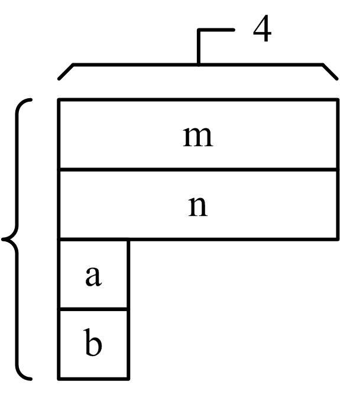

# 自定义数据类型

## 1、结构体的定义与使用

* 数组是一种数据形式，其特点是多个相同类型的元素集合起来；

* 结构体是另一种重要的数据形式，特点是将不同类型的成员组合起来。

* 数组和结构体形成了两种风格迥异的聚合方式，通过他们及其相互组合、嵌套的机制可以构造出复杂的、满足应用要求的自定义数据类型。

### 1. 定义结构体类型
* 结构体允许将不同类型的数据元素组合在一起形成一种新的数据类型，其声明形式为：
```cpp
struct 结构体类型名 
{ 
    成员列表 
};
```
* 例如可以通过如下声明建立能表示学生信息的数据类型。
```cpp
struct STUDENT { //学生信息类型 
    int no; //声明一个整型数据成员表示学号 
    char name[21]; //声明一个字符串数据成员表示姓名 
    char sex; //声明一个字符数据成员表示性别 
    int age; //声明一个整型数据成员年龄 
    char qq[11]; //声明一个字符串数据成员表示QQ号 
    double score; //声明一个浮点型数据成员表示成绩 
};
```

* **结构体类型声明一般放在程序文件开头**，此时这个声明是全局的。在全局作用域内，该声明处处可见，因此同作用域内的所有函数都可以使用它。

* 结构体类型声明也可以放到函数内部，此时这个声明是局部的。

* 说明：
    1. 结构体类型和普通数据类型（如int、char、double等）一样是类型名称，而不是该类型的一个实体，因此不会为结构体类型分配存储空间。
    2. 结构体类型声明时成员可以又是是结构体类型。
        ```cpp
        struct DATA { 
            int year,month,day; 
        };
        ```

### 2. 结构体类型实例化
* 定义结构体对象称为**结构体类型实例化**（instance），实例化会根据数据类型为结构体对象分配内存单元。

* 定义结构体对象有两种形式。
    1. 先声明结构体类型再定义对象
        ```cpp
        结构体类型名 结构体对象名列表;
        ```
        ```cpp
        STUDENT a,b; //定义结构体对象
        ```
    2. 声明结构体类型的同时定义对象, 一般形式为：
        ```cpp
        结构体类型名 { 
            成员列表 
        } 结构体对象名列表;
        ```
        ```cpp
        DATE { //日期类型 
            int year,month,day; //年，月，日 整型 
        } d1,d2; //定义结构体对象
        ```

### 3. 结构体对象的内存形式
* 实例化结构体对象后，对象会得到存储空间。
    ```cpp
    struct STUDENT { //学生信息类型 
        int no; //声明一个整型数据成员表示学号 
        char name[21]; //声明一个字符串数据成员表示姓名 
        char sex; //声明一个字符数据成员表示性别 
        int age; //声明一个整型数据成员年龄 
        char qq[11]; //声明一个字符串数据成员表示QQ号 
        double score; //声明一个浮点型数据成员表示成绩 
    };
    ```
    

* 可以在结构体对象定义时进行初始化。
```cpp
struct STAFF { //职员信息类型 
    int no; //工号，整型 
    char name[21]; //姓名，字符串 
    char sex; //性别，字符型 
    DATA birthday; //出生日期，结构体类型 
    double salary; //薪水，浮点型 
};
```
```cpp
STAFF s1={1001, "Li Min",'M',{1980,10,6},2700.0}; 
STAFF s2={1002, "Ma Gang",'M',1978,3,22,3100.0};
```


### 4. 结构体对象成员引用
* 使用结构体对象主要是引用它的成员，其一般形式为：
    ```cpp
    结构体对象名.成员名
    ```
    ```cpp
    STAFF a,b; 
    a.no=10002; //将10002赋值给a对象中的no成员 
    b.salary=a.salary+500.0; //在表达式中可以引用对象成员 
    a.no++; //按优先级等价于(a.no)++
    ```

1. 如果成员本身又是一个结构体对象，就要用成员引用运算符，一级一级地引用。例如：
    ```cpp
    STAFF x; 
    x.birthday.year=1990, 
    x.birthday.month=5, 
    x.birthday.day=12; //逐级引用成员
    ```
2. 不能将一个结构体对象作为整体进行输入或输出，只能对结构体对象中的成员逐个进行输入或输出。例如：
    ```cpp
    STAFF x; 
    cin>>x.no>>x.sex>>x.salary; 
    cin>>x.birthday.year>>x.birthday.month>>x.birthday.day; 
    cin>>x.name;
    ```

3. 结构体对象可以进行赋值运算，但不能对进行算术运算、关 系运算等，例如：
    ```cpp
    COMPLEX m,n,k; 
    m=n; //正确，结构体对象允许赋值 
    k=m+n; //错误，结构体对象不能做算术运算 
    m>n; //错误，结构体对象不能做关系运算
    ```

## 2、结构体与数组、指针、函数

### 1. 结构体与数组
* 数组元素可以是结构体类型，称为结构体数组，如一维结构体数组定义形式为：
    ```cpp
    struct 结构体类型名 结构体数组名[常量表达式];
    ```
    ```cpp
    struct POINT { //点类型 
        int x,y; //平面上点的x、y坐标 
    };
    POINT points[100]; //表示100个点的数据对象
    ```

* 一维结构体数组初始化形式为：
    ```cpp
    struct 结构体类型名 结构体数组名[常量表达式] = {初值序列};
    ```
* 其中初值序列必须按内存形式做到类型、次序一一对应。
    ```cpp
    struct RECT { //矩形框类型 
        int left,top,right,bottom; 
    };
    RECT rects[3]={{1,1,10,10}, {5,5,25,32},{100,100,105,200}};
    ```

* 引用结构体数组成员需要将数组下标运算、对象成员引用运算结合起来操作，其一般形式为：
    ```cpp
    数组对象[下标表达式].成员名
    ```
    ```cpp
    rects[0].left=10; //数组对象[下标表达式]是结构体对象
    ```

* 结构体类型中可以包含数组成员，数组成员类型既可以是基本数据类型又可以是指针类型或结构体类型，例如表示平面三角形的数据对象，可以这样定义：
    ```cpp
    struct TRIANGLE { //三角形类型 
        POINT p[3];//由3个平面上的点描述三角形 
    };
    ```
    ```cpp
    TRIANGLE tri; 
    tri.p[0].x=10,tri.p[0].y=10; //结构体对象.数组成员[下标表达式].成员名
    ```

* 【例21.1】输入20个学生信息，按成绩递减排序；成绩相同时，按学号递增排序。
    ```cpp
    #include <iostream> 
    using namespace std; 
    #define N 20 
    struct tagSTUDENT { //学生信息类型 
        int no; //学号 
        char name[21]; //姓名 
        double score; //成绩 
    };
    int main() 
    { 
        struct tagSTUDENT A[N] , t; 
        int i,j; 
        for (i=0; i<N; i++) //输入学生信息 
        cin>>A[i].no>>A[i].name>>A[i].score; 
        for (i=0; i<N-1; i++) //排序 
            for (j=i; j<N; j++) 
                if (A[i].score<A[j].score //按成绩递减排序 
                || (A[i].score==A[j].score&&A[i].no>A[j].no)) //按学号递 增排序 
                t=A[i], A[i]=A[j], A[j]=t; 
        for (i=0; i<N; i++) //输出学生信息 
            cout<<A[i].no<<","<<A[i].name<<","<<A[i].score<<endl; 
        return 0; 
    }
    ```

### 2. 结构体与指针
* 结构体对象各成员的地址：&对象名.成员名，例如：
    ```cpp
    STAFF m; //结构体对象 
    int *p1; //指向no成员的指针类型是int* 
    char *s1,*s2; //指向name、sex成员的指针类型是char* 
    DATE *p2; //指向birthday成员的指针类型是DATE* 
    p1=&m.no; //取no成员的地址 
    s1=m.name; //name成员是数组，数组名即是地址 
    s2=&m.sex; //取sex成员的地址 
    p2=&m.birthday; //取birthday成员的地址
    ```

* 结构体对象的地址：&对象名。例如：
    ```cpp
    struct STAFF m, *p; //指向结构体对象的指针 
    p=&m; //取结构体对象的地址
    ```

* 显然，结构体对象的地址值（&m）与第一个成员的地址值（&m.no）相同。
    


* 假设p是指向结构体对象的指针，通过p引用结构体对象成员有两种方式：
    1. 对象法：(*p)．成员名；
    2. 指针法：p->成员名。

* 两种方式中，更常用第二种方式，->为指针成员引用运算符。
    ```cpp
    p->no=10002; //将10002赋值给对象中的no成员，指针成员引用运算 结果是左值（即成员本身） 
    p->salary=p->salary+500.0; //在表达式中引用指针指向的成员 
    p->no++; //按优先级等价于(p->no)++
    ```

* 如果成员本身又是一个结构体对象指针，就要用指针成员引用运算符一级一级地引用成员。例如：
    ```cpp
    DATE d={1981,1,1}; 
    TEACHER { //教师信息类型 
        int no; //工号 
        char name[21]; //姓名 
        DATE *pbirthday; //出生日期 
    } a={1001,"Li Min",&d}, *p=&a;
    ```
    ```cpp
    p->no=10001; //通过指针p引用a的no成员 
    p->pbirthday->year=2008; //通过指针p->pbirthday引用d的year成员
    ```

### 3. 结构体与函数
* 将结构体对象作为函数实参传递到函数中，采用值传递方式。例如：
    ```cpp
    struct DATA { 
        int data; //整型成员 
        char name[10]; //数组成员 
    };
    void fun1(DATA x); //函数原型 
    void fun2() 
    { 
        DATA a={1,"LiMin"}; 
        fun1(a); //函数调用 
    }
    ```

* 将结构体数组作为函数参数，采用地址传递方式。函数调用实参是数组名，形参必须是同类型的结构体数组。例如：
    ```cpp
    void fun3(DATA X[]); //函数原型 
    void fun4() 
    { 
        DATA A[3]={1,"LiMin",2,"MaGang",3,"ZhangKun"}; 
        fun3(A); //函数调用 
    }
    ```

* 采用地址传递方式，形参数组的首地址与实参数组完全相同。


* 将结构体指针作为函数参数，采用地址传递方式。例如：
    ```cpp
    void fun5(DATA *p); //函数原型 
    void fun6() 
    { 
        DATA a={1,"LiMin"}; 
        fun5(&a); //函数调用 
    }
    ```

* 函数的返回类型可以是结构体类型，这时函数将返回一个结构体对象。例如：
    ```cpp
    DATA fun8() 
    { 
        DATA a={1,"LiMin"}; 
        return a; //返回结构体对象，复制到临时对象中 
    }
    void fun9() 
    { 
        DATA b; 
        b=fun8(); //函数返回结构体对象，并且赋值 
    }
    ```

## 3、共用体类型

* 共用体（union）是一种**成员共享存储空间的结构体类型**。共用体类型是抽象的数据类型，因此程序中需要事先声明具体的共用体类型，一般形式为：
    ```cpp
    union 共用体类型名 
    { 
        成员列表 
    };
    ```

* 共用体类型名与union一起作为类型名称，成员列表是该类型数据元素的集合。一对大括号｛｝是成员列表边界符，后面必须用分号（；）结束。
    ```cpp
    union A 
    { 
        int m,n; //整型成员 
        char a,b; //字符成员 
    };
    ```

* 共用体中每个成员与其他成员之间共享内存。 
* 对于union A，m、n、a、b共享内存单元，其内存结构如图所示。
      

    ```cpp
    union B 
    { 
        int m; //整型成员 
        char a,b; //字符成员 
        short n; //短整型成员 
    };
    ```
    * 对于union B，m、a、b、n共享内存单元，其内存结构如图所示。
      

* 结构体与共用体的内存形式是截然不同的。**共用体内存长度是所有成员内存长度的最大值**，结构体内存长度是所有成员内存长度之和。可以用sizeof取它们的内存长度进行比较。


* 与结构体对象相似，定义共用体对象也有三种形式：
    1. 先声明共用体类型再定义共用体对象
        ```cpp
        union 共用体类型名 共用体对象名列表;
        ```
    2. 同时声明共用体类型和定义共用体对象
        ```cpp
        union 共用体类型名 { 成员列表 } 共用体对象名列表;
        ```
    3. 直接定义共用体对象
        ```cpp
        union { 成员列表 } 共用体对象名列表;
        ```
* 定义共用体对象时可以进行初始化，但只能按一个成员给予初值，例如：
    ```cpp
    union A x={ 5678 }; //正确，只能给出1个初值 
    union A y={5,6,7,8}; //错误，试图给出4个初值（结构体做法）
    ```

* 共用体对象的使用主要是引用它的成员，方法是对象成员引用运算（．），例如：
    ```cpp
    x.m=5678; //给共用体成员赋值 
    cout<<x.m<<","<<x.n<<","<<x.a<<","<<x.b<<endl; //输出 5678,5678,46,46 
    cin>>x.m>>x.n>>x.a>>x.b; 
    x.n++; //共用体成员运算
    ```
    * 第1句给成员m赋值5678，由于所有成员内存是共享的，因此每个成员都是这个值。
    * 第2句输出m和n为5678，输出a和b为46，因为a和b类型为char，仅使用共享内存中的一部分（4个字节的低字节），即5678（0x162E）的0x2E（46）。
    * 第三句每个成员的起始地址是相同的，当运行第3句时输入1 2 3 4↙，x.m得到1，但紧接着x.n得到2时，x.m也改变为2了（因为共享），依次类推，最终x.b得到4时，所有成员都是这个值。
    * 第4句当x.n自增运算后，所有成员的值都改变了。


* 由于成员是共享存储空间的，使用共用体对象成员时有如下特点：
    1. 修改一个成员会使其他成员发生改变，所有成员存储的总是最后一次修改的结果；
    2. 所有成员的值是相同的，区别是不同的类型决定了使用这个值的全部或是部分；
    3. 所有成员的起始地址值是相同的，因此通常只按一个成员输入、初始化；

## 4、枚举类型

* 枚举类型是由用户自定义的由多个命名枚举常量构成的类型，其声明形式为：
    ```cpp
    enum 枚举类型名 {命名枚举常量列表};
    ```

* 例如：
    ```cpp
    enum DAYS {MON,TUE,WED,THU,FRI,SAT,SUN};
    ```
    * DAYS是枚举类型，MON等是命名枚举常量。默认时枚举常量总是从0开始，后续的枚举常量总是前一个的枚举常量加一。如MON为0，TUE为1，……，SUN为6。


1. 可以在（仅仅在）声明枚举类型时，为命名枚举常量指定值。例如：
    ```cpp
    enum COLORS {RED=10,GREEN=8,BLUE,BLACK,WHITE};
    ```
    * 则RED为10、GREEN为8、BLUE为9、BLACK为10、WHITE为11。

2. 命名枚举常量是一个整型常量值，也称为枚举器，在枚举类型范围内必须是唯一的。**命名枚举常量是右值不是左值**，例如：
    ```cpp
    RED=10; //错误，RED不是左值，不能被赋值 
    GREEN++; //错误，GREEN不是左值，不能自增自减
    ```

* 定义枚举类型对象有三种形式：
    ```cpp
    enum 枚举类型名 {命名枚举量列表} 枚举对象名列表;
    ```
    ```cpp
    enum 枚举类型名 枚举对象名列表; //在已有枚举类型下，最常用的定义形式
    ```
    ```cpp
    enum {命名枚举量列表} 枚举对象名列表; //使用较少的定义形式
    ```

* 可以在定义对象时进行初始化，其形式为：
    ```cpp
    枚举对象名1=初值1, 枚举对象名2=初值2,……;
    ```
    ```cpp
    enum DIRECTION {LEFT,UP,RIGHT,DOWN,BEFORE,BACK} dir=LEFT;
    ```

* 当给枚举类型对象赋值时，若是除枚举值之外的其他值，编译器会给出错误信息，这样就能在编译阶段帮助程序员发现潜在的取值超出规定范围的错误。例如：
    ```cpp
    enum COLORS color; 
    color=101; //错误，不能类型转换 
    color=(COLORS)101; //正确，但结果没有定义
    ```

* 可以用typedef声明一个新类型名来代替已有类型名，其形式为：
    ```cpp
    typedef 已有类型名 新类型名;
    ```

* 其中已有类型名必须是已存在的数据类型的名称，新类型名是标识符序列，习惯上用大写标识；如果是多个新类型名，用逗号（，）作为间隔。最后以分号（；）结束。例如：
    ```cpp
    typedef unsigned char BYTE; //按计算机汇编指令习惯规定的字节型 
    typedef unsigned short WORD; //按计算机汇编指令习惯规定的字类型 
    typedef unsigned long DWORD; //按计算机汇编指令习惯规定的双字类型
    ```
