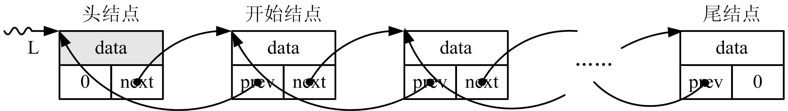

# 自定义数据类型的应用


## 1、链表的概念和分类
* 链表是一种存储空间能动态进行增长或缩小的数据结构。

* 链表主要用于两个目的：**一是建立不定长度的数组。二是链表可以在不重新安排整个存储结构的情况下，方便且迅速地插入和删除数据元素**。

* 链表广泛地运用于数据管理中。

* 首先设计一种称为结点（node）的数据类型：
    ```cpp
    struct NODE { //结点数据类型 
        ElemType data; //数据域 
        NODE *link; //指针域 
    };
    ```
* 这个结构体类型中，data成员表示数据域，代表结点的数据信息。

* ElemType可以是简单的内置数据类型，也可以是复杂的数据类型，如
    ```cpp
    typedef struct tagElemType { //复杂的数据元素类型 
        ...... //任意数目、任意组合、任意类型的数据成员 
    } ElemType;
    ```

* 数据域是链表中的信息对象（元素），实际应用中结合具体要求设计其数据类型。为方便介绍，将ElemType简单设定为int型，即
    ```cpp
    typedef int ElemType; //简单的数据元素类型
    ```

* link成员表示指针域，存放另一个结点的地址，是链表中的组织者。假定有一个NODE类型的对象指针L，将一个新结点的地址赋给L的link成员，则L可以通过它的link成员“链接”到新结点上，重复这个过程可以得到链表结构。
      

* 链表的分类：
    1. 单链表
        * 单链表每个结点包含一个指向直接后继结点的指针域，其形式为：
            ```cpp
            struct LNode { //单链表结点类型 
                ElemType data; //数据域 
                LNode *next; //指针域：指向直接后继结点 
            };
            typedef LNode* LinkList; //LNode为单链表结构体类型， LinkList为单链表指针类型
            ```
            * next指向直接后继结点，由它构成了一条链。
        * 图22.1 单链表结构 
              
        
        * 指针L指向单链表**头结点**，头结点指向开始结点，开始结点又指向下一个结点，……，直到最后一个尾结点。尾结点的next为0，表示NULL指针，约定单链表的结点的next为0时表示尾结点。上述链表称为带头结点的单链表，若开始结点为头结点，则称这样的链表为不带头结点的单链表。

    2. 双链表
        * 双链表每个结点包含指向前驱结点和指向直接后继结点的指针域，其形式为：
            ```cpp
            struct DNode { //双链表结点类型 
                ElemType data; //数据域 
                DNode *prev,*next; //指针域：分别指向前驱结点和直接后继结点 
            };
            typedef DNode *DLinkList; //DNode为双链表结构体类型， DLinkList为双链表指针类型
            ```
        * 图22.2 双链表结构
              

        * 指针L指向双链表**头结点**，其每个结点分别有指向前一个结点和后一个结点的指针。沿着next指针，头结点指向开始结点，开始结点又指向下一个结点，……，直到尾结点，尾结点的next为0。沿着prev指针，尾结点指向前一个结点，直到头结点head，头结点的prev为0。约定双链表的结点的next为0时表示尾结点，prev为0时表示头结点。双链表也有带头结点和不带头结点之分。

    3. 循环链表
        * 若单链表尾结点指向头结点而不是0，则该链表是循环单链表。
        * 同理，若双链表尾结点next指向头结点而不是0，头结点prev指向尾结点而不是0，则该链表是循环双链表。
        * 图22.3 循环单链表和循环双链表 
              
              


## 2、创建单链表

* 通过前面介绍的内存动态分配技术可以产生新结点的内存单元，例如：
    ```cpp
    LinkList p; //链表指针 
    p=new LNode;//分配LNode类型内存单元且将地址保存到p中
    ```

* 创建链表常用两种方法：头插法和尾插法。
    1. 头插法建立链表CreateLinkF(&L,n,input())
        : 该方法先建立一个头结点*L，然后产生新结点，设置新结点的数据域；再将新结点插入到当前链表的表头，直至指定数目的元素都增加到链表中为止。其步骤为：
        > ①创建头结点*L，设置*L的next为0。
        > ②动态分配一个结点s，输入s的数据域。
        > ③将s插入到开始结点之前，头结点之后。
        > ④重复②～④步骤加入更多结点。

        ```cpp
        #include <iostream> 
        using namespace std; 
        typedef int ElemType; //简单的数据元素类型 
        struct LNode { //单链表结点类型 
            ElemType data; //数据域 
            LNode *next; //指针域：指向直接后继结点 
        }; 
        typedef LNode* LinkList; //LNode为单链表结构体类型，LinkList为单 链表指针类型 
        void input(ElemType *ep) //实现数据域元素输入的定制函数 
        { //在函数中可以写更加复杂、任意形式、任意数目的输入 
            cin>>*ep; 
        }
        void CreateLinkF(LinkList *L,int n,void(*input)(ElemType*)) 
        { //头插法创建单链表，调用input输入函数输入数据 
            LinkList s; 
            *L=new LNode;//创建头结点 
            (*L)->next=NULL; //初始时为空表 
            for (; n>0; n--) { //创建n个结点链表 
                s=new LNode; //创建新结点 
                input(&s->data); //调用input输入数据域 
                s->next=(*L)->next; //将s增加到开始结点之前 
                (*L)->next=s; //头结点之后 
            } 
        } 
        int main() 
        { 
            LinkList L; int n; cin>>n; 
            CreateLinkF(&L,n,input); 
        }
        ```
    2. 尾插法建立链表CreateLinkR(&L,n,input())
        : 头插法建立的链表中结点的次序与元素输入的顺序相反，若希望两者次序一致，可采用尾插法建立链表。该方法是将新结点插到当前链表的末尾上，其步骤为：
        > ①创建头结点*L，设置*L的next为0，且令指针p指向*L。
        > ②动态分配一个结点s，输入s的数据域。
        > ③将s插入到当前链表末尾。
        > ④重复②～④步骤加入更多结点。

        ```cpp
        #include <iostream> 
        using namespace std; 
        typedef int ElemType; //简单的数据元素类型 
        struct LNode { //单链表结点类型 
            ElemType data; //数据域 
            LNode *next; //指针域：指向直接后继结点 
        }; 
        typedef LNode* LinkList; //LNode为单链表结构体类型，LinkList为 单链表指针类型 
        void input(ElemType *ep) //实现数据域元素输入的定制函数 
        { //在函数中可以写更加复杂、任意形式、任意数目的输入 
            cin>>*ep; 
        }
        void CreateLinkR(LinkList *L,int n,void(*input)(ElemType*)) 
        { //尾插法创建单链表，调用input输入函数输入数据 
            LinkList p,s; 
            p=*L=new LNode; //创建头结点 
            for (; n>0; n--) { //创建n个结点链表 
                s=new LNode; //创建新结点 
                input(&s->data); //调用input输入数据域 
                p->next=s, p=s; //将s插入到当前链表末尾 
            } 
            p->next=NULL; //尾结点 
        } 
        int main() 
        { 
            LinkList L; int n; cin>>n; 
            CreateLinkR(&L,n,input); 
        }
        ```
    3. 销毁链表DestroyList(&L)
        : 按照动态内存的使用要求，当不再使用链表时或程序结束前，需要 将创建链表时分配的所有结点的内存释放掉，即销毁链表。销毁链表的步骤如下：
        > ①若*L为0，表示已到链尾，销毁链表结束。
        > ②令指针p指向结点*L的next，释放内存*L。
        > ③*L置换为p，即*L指向直接后继结点，重复①～③步骤直至销毁 链表结束。
        ```cpp
        void DestroyList(LinkList *L) //销毁单链表L 
        { 
            LinkList q,p=*L; //p指向头结点 
            while(p!=NULL) { //若不是链尾继续 
                q=p->next; //指向直接后继结点 
                delete p; //释放结点存储空间 
                p=q; //直接后继结点 
            } 
            *L=NULL; //置为空表 
        }
        ```

## 3、链表的运算

1. 链表遍历ListTraverse(L,visit())
* 与数组不同，链表不是用下标而是用指针运算查找数据元素的。通过链表的头指针L可以访问开始结点p=L->next，令**p=p->next**，即p指向直接后继结点，如此循环可以访问整个链表中的全部结点。

* 链表遍历算法的实现步骤为：
    > ①令指针p指向L的开始结点。
    > ②若p为0，表示已到链尾，遍历结束。
    > ③令p指向直接后继结点，即p=p->next。重复②～③步骤直至遍历结束。


* 链表遍历的算法如下：
    ```cpp
    void ListTraverse(LinkList L, void(*visit)(ElemType*)) 
    { //遍历L中的每个元素且调用函数visit访问它 
        LinkList p=L->next; //p指向开始结点 
        while(p!=NULL) { //若不是链尾继续 
            visit(&(p->data)); 
            p=p->next; //p指向直接后继结点 
        } 
    }
    ```

* 其中visit是函数指针。当调用ListTraverse遍历结点时，通过调用visit()对每个结点完成定制的操作。
    ```cpp
    void visit(ElemType *ep) //实现链表遍历时结点访问的定制函数 
    { //在函数中对结点*ep实现定制的操作，例如输出 
        cout<<*ep<<" "; 
    }
    ```

2. 查找结点，返回链表中满足指定数据元素的位序 LocateElem(L,e,compare())

* 应用遍历算法查找链表结点，返回第一个满足定制关系数据元素的位序的算法如下：
    ```cpp
    int LocateElem(LinkList L,ElemType e, int(*compare)(ElemType*,ElemType*)) 
    {//返回L中第1个与e满足关系compare()的元素的位序 
        int i=0; 
        LinkList p=L->next; //p指向开始结点 
        while(p!=NULL) { //若不是链尾继续 
            i++; //记录结点的位序 
            if(compare(&(p->data),&e)) return i; 
            p=p->next; //指向直接后继结点 
        } 
        return 0; //关系不存在返回0 
    }
    ```
* 其中compare是函数指针。当调用LocateElem遍历结点时，通过调用compare()对每个结点与给定完成定制的关系比较，关系成立返回真，否则返回假。如相等比较为
    ```cpp
    int compare(ElemType *ep1,ElemType *ep2) //实现两个数据元素关系比较的定制函数 
    {//在函数中对数据元素进行定制的关系比较，如相等，大于或小于 
        if (*ep1==*ep2) return 1; //满足相等关系返回真（1） 
        return 0; //不满足关系返回假（0） 
    }
    ```

3. 插入结点
* 插入结点操作是指将一个新结点插入到已知的链表中。插入位置可能在头结点、尾结点或者链表中间，插入操作前需要定位插入元素的位置和动态分配产生新结点。

* 假设将新结点s插入到单链表的第i个结点位置上。方法是先在单链表中找到第i-1个结点p ，在其后插入新结点s。

* 图22.4 单链表插入结点示意
      

* 图22.4 单链表插入结点示意
      

* 图22.4 单链表插入结点示意
      

* 图22.4 单链表插入结点示意
      

    ```cpp
    int ListInsert(LinkList *L,int i,ElemType e) 
    { //在第i个位置之前插入元素e 
        LinkList s,p=*L; //p指向头结点 
        while(p!=NULL && i>1) { //寻找第i-1个结点 
            p=p->next; //p指向直接后继结点 
            i--; 
        } 
        if(p==NULL||i<1) return 0; //i值不合法返回假（0） 
        s=new LNode; //创建新结点 
        s->data=e; //插入L中 
        s->next=p->next, p->next=s; //结点插入算法 
        return 1; //操作成功返回真（1） 
    }
    ```

4. 删除结点
* 结点删除操作是指将链表中的某个结点从链表中删除。删除位置可能在头结点、尾结点或者链表中间，删除操作后需要释放删除结点的内存空间。

* 将链表中第i个结点删去的方法是先在单链表中找到第i-1个结点p，再删除其后的结点。

* 图22.5 单链表删除结点示意
      

* 图22.5 单链表删除结点示意
      

* 图22.5 单链表删除结点示意
      

    ```cpp
    int ListDelete(LinkList *L,int i,ElemType *ep) 
    { //删除第i个结点,并由*ep返回其值 
        LinkList p=NULL,q=*L; //q指向头结点 
        while(q!=NULL && i>=1) { //直到第i个结点 
            p=q; //p是q的前驱 
            q=q->next; //q指向直接后继结点 
            i--; 
        } 
        if(p==NULL||q==NULL) return 0;//i值不合法返回假（0） 
        p->next=q->next; //结点删除算法 
        if(ep!=NULL) *ep=q->data; //删除结点由*ep返回其值 
        delete q; //释放结点 
        return 1; //操作成功返回真（1） 
    }
    ```
