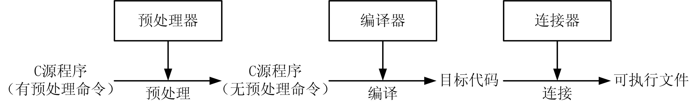

# 预处理命令

##　1、什么是预处理命令
* 图23.1 编译、连接处理过程
      

* 预处理命令不是C++本身的组成部分，更不是C++语句，它是C++标准规定的可以出现在C++源程序文件中的命令。

* 这些命令必须以“#”开头，结尾不加分号，可以放置在源程序中的任何位置，其有效范围是从出现位置开始到源程序文件末尾。

## 2、宏定义

* 在Ｃ++源程序中允许**用一个标识符来代表一个字符文本，称为宏，标识符为宏名**。

* 宏是由宏定义命令事先定义的。预处理时，对程序中所有后续的宏名实例（称为宏引用），预处理器都用字符文本去替换，称为宏替换或宏展开。

* 宏定义通常用于定义程序中的符号常量、类型别名、运算式代换、语句代换等，其命令为#define，分为不带参数的宏定义和带参数的宏定义。

1. 不带参数的宏定义
    * 不带参数的宏定义的命令形式为：
        ```cpp
        #define 宏名 字符文本
        ```
        ```cpp
        #define PI 3.1415926 
        L=2*PI*r; 
        #define M y*y+5*y 
        S=3*M+4*M+5*M;
        ```
        ```cpp
        L=2*3.1415926*r; 
        S=3*y*y+5*y+4*y*y+5*y+5*y*y +5*y;
        ```

    * 宏定义只是简单置换，不作语法检查，因此，宏串中的每字符都是有效字符；
    * 下例多余字符均导致编译出错：
        ```cpp
        #define PI "3.141592"
        c=2.0*PI*r; // 宏展开结果：c=2.0*"3.141592"*r;
        ```
        ```cpp
        #define PI 3.141592; 
        c=2.0*PI*r; //宏展开结果：c=2.0*3.141592*r;
        ```

* 【例23.1】
    ```cpp
    #include <iostream> 
    using namespace std; 
    #define PI 3.1415926 //不带参数的宏定义 
    int main() 
    { 
        double r,L,S,SQ,V; 
        cin >> r; //输入半径 
        L=2*PI*r; //计算圆周长 
        S=PI*r*r; //计算圆面积 
        SQ=4.0*PI*r*r; //计算圆球表面积 
        V=4.0*PI*r*r*r/3.0; //计算圆球体积 
        cout<<"L="<<L<<",S="<<S<<",SQ="<<SQ<<",V="<<V<<endl; 
        return 0; 
    }
    ```

2. 带参数的宏定义
    * 带参数的宏定义的命令形式为：
        ```cpp
        #define 宏名(参数表) 字符文本
        ```
    * 带参数的宏的引用形式为：
        ```cpp
        宏名(引用参数表)
        ```
    
    * 例如有宏定义
        ```cpp
        #define max(a,b) (((a) > (b)) ? (a) : (b))
        ```

    * 程序代码：
        ```cpp
        L=max(x-y,x+y); //max宏引用
        ```

    * 预处理时宏替换为：
        ```cpp
        L=(((x-y) > (x+y)) ? (x-y) : (x+y))
        ```

* 【例23.2】
    ```cpp
    #include <iostream> 
    using namespace std; 
    int M1(int y) 
    { 
        return((y)*(y)); 
    } 
    #define M2(y) ((y)*(y)) 
    int main() 
    { 
        int i,j; 
        for (i=1,j=1;i<=5;i++) cout<<M1(j++)<<" "; //函数调用处理 
        cout << endl; 
        for (i=1,j=1;i<=5;i++) cout<<M2(j++)<<" "; //宏引用处理 
        cout << endl; 
        return 0;
    }
    ```

* 为了保证宏展开的结果符合设计本意，应在宏串或实参字串中加入必要的括号；
    ```cpp
    #define S(r) 3.141592*r*r 
    int main( ) 
    { 
        float a=2.0, b=3.0, area; 
        area=S((a+b)); //替换为3.141592*(a+b)*(a+b) 
        cout<<“area=”<<area<<endl; 
        return 0; 
    }
    ```
    或者：
    ```cpp
    #define S(r) 3.141592*(r)*(r) 
    int main( ) 
    { 
        float a=2.0, b=3.0, area; 
        area=S(a+b); //替换为3.141592*(a+b)*(a+b) 
        cout<<“area=”<<area<<endl; 
        return 0; 
    }
    ```

3. #和##预处理运算
* #运算符的作用是文本参数“字符串化”，即出现在宏定义字符文本中的#把跟在后面的参数转换成一个C++字符串常量。
    ```cpp
    #define PRINT_MSG1(x) printf(#x); 
    #define PRINT_MSG2(x) printf(x); 
    PRINT_MSG1(Hello World); //正确 
    PRINT_MSG1("Hello World"); //正确 
    PRINT_MSG2(Hello World); //错误 
    PRINT_MSG2("Hello World"); //正确
    ```

* ##运算符的作用是将两个字符文本连接成一个字符文本，如果其中一个字符文本是宏定义的参数，连接会在参数替换后发生。
    ```cpp
    #define SET1(arg) A##arg=arg; 
    #define SET2(arg) Aarg=arg; 
    SET1(1); //宏替换为 A1=1; 
    SET2(1); //宏替换为 Aarg=1;
    ```

## 3、文件包含

* 文件包含命令的作用是把指定的文件插入到该命令所处的位置上取代该命令，然后再进行编译处理，相当于**将文件的内容“嵌入”到当前的源文件中一起编译**。

* 文件包含命令为#include，有两种命令形式：
    1. 第一种形式：
        ```cpp
        #include <头文件名>
        ```
    2. 第二种形式：
        ```cpp
        #include "头文件名"
        ```

1. 文件包含的路径问题
* 文件包含命令中的头文件名可以写成绝对路径的形式，例如：
    ```cpp
    #include "C:\DEV\GSL\include\gsl_linalg.h" 
    #include <C:\DEV\SDL\include\SDL.h>
    ```
* 文件名也可以写成相对路径的形式，例如：
    ```cpp
    #include <math.h> 
    #include <zlib\zlib.h> 
    #include "user.h" 
    #include "share\a.h"
    ```

* 这时的文件包含命令是相对系统INCLUDE路径或用户路径来查找头文件的。
* 假设编译器系统INCLUDE路径为“C:\DEV\MinGW\include”，则
    ```cpp
    #include <user.h> //user.h在C:\DEV\MinGW\include 
    #include <share\a.h> //a.h 在C:\DEV\MinGW\include\share
    ```

* 假设用户路径为“D:\Devshop”，则
    ```cpp
    #include "user.h" //user.h在D:\Devshop或C:\DEV\MinGW\include 
    #include "share\a.h" //a.h 在D:\Devshop\share 或C:\DEV\MinGW\include\share
    ```

* 如果在上述路径中找不到头文件，会出现编译错误。


2. 文件包含的重复包含问题
* 头文件有时需要避免重复包含（即多次包含），例如一些特定声明不能多次声明，而且重复包含增加了编译时间。这时可以采用以下两个办法之一。
    > （1）使用条件编译。
    > （2）使用特殊预处理命令#pragma。

## 4、条件编译      
1. #ifdef条件编译命令 
* 测试条件字段是否定义，以此选择参与编译的程序代码段，它有两种命令形式。
    > ①第一种形式：
    ```cpp
    #ifdef 条件字段 
        ......//程序代码段1 
    #endif
    ```
    > ②第二种形式：
    ```cpp
    #ifdef 条件字段 
        ......//程序代码段1 
    #else 
        ......//程序代码段2 
    #endif
    ```

* 例：如果DEBUG已经定义则编译printf语句，否则不编译；  
```cpp
#ifdef DEBUG 
printf("x=%d,y=%d,z=%d\n",x,y,z); 
#endif
```

2. #if条件编译命令
* 根据表达式的值选择参与编译的程序代码，其命令形式为：
    ```cpp
    #if 常量表达式 
        ......//程序代码段1 
    #else 
        ......//程序代码段2 
    #endif
    ```

* 可以使用嵌套的#if条件编译命令#if-#elif，命令形式为：
    ```cpp
    #if 常量表达式1 
        ......//程序代码段1 
    #elseif 常量表达式2 
        ......//程序代码段2 
    #else 
        ......//程序代码段3 
    #endif
    ```

* 【例23.3】
    ```cpp
    #include <iostream> 
    using namespace std; 
    int main() 
    { 
        double sn=100.0, hn=sn/2; 
        int n; 
        for(n=2;n<=10;n++) { 
            sn=sn+2*hn; //第n次落地时共经过的米数 
            hn=hn/2; //第n次反跳高度 
            #ifdef _DEBUG 
            cout<<"sn="<<sn<<",hn="<<hn<<endl; 
            #endif 
        } 
        cout<<"the total of road is "<<sn<<endl; 
        cout<<"the tenth is "<<hn<<" meter"<<endl; 
        return 0; 
    }
    ```
