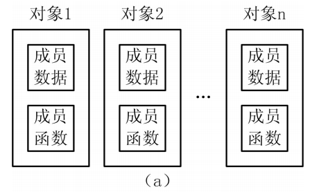
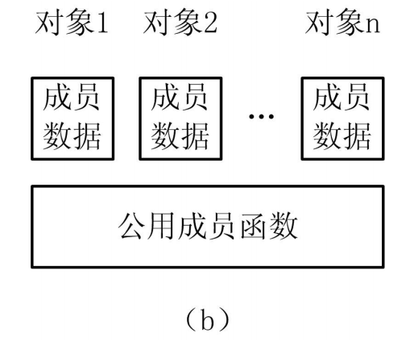

## 1、定义类

* C语言——面向过程的程序设计思想  
    > ►自顶向下，逐步求精；  
    > ►一个main函数+若干子函数。  

* C++语言——面向对象的程序设计思想   
    > ►实现软件设计的产业化；     
    > ►自然界是由实体（对象）组成的；   

    * （1）抽象：对具体对象（问题）进行概括，抽出这一类对象的公 共性质并加以描述的过程。   
        > ►数据抽象   
        > ►行为抽象  
    * （2）封装：将抽象出的数据成员、行为成员相结合，将他们视为 一个整体——类。  
        > ►使用者不需要了解具体的实现细节，只需要通过接口使用类的 成员即可。
    * （3）继承与派生：保持原有类特性的基础上，进行更具体的说明。  


* 类（class）是用户自定义数据类型。如果程序中要使用类类型 （class type），必须根据实际需要定义，或者使用已设计好的类。

    * C++定义一个类，其方法与定义一个结构体类型是相似的，一般形式为：  
        ```cpp
        class 类名 { //类体
            成员列表
        };
        ```
        1. 其中成员列表（member list）是类成员的集合，数目可以任意多， 由具体应用确定。一对大括号｛｝是成员列表边界符，与成员列表一起称为类体（class body）。类体后面必须用分号（；）结束。  
        2. 每个类可以没有成员，也可以有多个成员。  
        3. 类成员可以是数据或函数。  
        4. 所有成员必须在类的内部声明，**一旦类定义完成后，就没有任何其 他方式可以再增加成员了**。  
    * 类定义时必须给出各个数据成员（data member）的数据类型声明， 其一般形式为：
        ```cpp
        class 类名 { //类体 
            …
            数据成员类型 数据成员名列表; //数据成员声明
            … 
        };
        ```
        1. 声明时成员名列表允许为多个，用逗号（，）作为间隔，最后必须 用分号（；）结束。  
        2. 每个类还可以包含成员函数，能够访问类自身的所有成员。  
        3. 面向对象程序设计一般将数据隐蔽起来，外部不能直接访问，而把**成员函数作为对外界的接口，通过成员函数访问数据**。即数据成员是属性，成员函数是方法，通过方法存取属性。  
        4. 如果类中有成员函数，则声明成员函数是必需的，而定义成员函数则是可选的，因此类的成员函数有两种形式。  
            * ①在类中定义（也是声明）成员函数，形式如下：  
            ```cpp
            class 类名 { //类体
                …
                返回类型 函数名(形式参数列表)//成员函数定义
                { 
                    函数体 
                } 
                … 
            };
            ```
            * ②成员函数的声明在类中，定义在类外部，形式：  
            ```cpp
            class 类名 { //类体 
                … 
                返回类型 函数名(类型1 参数名1,类型2 参数名2,…); //成员函数声明 
                返回类型 函数名(类型1, 类型2,…); 
                … 
            };
            
            返回类型 类名::函数名(形式参数列表) { //成员函数定义在类外部实现 
                函数体 
            }
            ```
     * 【例25.1】
        ```cpp
        class Data { //Data类定义 
            void set(int d); 
            //成员函数原型声明，与 void set(int); 等价 
            int get() { //成员函数类内部定义 
                return data; 
            } //get函数定义结束 
            int data; //数据成员 
        }; //Data类定义结束 

        void Data::set(int d) //成员函数类外部定义 
        { 
            data=d; //访问类的数据成员 
        } 
        
        ```
        1. 类定义一般放在程序文件开头，或者放到头文件中被程序文件包含， 此时这个定义是全局的。在全局作用域内，该定义处处可见，因此同作用域内的所有函数都可以使用它。  
        2. 类定义也可以放到函数内部或局部作用域中，此时这个定义是局部的。若在函数内部有同名的类定义，则全局声明在该函数内部是无 效的，有效的是局部定义的。  

    * 【例25.2】
        ```cpp
        class Data { //全局的Data类定义 
            void show(); //成员函数原型声明 
            int data; //数据成员 
        }; //Data类定义结束 

        void fun() 
        {   //全局Data在fun函数中无效，有效的是局部定义的
            Data class Data { //局部的Data类定义 
                void show() { cout<<data; }//set函数定义 
                int data; //数据成员 
            }; //Data类定义结束 
        }
        ```
        1. C++规定，在局部作用域中声明的类，成员函数必须是函数定义形式，不能是原型声明。一般地，由于类是为整个程序服务的，因此 很少有将类放到局部作用域中去定义。  
        2. 类定义向编译器声明了一种新的数据类型，该数据类型有不同类型的数据成员和成员函数。因此尽管数据成员类似变量的定义，但类型声明时并不会产生该成员的实体，即为它分配存储空间。  


## 2、成员的访问控制
* 对类的成员进行访问，来自两个访问源：类成员和类用户。  
* 类成员指类本身的成员函数，类用户指类外部的使用者，包括全局函数、另一个类的成员函数等。  
* 无论数据成员还是函数成员，类的每个成员都有访问控制属性，由 以下三种访问标号说明：public（公有的）、private（私有的）和 protected（保护的）。  
* **公有成员**用public标号声明，类成员和类用户都可以访问公有成员， 任何一个来自类外部的类用户都必须通过公有成员来访问。显然， **public实现了类的外部接口**。  
* **私有成员**用private标号声明，只有类成员可以访问私有成员，类用 户的访问是不允许的。显然，**private实现了私有成员的隐蔽**。  
* **保护成员**用protected标号声明，在不考虑继承的情况下， protected的性质和private的性质一致，但保护成员可以被派生类 的类成员访问。  
* 成员访问控制是C++的类和结构体又一个重要特性。加上访问标号， 类定义更一般的形式为：  
    ```cpp
    class 类名 { //类体 
        public: //公有访问权限 
            公有的数据成员和成员函数 
        protected: //保护访问权限 
            保护的数据成员和成员函数 
        private: //私有访问权限 
            私有的数据成员和成员函数 
    };
    ```
* 如果没有声明访问控制属性，类所有成员默认为private，即私有的。 例如：  
    ```cpp
    class Data { 
        int a, b; //默认为私有的，外部不能直接访问 
        public://公有的，外部可以直接访问 
            void set(int i, int j,int k,int l,int m,int n){ a=i,b=j,c=k,d=l,e=m,f=n;} 
        protected://保护的，外部不能直接访问，派生类可以访问 
            int c, d; 
        private://私有的，外部不能直接访问，派生类也不可以访问 
            int e, f; 
    };
    ```
    > 说明：  
    1. 在定义类时，声明为public、private或protected的成员的次序任意。  
    2. 在一个类体中不一定都包含public、private或protected部分， 可以只有public、private、protected部分或任意组合。  
    3. 关键字public、private、protected可以分别出现多次，即一 个类体可以包含多个public、private或protected部分。但**更通用的做法是将相同访问控制属性的成员集中在一起来写**。  
    4. **实际编程中，为了使程序清晰，每一种成员访问限定符在类体中只出现一次**，且按照public、protected、private顺序组织，形成访问权限层次分明的结构。


## 3、类的数据成员

### 1. 在类中声明数据成员
* 正如我们所见，类的数据成员的声明类似于普通变量的声明。如果 一个类具有多个同一类型的数据成员，则这些成员可以在一个成员 声明中指定。  
```cpp
class Cube { //Cube类表示立方体 
    … //其他成员 
    long color; //数据成员 
    double x,y,z,side; //数据成员 
};
```

* 类的数据成员可以是基本类型、数组、指针、引用、共用体、枚举类型、void指针、const限定等数据类型。例如：  
```cpp
class ADT { //类成员数据类型 
    … //成员函数 
    long color; 
    double x,y,z,side; //基本类型 
    int a[10]; //数组 
    char *s; //指针 
    char &r; //引用 
    void *p; //void指针 
};
```

* 类的数据成员还可以是成员对象（member object），即类类型或结构体类型的对象。若类A中嵌入了类B的对象，称这个对象为子对象（subobject）。例如：类Line嵌入了类Point的子对象start、end。  
```cpp
class Point { //Point类表示点 
    public: 
        void set(int a,int b); 
        int x,y; 
};

class Line { //Line类表示线 
    public: 
        void set(Point a,Point b); 
        Point start, end; //成员对象 
};
```

### 2. 在类中定义或声明数据类型
* 除了定义数据成员和成员函数之外，类还可以定义自己的局部类型， 并且使用类型别名来简化。
* 在类中定义或声明的数据类型的作用域是类内部，因此，它们不能 在类外部使用。
* 在类定义中，可以定义结构体和共用体类型、嵌套的类定义，声明枚举类型。  
```cpp
class ADT { //类定义 
    struct Point { int x,y; }; //定义结构体 
    union UData {Point p; long color; }; //定义共用体 
    enum COLORS {RED,GREEN,BLUE,BLACK,WHITE }; //定义枚举类型 
    class Nested { //嵌套类定义 
        … //成员函数 
        Point start; //数据成员 
        UData end; //数据成员 
        COLORS color; //数据成员 
    };
    typedef Point* LPPOINT; //声明类型别名 
    … //成员函数 
    … //数据成员 
}; //类定义结束
```

## 4、类的成员函数

### 1. 在类的外部定义成员函数
* 如果成员函数仅有声明在类定义中，则在类外部必须有它的实现， 其一般形式为：  
    ```cpp
    返回类型 类名::函数名(形式参数列表) 
    { 
        函数体 
    }
    ```

    ```cpp
    class Data { //Data类定义 
        public: 
            void set(int d); //成员函数原型声明 
            int get() { //成员函数定义 
                return data; 
            } //get函数定义结束 
        private: 
            int data; //数据成员 
    }; //Data类定义结束 

    void Data::set(int d) //成员函数的外部定义，使用 Data:: 限定 
    { 
        data=d; //访问类的数据成员 
    } 

    void set(int d) //全局普通函数 
    { 
        … //函数体 
    }
    ```
    > 说明：  
    1. （::）是作用域限定符（field qualifed）。如果在作用域限定符的前面没有类名，或者函数前面既无类名又无作用域限定符，例如：  
        ```cpp
        ::set(10) 或 set(10)
        ```  
        则表示set函数不属于任何类，这个函数不是成员函数，而是全局的普通函数。此时的（::）不是类作用域限定符的含义，而是命名空间域限定符的含义。  
    2. 在成员函数中可以访问这个类的任何成员，无论它是公有的或是私有的，是类内部声明的还是类外部定义的。  
    3. 虽然成员函数在类的外部定义，但在调用成员函数时会根据在类中声明的函数原型找到函数的定义（即函数代码），从而执行该函数。因此**类的成员函数原型声明必须出现在成员函数定义之前**， 否则编译时会出错。  
    4. 在类的内部声明成员函数，而在类的外部定义成员函数，这是一个**良好的编程习惯**。因为不仅可以减少类体的长度，使类体结构清晰，便于阅读，而且**有助于类的接口和实现分离**。  
    5. 如果一个成员函数，其函数体不太复杂，只有4～5行时，一 般可在类体中定义。  


### 2. 内联成员函数
* 类的成员函数可以指定为inline，即内联函数。  
* 默认情况下，在类体中定义的成员函数若不包括循环等控制结构， 符合内联函数要求时，C++会自动将它们作为内联函数处理（隐式 inline）。  
* 也可以显式地将成员函数声明为inline。例如：  
```cpp
class Data { //Data类定义 
    int getx() { return x;} //内联成员函数 
    inline int gety() { return y;} //显式指定内联成员函数 
    inline void setxy(int _x, int _y); //显式指定内联成员函数 
    void display(); 
    int x, y; 
};

inline void Data::setxy(int _x, int _y) //内联成员函数 
{ 
    x=_x, y=_y; 
}

void Data::display() //非内联成员函数 
{ 
    … //函数体 
}
```
* 判断成员函数是否是内联的，有以下几条：  
    ① 符合内联函数要求；  
    ② 符合①的条件，并且在类体中定义，自动成为内联的；  
    ③ 符合①的条件，在类体显式指明inline，或在外部定义时显式指 明inline，或者同时显式指明，则函数是内联的；  
    ④ 在类外部定义，并且既没有在类体，也没有在外部定义时显式 指明inline，则函数不是内联的。  


### 3. 成员函数重载及默认参数

* 可以对成员函数重载或使用默认参数。例如：  
```cpp
class MAX { 
    int Max(int x,int y) { return x>y?x:y; } 
    int Max() 
    { 
        return Max(Max(a,b),Max(c,d)); 
    } //重载Max 
    int Set(int i=1,int j=2,int k=3,int l=4) 
    { 
        a=i,b=j,c=k,d=l; 
    } //默认参数 
    int a,b,c,d; 
};
```
需要注意，声明成员函数的多个重载版本或指定成员函数的默认参数，**只能在类内部中进行**。  
因为类定义中的声明先于成员函数的外部实现，根据重载或默认参数函数的要求，必须在第1次出现函数声明或定义时就明确函数是否重载或有默认参数。  


### 4. 成员函数的存储方式
* 用类实例化一个对象时，系统会为每一个对象分配存储空问。如果 一个类包括了数据成员和成员函数，则要分别为数据和函数的代码分配存储空间。  
* 通常，**C++会为每个对象的数据成员分配各自独立的存储空间**，像结构体成员那样。
* 那么在类中的成员函数是否会如图所示那样也分配各自独立的存储空间呢？  
    图25.1 成员函数的存储方式  
    
    > **由于不论调用哪一个对象的函数代码，实际调用的都是同样内容的代码**。因此，若像上图那样存放相同代码的多份副本，既浪费空间又无必要。  
    > 实际上，**成员函数代码只有公用的一段存储空间**，调用不同对象的成员函数时都是执行同一段函数代码。  

    图9.1 成员函数的存储方式  
    

    * 例如定义了一个类  
    ```cpp
    class Time { //Time类 
        int h,m,s; //数据成员 
        void settime(int a,int b,int c) { h=a,m=b,s=c;} //成员函数 
    };
    ```
    > sizeof(Time)的值是12。显然，Time类的存储空间长度只取决于数据成员h、m、s所占的空间，而与成员函数settime无关。C++把成 员函数的代码存储在对象空间之外的地方。  

## 5、类的声明

* 一旦遇到类体后面的右大括号，类的定义就结束了。  
* 在一个给定的源文件中，一个类只能被定义一次。  
* 通常将类的定义放在头文件中，这样可以保证在每个使用该类的文件都以同样的方式定义类。  
* 可以只声明一个类而不定义它：  
    ```cpp
    class Point; //Point类声明，非Point类定义，因为没有类体
    ```
    * 这个声明，称为前向声明（forward declaration），表示在程序中 引入了Point类类型。  
    * 在声明之后、定义之前，类Point是一个不完全类型，即已知Point是一个类，但不知道它包含哪些成员。因此不能定义该类型的对象， 只能用于定义指向该类型的指针及引用，或者用于声明（而不是定义）使用该类型作为形参类型或返回类型的函数。  
* 在创建类的对象之前，必须完整地定义该类。这样，编译器就会给 类的对象准备相应的存储空间。  
* 同样地，在使用引用或指针访问类的成员之前，必须己经定义类。  
* **类不能具有自身类型的数据成员**。然而，只要类名一经出现就可以认为该类己声明。因此，类的数据成员可以是指向自身类型的指针或引用。  
    > 例如：
    ```cpp
    class Point; //Point类声明，非Point类定义，因为没有类体 
    class Line { 
        Point a; //错误，不能使用仅有类声明而没有类定义的类定义数 据对象
        Point *pp, &rp; //正确，只有类声明，即可用它定义该类的指 针或引用
        Line b; //错误，类不能具有自身类型的数据成员 
        Line *pl, &rl; //正确，类可以有指向自身类型的指针或引用 的数据成员 
    };
    ```

