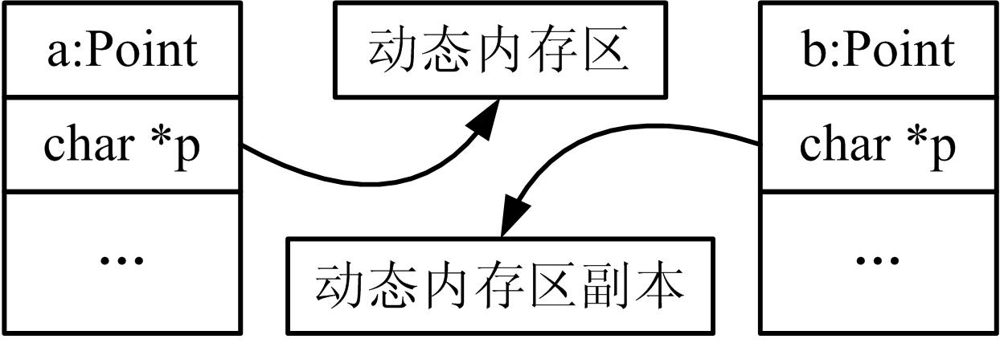
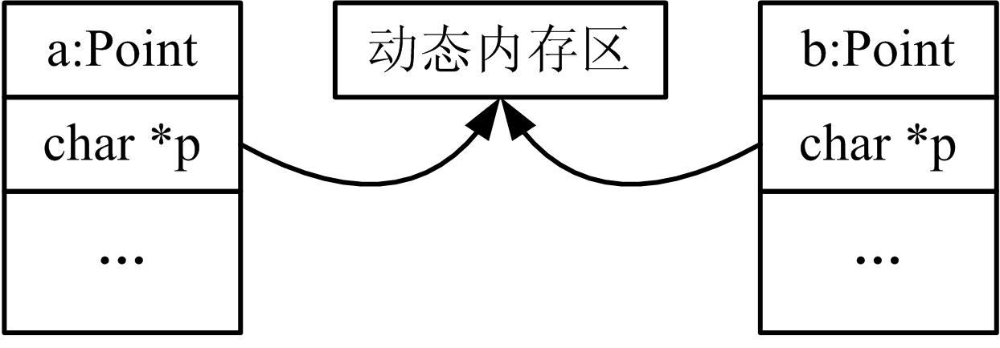

# 默认构造函数和复制构造函数  

## 1、定义默认构造函数
* **默认构造函数**就是在没有显式提供初始化式时调用的构造函数，它 是一个不带参数的构造函数。如果定义某个类的对象时没有提供初始化式就会使用默认构造函数。  

* 定义默认构造函数（default constructor）的一般形式为：  
    ```cpp
    类名() 
    { 
        函数体 
    }
    ```
    它由不带参数的构造函数，或者所有形参均是默认参数的构造函数 定义。与默认构造函数相对应的对象定义形式为：  
    ```cpp
    类名 对象名;
    ```

* 任何一个类有且只有一个默认构造函数。如果定义的类中没有显式定义任何构造函数，编译器会自动为该类生成默认构造函数，称为**合成默认构造函数**（synthesized default constructor）。  

* 一个类哪怕只定义了一个构造函数，编译器也不会再生成默认构造函数。换言之，如果为类定义了一个带参数的构造函数，还想要无参数的构造函数，就必须自己定义它。  

* 一般地，任何一个类都应定义一个默认构造函数。因为，在很多情况下，默认构造函数是由编译器隐式调用的。  


## 2、隐式类类型转换
* 为了**实现其他类型到类类型的隐式转换**，需要定义合适的构造函数。 可以用单个实参调用的构造函数（称为转换构造函数）定义从形参类型到该类类型的隐式转换。  

* 【例28.1】隐式类类型转换举例  
    ```cpp
    #include <iostream> 
    using namespace std; 
    class Data { //Data类定义 
        public: 
            Data(const string& str="") : s1(str) { } 
            void SetString(const Data& r) //期待的是Data类型的对象 
            { s1=r.s1; } 
            void print() { cout<<s1<<endl; } 
        private: 
            string s1; 
    };

    int main() 
    { 
        Data a,b,c("world"); 
        string i="string"; 
        a.SetString(c); 
        b.SetString(string("world")); //隐式转换 
        a.print(); 
        b.print(); 
        Data d=Data(i); //隐式转换 
        d.print(); 
        return 0; 
    }
    ```


* 使用单个参数的构造函数来进行类类型转换的方法可以总结如下：  
    1. 先声明一个类；  
    2. 在这个类中定义一个只有一个参数的构造函数，参数的类型是需要转换的数据类型，即转换构造函数的一般形式为：  
        ```cpp
        类名(const 指定数据类型& obj)
        ```
    3. 采用转换构造函数定义对象时即进行类型转换，一般形式为：  
        ```cpp
        类名(指定数据类型的数据对象)
        ```

* 可以禁止由构造函数定义的隐式转换，方法是通过将构造函数声明为explicit，来防止在需要隐式转换的上下文中使用构造函数。

* C++关键字explicit用来修饰类的构造函数，指明该构造函数是显式的。explicit关键字只能用于类内部的构造函数声明上，在类定义外部不能重复它。

* 一般地，除非有明显的理由想要定义隐式转换，否则，单形参构造函数应该为explicit。将构造函数设置为explicit可以避免错误，如果真需要转换，可以显式地构造对象。

## 3、复制构造函数与合成复制构造函数

### 1. 复制构造函数
* **复制构造函数**又称为**拷贝构造函数**，它是一种特殊的构造函数。它的作用就是用一个已经生成的对象来初始化另一个同类的对象。
* 变量的初始化：  
    > int a=10; int b=a;  
* 对象的初始化：  
    > Point pt1(10,20); Point pt2=pt1;  
* 复制构造函数定义的一般形式为：  
    ```cpp
    类名(const 类名& obj) 
    { 
        函数体 
    }
    ```
* 例如：  
    ```cpp
    class Point { //Point类 
        public:
            Point() : x(0), y(0) { } //默认构造函数 
            Point(const Point& r) : x(r.x), y(r.y) { } //复制构造函数 
            Point(int a,int b) : x(a), y(b) { } //带参数构造函数 
        private: 
            int x,y; 
    };
    ```
* 复制构造函数有且只有一个本类类型对象的引用形参，**通常使用const限定**。因为复制构造函数只是复制对象，没有必要改变传递来的对象的值。  
* **复制构造函数的功能是利用一个已知的对象来初始化一个被创建的同类的对象**。  
* 与复制构造函数对应的对象的定义形式为：  
    ```cpp
    类名 对象名1(类对象1), 对象名2(类对象2),......;
    ```


* 对象赋值和对象复制的区别：  
    * 对象的赋值是对一个已经存在的对象赋值，因此必须先定义被赋值的对象，才能进行赋值。  
    * 对象的复制则是从无到有地建立一个新对象，并使它与一个已有的对象完全相同（包括对象的结构和成员的值）。


### 2. 合成复制构造函数
* 每个类必须有一个复制构造函数。如果类没有定义复制构造函数， 编译器就会自动合成一个，称为**合成复制构造函数**（synthesized copy constructor）。

* 与合成默认构造函数不同，即使定义了其他构造函数，编译器也会合成复制构造函数。  
* 合成复制构造函数的操作是：执行逐个成员初始化，将新对象初始化为原对象的副本。  
* 所谓“逐个成员”，指的是编译器将现对象的每个非静态数据成员， 依次复制到正创建的对象中。每个成员的类型决定了复制该成员的 含义：  
    > ①内置类型成员直接复制其值；  
    > ②类类型成员使用该类的复制构造函数进行复制；  
    > ③如果一个类具有数组成员，则合成复制构造函数将复制数组，即复制数组的每一个元素到新对象中。

* 逐个成员初始化可以这样理解：将合成复制构造函数看作是每个数据成员在构造函数初始化列表中进行初始化的构造函数。
* 以下3种情况会使用复制构造函数。  
    1. 用一个对象显式或隐式初始化另一个对象。  
        1. C++支持两种初始化形式：复制初始化和直接初始化。复制初始化使用等号（=），而直接初始化将初始化式放在圆括号中。  
        2. 复制初始化和直接初始化是有区别的：直接初始化会调用与实参匹配的构造函数；而复制初始化总是调用复制构造函数。  
            ```cpp
            Point pt1(10,20); 
            Point pt2=pt1; //复制初始化 
            Point pt3(pt1); //直接初始化
            ```
    2. 函数参数按值传递对象时或函数返回对象时。  
        * 当函数形参为对象类型，而非指针和引用类型时，函数调用按值传递对象，即编译器调用复制构造函数产生一个实参对象副本传递到函数中。  
        * 类似地，以对象类型作为返回值时，编译器调用复制构造函数产生一个return语句中的值的副本返回到调用函数。
    3. 根据元素初始化式列表初始化数组元素时。  
        * 如果没有为类类型数组提供元素初始化式，则将用默认构造函数初始化每个元素。然而，如果使用常规的大括号的数组初值列表形式来初始化数组时，则使用复制初始化来初始化每个元素。  
        * **总的来说，正是有了复制构造函数，函数才可以传递对象和返回对象，对象数组才能用初值列表的形式初始化。**

## 4、深复制与浅复制
* 如果一个拥有资源（如用new得到的动态内存）的类对象发生复制的时候，若对象数据与资源内容一起复制，称为深复制，如图所示：
      

* 若复制对象但未复制资源内容称为浅复制，如图所示。  
      

* 【例28.2】深复制、浅复制举例  
    ```cpp
    #include <iostream> 
    #include <string.h> 
    using namespace std; 
    class CA 
    { 
        public: 
            CA(int b,char *cstr) //构造函数 
            { 
                a=b; str=new char[b]; strcpy(str,cstr); 
            } 
            CA(const CA &C) //复制构造函数 
            { 
                a=C.a; str=new char[a]; //深复制，浅复制则写成str=C.str; 
                if(str!=0) strcpy(str,C.str); 
            }
            void show() { cout<<str<<endl; } 
            ~CA() //析构函数 
            {
                delete [] str; 
            } 
        private: 
            int a; char *str; 
    }; 
    int main() 
    { 
        CA a(10,"hello"); 
        CA b=a; 
        b.show(); 
        return 0; 
    }
    ```

