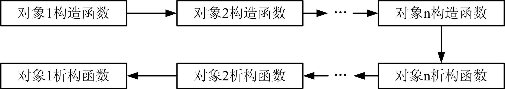

# 析构函数

## 1、析构函数的定义

* **析构函数**：当对象脱离其作用域时（例如对象所在的函数已调用完毕），系统会自动执行析构函数。**析构函数往往用来做“清理善后”的工作**（例如在建立对象时用new开辟了一段内存空间，则在该对象消亡前应在析构函数中用delete释放这段存储空间）。  

* C++规定析构函数的名字是类名的前面加一个波浪号（~）。其定 义形式为：  
    ```cpp
    ~类名() 
    { 
        函数体 
    }
    ```
* 析构函数不返回任何值，没有返回类型，也没有函数参数。由于没有函数参数，因此它不能被重载。换言之，一个类可以有多个构造函数，但是**只能有一个析构函数**。

* 何时调用析构函数：  
    1. 对象在程序运行超出其作用域时自动撤销，撤销时自动调用该对象的析构函数。如函数中的非静态局部对象。  
    2. 如果用new运算动态地建立了一个对象，那么用delete运算释放该对象时，调用该对象的析构函数。  

* 【例29.1】析构函数举例  
    ```cpp
    #include <iostream> 
    #include <string.h> 
    using namespace std; 
    class Point 
    { 
        public: 
            Point(int a,int b):x(a),y(b){} //带参数的构造函数 
            ~Point() { cout<<"析构函数被调用。"<<endl; } //析构函数 
            void show() { cout<<x<<","<<y<<endl; } 
        private: 
            int x,y; 
    }; 
    int main() 
    { 
        Point pt1(10,20); 
        pt1.show(); 
        return 0; 
    }
    ```
    程序运行结果：  
    ```cpp
    10,20 
    析构函数被调用
    ```
## 2、合成析构函数

* 与复制构造函数不同，编译器总是会为类生成一个析构函数，称为**合成析构函数**（synthesized destructor）。  
* 合成析构函数按对象创建时的逆序撤销每个非静态成员，即它是按成员在类中声明次序的逆序撤销成员的。对于类类型的每个成员，合成析构函数调用该成员的析构函数来撤销对象。  
* 需要注意，**合成析构函数并不删除指针成员所指向的对象**，它需要程序员显式编写析构函数去处理。

## 3、何时需要编写析构函数

* 许多类不需要显式地编写析构函数，尤其是具有构造函数的类不一定需要定义自己的析构函数。析构函数通常用于释放在构造函数或在对象生命期内获取的资源（如动态分配的内存）。  
* 但是，析构函数的作用并不仅限于释放资源方面，它可以包含任意操作，**用来执行“对象即将被撤销之前程序员所期待的任何操作”**。  
* 如果类需要析构函数，则该类几乎必然需要定义自己的复制构造函数和赋值运算符重载，这个规则称为析构函数三法则（rule of three）。  

* 【例29.2】析构函数举例  
    ```cpp
    #include <iostream> 
    using namespace std; 
    class CString { //CString类 
        public: 
            CString(const char *str); //单个参数构造函数 
            ~CString(); //析构函数 
            void show() { cout<<p<<endl; } //显示字符串 
        private: 
            char *p; //存储字符串动态内存区 
    };
    CString::CString(const char *str) 
    { 
        p=new char[strlen(str)+1]; //为存储str动态分配内存 
        strcpy(p,str); //复制str到p 
        cout<<"构造："<<str<<endl; 
    } 
    CString::~CString() 
    { 
        cout<<"析构："<<p<<endl; 
        delete [] p; //析构函数必须是否p占用的内存 
    } 
    int main() 
    { 
        CString s1("C++"), s2="JavaScript"; //定义对象 
        s1.show(); s2.show(); 
        return 0; 
    }
    ```
    运行结果：  
    ```cpp
    构造：C++ 
    构造：JavaScript 
    C++ 
    JavaScript 
    析构：JavaScript 
    析构：C++
    ```

## 4、构造函数和析构函数的调用次序

* 在使用构造函数和析构函数时，需要特别注意对它们的调用时间和调用次序。
* 构造函数和析构函数的调用很像一个栈的先进后出，**调用析构函数的次序正好与调用构造函数的次序相反**。最先被调用的构造函数，其对应的（同一对象中的）析构函数最后被调用，而最后被调用的构造函数，其对应的析构函数最先被调用。  
* 可简述为：先构造的后析构，后构造的先析构。 
* 图29.1 对象构造函数和析构函数的调用次序  
      

