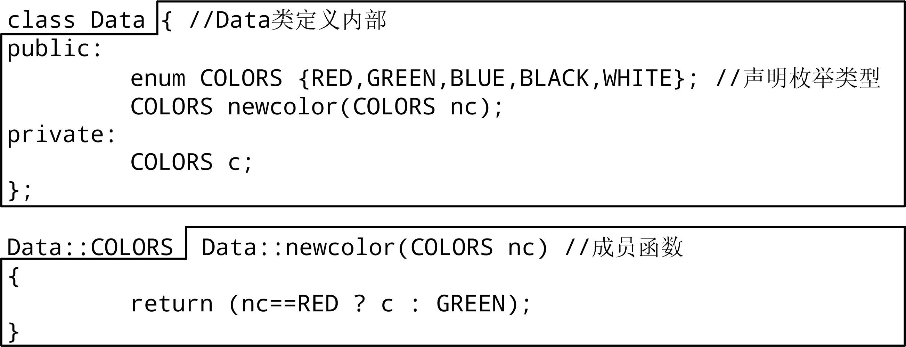

# 类作用域、对象生命期、const限定


## 1、类的作用域 
* 同变量、函数一样，类也有自己的作用域。  

1. 每个类都定义了自己的作用域和唯一的类型。在类体内声明类成员，将成员名引入类的作用域中。两个不同的类具有两个独立的类作用域。即使两个类具有完全相同的成员列表，它们也是不同的类型。每个类的成员不同于任何其他类的成员。例如：  
    ```cpp
    class A { public: int i; double d; }; 
    class B { public: int i; double d; }; 
    class Data{public: int member; void memfunc();}; 
    A obj1; 
    B obj2 = obj1; //错误，不同的类类型对象不能赋值 
    int a;
    ```
2. 在类作用域之外，成员只能通过对象、指针或引用的方式 （使用成员访问操作符“.”或“->”）来访问。这些运算符左边的运算对象分别是一个类对象、指向类对象的指针或对象的引用，后面的成员名字必须在相对应的类的作用域中声明。  
    ```cpp
    Data obj; //定义对象 
    Data *ptr=&obj , &r=obj; //定义指针和引用 
    a=member; //错误，member需要作用域限定 
    obj.member;//正确，通过对象使用member 
    a=ptr->member; //正确，通过指针使用member 
    r.memfunc(); //正确，通过引用使用memfunc
    ```
3. 静态成员、类中定义的类型成员需要直接通过类作用域运算符“::”来访问。  
    ```cpp
    class Data { 
        public:
            enum COLORS {RED,GREEN,BLUE,BLACK,WHITE}; //声明枚举类型 
            COLORS getcolor(); 
    };
    COLORS c1; //错误，COLORS只能在类作用域中 
    Data::COLORS cc; //正确，Data:: 限定COLORS在类作用域中
    ```
4. 定义于类外部的成员函数的形参列表和函数体也都是在类作用域中，所以可以直接引用类的其他成员。例如：  
      
    方框内都是Data类的作用域。  


### 1.类作用域中的名字查找
* 名字查找（name lookup），即寻找与给定的名字相匹配的声明的过程。  
    > ①首先，在使用该名字的块中查找名字的声明，且只考虑在该名字使用之前声明的名字；  
    > ②如果找不到该名字，则在包围的作用域中查找；  
    > ③如果找不到任何声明，则编译错误。  

* 比较容易引起混淆的是在类体内定义的名字。  
    1. 类成员声明的名字查找。
        按以下方式确定在类成员的声明中用到的名字：  
        > ①检查出现在名字使用之前的类成员的声明。  
        > ②如果①查找不成功，则检查包含类定义的作用域中出现的声明以及出现在类定义之前的声明。    

        必须在类中先定义类型名字，才能将它们用作数据成员的类型，或者成员函数的返回类型或形参类型。编译器按照成员声明在类中出现的次序来处理名字。  
    2. 类成员定义中的名字查找。  
        按以下方式确定在成员函数的函数体中用到的名字。  
        > ①首先检查成员函数局部作用域中的声明；  
        > ②如果在成员函数中找不到该名字的声明，则检查所有类成员的声明；   
        > ③如果在类中找不到该名字的声明，则检查在此成员函数定义之前的作用域中出现的声明。  

### 2. 嵌套类
* 可以在类A的内部定义类B，称类B为嵌套类（nested class），又称为嵌套类型（nested type），称类A为外围类（enclosing class）。 例如：
    ```cpp
    class Queue { //外围类定义体 
        private: 
            struct QueueItem { //嵌套类 
                QueueItem(const int &); 
                int item; 
                QueueItem *next; 
            };
            QueueItem *head,*tail; 
    };
    ```
    说明：  
    1. 嵌套类是独立的类，基本上与它们的外围类不相关，因此，外围类和嵌套类的对象是互相独立的。嵌套类型的对象不包含外围 类所定义的成员，同样，外围类的成员也不包含嵌套类所定义的成员。  
    2. 嵌套类的名字只在其外围类的作用域中可见，嵌套类的名字不会与另一作用域中声明的名字冲突。  
    3. 嵌套类可以具有与非嵌套类相同种类的成员。像任何其他类一样，嵌套类使用访问标号控制对自己成员的访问。成员可以声明为public、private或protected。外围类对嵌套类的成员没有特殊访问权，并且嵌套类对其外围类的成员也没有特殊访问权。  
    4. 在外围类的public部分定义的嵌套类定义了可在任何地方使用的类型，在外围类的protected部分定义的嵌套类定义了只能由外围类、友元或派生类访问的类型，在外围类的private部分定义的嵌套类定义了只能被外围类或其友元访问的类型。
* 嵌套类可以直接引用外围类的静态成员、类型名和枚举成员，当然， 引用外围类作用域之外的类型名或静态成员，需要作用域运算符 （::）。

### 3. 局部类
* 可以在函数体内部定义类，这样的类称为局部类。一个局部类定义了一个类型，该类型只在定义它的局部作用域中可见。
    1. 局部类的所有成员（包括函数）必须完全定义在类体内。  
    2. 局部类可以访问的外围作用域中的名字是有限的。局部类只能访问在外围作用域中定义的类型名、静态变量和枚举成员，不能使用定义该类的函数中的变量。  
    3. 外围函数对局部类的私有成员没有特殊访问权，当然，局部类可以将外围函数设为友元。实际上，局部类中private成员几乎是不必要的，通常局部类的所有成员都为public成员。  
    4. 可以访问局部类的程序部分是非常有限的。局部类封装在它的局部作用域中，进一步通过信息隐藏进行封装通常是不必要的。 
    ```cpp
    int a, v; 
    void fun(int v){ 
        static int s; //静态局部变量 
        enum Loc { a=1024, b}; 
        class Bar { //局部类 
            public:
                Loc locv; //正确，允许使用局部类型 
                int barv; 
                void setBar(Loc l=a) { //正确，默认参数值为枚举类型的枚举器a 
                    barv=v; //错误，v是函数fun的形参 
                    barv=::v; //正确，使用全局v 
                    barv=s; //正确，使用静态局部变量 
                    locv=b; //正确，使用枚举器b 
                }
        };
    }
    ```


## 2、对象的生命期
* 按生命期的不同，对象可分为如下四种：  
    1. 局部对象。  
        * 局部对象在运行函数时被创建，调用构造函数；当函数运行结束时被释放，调用析构函数。  
    2. 静态局部对象。  
        * 静态局部对象在程序执行函数第一次经过该对象的定义语句时被创 建，调用构造函数。这种对象一旦被创建，在程序结束前都不会撤销。即使定义静态局部对象的函数结束时，静态局部对象也不会撤销。在该函数被多次调用的过程中，静态局部对象会持续存在并保持它的值。  
        * 静态局部对象在程序运行结束时被释放，调用析构函数。  
    3. 全局对象
        * 全局对象在程序开始运行时，main运行前创建对象，并调用构造函 数；在程序运行结束时被释放，调用析构函数。
    4. 自由存储对象
        * 用new分配的自由存储对象在new运算时创建对象，并调用构造函数；在delete运算时被释放，调用析构函数。自由存储对象一经new运算创建，就会始终保持直到delete运算时，即使程序运行结束它也不会自动释放。
* 【例31.1】  
    ```cpp
    #include <iostream> 
    using namespace std; 
    class A { 
        public: 
            int n; 
            A(int _n=10):n(_n) { cout<<"A("<<n<<")构造\t"; } 
            ~A() { cout<<"A("<<n<<")析构\t"; } 
    }; 
    class B { 
        public: 
            int m; 
            B(int _n=20):m(_n),a(_n) { cout<<"B("<<m<<")构造"<<endl; } 
            ~B() { cout<<"B("<<m<<")析构"<<endl; } 
            A a; //类类型对象 
    };
    B *gp, gb(30); //全局对象 
    void fun4() 
    { 
        static B b41(41); //静态局部对象 
        B b42(42); //局部对象 
        gp = new B(43); //自由存储对象 
    } 
    void fun5() 
    { 
        static B b51(51); //静态局部对象 
        B b52(52); //局部对象 
    }
    B fun6(B b61) //形参对象 
    { 
        delete gp; //释放自由存储对象 
        return b61; 
    } 
    int main() 
    { 
        cout<<"----------main start---------"<<endl; 
        fun4(); cout<<"\n---------fun4 end---------"<<endl; 
        fun5(); cout<<"\n---------fun5 end---------"<<endl; 
        B b71(71),b72(72); //局部对象 
        b72=fun6(b71); //函数返回临时对象 
        cout<<"\n---------main end---------"<<endl; 
        return 0; 
    }
    ```


## 3、常对象、常数据成员、常成员函数
* C++有不少措施保护数据的安全性，如private保护类的数据成员等。 但对于一些共用的数据，如函数实参与形参等，我们可以在不同的场合通过不同的途径访问同一个数据对象。有时不经意的误操作会改变数据的值，而这是人们所不希望出现的。
* 既要使数据能在函数间共享，又要保证它不被任意修改，**可以使用const限定，即把数据定义为只读的**。  

### 1. 常对象
* 在定义对象时使用const限定，称它为常对象，定义的一般形式为：  
    ```cpp
    类名 const 对象名1(实参列表), 对象名2,......;
    ```
    或  
    ```cpp
    const 类名 对象名1(实参列表), 对象名2,......;
    ```
* 例如，如已定义Data类，定义常对象如下：  
    ```cpp
    const Data d1; //定义常对象 Data const d2(10,20,100); //定义常对象
    ```
* 常对象中的数据成员均是const的，因此必须要有初值。无论什么情况下，常对象中的数据成员都不能被修改。  
* 除了合成的默认构造函数和默认析构函数外，也不能调用常对象的非const型的成员函数。例如：  
    ```cpp
    d1.data=10; //错误，常对象数据成员data为const，不能成为左值 
    d2.show(); //错误，不能调用常对象中非const型成员函数
    ```
* 在实际编程中，有时一定要修改常对象中的某个数据成员的值，这时可以将数据成员声明为mutable（可变的）来修改它的值。声明形式为：  
    ```cpp
    mutable 数据成员类型 数据成员名列表; //可变的数据成员声明
    ```
    其中mutable为C++关键字，表示可变的数据成员。  
    例如：  
    ```cpp
    mutable int data; //可变的数据成员
    ```
    

###　2. 常数据成员
* 在声明数据成员时使用const限定，称它为常数据成员。声明的一般形式为：  
    ```cpp
    const 数据成员类型 数据成员名列表; //常数据成员声明
    ```
* 例如：  
    ```cpp
    const int data;//常数据成员声明
    ```
* 无论是成员函数还是非成员函数都不允许修改常数据成员的值。  
* 常数据成员只能通过构造函数初始化列表进行初始化。  


### 3. 常成员函数
* 在定义成员函数时使用const限定，称它为常成员函数。定义的一般形式为：  
    ```cpp
    class 类名 { //类体 
        …
        返回类型 函数名(形式参数列表) const //常成员函数定义 
        { 
            函数体 
        }
        … 
    };
    ```
    或者：  
    ```cpp
    class 类名 { //类体 
        …
        返回类型 函数名(类型1 参数名1,类型2 参数名2,…) const; 
        … 
    };
    返回类型 类名::函数名(形式参数列表) const //常成员函数外部定义 
    { 
        函数体 
    }
    ```
* 例如：  
    ```cpp
    int getx() const; //类体声明常成员函数 
    int Data::getx() const //外部定义常成员函数 
    { 
        return x; 
    }
    ```
* 需要注意const的位置在函数头和函数体之间，不要写成：  
    ```cpp
    const 返回类型 函数名(类型1 参数名1,类型2 参数名2,…);
    ```
    这种写法表示函数返回值只读（如返回只读引用）。


* 无论声明还是定义常成员函数都要有const关键字。常成员函数可以访问const数据成员，也可以访问非const的数据成员。const数据成员可以被const成员函数访问，也可以被非const的成员函数访问。具体情况见下表：  

    表31-1 const限定访问关系

    | 数据成员 | 非常成员函数 | 常成员函数 |  
    | -- | -- | -- |  
    | 非常数据成员 | 允许访问，可以修改 | 允许访问，不能修改 |  
    | 常数据成员 | 允许访问，不能修改 | 允许访问，不能修改 |  
    | 常对象数据成员 | 不允许访问和修改 | 允许访问，不能修改 |  


* 关于常成员函数的说明。  
    1. 在一个类中，如果有些数据成员的值允许修改，另一些数据成员的值不允许修改，那么可以将一部分数据成员声明为const（常数据成员），使得其值不能被修改。而普通的成员函数可以修改普通的数据成员，但只能访问常数据成员的值。  
    2. 如果要求所有数据成员的值都不允许改变，可以将对象声明为const的（常对象），那么只能用const成员函数访问数据成员，且不能修改其值。这样，数据成员无论如何也不会被修改。  
    3. 如果定义了一个常对象，只能调用其中的const成员函数，而不能调用非const成员函数。如果需要访问对象中的数据成员，可将常对象中所有成员函数都声明为const成员函数，但应确保在函数中不会修改对象中的数据成员。  
    4. 常对象中的成员函数不一定是常成员函数。如果在常对象中的成员函数未加const声明，C++把它作为非常成员函数处理。  
    5. 常成员函数不能调用另一个非常成员函数。  

## 4、指向对象的常指针、指向常对象 的指针、对象的常引用

### 1. 指向对象的常指针
* 指向对象的常指针定义形式如下：  
    ```cpp
    类名 * const 指针变量名=对象地址; //常指针
    ```
* 其含义是这样的指针始终保持其初值，程序中**不能修改其指向**。如：  
    ```cpp
    Data d(10,20,100), d1; 
    Data *const p=&d; //定义指向对象的常指针 
    p=&d1; //错误，不能修改常指针的指针值
    ```
    请注意，对象的常指针必须在定义时初始化，因为其后就不能再指向别的对象了。  

* 虽然常指针是const的不能改变指向，但常指针所指向的对象却不一定是const的。
* 通常，使用常指针作为函数的形参，目的是不允许在函数执行过程中改变指针变量的值，使其始终指向原来的对象。如果在函数执行过程中试图修改常指针形参的值，就会出现编译错误。


### 2. 指向常对象的指针变量
* 指向常对象的指针变量定义形式如下：  
    ```cpp
    const 类名 * 指针变量名;
    ```
* 其含义是指针变量指向的对象为const（即常对象）。例如：  
    ```cpp
    const Data *p; //指向常对象的指针变量
    ```
* 指向常对象的指针变量，是**不能通过它改变所指向的对象的值**，但是指针变量本身的值是可以改变的，因此可以在定义时不初始化。  
* 请注意指向对象的常指针变量与指向常对象的指针变量的区别：  
    ```cpp
    Data *const p=&d; //定义指向对象的常指针 
    const Data *p; //指向常对象的指针变量
    ```
* 如果一个对象已被声明为常对象，只能用指向常对象的指针变量指向它。  
* 如果定义了一个指向常对象的指针变量，即使它指向一个非const的对象，其指向的对象也是不能通过指针来改变的。
* 指向常对象的指针常用作函数形参，目的是在保护形参指针所指向 的对象，使它在函数执行过程中不被修改。


### 3. 对象的常引用
* 在C++程序中，经常用对象的常指针和常引用作函数参数。这样既能保证数据安全，使数据在函数中不能被随意修改，又在调用函数时又不必传递实参对象的副本，大幅减少函数调用的空间和时间的开销。  
* 对象常引用定义形式如下：  
    ```cpp
    const 类名 & 引用变量名;
    ```
* 例如，复制构造函数就使用了常引用作为函数唯一形参：
    ```cpp
    Data(const Data& r) : x(r.x),y(r.y),data(r.data) { } //复制构造
    ```
* 【例31.2】 
    ```cpp
    #include <iostream> 
    #include <string.h> 
    using namespace std; 
    class A{
        public: 
            int getArea() const 
            { 
                return w*h; 
            } 
            void setWH(int x,int y) 
            { 
                w=x,h=y; 
            }
            A(int x,int y){w=x,h=y;} 
            A(){} 
        private: 
            int w,h;    
    }; 
    int main() 
    { 
        A a;//普通对象可以不初始化 
        a.setWH(3,9); 
        A const b;//错误，常对象必须声明的同时初始化，正确的是：A const b(3,6); 
        b.setWH(3,7);//错误，常对象不能调用非常成员函数 
        cout<<a.getArea()<<endl<<b.getArea()<<endl;
        return 0; 
    }
    ```


