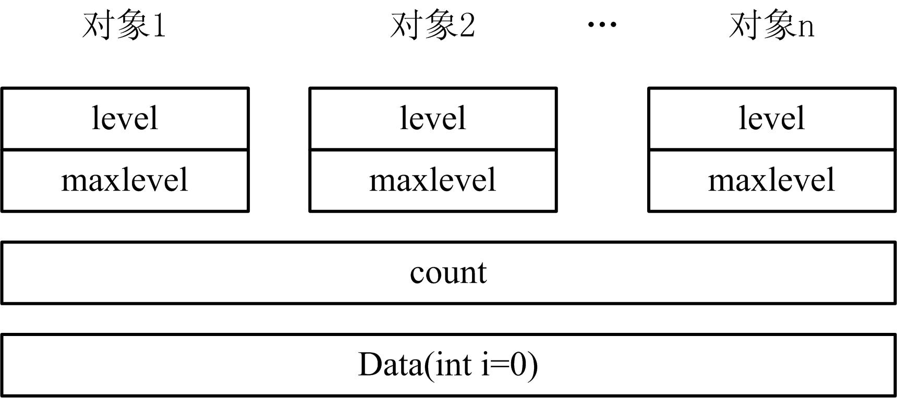

# 静态成员和友元


## 1、静态数据成员
* 可以定义类的静态成员，能够实现同类的多个对象之间数据共享。使用类的静态成员的优点是：  
    > ①静态成员的名字是在类的作用域中，因此可以避免与其他类的成 员或全局对象名字冲突；  
    > ②静态成员可以实施封装，可以是私有成员，而全局对象不可以。  
    > ③静态成员是与特定类关联的，结构清晰。  


### 1. 静态数据成员
* 例：
    ```cpp
    class employee { //雇员类定义 
        private: 
            int empNo; 
            int id; 
            char *name; 
            static int count; //静态数据成员 
            …… 
    };
    ```
* 静态数据成员是类的一种特殊数据成员，它以关键字static开始，声明形式为：  
    ```cpp
    class 类名 { //类体 
        … 
        static 数据成员类型 数据成员名列表; //静态数据成员声明 
        … 
    };
    ```
* 例如：  
    ```cpp
    class Data { //Data类定义 
        public:
            static int count; //静态数据成员 
            int maxlevel; //非静态公有数据成员 
            Data(int i=0){ …… , count++; } //构造函数 
        private: 
            int level; //非静态私有数据成员 
    };
    int Data::count=0; //静态数据成员定义且初始化
    ```
    count设计的目的是计数Data类总共有多少个实例化对象。  


* 图32.1 静态数据成员存储示意   
  

* 关于静态数据成员的说明:  
    1. 通常，非静态数据成员存在于类类型的每个对象中，静态数据成员则独立于该类的任何对象，在所有对象之外单独开辟空间存储。在为对象所分配的空间中不包括静态数据成员所占的空间。  
    2. 如果只声明了类而未定义对象，则类的非静态数据成员是不占存储空间的，只有在定义对象时，才为对象的数据成员分配空间。但是只要在类中定义了静态数据成员，即使不定义任何对象，也为静态数据成员分配空间，它可以在尚未建立对象时就被引用。  
    3. 访问静态成员时同样需要遵守公有及私有访问规则。  
    4. 静态数据成员必须在类外部定义一次（仅有一次），静态成员不能通过类构造函数进行初始化，而是在类外定义时进行初始化。定义静态数据成员的方式为：  
        ```cpp
        数据成员类型 类名::静态数据成员名=初始化式;
        ```
    5. 静态数据成员可用作默认实参，非静态数据成员不能用作默认实参，因为它的值不能独立于所属的对象而使用。例如：  
        ```cpp
        class Data { //Data类定义 
            …
            Data& setbkcolor(int=bkcolor); 
            static const int bkcolor = 5; 
        };
        ```
    6. 有了静态数据成员，各对象之间实现了数据共享，因此可以不使用全局变量。  
        ```cpp
        class test {
            private: 
                int x; 
                int y; 
            public: 
                static int num; 
                static int Getnum() { 
                    x+=5; //错误，静态成员函数不能调用非静态数据成员 
                    num+=15; 
                    return num; 
                }
        };
        int test::num = 10;
        int main(void) { 
            test a; 
            cout<<test::num<<endl; //输出10 
            test::num = 20; 
            cout<<test::num<<endl; //输出20 
            cout<<test::Getnum()<<endl; //输出35 
            cout<<a.Getnum()<<endl; //输出50 
            return 0; 
        }
        ```


## 2、静态成员函数
* 成员函数也可以定义为静态的，在类中声明函数的前面加static就成了静态成员函数，声明的一般形式为：  
    ```cpp
    class 类名 { //类体 
        … 
        static 返回类型 函数名(类型1 参数名1,类型2 参数名2,…); 
        … 
    };
    ```
* 例如：  
    ```cpp
    static int getcount() { return count; } //静态成员函数
    ```
* 和静态数据成员一样，静态成员函数是类的一部分，而不是对象的一部分。如果要在类外调用公有的静态成员函数，可以类作用域运算符（::）和通过对象名调用静态成员函数，例如：  
    ```cpp
    cout<<Data::getcount()<<'\t'<<d.getcount();
    ```
* 静态成员函数与非静态成员函数的根本区别是：非静态成员函数有this指针，而静态成员函数没有this指针。因此，静态成员函数不能访问本类中的非静态成员。**静态成员函数就是专门为了访问静态数据成员的**。

* **静态成员函数不能被声明为const**。

* 【例32.1】静态成员举例  
    ```cpp
    #include <iostream> 
    using namespace std; 
    class CTest { 
        public: 
            CTest() { s_total++; id=s_total; cout<<"构造"<<id<<" ";} 
            ~CTest() { s_total--; cout<<"析构"<<id<<" "; } 
            static int gettotal() { return s_total; } 
        private: 
            static int s_total; 
            int id; 
    };
    int CTest::s_total=0; 
    int main() 
    { 
        CTest a,b,c; 
        CTest *p=new CTest; 
        cout<<"合计="<<CTest::gettotal()<<" "; 
        delete p; 
        cout<<"合计="<<CTest::gettotal()<<" "; 
        return 0; 
    }
    ```

* 【例32.2】静态成员举例  
    ```cpp
    class Test {
        public: 
            void init() { } 
            static void output() { } 
    };
    int main() { 
        Test::init(); 
        Test::output(); 
        return 0; 
    }
    ```
    编译出错,因为不能通过类名来调用类的非静态成员函数init。  

* 【例32.3】静态成员举例  
    ```cpp
    class Test {
        public: 
            void init() { } 
            static void output() { } 
    };
    int main() { 
        Test t;
        t.init();
        t.output();
        return 0;
    }
    ```
    编译通过，类的对象可以使用静态成员函数和非静态成员函数。  


* 【例32.4】静态成员举例  
    ```cpp
    class Test { 
        public: 
            void init() { } 
            static void output() { cout<<x<<endl;} 
        private: 
            int x; 
    };
    int main() { 
        Test t; 
        t.output(); 
        return 0; 
    }
    ```
    * 编译出错，因为静态成员函数中不能引用非静态成员。  
    * 静态成员函数属于整个类，在类实例化对象之前就已经分配空间了，而类的非静态成员必须在类实例化对象后才有内存空间  

* 【例32.5】静态成员举例  
    ```cpp
    class Test {
        public: 
            void init() { output();} 
            static void output() { } 
    };
    int main() { 
        Test t; 
        t.output(); 
        return 0; 
    }
    ```
    编译通过，因为类的非静态成员函数可以调用用静态成员函数，但反之不能。  


* 【例32.6】静态成员举例  
    ```cpp
    class Test {
        public: 
            Test() { m++;} 
            ~Test() { m--;} 
            static void output(){cout<<m<<endl; } 
        private: 
            static int m; 
    };
    int main() { 
        Test t; 
        t.output(); 
        return 0; 
    }
    ```
    * 链接错误，因为类的静态数据成员在使用前必须先初始化。  
    * 如果在main函数前加上int Point :: m = 0;  
    * 再编译链接无错误，运行程序将输出1。

## 3、友元函数
* C++提供**友元（friend）机制，允许一个类将其非公有成员的访问权授予指定的函数或类**。友元的声明只能出现在类定义的内部的任 何地方，由于友元不是授予友元关系（friendship）的那个类的成员，所以它们不受访问控制的影响。通常，将友元声明放在类定义的开始或结尾。  

* 友元可以是普通的函数，或已定义的其他类的成员函数，或整个类。 将一个函数设为友元，称为友元函数（friend function），将一个类设为友元，称为友元类（friend class）。友元类的所有成员函数都可以访问授予友元关系的那个类的非公有成员。  

* 因此，访问类非公有成员可以有两个用户：类成员和友元。  

* 如果在一个类以外的某个地方定义了一个函数，在类定义中用friend对其进行声明，此函数就称为这个类的友元函数。友元函数可以访问这个类中的私有成员。

* 【例32.7】友元函数举例  
    ```cpp
    #include <iostream> 
    #include <cmath> 
    using namespace std; 
    class Point { //Point类 
        public: 
        Point(int _x=0,int _y=0) : x(_x), y(_y) { } 
        private: 
            int x, y;//私有数据成员 
            friend double distance(Point& r1, Point& r2); //友元函数 
    };
    double distance(Point& r1, Point& r2) //计算两个点的距离 
    { 
        double x = r2.x>r1.x ? r2.x-r1.x : r1.x-r2.x; //访问Point 类私有成员 
        double y = r2.y>r1.y ? r2.y-r1.y : r1.y-r2.y; //访问Point 类私有成员 
        return sqrt(x*x+y*y); 
    } 
    int main() 
    { 
        Point a(1,1),b(5,5); //定义两个点 
        cout<<distance(a, b); //输出它们的距离 
        return 0; 
    }
    ```

* 友元函数可以是另一个类的成员函数，称为**友元成员函数**。  
* 【例32.7】友元成员函数举例  
    ```cpp
    class B; //类的前向声明 
    class A { //A类 
        public: 
            A(int _a=0) : a(_a) { } 
            void setb(B& r); 
        private: 
            int a; //私有数据成员 
    }; 
    class B { //B类 
        public: 
            B(int _b=0) : b(_b) { } 
        private: 
            int b; //私有数据成员 
            friend void A::setb(B& r); 
    };
    void A::setb(B& r) 
    { 
        r.b=a; //访问B的私有成员b 
    } 
    int main() 
    { 
        return 0; 
    }
    ```

## 4、友元类
* 不仅可以将一个函数声明为友元，还可以将一个类（如B）声明为另一个类（如A）的友元，这时类B就是类A的友元类。友元类B中的所有成员函数都是A类的友元函数，可以访问A类中的所有成员。  
    ```cpp
    class 类名 { //类体 
        …
        friend 友类名; 
    };
    class 友类名 { //类体 
        … 
    };
    ```
* 关于友元类的说明：  
    1. 友元的关系是单向的而不是双向的。如果声明了类B是类A的友元类，不等于类A是类B的友元类，类A中的成员函数不能访问类B中的私有数据。  
    2. 友元的关系不能传递或继承，如果类B是类A的友元类，类C是类B的友元类，不等于类C是类A的友元类。如果想让类C是类A的友元类，必须显式地在类A中另外声明。  
    3. 面向对象程序设计的一个基本原则是封装性和信息隐蔽，而友元却可以访问其他类中的私有成员，**突破了封装原则**。友元的使用有助于数据共享，能提高程序的效率，但也不要滥用，要在数据共享与信息隐蔽之间选择一个恰当的平衡点。


