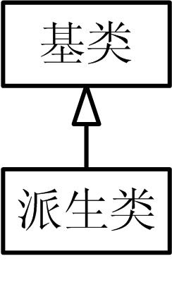
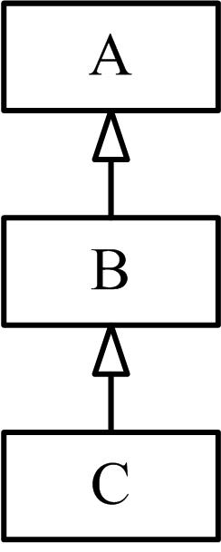
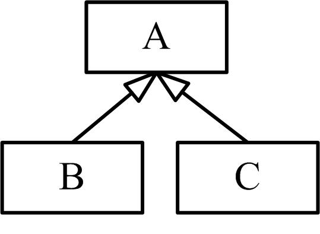
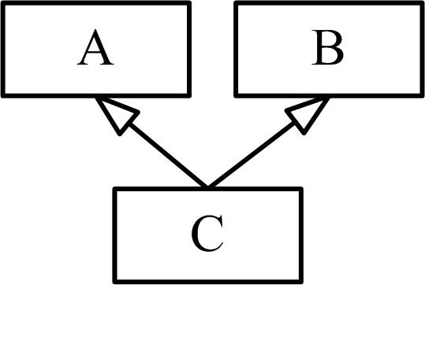
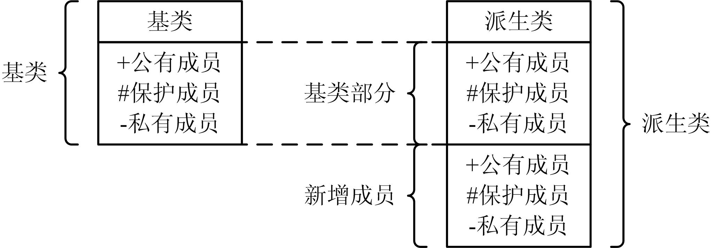

# 类的继承与派生


## 1、基类与派生类
* **继承**（inheritance）是面向对象程序设计的一个重要特性，是软件复用（software reusability）的一种重要形式。

* **继承允许在原有类的基础上创建新的类**，新类可以从一个或多个原有类中继承数据成员和成员函数，并且可以重新定义或增加新的成员，从而形成类的层次。继承具有传递性，不仅支持系统的可重用 性，而且还促进系统的可扩充性。

* 类的对象是各自封闭的，**如果没继承性机制，则类对象中数据、函数就会出现大量重复**。

* 继承改变了传统程序设计中对不再使用的数据类型和函数进行改写甚至重写的方法，克服了程序无法重复使用的缺点。

* 通过继承，可以吸收现有类的数据和函数来创建新类，并增添新的成员增强此类，这样可以节约程序开发的时间。

* 在C++中，**继承就是在一个已存在的类的基础上建立一个新的类**。 已存在的类称为**基类**（base class），又称为**父类**；新建立的类称为**派生类**（derived class），又称为**子类**。  

* **一个新类从已有的类那里获得其特性，这种现象称为类的继承**。
* 
* 另一方面，从已有的父类产生一个新的子类，称为类的派生。派生类继承了基类的所有数据成员和成员函数，具有基类的特性，派生类还可以对成员作必要的增加或调整，定义自己的新特性。  

* 一个基类可以派生出多个派生类，每一个派生类又可以作为基类再派生出新的派生类，因此基类和派生类是相对而言的。

* 派生分为为单级派生和多级派生。  
    单级派生  
      
    多级派生  
      
    


* 一个派生类可以只从一个基类派生，称为单一继承（single inheritance），这是最常见的继承形式，如图所示，类B和类C都只从类A派生。  
      


* 一个派生类有两个及两个以上的基类，称为多重继承（multiple inheritance），如图所示，类C从类A和类B派生。  
      


* 表33-1 基类和派生类的现实示例

    | 基类 | 派生类 |  
    | -- | -- |  
    | 大学生 | 本科生、研究生 |  
    | 形状 | 圆、三角形、矩形、球体、立方体 |  
    | 职员 | 教职员工、后勤人员 |  
    | 交通工具 | 汽车、轮船、飞机、自行车 |  
    | 控件 | 按钮、组合框、编辑框、列表框、状态条、工具条、卷滚条、选项卡、 树形控件 |  

* 很多情况下，一个类的对象也是另一个类的对象。例如，矩形是四边形，正方形、平行四边形和梯形也是四边形。因而在C++中，矩形类可以由四边形类继承而来。

* 基类与派生类之间的关系为：  
    1. **基类是对派生类的抽象，派生类是对基类的具体化**。基类抽取了它与派生类的公共特征，而派生类通过增加信息将抽象的基类变为某种具体的类型。  
    2. 派生类是基类的组合，可以把多重继承看作是多个单一继承的简单组合。

## 2、派生类的定义
* 定义派生类的一般形式为：  
    ```cpp
    class 派生类名 : 类派生列表 { //类体 
        成员列表 
    };
    ```
* 除了增加类派生列表外，派生类的定义与类定义并无区别。  

* **类派生列表**（class derivation list）指定了一个或多个基类（base class），具有如下形式：
    ```cpp
    访问标号 基类名
    ```

* 类派生列表可以指定多个基类，中间用逗号（，）间隔，基类名必须是已定义的类的名字。

* 访问标号表示继承方式，可以是public（公有继承）、protected（保护继承）或private（私有继承），**继承方式决定了对继承成员的访问权限**。如果未给出访问标号则默认为private（私有继承）。

* 派生类的成员列表描述的是派生类自己新增加的数据成员和成员函数。

* 【例33.1】派生类举例  
    ```cpp
    #include <iostream> 
    using namespace std; 
    class Base //基类 
    { 
        private: 
            int b_number; 
        public: 
            Base( ){} //基类不带参数的构造函数 
            Base(int i) : b_number (i) { } //基类带参数的构造函数 
            int get_number( ) {return b_number;} 
            void print( ) {cout << b_number << endl;} 
    }; 
    class Derived : public Base //派生类 
    { 
        private: 
            int d_number; //派生类增加的数据成员
        public: 
            Derived(int i,int j):Base(i),d_number(j){};//派生类构造函数 
            void print( )//派生类增加的成员函数 
            { 
                cout << get_number() << " "; //派生类继承的成员函数 
                cout << d_number << endl; 
            } 
    }; 
    int main( ) 
    { 
        Base a(2); Derived b(3, 4); 
        cout << "a is "; a.print( ); //基类的print 
        cout << "b is "; b.print( ); //派生类的print 
        cout << "base part of b is "; 
        b.Base::print( ); //基类的print 
        return 0; 
    }

    ```


## 3、派生类的构成

* 派生类的说明：  
    1. 用作基类的类必须是已定义的，其原因是显而易见的：每个派生类包含并且可以访问其基类的成员，为了使用这些成员，派生类必须知道它们是什么。这一规则说明**不可能从类自身派生出一个类**。
    2. 如果需要声明（但并不实现）一个派生类，则只需要声明类名即可。例如：  
        ```cpp
        class Derived : public Base; //错误，前向声明会导致编译错误 
        
        class Base; 
        class Derived; //正确
        ```
    3. 显然，在一个派生类中，其成员由两部分构成：一部分是从基类继承得到的，另一部分是自己定义的新成员，所有这些成员仍然分为public（公有）、private（私有）和protected（保护）三种访问属性。  
    4. **友元关系不能继承**。一方面，基类的友元对派生类的成员没有特殊访问权限。另一方面，如果基类被授予友元关系，则只有基类具有特殊访问权限，该基类的派生类不能访问授予友元关系的类。  
    5. 如果基类定义了静态成员，则整个继承层次中只有一个这样的成员。无论从基类派生出多少个派生类，每个静态成员只有一个实例。  
    6. 静态成员遵循常规访问控制：如果静态成员在基类中为私有的，则派生类不能访问它。如果该静态成员在基类是公有的，则基类可以访问它，派生类也可以访问它。  
    7. 一般地，可以使用作用域运算符（::）也可以使用对象成员引用运算符（．）或指针成员引用运算符（->）访问静态成员。   

    图33.1 派生类的构成  
      

* 实际编程中，设计一个派生类包括4个方面的工作：  
    1. 从基类接收成员。  
        * 除了构造函数和析构函数，派生类会把基类全部的成员继承过来。这种继承是没有选择的，不能选择接收其中一部分成员，而舍弃另 一部分成员。
    2. 调整基类成员的访问。  
        * 派生类接收基类成员是程序员不能选择的，但是程序员可以对这些成员作出访问策略。  
    3. 修改基类成员  
        * 可以在派生类中声明一个与基类成员同名的成员，则派生类中的新成员会覆盖基类的同名成员，就实现了修改基类成员功能的效果。
    4. 在定义派生类时增加新的成员。  
    5. 一般还应当自己定义派生类的构造函数和析构函数。

## 4、派生类举例
* 【例33.2】派生类举例   
    ```cpp
    #include <iostream> 
    using namespace std; 
    class Base //基类 
    { 
        private: 
            int b_number; 
        public: 
            Base( ){} //基类不带参数的构造函数 
            Base(int i) : b_number (i) { } //基类带参数的构造函数 
            int get_number( ) {return b_number;} 
            void print( ) {cout << b_number << endl;} 
    };
    class Derived : public Base //派生类 
    { 
        private: 
            int d_number; //派生类增加的数据成员 
        public: 
            Derived(int i,int j):Base(i),d_number(j){}; //派生类构造函数 
            void print()//派生类增加的成员函数 
            { 
                cout << get_number() << " "; //派生类继承的成员函数 
                cout << d_number << endl; 
            } 
    };
    int main( ) 
    { 
        Base a(2); 
        Derived b(3, 4); 
        cout << "a is "; 
        a.print( ); //基类的print 
        cout << "b is "; 
        b.print( );
    }

    ```


