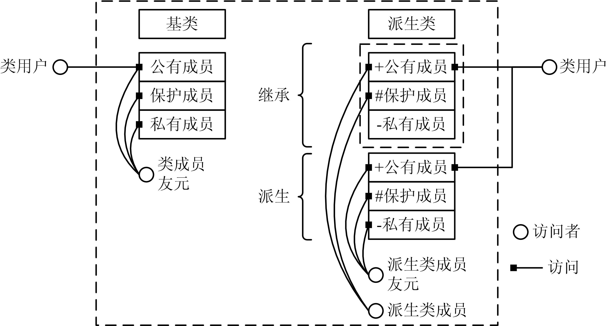

# 派生类成员的访问

## 1、类的保护成员

* 对派生类来说，成员分为两大类：  
    1. 一类是从基类继承过来的成员；  
    2. 一类是自己新生成的成员。  

* 如果没有继承，一个类只有两种类型的访问者：类成员和类用户。 将类划分为private和public访问级别反映对访问者的访问权限：类用户只能访问公有成员，类成员和友元既可以访问公有成员也可以访问私有成员。

* 有了继承，就有了类的**第三种访问者：派生类成员**。

* 派生类通常需要访问（一般为私有的）基类成员，为了允许这种访问而仍然禁止外部对基类的一般访问，可以使用protected访问标号。**类的protected部分仍然不能被类用户访问，但可以被派生类访问**。

* 只有基类类成员及其友元可以访问基类的private部分，派生类不能访问基类的私有成员。

* 类的保护成员用protected访问标号声明，可以认为protected访问标号是private和public的混合：  
    > ①像私有成员一样，保护成员不能被类用户访问。  
    > ②像公有成员一样，保护成员可以被该类的派生类访问。


* 如果基类声明了私有成员，那么任何派生类都是不能访问它们的，若希望在派生类中能访问它们，应当把它们声明为保护成员。

* 所以如果在一个类中声明了保护成员，就意味着该类可能要用作基类，在它的派生类中会访问这些成员。

* 图34.1 类的访问者示意 
    

## 2、派生类成员的访问权限
* 派生类中包含继承来的成员和自己新增的成员，因而产生了这两部分成员的关系和访问属性的问题。  
* 对基类成员和派生类自身的成员是按不同的原则处理的，需要考虑以下6种情形：  
    1. 基类的成员和友元访问基类成员；  
    2. 派生类的成员和友元访问派生类自己新增的成员；  
    > 对于第1种和第2种的情形，可以按以下规则处理，即：基类的类成员和友元可以访问基类成员，派生类的类成员和友元可以访问派生新增的类成员。私有成员只能被同一类中的类成员访问，公有成员可以被类用户访问。
    3. 基类的成员访问派生类新增的成员；  
    > 第3种的情形，基类的成员不能直接访问派生类的成员（因为有基 类的时候尚未有派生类），但可以通过虚函数间接访问派生类的成员。
    4. 类用户访问派生类的成员；  
    > 第4种的情形，比较明确，类用户可以访问派生类的公有成员，不能访问派生类任何私有的或保护的成员。  
    5. 派生类新增的成员访问基类的类成员；  
    6. 类用户访问派生类的基类成员。  
    > 第5种和第6种的情形比较复杂，其访问形式实际是两种形式：  
    ①内部访问：由派生类中新增成员对基类继承来的成员的访问。  
    ②对象 访问：在派生类外部，通过派生类的对象对从基类继承来的成员的访问。  


* 不同的继承方式决定了基类成员在派生类中的访问属性。  
    1. 公有继承（public inheritance）  
    > 基类的公有成员和保护成员在派生类中保持原有访问属性，私有成员仍为基类私有。
    2. 私有继承（private inheritance）  
    > 基类的所有成员在派生类中为私有成员。
    3. 保护继承（protected inheritance）  
    > 基类的公有成员和保护成员在派生类中成了保护成员，私有成员仍 为基类私有。


* 表34-1 不同继承方式下的基类特性和访问属性

| 继承方式 | 基类访问属性 | 在派生类的访问属性 | 派生类成员 | 派生类用户 | 派生类的公有派生类 |  
| -- | -- | -- | -- | -- | -- |  
| public | public | public | 可以访问 | 可以访问 | 可以访问 |  
|  | protected | protected | 可以访问 | 不可以 | 可以访问 |  
|  | private | inaccessible | 不可以 | 不可以 | 不可以 |  
| private | public | private | 可以访问 | 不可以 | 不可以 |  
|  | protected | private | 可以访问 | 不可以 | 不可以 |  
|  | private | inaccessible | 不可以 | 不可以 | 不可以 |  
| protected | public | protected | 可以访问 | 不可以 | 可以访问 |  
|  | protected | protected | 可以访问 | 不可以 | 可以访问 |  
|  | private | inaccessible | 不可以 | 不可以 | 不可以 |  


* 无论采用何种继承方式得到的派生类，派生类成员及其友元都不能访问基类的私有成员，派生类外部的用户只能访问公有属性的成员。

* 多级派生的情况下，保护继承和私有继承会进一步地将基类的访问权限隐蔽成不可访问的。

* 一般地，保护继承与私有继承在实际编程中是极少使用的，它们只在技术理论上有意义。  

* 【例34.1】访问权限举例  
    ```cpp
    class A { 
        int k; 
        public: 
            int i; 
        protected: 
            void f2(); 
            int j; 
    }; 
    class B:public A { //public继承 
        int m; 
        public: 
            void f3(); 
        protected: 
            void f4(); 
    };
    class C: protected B { //protected继承 
        int n; 
        public: 
            void f5(); 
    }; 
    int main() 
    { 
        return 0; 
    }
    ```

    |  | i | f2 | j | k | f3 | f4 | m | f5 | n |  
    | -- | -- | -- | -- | -- | -- | -- | -- | -- | -- |  
    | 基类A | 公有 | 保护 | 保护 | 私有 |  |  |  |  |  |  
    | 派生类B | 公有 | 保护 | 保护 | 不可访问 | 公有 | 保护 | 私有 |  |  |  
    | 派生类C | 保护 | 保护 | 保护 | 不可访问 | 保护 | 保护 | 不可访问 | 公有 | 私有 |  


## 3、赋值兼容规则

* 赋值兼容规则是指**在需要基类对象的任何地方，都可以使用公有派生类的对象来替代**。

* 通过公有继承，派生类得到了基类中除构造函数、析构函数之外的所有成员。这样，公有派生类实际就具备了基类的所有功能，**凡是基类能解决的问题，公有派生类都可以解决**。

* 赋值兼容规则中所指的替代包括以下的情况：
    > ①派生类的对象可以赋值给基类对象； 
    > ②派生类的对象可以初始化基类的引用；  
    > ③派生类对象的地址可以赋给指向基类的指针。  

* 例： 
    ```cpp
    class Base { }; //基类 
    class Derive : public Base { }; //公有派生类 
    Base b,*pb; //定义基类对象、指针 
    Derive d; //定义派生类对象
    ```
    这时，支持下面三种操作：  
    ```cpp
    b=d; //派生类对象赋值给基类，复制基类继承部分 
    Base &rb=d; //基类引用到派生类对象 
    pb=&d; //基类指针指向派生类对象
    ```
* **赋值兼容规则是C++多态性的重要基础之一**。


## 4、赋值兼容规则举例

* 【例34.2】赋值兼容规则举例1  
    ```cpp
    #include <iostream> 
    using namespace std; 
    class man //基类man 
    { 
        protected: 
            int age; 
            string name; 
        public: 
            man(int a,string n):age(a),name(n){ } //基类的构造函数 
            void print() {cout<<"姓名："<<name<<"，年龄："<<age<< endl;} 
            int get_age(){return age;} 
            string get_name(){return name;} 
    };
    class superman:public man //派生类superman 
    { 
        private: 
            int force_value; //派生类增加的数据成员 
        public: 
            superman(int a,string n,int f) :man(a,n),force_value(f){ };//派生类的构造函数 
            void print( ) { 
                cout<<"姓名："<<name<<"，年龄："<<age<<"武力值： "<<force_value<<endl; 
            } 
            void fly(){cout<<"fly,fly,fly……"<<endl;} //派生类增加的成员函数 
    };
    int work(man a) //形参为基类对象 
    { 
        if(a.get_age()>=20) return 1; 
        else return 0; 
    } 
    int main( ) 
    { 
        int n; 
        man i(25,"jerry"); 
        superman j(20,"clark",100); 
        n=work(j);//实参为派生类对象 
        if(n!=0) cout<<j.get_name()<<"可以胜任此项工作。"<<endl; 
        else cout<<j.get_name()<<"不可以胜任此项工作。"<<endl; 
        return 0; 
    }
    ```


* 【例34.2】赋值兼容规则举例2  
    ```cpp
    int work(man *a) //形参为基类指针 
    { 
        if(a->get_age()>=20) return 1; 
        else return 0; 
    } 
    int main( ) 
    { 
        int n; 
        man i(25,"jerry"); 
        superman j(20,"clark",100); 
        n=work(&j); //实参为派生类对象的地址 
        if(n!=0) cout<<j.get_name()<<"可以胜任此项工作。"<<endl; 
        else cout<<j.get_name()<<"不可以胜任此项工作。"<<endl; 
        return 0; 
    }
    ```

* 【例34.2】赋值兼容规则举例3  
    ```cpp
    int work(man &a) //形参为基类引用 
    { 
        if(a.get_age()>=20) return 1; 
        else return 0; 
    } 
    int main( ) 
    { 
        int n; 
        man i(25,"jerry"); 
        superman j(20,"clark",100); 
        n=work(j); //实参为派生类对象 
        if(n!=0) cout<<j.get_name()<<"可以胜任此项工作。"<<endl; 
        else cout<<j.get_name()<<"不可以胜任此项工作。"<<endl; 
        return 0; 
    }
    ``