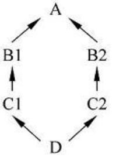

# 多重继承


## 1、多重继承派生类
* 除去一个类从一个基类派生，C++还支持**一个派生类同时继承多个基类**。

### 1．多重继承派生类的定义
* 如果已经定义了多个基类，那么定义多重继承的派生类的形式为：  
    ```cpp
    class 派生类名:访问标号1 基类名1,访问标号2 基类名2,... { //类体 
        成员列表 
    };
    ```
    ```cpp
    class A { }; 
    class B : public A { }; //A→B 
    class C : public A { }; //A→C 
    class D : public B,public C { }; //B→D,C→D
    ```

### 2．多重继承派生类的构造函数
* 多重继承派生类的构造函数形式与单一继承时的构造函数形式基本相同，只是在**派生类的构造函数初始化列表中调用多个基类构造函数**。一般形式为：
    ```cpp
    派生类名(形式参数列表) : 基类名1(基类1构造函数实参列表), 
                           基类名2(基类2构造函数实参列表), 
                           …, 
                           子对象名1(子对象1属类构造函数实参列表), 
                           …, 
                           派生类初始化列表 
    { 
        派生类初始化函数体 
    }
    ```
* 其调用顺序是：  
    > ①调用基类构造函数，各个基类按定义时的次序先后调用；   
    > ②调用子对象构造函数，各个子对象按声明时的次序先后调用；  
    > ③执行派生类初始化列表；  
    > ④执行派生类初始化函数体；  


* 【例36.1】多重继承举例  
    ```cpp
    #include <iostream> 
    using namespace std; 
    class Base1 
    { 
        private: 
            int b1; 
        public: 
            Base1(){b1=0;cout<<"默认构造Base1: "<<"b1="<<b1<<endl;} 
            Base1(int i){b1=i;cout<<"构造Base1: "<<"b1="<<b1<<endl;} 
    }; 
    class Base2 
    { 
        private: 
            int b2; 
        public: 
            Base2(){b2=0;cout<<"默认构造Base2: "<<"b2="<<b2<<endl;}
            Base2(int j){b2=j;cout<<"构造Base2: "<<"b2="<<b2<<endl;} 
    }; 
    class Base3 
    { 
        public: 
            Base3(){cout<<"默认构造Base3: "<<endl;} 
    }; 
    class Derive : public Base1, public Base2, public Base3 
    { 
        private: 
            Base1 memberBase1; 
            Base2 memberBase2; 
            Base3 memberBase3; 
        public: 
            Derive(){cout<<"默认构造Derive."<<endl;} 
            Derive(int a,int b,int c,int d): Base1(a),Base2(b),memberBase1(c),memberBase2(d)
            {cout<<"构造Derive."<<endl;} 
    }; 
    int main() 
    { 
        cout<<"\n创建派生类对象obj1："<<endl; 
        Derive obj1; 
        cout<<"\n创建派生类对象obj2(1,2,3,4)："<<endl; 
        Derive obj2(1,2,3,4); 
        return 0; 
    }

    ```
    运行结果：  
    ```cpp
    创建派生类对象obj1： 
    默认构造Base1: b1=0 
    默认构造Base2: b2=0 
    默认构造Base3: 
    默认构造Base1: b1=0 
    默认构造Base2: b2=0 
    默认构造Base3: 
    默认构造Derive. 
    
    创建派生类对象obj2(1,2,3,4)： 
    构造Base1: b1=1 
    构造Base2: b2=2 
    默认构造Base3: 
    构造Base1: b1=3 
    构造Base2: b2=4 
    默认构造Base3: 
    构造Derive.
    ```

## 2、二义性问题及名字支配规则

### 1．二义性问题
* 多重继承时，**多个基类可能出现同名的成员**。在派生类中如果使用一个表达式的含义能解释为可以访问多个基类的成员，则这种对基类成员的访问就是不确定的，称这种访问具有二义性。**C++要求派生类对基类成员的访问必须是无二义性的**。

* 例如：  
    ```cpp
    class A {
        public: 
            void fun() { cout<<"a.fun"<<endl; } 
    };
    class B {
        public: 
            void fun() { cout<<"b.fun"<<endl; } 
            void gun() { cout<<"b.gun"<<endl; } 
    };
    class C:public A,public B {
        public: 
            void gun() { cout<<"c.gun"<<endl; } //重写gun() 
            void hun() { fun(); } //出现二义性 
    };
    int main() { 
        C c,*p=&c; 
        return 0; 
    }
    ```
* 使用成员名限定可以消除二义性，例如：  
    ```cpp
    c.A::fun(); //成员名限定消除二义性 
    c.B::fun(); //成员名限定消除二义性 
    p->A::fun(); //成员名限定消除二义性 
    p->B::fun(); //成员名限定消除二义性
    ```
    基本形式为：  
    ```cpp
    对象名.基类名::成员名 
    对象指针名->基类名::成员名
    ```

### 2．名字支配规则
* C++对于在不同的作用域声明的名字，可见性原则是：如果存在两个或多个具有包含关系的作用域，外层声明了一个名字，而内层没有再次声明相同的名字，那么外层名字在内层可见；如果在内层声明了相同的名字，则外层名字在内层不可见，这时称内层名字隐藏（或覆盖）了外层名字，这种现象称为**隐藏规则**。

* 在类的派生层次结构中，**基类的成员和派生类新增的成员都具有类作用域，二者的作用域是不同的：基类在外层，派生类在内层**。

* 如果派生类声明了一个和基类成员同名的新成员，**派生的新成员就覆盖了基类同名成员**，直接使用成员名只能访问到派生类的成员。

* 如果派生类中声明了与基类成员函数同名的新函数，即使函数的参数不同，从基类继承的同名函数的所有重载形式也都会被覆盖。

* 如果要访问被覆盖的成员，就需要使用基类名和作用域限定运算符来限定。

* 派生类D中的名字N覆盖基类B中同名的名字N，称为**名字支配规则**。如果一个名字支配另一个名字，则二者之间不存在二义性，当选择该名字时，使用支配者的名字，如：
    ```cpp
    c.gun();//使用C::gun
    ```
* 如果要使用被支配者的名字，则应使用成员名限定，例如：  
    ```cpp
    c.B::gun(); //使用B::gun
    ```


##　3、虚基类
* C++提供虚基类（virtual base class）的机制，使得在继承间接共同基类时只保留一份成员。
      
    A为虚基类  


### 1. 虚基类的定义
* 虚基类是在派生类定义时，指定继承方式时声明的。声明虚基类的一般形式为：
    ```cpp
    class 派生类名: virtual 访问标号 虚基类名,... { //类体 
        成员列表 
    };
    ```
* 需要注意，为了保证虚基类在派生类中只继承一次，应当在该基类的所有直接派生类中声明为虚基类。否则仍然会出现对基类的多次继承。


* 【例36.2】虚基类举例  
    ```cpp
    #include <iostream> 
    using namespace std; 
    class A// 声明为基类A 
    { 
        public://外部接口 
            A(int n){ nv=n; cout<<"Member of A"<<endl; }//A类的构造函数 
            void fun(){ cout << "fun of A" << endl; } 
        private: 
            int nv;//私有成员 
    }; 
    class B1 :virtual public A //声明A为虚基类 
    { 
        public: 
            B1(int a):A(a){ cout<<"Member of B1"<<endl; }//B1类的构造函数
        private: 
            int nv1; 
    }; 
    class B2 :virtual public A//声明A为虚基类 
    { 
        public: 
            B2(int a) :A(a){ cout << "Member of B2" << endl; }//B2类的构造函数 
        private: 
            int nv2; 
    }; 
    class C :public B1, public B2 
    { 
        public: 
            // 派生类的构造函数的成员初始化列表中必须列出对虚基类构造函数的调用 
            C(int a):A(a),B1(a),B2(a){cout << "Member of C" << endl;}
            void fund(){ cout << "fun of C" << endl; } 
        private: 
            int nvd; 
    }; 
    int main() 
    { 
        C c1(1); 
        c1.fund(); 
        c1.fun(); //不会产生二义性 
        return 0; 
    }
    ```
    运行结果：   
    ```cpp
    Member of A 
    Member of B1 
    Member of B2 
    Member of C 
    fun of C 
    fun of A
    ```


### 2.虚基类的初始化
* 如果在虚基类中定义了带参数的构造函数，而且没有定义默认构造函数，则在其所有派生类(包括直接派生和间接派生)中，都要通过构造函数的初始化表对虚基类进行初始化。例如 :
    ```cpp
    class A { public: A(int) {} }; //定义基类 
    class B : virtual public A { public: B(int a):A(a) {} }; //对基类A初始化 
    class C : virtual public A { public: C(int a):A(a) {} }; //对基类A初始化 
    class D : public B,public C { public: D(int a):A(a),B(a),C(a) {} };
    ```
* 在最后的派生类中不仅要负责对其直接基类进行初始化，还要负责对虚基类初始化。

* 关于虚基类的说明：  
    1. 一个类可以在一个类族中既被用作虚基类，也被用作非虚基类。  
    2. 派生类的构造函数的成员初始化列表中必须列出对虚基类构造函数的调用；如果未列出，则表示使用该虚基类的默认构造函数。  
    3. 在一个成员初始化列表中同时出现对虚基类和非虚基类构造函数的调用时，**虚基类的构造函数先于非虚基类的构造函数执行**。  

## 4、多重继承应用举例

* 【例36.3】  
    ```cpp
    #include <iostream> 
    using namespace std; 
    enum Color {Red,Yellow,Green,White}; //颜色枚举类型 
    class Circle { //圆类Circle的定义 
        float radius; 
        public: 
            Circle(float r) { 
                radius=r; 
                cout<<"Circle initialized!"<<endl; 
            } 
            ~Circle() { 
                cout<<"Circle destroyed!"<<endl; 
            } 
            float Area() { 
                return 3.1415926*radius*radius; 
            } 
    }; 
    class Table { //桌子类Table的定义 
        float height; 
        public: 
            Table(float h) { 
                height=h; 
                cout<<"Table initialized!"<<endl; 
            } 
            ~Table() { cout<<"Table destroyed!"<<endl; } 
            float Height() { return height; } 
    }; 
    class RoundTable:public Table,public Circle {//圆桌类的定义 
        Color color; 
        public: 
            RoundTable(float h,float r,Color c); 
            int GetColor() { return color; } 
            ~RoundTable() { cout<<"RoundTable destroyed!"<<endl; } 
    };

    RoundTable::RoundTable(float h,float r,Color c): Table(h),Circle(r)//圆桌构造函数的定义 
    { 
        color=c; 
        cout<<"RoundTable initialized!"<<endl; 
    } 
    int main() 
    { 
        RoundTable cir_table(15.0,2.0,Yellow); 
        cout<<"The table properties are:"<<endl; 
        cout<<"Height="<<cir_table.Height()<<endl;//调用Table类的成员 函数
        cout<<"Area="<<cir_table.Area()<<endl; //调用circle类的成员函数 
        cout<<"Color="<<cir_table.GetColor()<<endl; //调用RoundTable 类的成员函数 
        return 0; 
    }
    ```
    运行结果：  
    ```cpp
    Table initialized! 
    Circle initialized! 
    RoundTable initialized! 
    The table properties are: 
    Height=15 
    Area=12.5664 
    Color=1 
    RoundTable destroyed! 
    Circle destroyed! 
    Table destroyed!
    ```