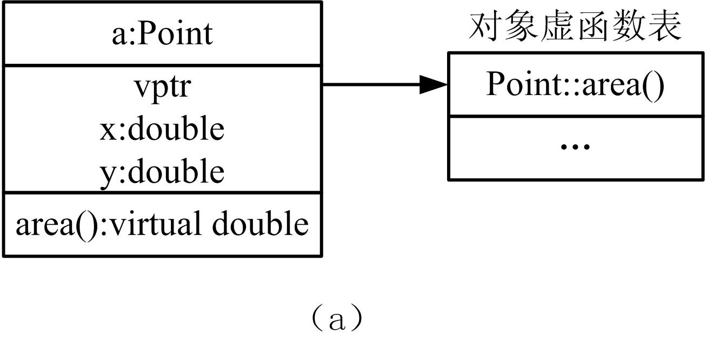
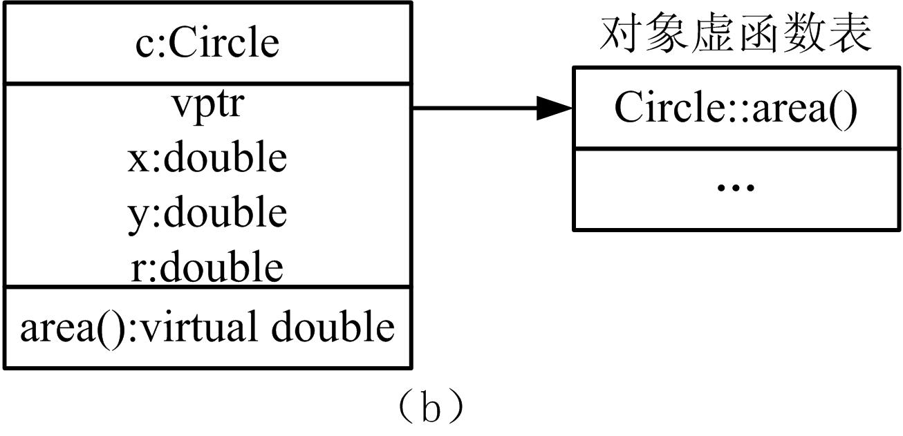

# 多态性


## 1、多态性的概念
* 派生一个类的原因并非总是为了继承或添加新成员，有时是为了重新定义基类的成员，使基类成员“获得新生”。  
* 面向对象程序设计的真正力量不仅仅是继承，而是允许派生类对象像基类对象一样处理，其**核心机制就是多态和动态联编**。

* **多态**是指**同样的消息被不同类型的对象接收时导致不同的行为**。所谓消息是指对类成员函数的调用，不同的行为是指不同的实现，也就是调用了不同的函数。

* 从广义上说，多态性是指一段程序能够处理多种类型对象的能力。  
* 在C++中，这种多态性可以通过重载多态（函数和运算符重载）、强制多态（类型强制转换）、类型参数化多态（模板）、包含多态（继承及虚函数）四种形式来实现。

1. 重载多态  
    * 重载是多态性的最简单形式，分为**函数重载**和**运算符重载**。  
    * 重定义已有的函数称为函数重载。在C++中既允许重载一般函数，也允许重载类的成员函数。如对构造函数进行重载定义，可使程序有几种不同的途径对类对象进行初始化。  
    * C++允许为类重定义已有运算符的语义，使系统预定义的运算符可操作于类对象。如流插入（<<）运算符和流提取（>>）运算符（原先语义是位移运算）。
2. 强制多态  
    * 强制多态也称类型转换。  
    * 如C++定义了基本数据类型之间的转换规则，即：  
        `char→short→int→unsigned→long→unsigned long→float→double→long double`
    * 同时，可以在表达式中使用3种强制类型转换表达式：
        > ①static_cast<T>(E)；  
        > ②T(E)；  
        > ③(T)E，
        > 其中E代表运算表达式，T代表一个类型表达式。
        * 上述任意一种都可改变编译器所使用的规则， 以便按自己的意愿进行所需的类型强制。
        * 但是强制多态使类型检查复杂化，尤其在允许重载的情况下，导致 无法消解的二义性。
3. 类型参数化多态  
    * 参数化多态即：将类型作为函数或类的参数，避免了为各种不同的数据类型编写不同的函数或类，减轻了设计者负担，提高了程序设计的灵活性。  
    * 模板是C++实现参数化多态性的工具，分为函数模板和类模板。类模板中的成员函数均为函数模板，因此函数模板是为类模板服务的。
4. 包含多态  
    * C++中**采用虚函数实现包含多态**。虚函数为C++提供了更为灵活的多态机制，这种多态性在程序运行时才能确定，因此**虚函数是多态性的精华**，至少含有一个虚函数的类称为多态类。包含多态在面向对象程序设计中使用十分频繁。

* 派生类继承基类的所有操作，或者说，基类的操作能被用于操作派生类的对象。当基类的操作不能适应派生类时，派生类就需要重载基类的操作。


## 2、静态联编
* 联编（binding）又称绑定，就是**将模块或者函数合并在一起生成可执行代码的处理过程**，同时对每个模块或者函数分配内存地址，并且对外部访问也分配正确的内存地址。

* 在编译阶段就将函数实现和函数调用绑定起来称为**静态联编**（static binding）。静态联编在编译阶段就必须了解所有的函数或 模块执行所需要的信息，**它对函数的选择是基于指向对象的指针（或者引用）的类型**。C语言中，所有的联编都是静态联编，C++中一般情况下联编也是静态联编。

* 【例37.1】静态联编举例。  
    ```cpp
    #include <iostream> 
    using namespace std; 
    class Point { //Point类表示平面上的点 
        double x,y; //坐标值 
        public: 
            Point(double x1=0,double y1=0) : x(x1),y(y1) { }//构造函数 
            double area() { return 0; } //计算面积 
    }; 
    class Circle:public Point { //Circle类表示圆 
        double r; //半径 
        public: 
            Circle(double x,double y,double r1) : Point(x,y),r(r1) { } 
            double area() { return 3.14*r*r; } //计算面积 
    };
    int main() 
    { 
        Point a(2.5,2.5); Circle c(2.5,2.5,1); 
        cout<<"Point area="<<a.area()<<endl; //基类对象 
        cout<<"Circle area="<<c.area()<<endl; //派生类对象 
        Point *pc=&c , &rc=c; //基类指针、引用指向或引用派生类对象 
        cout<<"Circle area="<<pc->area()<<endl; //静态联编基类调用 
        cout<<"Circle area="<<rc.area()<<endl; //静态联编基类调用 
        return 0; 
    }
    ```
    运行结果：   
    ```cpp
    Point area=0 
    Circle area=3.14 
    Circle area=0 
    Circle area=0
    ```


## 3、动态联编
* 在程序运行的时候才进行函数实现和函数调用的绑定称为**动态联编**（dynamic binding）。

* 如果在编译“Point *pc=&c”时，只根据兼容性规则检查它的合理性，即检查它是否符合派生类对象的地址可以赋给基类的指针的条件。至于“pc->area()”调用哪个函数，等到程序运行到这里再决定。

* 如果希望“pc->area()”调用Circle::area() ，也就是使类Point的指针pc指向派生类函数area的地址，则需要将Point类的area函数设置成虚函数。

* 虚函数的定义形式为：  
    ```cpp
    virtual double area() { return 0; } //计算面积
    ```

* 【例37.2】动态联编举例。  
    ```cpp
    #include <iostream> 
    using namespace std; 
    class Point { //Point类表示平面上的点 
        double x,y; //坐标值 
        public: 
            Point(double x1=0,double y1=0) : x(x1),y(y1) { }//构造函数 
            virtual double area() { return 0; } //虚函数 
    }; 
    class Circle:public Point { //Circle类表示圆 
        double r; //半径 
        public: 
            Circle(double x,double y,double r1):Point(x,y),r(r1) { } //构造函数 
            double area() { return 3.14*r*r; } //虚函数 
    };
    int main() 
    { 
        Point a(2.5,2.5); Circle c(2.5,2.5,1); 
        cout<<"Point area="<<a.area()<<endl; //基类对象 
        cout<<"Circle area="<<c.area()<<endl; //派生类对象 
        Point *pc=&a; //基类指针指向基类对象 
        cout<<"Circle area="<<pc->area()<<endl; 
        pc=&c; //基类指针指向派生类对象 
        cout<<"Circle area="<<pc->area()<<endl; //动态联编 
        return 0; 
    }
    ```
    运行结果：   
    ```cpp
    Point area=0 
    ircle area=3.14 
    Circle area=0 
    Circle area=3.14
    ```
* 当编译器编译含有虚函数的类时，将为它建立一个虚函数表 VTABLE（virtual table），它相当于一个指针数组，存放每个虚函数的入口地址。编译器为该类增加一个额外的数据成员，这个数据成员是一个指向虚函数表的指针，通常称为vptr。

* Point类只有一个虚函数area，所以虚函数表里只有一项。如下图（a）是Point对象UML示意。

* 如果派生类Circle没有重写这个虚函数area，则派生类的虚函数表里的元素所指向的地址就是基类Point的虚函数area的地址。如果派生类Circle重写这个虚函数area,这时编译器将派生类虚函数表里的vptr指向Circle::area()，即指向派生类area虚函数的地址。如图（b）  
    
       
       

* 当调用虚函数时，先通过vptr找到虚函数表，然后再找出虚函数的真正地址，再调用它。

* **派生类能继承基类的虚函数表，而且只要是和基类同名（参数也相 同）的成员函数，无论是否使用virtual声明，它们都自动成为虚函数**。如果派生类没有改写继承基类的虚函数，则函数指针调用基类的虚函数。如果派生类改写了基类的虚函数，编译器将重新为派生类的虚函数建立地址，函数指针会调用改写以后的虚函数。

* 【例37.3】动态联编举例。  
    ```cpp
    #include <iostream> 
    using namespace std; 
    class Base { 
        public: 
            virtual void print() { cout<<"Base"<<endl;}//虚函数 
    }; 
    class Derived: public Base { 
        public: 
            void print() { cout<<"Derived"<<endl; } //虚函数 
    }; 
    void display(Base *p) 
    { 
        p->print(); 
    } 
    int main() 
    { 
        Derived d; Base b; 
        display(&d); //派生类对象，输出“Derived” 
        display(&b); //基类对象，输出“Base” 
        return 0; 
    }
    ```
* 虚函数的调用规则是：根据当前对象，优先调用对象本身的虚成员函数。这和名字支配规律类似，不过虚函数是动态联编的，是在运行时（通过虚函数表中的函数地址）“间接”调用实际上欲联编的函数。
