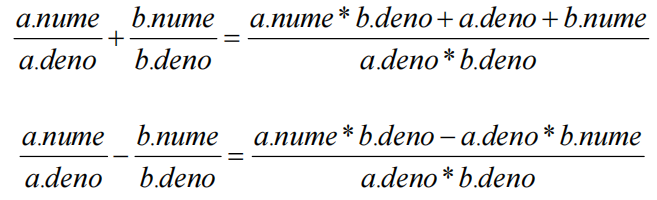

# 典型运算符的重载

## 1、构造“分数”类

* 【例40.1】构建一个“分数”类Fraction。  
    ```cpp
    #include <iostream> 
    #include <stdlib.h> 
    using namespace std; 
    class Fraction { //Fraction类表示分数 
        public: 
            Fraction(int n=0,int d=1) : nume(n),deno(d) { simplify(); } 
            Fraction(double d); //double类型转换Fraction构造函数 
            Fraction(const string& str); //string类型转换Fraction构造函数 
            Fraction(const Fraction& f):nume(f.nume),deno(f.deno) { } 
            //复制构造函数 
            void display(); //显示分数 
        private: 
            void simplify(); //简化分数 
            int nume,deno; //分子nume，分母deno 
    };
    Fraction::Fraction(const string& str) : nume(0),deno(1) 
    { //字符串"2/3"转换为分数类 
        char buf[200]; 
        int i=str.find('/') , j=str.length()-i-1; 
        if (i>=0) { 
            str.copy(buf,i,0);buf[i]=0;nume=atoi(buf);//前面子串转换为分子 
            str.copy(buf,j,i+1);buf[j]=0;deno=atoi(buf);//后面子串转换为分母 
        } 
        simplify();//规格化分数 
    } 
    Fraction::Fraction(double d):nume(d),deno(1)//分子初始为d的整数部份 
    { 
        d=d-nume; //d的小数部分 0.25 
        while ( int(d*10) != 0) { // 0.25=>25/100 
            nume=nume*10+int(d*10); 
            deno=deno*10; 
            d=d*10-int(d*10); 
        } 
        simplify();//规格化分数 
    }
    void Fraction::display() 
    { //显式规格化的分数 
        if (deno!=0&&deno!=1&&nume!=deno) 
        cout<<nume<<"/"<<deno<<endl; 
        else cout<<nume<<endl; 
        // 当出现nume/0,nume/1,nume/nume时只显示nume 
    } 
    void Fraction::simplify() 
    { //分数规格化 
        int m, n, r, s=1; 
        if (nume!=0 && deno!=0) { //分母不能为0 
            if (deno<0) s=-s, deno=-deno; //分母取正数 
            if (nume<0) s=-s, nume=-nume; 
            //分子取正数，s为分数符号，符号在分子上 
            m=nume, n=deno;
            while(n!=0) r=m%n, m=n, n=r; 
            //求nume和deno的最大公约数m 
            if (m!=0) nume=s*nume/m, deno=deno/m; 
            //分子分母去除公约数 
        } 
        else nume=0, deno=1; 
        //分子或分母为0时规格化为分子=0，分母=1 
    } 
    int main() 
    { 
        Fraction a(1,2),b(0.25),c("6/9"); 
        a.display(); //输出1/2 
        b.display(); //输出1/4 
        c.display(); //输出2/3 
        return 0; 
    }
    ```

## 2、典型运算符的重载

### 1. 重载复合的赋值运算符

* 复合的赋值运算符具有“给运算对象重新赋值”的功能，所以运算符函数需要返回引用类型。
* 例如：a+=b 相当于 a=a+b
* 将复合的赋值运算符设计成Fraction的公有成员函数：  
  

```cpp
Fraction& Fraction::operator+=(const Fraction& b) //a+=b 
{ 
    nume=nume*b.deno+deno*b.nume, deno=deno*b.deno; 
    simplify(); 
    return *this; //返回左运算对象 
}
Fraction& Fraction::operator-=(const Fraction& b) //a-=b 
{ 
    nume=nume*b.deno-deno*b.nume, deno=deno*b.deno; 
    simplify(); 
    return *this; //返回左运算对象 
}
```

* 执行语句：
```cpp
Fraction a(2,5),b(1,2),c; 
a+=a-+b; 
a.display();
```

* 程序运行结果：
```cpp
-1/5
```

### 2. 重载流运算符
* 用户自定义数据类型的数据，是不能直接用<<和>>来进行输入输出的。如果想使用它们输入输出自定义数据类型的数据，就必须对它们进行重载。

* 对<<和>>重载的函数是由标准库iostream规定的，形式如下：
```cpp
ostream& operator <<(ostream& os,const 类类型 &obj) 
{ 
    os<<…… //obj数据成员逐个输出 
    return os; //必须返回ostream对象 
}
istream& operator >>(istream& is,类类型 &obj) 
{ 
    is>>…… //逐个输入obj数据成员 
    return is; //必须返回istream对象 
}
```
* 之所以两个函数都返回流对象的引用类型，是因为无论流插入或是流提取都需要连续输入或输出，如`cout<<a<<b<<c;`因此运算对象应该能作为左值。

* **流插入和提取重载函数不能是类的成员函数**，否则左运算对象就只能是该类型的对象，就会出现如下的错误形式：
    > `a<<cout` 或者 `a>>cin`

* 如果想要支持正常的形式，则左运算对象就必须为ostream类型或istream类型。
```cpp
ostream& operator<<(ostream& os,const Fraction& a) //os<<a 
{ //显式规格化的分数 
    if (a.deno!=0 && a.deno!=1 && a.nume!=a.deno) 
        os<<a.nume<<"/"<<a.deno; 
    else os<<a.nume; //当出现nume/0,nume/1,nume/nume时只显示nume 
    return os; //必须返回ostream对象 
}
istream& operator>>(istream& is,Fraction& a) //is>>a 
{ 
    char ch; 
    is>>a.nume>>ch>>a.deno; //按 分子/分母 形式输入数据 
    return is; //必须返回istream对象 
}
```
* 执行语句：
    ```cpp
    Fraction a,b; 
    cin>>a>>b; 
    cout<<"a+b="<<a+b<<endl;
    ```
* 程序运行结果：  
    ```cpp
    1/7 1/4↙ 
    a+b=11/28
    ```


### 3. 重载类型转换运算符

* C++对基本数据类型既有隐式类型转换，又有显示类型转换，我们可以通过构造单个参数的构造函数将指定数据类型隐式转换为类类型：
* `Fraction(double d);` 和 `Fraction(const string& str);`
* 如果要将类类型显示地转换为其他数据类型，就需要重载类型转换运算符。


* 类型转换运算符函数只能作为类的成员函数，因为转换的运算对象是类的对象。例如：
    ```cpp
    Fraction::operator double() { 
        return (double)nume/deno; 
    }
    ```

* 执行语句：
    ```cpp
    Fraction a,b(1,2); 
    a=1.25; 
    cout<<(double)(a+b)<<endl; // 输出0.625
    ```
