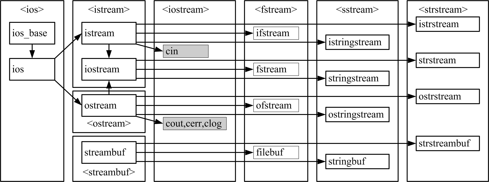

# 文件

## 1、文件的概念

### 1. 流
* C++的输入输出是以字节流的形式实现的。
* 流是指由若干字节组成的字节序列的数据从一个对象传递到另一个对象的操作。
* 从流中读取数据称为**提取操作**，向流内添加数据称为**插入操作**。
* 流在使用前要建立，使用后要删除。
* 流具有方向性：与输入设备相联系的流称为输入流，与输出设备相联系的流称为输出流，与输入输出设备相联系的流称为输入输出流。


* C++输入输出类库中包含许多流类（stream class），如下图所示。
      

* 提取和插入运算符
* 在`istream`类中已经将运算符（`>>`）重载为提取运算符，支持基本 数据类型及其指针类型。
* 在`ostream`类中已经将运算符（`<<`）重载为插入运算符，其适用类 型除了前述类型外，还增加了`void*`类型。


* 预定义流对象
* 标准库将常用iostream类的流对象，定义在`<iostream>`头文件中， 它们是：  
    > ①`cin`：与标准输入设备相关联的标准输入流（`istream`对象）；  
    > ②`cout`：与标准输出设备相关联的标准输出流（`ostream`对象）；   

### 2. 文件
* 程序常常需要将一些数据信息（如运行结果）永久性地保存下来，或者从永久性信息中读取有用的数据（如历史记录），这些都需要进行文件操作。C++文件操作是通过文件流实现的。

* **文件是指存放在磁盘上数据的集合**。操作系统以文件为单位对这些数据进行管理。也就是说，如果想得到存在磁盘上的数据，必须先按文件名找到指定的文件，然后再从该文件中读取数据。要向磁盘上存放数据也必须先以文件名为标识创建建一个文件，才能向它输出数据。

* 文件按数据的组织形式可以分为两类：
    1. ASCII文本文件
        * 文本（text）文件对于ASCII字符集而言，文件中每个字节存放的是一个ASCII码，表示一个字符；对于像汉字、日韩文字等字符集而言，使用双字节存放字符。
    2. 二进制文件
        * 二进制文件是将数据以内存中的存储形式直接存放到磁盘上。用二进制形式输出数据，可以节省存储空间和避免编码转换。由于一个字节并不对应一个字符，所以不能直接打印输出或编辑二进制文件。


## 2、文件的操作

### 1. 文件打开
* 已创建的文件流对象需要和指定的磁盘文件建立关联，以便使文件流流向指定的磁盘文件，这个过程称为**文件打开**。

* 打开文件有两种方式：
    1. 是定义文件流对象时使用带参数的构造函数；  
    2. 是调用文件流成员函数`open`。  

    ```cpp
    ifstream(); //文件输入流构造函数 
    //文件输入流构造函数，用指定的mode方式打开filename文件 
    ifstream(const char* filename,ios_base::openmode mode=ios_base::in); 
    ofstream(); //文件输出流构造函数 
    //文件输出流构造函数，用指定的mode方式打开filename文件 
    ofstream(const char* filename,ios_base::openmode mode=ios_base::out); 
    fstream(); //文件输入输出流构造函数 
    //文件输入输出流构造函数，用指定的mode方式打开filename文件 
    fstream(const char* filename,ios_base::openmode mode=ios_base::in|ios_base::out); 
    //用指定的mode方式打开filename文件 
    void open(const char* filename,ios_base::openmode mode=ios_base::in); 
    bool operator!(); //检测流对象是否为空 
    bool is_open(); //检测文件是否打开
    ```

* **输入：读操作，将文件中的内容读到内存中。**
* **输出：写操作，将内存中的数据写到文件中。**


* 表43-1 打开方式`openmode` 

| 取值 | 含义 | 作用 |  
| -- | -- | -- |  
| `ios_base::in` | input | 以输入方式打开文件（默认方式） |  
| `ios_base::out` | output | 以输出方式打开文件。若已存在该文件，则将其内容全 部清空 |  
| `ios_base::app` | append | 以输出方式打开文件，写入的数据添加在文件末尾 |  
| `ios_base::ate` | at end | 打开一个已有的文件，文件指针指向文件末尾 |  
| `ios_base::binary` | binary | 二进制文件，默认为ASCII文件 |  
| `ios_base::trunc` | truncate | 打开一个文件，若文件己存在，则将其内容全部清空； 若文件不存在，则建立新文件。若指定了`ios::out`方式而未指定`ios::app`、`ios::ate`、`ios::in`时，默认为此方式 |  


* 说明：  
    1. 可以用位或运算（|）对openmode进行组合。  
    2. 打开文件时操作可能会失败，如果打开操作失败，`open`函数返回值为0（假）。如果是调用构造函数打开文件且打开操作失败，则流对象的值为0（空对象）。可以据此测试打开是否成功，确定能否对该文件继续操作。  
    3. 每一个打开的文件都有一个文件指针，该指针初始位置要么在文件末尾（当指定`ios_base::app`或`ios_base::ate`时），要么在文件开头。每次读写都从文件指针的当前位置开始。每读写一个字节，指针就**自动**后移一个字节。当文件指针移到最后，就会遇到文件结束EOF（文件结束符）。


### 2. 文件关闭
* 当不再使用文件时，应该关闭该文件。关闭文件可以调用文件流成员函数：
    ```cpp
    void close(); //关闭文件
    ```
* 当文件关闭后，就不能再通过流对象对文件进行操作了，除非再次打开。


### 3. 文件状态
* 文件流提供如下四个成员函数用来检测文件状态：
    ```cpp
    bool eof(); bool bad(); 
    bool fail(); bool good();
    ```
* 如果文件已到末尾，`eof`函数返回真（1），否则返回假（0）。如果在读写文件过程中出错，`bad`函数返回`true`。如对一个不是为写状态打开的文件进行写入，或者要写入的设备没有剩余空间。除了与`bad`函数同样的情况下会返回`true`以外，格式错误时`fail`函数也会返回`true`。如要读入一个整数而得到一个字母时。  

* 如果调用以上任何一个函数返回`true`的话，`good`函数函数返回`false`。

### 4. 文件操作的基本形式
* 几乎所有文件应用中的打开和关闭的程序形式是相同的，为此给出通用的文件打开和关闭的操作步骤：  
    1. 定义文件流对象；  
    2. 通过构造函数或者成员函数open打开文件（或创建文件）；  
    3. 打开文件失败时中断文件处理；  
    4. 对文件进行各种操作；  
    5. 文件处理结束时关闭文件。  


* 文件操作的基本形式 --- 代码形式
    ```cpp
    ifstream infile("文件名",openmode); //打开文件或创建文件 
    if (!infile) { //打开或创建成功继续操作 
        …//文件读写操作 
        infile.close(); //处理结束时关闭文件 
    }
    ```
    或：  
    ```cpp
    ifstream infile; 
    infile.open("文件名",openmode); //打开文件或创建文件 
    if (!infile.fail()) { //打开或创建成功继续操作 
        …//文件读写操作 
        infile.close(); //处理结束时关闭文件 
    }
    ```

* 文件操作包括读写和定位，除流提取和流插入运算符外，文件流还有如下有用的操作文件的成员函数：
    ```cpp
    //用于文件输入流 
    istream& read(char* s,streamsize n); //从文件中读n个字节到s 
    streampos tellg(); //返回文件指针的位置 
    istream& seekg(streampos pos);//移动文件指针到pos位置 
    istream& seekg(streamoff off,ios_base::seekdir dir);//以dir参照off偏移移动文件指针 
    //用于文件输出流 
    ostream& write(const char* s,streamsize n); //输出s的n个字节到文件 
    streampos tellp(); //返回文件指针的位置 
    ostream& seekp(streampos pos); //移动文件指针到pos位置 
    ostream& seekp(streamoff off,ios_base::seekdir dir);//以dir参照off偏移移动文件指针 
    flush(); //文件输出流刷新
    ```


### 5. 文件操作举例
1. 对ASCII文件操作。
    * 对ASCII文件的读写操作可以用以下两种方法：
        > ①用流插入（`<<`）运算符和流提取（`>>`）运算符输入输出标准类 型的数据；   
        > ②用流对象成员函数`get`、`getline`、`put`等进行字符的输人输出。   


* 【例43.1】将源文件每行文本添加一个行号输出到目的文件中。
    ```cpp
    #include <fstream> //使用文件流 
    #include <iomanip> 
    using namespace std; //文件流定义在std命名空间 
    int main() 
    { 
        char s1[500]; int cnt=0; 
        ifstream inf("a.cpp"); //打开源文件读 
        if (!inf.fail()) { 
            ofstream outf("b.cpp"); //创建目的文件写 
            while (!inf.eof()) { //是否到源文件末尾 
                inf.getline(s1,sizeof(s1)-1); //读源文件字符串 
                //将字符串添加行号输出到目的文件 
                outf<<setfill('0')<<setw(4)<<++cnt<<" "<<s1<<endl; 
            }
            outf.close(); //关闭目的文件 
            inf.close(); //关闭源文件 
        } 
        return 0; 
    }
    ```

2. 对二进制文件操作。
    * 二进制文件打开时要用`ios_base::binary`指定为以二进制形式读取和存储。   
    * 二进制文件除了可以作为输入文件或输出文件外，还可以是既能输入又能输出的文件。这是和ASCII文件不同的地方。   
    * 对二进制文件的读写操作主要使用流成员函数`read`和`write`。  


* 【例43.2】复制源文件内容到目的文件。  
    ```cpp
    #include <iostream> 
    #include <fstream> //使用文件流 
    using namespace std; //文件流定义在std命名空间 
    int main() 
    { 
        char src[260],dest[260],buff[16384]; //读写缓冲达到16K 
        ifstream inf("book.dat",ios_base::in|ios_base::binary); //二进制读 
        if (!inf.fail()) { 
            ofstream outf("out.dat",ios_base::out|ios_base:: binary); //二进制写
            while (!inf.eof()) { //是否到源文件末尾 
                inf.read(buff,sizeof(buff)); 
                outf.write(buff,inf.gcount()); //按实际读到的字节数写入 
                cout<<buff<<endl; 
            } 
            outf.close(); //关闭目的文件 
            inf.close(); //关闭源文件 
        } 
        return 0; 
    }
    ```

3. 随机访问二进制文件。  
    * 一般情况下读写文件是顺序进行的，即逐个字节进行读写。但是对于二进制文件来说，可以利用`seekg`或`seekp`成员函数移动文件指针，从而随机地访问文件中任一位置上的数据，还可以修改文件中的内容。

* 【例43.3】已知文件book.dat文件中有100个数据销售记录，每个销售记录由代码（char c[5]）、书名（char n[11]）、单价（int p）和数量（int q）4 个组成部分组成。文件每行包含代码、书名、单价、数量，用Tab间隔，格式如下：
    > 1001 软件世界 5 100    
    > 1002 计算机工程 6 120     
    > ……   

    要求将所有记录写入到out.dat文件中，然后将out.dat的第一个记录进行输出。   

    ```cpp
    #include <fstream> //使用文件流 
    using namespace std; //文件流定义在std命名空间 
    struct BOOK { //书籍销售记录类型 
        char c[5]; //产品代码 
        char n[11]; //产品名称 
        int p; //单价 
        int q; //数量 
    }; 
    int main() 
    { 
        BOOK a; //书籍销售记录数组 
        ifstream inf("book.dat"); //打开文件读 
        ios_base::openmode m=ios_base::in|ios_base::out;//可读可写 
        fstream iof("out.dat",m|ios_base::trunc|ios_base::binary); //新建二进制文件
        if (inf.fail()||iof.fail()) return -1;//文件打开失败退出运行 
        while(!inf.eof()) { //是否读到文件末尾 
            inf>>a.c>>a.n>>a.p>>a.q; //读ASCII文件 
            iof.write((char*)&a,sizeof(BOOK)); //写二进制文件 
        } 
        inf.close(); //关闭book.dat文件 
        iof.seekg(0*sizeof(BOOK),ios_base::beg); //定位第1个结构体 
        cout<<a.c<<a.n<<a.p<<a.q; 
        iof.read((char*)&a,sizeof(BOOK)); //读取第一个结构体 
        iof.close(); //关闭out.dat文件 
        return 0; 
    }
    ```


