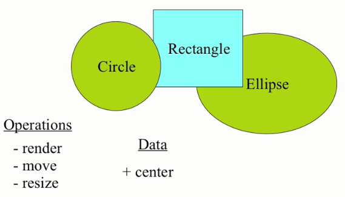
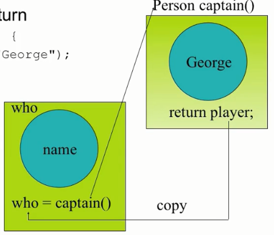

[面向对象程序设计-C++](https://study.163.com/course/introduction/271005.htm)  : https://study.163.com/course/introduction/271005.htm

网易云课堂课程下载器.exe


## 16. 子类父类关系

### Declare an Employee class
```cpp
class Employee {
    public:
        Employee( const std::string &name, const std::string &ssn);
        const std::string& get_name() const;
        void print(std::ostream &out) const;// overload
        void print(std::ostream &out, const std::string &msg) const;// overload
    protected:
        std::string m_name;
        std::string m_ssn;
};
```

### Constructor for Employee
```cpp
Employee::Employee(const std::string &name, const std::string &ssn) : m_name(name), m_ssn(ssn) {
    // initializer list sets up the values!
}
```

### Employee member functions
```cpp
inline const std::string & Employee::get_name() const {
    return m_name;
}

// overload
inline void Employee::print(std::ostream &out) const {
    out << m_name << endl;
    out << m_ssn << endl; 
}

inline void Employee::print(std::ostream &out, const std::string &msg) const {
    out << msg << endl; 
    print(out);
}
```

### Now add Manger
```cpp
class Manager : public Employee {
    public:
        Manager(const std::string &name, const std::string &ssn, const std::string &title);
        const std::string title_name() const; 
        const std:string &get_title() const; 
        void print(std::ostream &out) const;
    private:
        std::string m_title;
};
```

### Inheritance and constructors
* Think of inherited traits as an embedded object
* Base class is mentioned by class name
    ```cpp
    Manager::Manager(const string &name, const string &ssn, const string &title = "") : Employee(name, ssn), m_title(title) {
    }
    ```


### More on constructors 
* Base class is always constructed first
* If no explicit arguments are passed to base class
    - Default constructor will be called
* Destructors are called in exactly the reverse order of the constructors


### Manager member functions
```cpp
inline void Manager::print(std::ostream &out) const {
    Employee::print(out);// call the base class print
    out << m_title << endl; 
}

inline const std::string &Manager::get_title() const {
    return m_title;
}

inline const std::string Manger:title_name() const {
    return string(m_title + ": " + m_name);// access base m_name
}
```

### Use
```cpp
#include <iostream>
using namespace std;
int main() {
    Employee bob("Bob Jones", "555-44-0000");
    Manager bill("Bill Smith", "666-55-1234", "Important Person");

    string name = bill.get_name();// okay Manager inherits Employee
    // string title = bob.get_title();// Error -- bob is an Employee!
    cout << bill.title_name() << '\n' << endl;
    bill.print(cout);
    bob.print(cout);
    bob.print(cout, "Employee:");
    // bill.print(cout, "Employee:");// Error hidden!
}
```


## 17 函数缺省参数值
### Function overloading
* Same functions with different arguments list
```cpp
void print(char *str, int width);// #1
void print(double d, int width);// #2
void print(long l, int width);// #3
void print(int i, int width);// #4
void print(char *str);// #5

print("Pancakes", 15);
print("Syrup");
print(1999.0, 10);
print(1999, 12);
print(1999L, 15);
```


### Overload and auto-cast
```cpp
void f(short i);
void f(double d);

f('a');
f(2);
f(2L);
f(3.2);
```

### Default arguments
* A default argument is a value given in the **declaration** that the compiler automatically inserts if you don't provide a value in the function call.
```cpp
Stash(int size, int initQuantity = 0);
```

* To define a function with an argument list, defaults must be added from right to left.
```cpp
int harpo(int n, int m = 4, int j = 5);
int chico(int n, int m = 6, int j);// illeagle
int groucho(int k = 1, int m = 2, int n = 3);

beeps = harpo(2);
beeps = harpo(1.8);
beeps = harpo(8, 7, 6);
```


## 18 内联函数
### Overhead for a function call
* the procesing time required by a device prior to the execution of a command
    * Push parameters
    * Push return address
    * Prepare return values
    * Pop all pushed

    ```cpp
    int f(int i) {
        return i * 2;
    }
    main() {
        int a = 4;
        int b = f(a);
    }
    ```

### Inline Functions
* An inline function is expanded in place, like a preprocessor macro, so the overhead of the function call is eliminated. 
    ```cpp
    inline int f(int i) {
        return i * 2;
    }
    main() {
        int a = 4;
        int b = f(a);
    }
    ```

```cpp
inline int plusOne(int x);
inline int plusOne(int x) {return ++x;}
```
* Repeat inline keyword at declaration and definition.
* An inline function definition may not generate any code in .obj file.


### Inline functions in header file
* So you can put inline functions' bodied in header file. Then #include it where the function is needed.
* Never be afraid of multi-definition of inline functions, since they have no body at all.
* Definitions of inline funcionts are just declarations. 


### Tradeoff of inline functions
* Body of the called function is to be inserted into the caller.
* This may expand the code size.
* but deduces the overhead of calling time.
* So is gains speed at the expenses of space.
* In most cases, it is worth.
* It is much better than macro in C. It checks the types of the parameters.
    ```cpp
    #define f(a) (a) + (a)
    main() {
        double a = 4;
        printf("%d", f(a));
    }
    ```
    ```cpp
    inline int f(int i) {
        return i * 2;
    }
    main() {
        double a = 4;
        printf("%d", f(a));
    }
    ```

### Inline may not in-line
* The compiler does not have to honor your request to make a function inline. It might decide the function is too large or notice that it calls itself(recursion is no allowed or indeed possible for inline functions), or the feature might not be implemented of your particular compiler.

### Inline inside classes
* Any function you define inside a class declaration is automatically an inline.
```cpp
#include <string>
using namespace std;
class Point {
    int i, j, k;
    public:
        Point() { i = j = k = 0;}// inline
        Point(int ii, int jj, int kk) { i = ii, j = jj, k = kk;}// inline
        void print(string &msg = " ") {
            if (msg.size() != 0) cout << msg <<endl; 
            cout <<"i = "<< i << ", "<<"j = "<< j <<", "<<"k = "<<k<<endl; 
        }// inline
};
int main() {
    Point p, q(1, 2, 3);
    p.print("value of p");
    q.print("value of q");
}
```

### Access functions
* The are small functions that allow you to read or change part of the state of an object - that is, an internal variable or variables.
```cpp
class Cup {
    int color;
    public:
        int getColor() { return color;}// inline
        void setColor(int color) {
            this->color = color;
        }// inline
};
```

### Reducint clutter
* Member functions defined within classes us the Latin *in situ* (in place) and maintains that all definitions should be placed outside the class to keep the interface clean.
* Example: `Noinsitu.cpp`
```cpp
// Noinsitu.cpp
class Rectangle {
    int width, height;
    public:
        Rectangle(int w = 0, int h = 0);
        int getWidth() const;
        void setWidth(int w):
        int getHeight() const;
        void setHeight(int h);
};

inline Rectangle::Rectangle(int w, int h) : width(w), height(h) {
}

inline int Rectangle::getWidth() const {
    return width;
}

inline void Rectangle::setWidth(int w) {
    width = w;
}

inline int Rectangle::getHeight() const {
    return height;
}

inline void setHeight(int h) {
    height = h;
}
```

### Inline or not ? 
* Inline:
    * Small functions, 2 or 3 lines
    * Frequently called functions, e.g. inside loops

* Not inline ?
    * Very large functions, more than 20 lines
    * Recursive functions


## 19. const

### Const
* declares a *variable* to have a constant value
    ```cpp
    const int x = 123;
    x = 27;// illegal!
    x++;// illegal!

    int y = x;// Ok, copy const to non-const
    y = x;// Ok, same thing

    const int z = y;// Ok, const is safer
    ```

* Constants are variables
    * Observe scoping rules
    * Declared with "const" type modifier


### Complie time constants
```cpp
const int bufsize = 2014;
```
  * value must be initialized
  * unless you make an explicit extern declaration:**`extern const int bufsize;`**
  * compiler won't let you change it

* Compile time constants are entries in compiler symbol table, not really variables.


### Run-time constants
* const value can be exploited
    ```cpp
    const int class_size = 12;
    int finalGrade[class_size];// Ok

    int x;
    cin >> x;
    const int size = x;
    double classAverage[size];// Error!
    ```


### Pointers and const

```cpp
char * const q = "abc";// q is const
*q = 'c';// OK
q++;// Error!
```
```cpp
const char *p = "ABCD";// (*p) is a const char 
*p = 'b';// Error! (*p) is the const
p++;// OK
```

### Quiz:What do these mean?
```cpp
Person p1("Fred", 200);
const Person *p = &p1;// 对象是const
Person const *p = &p1;// 对象是const
Person *const p = &p1;// 指针是const
```

### Pointers and constants
```cpp
int i; 
const int ci = 3;
int *p;
const int *cip;

ip = &i;// OK 
cip = &i;// OK 

ip = &ci;// Error!
cip = &ci;// OK 
```
*Remember
```cpp
*ip = 54;// always legal since ip points to int
*cip = 54;// never legal since cip points to const int
```


### String Literals
`char *s = "Hello, world!";`
* s is a pointer initialized to point to a string constant
* This is actually a `const char *s` but compiler accepts it without the const
* Don't try and change the charactere values (it is undefined behavior)

* If you want to change the string, put in in an array:
```cpp
char s[] = "Hello, world!";
```


```cpp
#include <iostream>
using namespace std;
int main() {
    char *s = "hello, world";// 一般声明为: const char *s = "hello, world";
    cout<< s << endl;
    s[0] = 'B';// Bus error: 10
    cout << s << endl;
    return 0;
}
```

### Conversions
* Can always treat a non-const value as const
```cpp
void f(const int *x);
int a = 15;
f(&a);// ok
const int b = a;
f(&b);// ok
b = a + 1;// Error! 
```
**You cannot treat a constant object as non-constant without an explicit cast(const_cast)**


### Passing by const value?
```cpp
void f1(const int i) {
    i++;// illegal -- compile-time error
}
```

### Returning by const value?
```cpp
int f3() {return 1;}
const int f4() { return 1;}
int main() {
    const int j = f3();// Works fine
    int k = f4();// But this works fine too!
}
```

### Passing and returning address
* Passing a whole object may cost you a lot.
    * It is better to pass by a pointer. But it's possible for the programmer to take it and modify the original value.

* In fact, whenever you're passing an address into a function, you should make it a **const** if at all possible.
* Example: `ConstPointer.cpp`


### Const Objects
* what if an object is const?
    ```cpp
    const Currency the_raise(42, 38);
    ```
* What memebers can access the internals?
* How can the object be protected from change?


### Const member functions
* Cannot modify their objects
```cpp
int Date::set_day(int d) {
    // ...error check d here...
    day = d;// Ok, non-const so can modify
}
int Date::get_day() const {
    day++;// Error! modifies data member
    set_day(12);// Error! calls non-const member
    return day;// Ok
}
```

### Const member function usage
* Repeat the const keyword in the definition as well as the declaration
    ```cpp
    int get_day() const;// 意味着this是const
    int get_day() const {return day;}
    ```
* Functoin members that do not modify data should be declared const
* const member functions are safe for const objects


## 20. 不可修改的对象

```cpp
#include <iostream>
using namespace std;
class A {
    int i;
    public:
        A() : i(0) {}
        void f() {cout << "f()" <<endl;}// overload -- void f(A* this)
        void f() const {cout << "f() const"<<endl;}// overload -- void f(const A* this)
};
int main() {
    const A a;
    a.f();

    return 0;
}
```


### Constant in class
    ```cpp
    class A {
        const int i;
    };
    ```
* has to be initialized in initializer list of the constructor

### Compile-time constatns in classes
```cpp
class HasArray {
    const int size;
    int array[size];// Error! 
};
```
* Make the const value static:
    > `static const int size = 100;`
    > static indicates only one per class (not one per object)

* Or use "anonymous enum" hack
```cpp
class HasArray {
    enum {size = 100};
    int array[size];// Ok
};
```


## 21. 引用
对象存放地方：堆栈、堆、全局数据区
对象访问方式：直接掌握对象，即变量里面可以放对象；通过指针访问对象；可以通过引用去访问。

### Declaring references
* References are a new data type in C++
    ```cpp
    char c;// a character
    char *p = &c;// a pointer to a character
    char &r = c;// a reference to a character
    ```
* Local or global variables;
    ```cpp
    type& refname = name;
    ```
    For ordinary variables, the initial value is required

* In parameter lists and member variables
    ```cpp
    type& refname;
    ```
    Binding defined by caller or constructor


### References
* Declares a new name for an existing object
```cpp
int X = 47;
int &Y = X;// Y is a reference to X

// X and Y now refer to the same variable
cout << "Y = "<< Y;// prints Y = 47
Y = 18;
cout << "X = "<< X;// prints X = 18
```

### Rules of references
* References must be initialized when defined
* Initialization establishes a binding
    * In declaration
        ```cpp
        int x = 3;
        int &y = x;
        const int &z = x;// 通过z不能修改x，即不能做左值
        ```
    * As a function argument
        ```cpp
        void f(int &x);
        f(y);// initialized when function is called
        ```
* Bindings don't change at run time, unlike pointers
* Assignment changes the object referred-to
    ```cpp
    int &y = x;
    y = 12;// Changes value of x
    ```
* The target of a reference must have a location!
    ```cpp
    void func(int &);
    func(i * 3);// Warning or Error!
    ``

```cpp
// Reference.cpp
int * f(int *x) {
    (*x)++;
    return x;// Safe, x is outside this scope
}

// int g(int x){} 编译不会通过，会冲突
int & g(int &x) {
    x++;// Same effect as in f()
    return x;// Safe, outside this scope
}

int x;

int & h() { 
    int q;
    // return q;// Error
    return x;// Safe, x lives outside this scope
}

int main() {
    int a = 0;
    f(&a);// Ugly (but explicit)
    g(a);// Clean (but hidden)
    h() = 16;
}
```

### Pointers vs. References
* References
    * can't be null
    * are dependent on an existing variable, they are an alias for an variable
    * can't change to a new "address" location

* Pointers
    * can be set to null
    * pointer is independent of existing objects
    * can change to point to a different address


### Restrictions
* No references to references
* No pointers to references
    ```cpp
    int &* p;// illegal reference 的地址是取不到的
    ```
    Reference to pointer is ok
    ```cpp
    void f(int *& p);// p是reference，它所绑定的变量是int *
    ```
* No arrays of references


## 22. 向上造型

### Conversions
* Public Inheritance should imply substitution
    * if B ia an A, you can use a B anywhere an A can be used.
    * if B is an A, then everything that is true for A is also true of B.
    * Be careful if the substitution is not valid!

```cpp
#include <iostream>
using namespace std;

class A {
    public:
        int i;
    public:
        A():i(10) {}
};

class B : public A {
    private:
        int j;
    public:
        B():j(30) {}// 会调用 A 的默认构造函数
    public:
        void f() {cout<< "B.j = " << j << endl;}
};
int main() {
    A a;
    B b;
    cout << a.i << " " << b.i << endl;
    cout << sizeof(a) << " " << sizeof(b) << endl;
    int *p = (int *)&a;// 没有虚函数所以没有虚表，当作struct对待
    cout << p << " " << *p << endl;
    *p = 20;
    cout << a.i << endl;
    p = (int *)&b;
    cout << p << " " << *p <<endl;
    p++;
    *p = 50;
    b.f();

    return 0;
}
```


### Upcasting
* Upcasting is the act of converting from a Derived reference or pointer to a base class reference or pointer.(downcast)
      

### Upcasting examples
```cpp
Manager pete("Pete", "444-55-6666", "Bakery");
Employee *ep = &pete;// Upcast
Employee &er = pete;// Upcast
```
* Lose type information about the object:
    ```cpp
    ep->print(cout);// prints base class version
    ```


## 23. 多态性

### A drawing program
  


### Inheritance in C++
* Can define one class in terms of another
* Can capture the notion that
    * An ellipse is a shape
    * A circle is a special kind of ellipse
    * Circles, ellipses, and rectangles share common 
        * attributes
        * services
    * Circles, ellipses, and rectangles are not identical
          


### Conceptual model
  

### Shape
* Define the general properties of a Shape
```cpp
class XYPos { ... };// x, y point
class Shape {
    public:
        Shape();
        virtual ~Shape();
        virtual void render();
        void move(const XYPos&);
        virtual void resize();
    protected:
        XYPos center;
};
```

### Add new shapes
```cpp
class Ellipse : public Shape {
    public:
        Ellipse(float maj, float minr);
        virtual void render();// will define own 
    protected:
        float major_axis, minor_axis;
};

class Circle : public Ellipse {
    public:
        Circle(float radius) : Ellipse(radius, radius){}
        virtual void render();
};
```


### Example
```cpp
void render(Shape *p) {
    p->render();// calls correct render function for given Shape!
}
void func() {
    Ellipse ell(10, 20);
    ell.render();
    Circle circ(40);
    circ.render();
    render(&ell);
    render(&circ);
}
```


### Polymorphism
* Upcast: take an object of the derived clas as an object of the base one.
    * Ellipse can be treated as a Shape

* Dynamic binding:
    * Binding: which function to be called
        * Static binding: call the function as the code
        * Dynamic binding: call the function of the object


## 24. 多态的实现

```cpp
class Shape {
    public:
        Shape();
        virtual void render();
        void move(const XYPos&);
        virtual void resize();
    protected:
        XYPos center;
};
```
  


* 任何一个类，如果有虚函数，只要有一个，这个类的对象就会比正常的大一点。
```cpp
#include <iostream>
using namespace std;

class A {
    public:
        A() : i(10) {}
        virtual void f() {cout << "A::f() " << i << endl;}
        int i;
};
int main() {
    A a;
    a.f();
    cout << sizeof(a) <<endl;

    int *p = (int *)&a;// vptr 所有有virtual函数的对象的第一个位置
    cout << *p <<endl;// p++ -> *p => 10

    return 0;
}
```

### Ellipse
```cpp
class Ellipse : public Shape {
    public:
        Ellipse(float majr, float minr);
        virtual void render();
    protected:
        float major_axis;
        float minor_axis;
};
```
  


### Shape vs Ellipse
  


### Circle
```cpp
class Circle : public Ellipse {
    public:
        Circle(float radius);
        virtual void render();
        virtual void resize();
        virtual float radius();
    protected:
        float area;
};
```
  


### What happens if 
```cpp
Ellipse elly(20F, 40F);
Circle circ(60F);
elly = circ;// 10 in 5 ?
```
* Area of `circ` is sliced off
    * (Only the part of `circ` that fits in `elly` gets copied)

* Vtable from `circ` is ignored; the vtable in `elly` is the Ellipse vtable
    ```cpp
    elly.render();// Ellipse::render()
    ```


```cpp
// https://godbolt.org/ 选 ARM gcc 9.3 (linux)
#include <iostream>
using namespace std;

class A {
    public:
        A() : i(10) {}
        virtual void f() {cout << "A::f() " << i << endl;}
        int i;
};
class B : public A {
    public:
        B() : j(20) {}
        virtual void f() {cout << "B::f() " << j << endl;}
        int j;
};
int main() {
    A a;
    B b;
    A *p = &b;
    p->f();// B::f() 20

    a = b;
    a.f();// A::f() 10  也即赋值过程中vptr没有覆盖

    p = &a;
    p->f();// A::f() 10


    A *q = &a;
    int *r = (int *)&a;
    int *t = (int *)&b;

    *r = *t;
    q->f();// B::f() 32767

    return 0;
}
```


### What happens with pointers?
```cpp
Ellipse *elly = new Ellipse(20F, 40F);
Circle *circ = new Circle(60F);
elly = circ;
```
* Well, the original Ellipse for `elly` is lost...
* `elly` and `circ` point to the same Circle object!
```cpp
elly->render();// circle::render()
```


### Virtuals and reference arguments
```cpp
void func(Ellipse &elly) {
    elly.render();
}
Circle circ(60F);
func(circ);
```
* Reference act like pointers
* Circle::render() is called


### Virtual destructors
* Make destructors **virtual** if they might be inherited
    ```cpp
    Shape *p = new Ellipse(100.0F, 200.0F);
    ...
    delete p;
    ```
* Want `Ellipse::~Ellipse()` to be called
* If `Shape::~Shape()` is not virtual, only `Shape::~Shape()` will be invoked!


### Overriding(覆盖)
* Overriding redefines the body of a virtual function
    ```cpp
    class Base {
        public:
            virtual void func();
    };
    class Derived : public Base {
        public:
            virtual void func();// overrides Base::func()
    };
    ```


### Calls up the chain
* You can still call the overridden function:
    ```cpp
    void Dervied::func() {
        cout << "In Derived::func!" ;
        Base::func();// call to base class
    }
    ```
* This is a common way to add new functionality
* No need to copy the old stuff!


### Return types relaxation (current)
* Suppose D is publicly derived from B
* D::f() can return a subclass of the return type defined in B::f()
* Applies to pointer and reference types
    * e.g. D&, D*

* In most compilers now


### Relaxation example
```cpp
class Expr {
    public:
        virtual Expr *newExpr();
        virtual Expr &clone();
        virtual Expr self();
};
class BinaryExpr : public Expr {
    public:
        virtual BinaryExpr *newExpr();// OK
        virtual BinaryExpr &clone();// OK
        virtual BinaryExpr self();// Error!
}
```

### Overloading and virtuals
* Overloading adds multiple signatures
    ```cpp
    class Base {
        public:
            virtual void func();
            virtual void func(int);
    }
    ```
* If you override an overloaded function, you must override all of the variants!
    * Can't override just one
    * If you don't override all, some will be hidden


## 25. 引用再研究

### References as class members
* Declared without initial value
* Must be initialized using constructor initializer list
```cpp
class X {
    public:
        int &m_y;
        X(int &a);
};
X::X(int &a) : m_y(a) {}
```


### Returning references
* Functions can return references
    * But they better refer to non-local variables!
```cpp
#include <assert.h>
const int SIZE = 32;
double myarray[SIZe];
double& subscript(const int i) {
    return myarray[i];
}
```

### Example
```cpp
main() {
    for (int i = 0; i < SIZe; i++) {
        myarray[i] = i * 0.5;
    }
    double value = subscript(12);
    subcript(3) = 34.5;
}
```

### const in Functions Arguments
* Pass by const value -- don't do it
* Passing by const reference
    * don't change the string object
        ```cpp
        Person(const string& name, int weithg);
        ```
    * mor efficient to pass by reference (address) than to pass by value (copy)
    * const qualifier protects from change


### Const referenc parameters
* What if you don't want the argument changed?
* Use const modifier
    ```cpp
    // y is a constant! Can't be modified 
    void func(const int& y, int& z) {
        z = z * 5;// OK
        y += 8;// Error!
    }
    ```


### Temporary values are const
* What you type
    ```cpp
    void func(int &);
    func(i * 3);// Generates warnint or error!
    ```
* What the complier generates
    ```cpp
    void func(int &);
    const int tmp@ = i * 3;
    func(tmp@);// Problem -- binding const ref to non-const argument!
    ```

**The temporary is constant, since you can't access it**

```cpp
#include <iostream>
using namespace std;

void f(const int & i) {
    cout << i << endl;
}

void g(int & i) {
    cout << i << endl;
}

int main() {
    int i = 3;
    func(i * 3);// 正常编译  输出 9  
    // g(i * 3);// 编译报错
    return 0;
}
```

### const in Function returns
* return by const value
    * for user defined types, it means "prevent use as an lvalue"
    * for built-in's it means nothing
* return by const pointer or reference
    * depends on what you want your client to do with the return value


```cpp
class A {
    public:
        A() : i(10) {}
        int i;
};
A f() {
    A a;
    return a;
}

A* f1() {
    A a;
    return &a;// 不能返回局部对象的指针
}
A& f2() {
    A a;
    return a;// 不能返回局部对象的引用
}

const A f3() {
    A a;
    return a;
}

int g() {
    int i = 15;
    return i;
}
int main() {
    A b;
    f().i = 20;// 此对象或取不到了
    //f3().i = 20;// Error! 
    f() = b;// 编译没问题，但是拿不到f()返回的那个对象了，即失踪了
    // g() = 10;// Error!  g返回的是值而不是变量，不能拿来做左值
    return 0;
}
```


## 26. 拷贝构造I

### Copying
* Create a new object from an existing one
    * For example, when calling a function
    ```cpp
    // Currency as pass-by-value argument
    void func(Currency p) {
        cout << "X = " << p.dollars();
    }
    .....
    Currency bucks(100l, 0);
    func(bucks);// bucks is copied into p
    ```
* C++中必须分清楚的两组名词：
  * declaration / definition : 声明  定义
  * Initialization / assignment ： 初始化  赋值
    ```cpp
    Currency p = bucks;// Initialization
    p = bucks;// assignment
    ```

```cpp
#include <iostream> 
using namespace std;

static int objectCount = 0;
class HowMany {
    public:
        HowMany() { objectCount++; print("HowMany()");}
        void print(const string& msg = "") {
            if (msg.size() != 0) cout << msg << ": ";
            cout << "objectCount = " << objectCount << endl;
        }
        ~HowMany() {
            objectCount--;
            print("~HowMany()");
        }
};
// Pass and return By Value:
HowMany f(HowMany x) {
    cout << "begin of f" << endl;
    x.print("x argument inside f()");
    cout << "end of f" << endl;
    return x;
}
int main() {
    HowMany h;
    h.print("after const5ruction of h");
    HowMany h2 = f(h);
    h.print("after call to f()");
}
```
输出：
```cpp
HowMany(): objectCount = 1
after cconstruction of h: objectCount = 1
begin of f
x argument inside f(): objectCount = 1
end of f
~HowMany(): objectCount = 0
agfer call to f(): objectCount = 0
~HowMany(): objectCount = -1
~HowMany(): objectCount = -2
```
可以发现f函数里面缺少了一个构造的过程。
h2的创建过程也绕过来构造函数。
```cpp
int main() {
    HowMany h;
    h.print("after const5ruction of h");
    HowMany h2 = h;// 构造了h2 但是没有经过我们的构造函数
    //f(h);
    h.print("after call to f()");
}
```
则输出：
```cpp
HowMany(): objectCount = 1
after cconstruction of h: objectCount = 1
agfer call to f(): objectCount = 1
~HowMany(): objectCount = 0
~HowMany(): objectCount = -1
```

在类中增加一个函数：
```cpp
HowMany(int i) { objectCount++; print("HowMany(int)");}

int main() {
    HowMany h;
    h.print("after const5ruction of h");
    HowMany h2(10);// HowMany h2 = 10;
    // HowMany h2 = h; ??????
    //f(h);
    h.print("after call to f()");
}
```


在类中增加一个函数：
```cpp
HowMany(HowMany o) { objectCount++; print("HowMany(HM)");}// 编译错误 引发递归了 
// 但是一般不那样写 使用引用会高效些
HowMany(const HowMany& o) { objectCount++; print("HowMany(HM)");}

int main() {
    HowMany h;
    h.print("after const5ruction of h");
    HowMany h2 = h;// ??????
    //f(h);
    h.print("after call to f()");
}
```


### The copy constructor
* Copyint is implemented by the copy constructor
* Has the unique signature
    ```cpp
    T::T(const T&);
    ```
    Call-by-reference is used for the explicit argument
* C++ builds a copy ctor for you if you don't provide one!
    * Copies each member variable
        Good for numbers, objects, arrays
    * Copies each pointer
        Data may become shared!


## 27. 拷贝构造II

### What if class contains pointers
```cpp
class Person {
    public:
        Person(const char *s);
        ~Person();
        void print();
        // ... accessor functions
    private:
        char *name;// char * instead of string
        // ... more info e.g. age, address, phone
};

#include "Person.h"
#include <cstring> // #include <string.h>
using namespace std;

Person::Person(const char *s) {
    name = new char[::strlen(s) + 1];
    ::strcpy(name, s);
}

~Person::Person() {
    delete [] name;// array delete
}
```

### Choices
  


### Character strings
* In C++, a character string is
    * An array of characters
    * With a special terminator -- '\0' or ASCII null
* The string "C++" is represented, in memory, by an array of four (4, count'em) chatacters
      


### Standard C library String fxns
* Declared in `<cstring>`
```cpp
size_t strlen(const char *s);
```
    - s is a null-terminated string
    - returns the length of s
    - length does not include the terminator!
```cpp
char *strcpy(char *dest, const char *src);
```
    - Copies src to dest stopping after the terminating null-character is copied. (src shoulde be null-terminated!)
    - dest should have enough memory space allocated to contain src string.
    - Return Value: returns dest


### Person(char *) implementation
```cpp
#include <cstring>// #include <string.h>
using namespace std;

Person::Person(const char *s) {
    name = new char[::strlen(s) + 1];
    ::strcpy(name, s);
}

Person::~Person() {
    delete [] name;// array delete 
}
```

### Person copy constructor
* To Person declaration add copy ctor prototype:
```cpp
Person(const Person& w);// copy ctor
```
* To Person .cpp and copy ctor definition:
```cpp
Person::Person(const Person& w) {
    name = new char[::strlen(w.name) + 1];
    ::strcpy(name, w.name);
}
```
* No value returned
* Accesses w.name across client boundary
* The copy ctor initializes uninitialized memory


### When are copy ctors called? 
  

* During call by value
```cpp
void roster(Person);// declare function
Person child("Ruby");// create object
roster(child);// call function
```


* During initialization
  
```cpp
Person baby_a("Fred");
// these use the copy ctor
Person baby_b = baby_a;// not an assignment
Person baby_c(baby_a);// not an assignment
```

* During function return

```cpp
Person captain() {
    Person player("George");
    return player;
}
...
Person who("");
...
```

### Copies and overhead
* Compilers can "optimize out" copies when safe!
* Programmers need to 
    * Program for "dumb" compilers
    * Be ready to look for optimizations

### Example
```cpp
Person copy_func(char *who) {
    Person local(who);
    local.print();
    return local;// copy ctor called!
}

Person nocopy_func(char *who) {
    return Person(who);// no copy needed!
}
```


### Constructions vs. assignment
* Every object is constructed once
* Every object should be destroyed once
    * Failure to invoke delete()
    * Invoking delete() more than once
* Once an object is constructed, it can be the target of many assignment operations


### Person: string name
* What if the name was a string(and not a char *)
```cpp
#include <string>
class Person {
    public:
        Person(const string&);
        ~Person();
        void print();
        // ... other accessor fxns ...
    private:
        string name;// embedded object (composition)
        // ... other data members ... 
}
```

### Copy ctor guidelines
* In general, be explicit
    * Create your own copy ctor -- don't rely on the default
* If you don't need one declare a private copy ctor
    * prevents creation of a default copy constructor
    * generates a compiler error if try to pass-by-value
    * don't need a definition


* 建议：一旦写一个类，就一定要给他三个函数：
    1. default constructor 
    2. virtual destructor 
    3. copy constructor


## 28. 静态对象
### Static in C++
#### Two basic meanings
* Static storage
    * allocated once at a fixed address
* Visibility of a name
    * internal linkage
* Don't use static except inside functions and classes


### Uses of "static" in C++

| | |  
| - | - |  
| Static free functions | Internal linkage(deprecated) |  
| Static global variables | Internal linkage(deprecated) |  
| Static local variables | Persistent storage |  
| Static member variables | Shared by all instances |  
| Static member function | Shared by all instances, can only access static member variables |  


### Global static hidden in file
  


### Static inside functions
* Value is remembered for entire program
* Initialization occurs only once
* Example:
    * count the number of times the function has been called
```cpp
void f() {
    static int num_calls = 0;
    ...
    num_calls++;
}
```


### Static applied to object
* Suppose you have a class
    ```cpp
    class X {
        public:
            X(int, int);    
            ~X();
        ...
    };
    ```
* And a function with a static X object
    ```cpp
    void f() {
        static X my_X(10, 20);
        ...
    }
    ```
    * 关心的两点：存储在那里，什么时候被构造出来
    * 存储是全局的，初始化在函数第一次调用


### Static applied to objects ...
* Construction occurs when difinition is encountered
    * Constructor called at-most once
    * The constructor arguments must be satisfied
* Destruction takes palce on exit from program
    * Compiler assures LIFO order of destructors


### Conditional constrruction
* Example: conditional construction
    ```cpp
    void f(int x) {
        if (x > 10) {
            static X my_X(x, x * 21);
            ...
        }
    }
    ```
* `my_X`
    * is constructed once, if `f()` is ever called with `x > 10`
    * retains its value
    * destroyed only if constructed


### Global objects
* Consider
```cpp
#include "X.h"
X global_x(12, 34);
X global_x2(32, 43);
```
* Constructors are called before `main()` is entered
    * Order controlled by appearance in file
    * In this case, `global_x` before `global_x2`
    * `main()` is no longer the first function called
* Destructors called when
    * `main()` exits
    * `exit()` is called


### Static Initialization Dependency
* Order of construction within a file is known
* Order between files is *unspecified*!
* Problem when non-locak static objects in different files have dependencies.
* A non-local static object is:
    * defined at global or namespace scope
    * declared static in a class
    * defined static at file scope


## 29. 静态成员

### Can we apply static to members?
* Static means
    * Hidden
    * Persistent

* Hidden: A static member is a member
    * Obeys usual access rules

* Persistent: Independent of instances
* Static members are class-wide
    * variables or
    * functions


### Static members
* Static member variables
    * Global to all class member functions
    * Initialized once, at file scope
    * provide a place for this variable and init in in .cpp
    * No 'static' in .cpp

* Example: StatMem.h StatMem.cpp


* **写在class大括号里面的东西全部都是declaration 而非definition!**


Object - Oriented Programming 

## 30. 运算符重载——基本规则
### Overloaded operators
* Allows user-defined types to act like built in types
* Another way to make a function call
* Unary and binary operators can be overloaded:
    > `+  -  *  /  %  ^  &  |  ~ `
    > `=  <  >  +=  -=  *=  /=  %= `
    > `^=  &=  |=  <<  >>  >>=  <<=  == `
    > `!=  <=  >=  !  &&  ||  ++  -- `
    > `,  ->*  ->  ()  [] `
    > `operator new`        `operator delete`
    > `operator new[]`         `operator delete[]`

### Operators you can't overload
`.   .*  ::  ?:`
`sizeof  typeid`
`static_cast  dynamic_cast  const_cast  reinterpret_cast`


### Restrictions
* Only existing operators can be overloaded (you can't create a ** operator for exponentiation)乘幂
* Operators must be overloaded on a class or enumueration type
* Overloaded operators must
    * Preserve number of operands
    * Preserve precedence

* 保持原有操作数的个数和结合性和优先级


### C++ overloaded operator
* Just a function with an operator name!
    * Use the `operator` keyword as prefix to name
        ```cpp
        operator *(...)
        ```

* Can be a member function
    * Implicit first argument
        ```cpp
        const String String::operator +(const String& that);
        ```

* Can be a global (free) function
    * Both arguments explicit
        ```cpp
        const String operator+(const String& r, const String& l);
        ```

### How to overload
* As member function
    * Implicit first argument
    * No type conversion performed on receiver
    * Must have access to class definition


### Operators as member functions
```cpp
class Integer {
    public:
        Integer(int n = 0) : i(n) {}
        const Integer operator+(const Integer& n) const {
            return Integer(i + n.i);
        }// 返回为const是为了避免出现 a + b = 3;
    ...
    private:
        int i;
};
```

### Member Function
```cpp
Integer x(1), y(5), z;
x + y; //======> x.operator+(y)
```
* 运算符左边的那个算子叫做receiver，决定用那个 + ；即用Integer的 + 

* Implicit first argument
* Developer must have access to class definition
* Members have full access to all data in class
* No type conversion performed on receiver
    ```cpp
    z = x + y;// Ok Integer + 
    z = x + 3;// Ok receiver 是 x, 3 构造成匿名的Integer对象 然后再做运算
    z = 3 + y;// Error! 3 是 receiver, 用的是 int 类型的 + 
    z = x + 3.5;// Error! 
    ```

* For binary operators (+, -, *, etc) member functions require one argument.
* For unary operators (unary -, !, etc) member functions require no arguments:
```cpp
const Integer operator-() const {
    return Integer(-i);
}
...
z = -x;// z.operator=(x.operator-());
```

### How to overload
* As a global function
    * Explicit first argument
    * Type conversions performed on both arguments
    * Can be made a friend


### Operator as a global function
```cpp
const Integer operator+(const Integer& rhs, const Integer& lhs);
Integer x, y;
x + y;// ======> operator+(x, y);
```
* Explicit first argument
* Developer does not need special access to classes
* May need to be a friend
* Type conversions performed on both arguments


### Global operators (friend)
```cpp
class Integer {
    friend const Integer operator+(const Integer& lhs, const Integer& rhs);
    ...
};

const Integer operator+(const Integer& lhs, const Integer& rhs) {
    return Integer(lhs.i + rhs.i);
}
```


### Global Operators
* binary operators require two arguments
* unary operators require one argument
* conversion:
```cpp
z = x + y;// OK
z = x + 3;// OK
z = 3 + y;// OK 全局情况下,成员函数情况下不行
z = 3 + 7;// OK  10 去构造
```
* If you don't have access to private data members, then the global function must use the public interface (e.g. accessors)


### Tips: Memebers vs. Free Functions
* Unary operators should be members
* `=` `()` `[]` `->` `->*` must be members
* assignment operators should be members
* All other binary operators as non-members


## 31. 运算符重载——原型
### Argument Passing
* if it is read-only pass it in as a const reference (except built-ins)
* make member functions const that don't change the class (boolean operators, +, -, etc)
* for global functions, if the left-hand side changes pass as a reference (assignment operators)


### Return Values
* Select the return type depending on the expected meaning of the operator. For example,
    * For operator+ you need to generate a new object. Return as a const object so the result cannot be modified as an lvalue.
    * Logical operators should return bool (or int for older compilers).

### The prototypes of operators
* +-*/%^&|~
    ```cpp
    const T operatorX(const T& l, const T& r) const;
    ```
* ! && || < <= == >= >
    ```cpp
    bool operatorX(const T& l, const T& r) const;
    ```
* []
    ```cpp
    T& T::operator[](int index);
    ```

### Operators ++ and --
* How to distinguish postfix from prefix?
* postfix forms take an int argument -- compiler will pass in 0 as that int
    ```cpp
    class Integer {
        public:
            ...
            const Integer& operator++();// prefix++ ===> ++a
            const Integer operator++(int);// postfix++ ===> a++
            const Integer& operator--();// prefix--
            const Integer operator--(int);// postfix--
            ...
    };
    ```
    ```cpp
    const Integer& Integer::operator++() {
        *this += 1;// increment
        return *this;// fetch
    }

    // int argument not used so leave unnamed so won't get compiler warnings
    const Integer Integer::operator++(int) {
        Integer old(*this);// fetch  拷贝构造被调用
        ++(*this);// increment 第一个函数会被调用 const Integer& Integer::operator++()
        return old;// return 拷贝构造会被调用
    }
    ```

### Using the overloaded ++ and --
```cpp
// decrement operators similar to increment
Integer x(5);
++x;// calls x.operator++();
x++;// calls x.operator++(0);
--x;// calls x.operator--();
x--;// calls x.operator--(0);
```
* **User-defined prefix is more efficient than postfix.**


### Relational operators
* implement != in terms of ==
* implement >, >=, <= in terms of <
```cpp
class Integer {
    public:
        ...
        bool operator==(const Integer& rhs) const;
        bool operator!=(const Integer& rhs) const;
        bool operator<(const Integer& rhs) const;
        bool operator>(const Integer& rhs) const;
        bool operator<=(const Integer& rhs) const;
        bool operator>=(const Integer& rhs) const;
};
```
```cpp
bool Integer::operator==(const Integer& rhs) const {
    return i == rhs.i;
}
// implement lhs != rhs in terms of !(lhs == rhs)
bool Integer::operator!=(const Integer& rhs) const {
    return !(*this == rhs);// *this.operator==(rhs)
}

bool Integer::operator<(const Integer& rhs) const {
    return i < rhs.i;
}
// implement lhs > rhs in terms of lhs < rhs
bool Integer::operator>(const Integer& rhs) const {
    return rhs < *this;// rhs.operator<(*this)
}
// implement lhs <= rhs in terms of !(rhs < lhs)
bool Integer::operator<=(const Integer& rhs) const {
    return !(rhs < *this);
}
// implement lhs >= rhs in terms of !(lhs < rhs)
bool Integer::operator>=(const Integer& rhs) const {
    return !(*this < rhs);
}
```

### Operator [] (index)
* Must be a member function
* Single argument
* Implies that the object it is being called for acts like an array, so it should return a reference
```cpp
Vector v(100);// create a vector of size 100
v[10] = 45;
```
(Note: if returned a pointer you would need to do: `*v[10] = 45;`)
See: Vector.h Vector.cpp
```cpp
// Vector.h
#ifndef _VECTOR_H_
#define _VECTOR_H_

class Vector {
    public:
        Vector(int size):m_size(size) {
            m_array = new int[size];
        }
        ~Vector() {delete m_array;}
        int& operator[](int index) {return m_array[index];}
    private:
        int m_size;
        int *m_array;
};

#endif
```


## 32. 运算符重载——赋值

### Copying vs. Initialization
```cpp
MyType b;
MyType a = b;// 拷贝构造
a = b;// 赋值运算符
```
Example: CopyingVsInitialization.cpp

```cpp
// CopyingVsInitialization.cpp
class Fi{
    public:
        Fi() {}
};

class Fee {
    public:
        Fee(int) {}
        Fee(const Fi&) {}
};
int main() {
    Fee fee = 1;// Fee(int)
    Fi fi;
    Fee fum = fi;// Fee(Fi)
    fum = fi;// 不一样的类型，恰巧 fi 可以用 Fee 的构造函数构造出 Fee 的对象来。所以，会用Fee(Fi)的构造函数构造出Fee的对象来，然后用赋值运算去赋给Fee另外的对象
}
```

### Automatic operator= creation
* The compiler will automatically create a `type::operator=(type)` if you don't make one.
* *memberwise assignment*

* Example: AutomaticOperatorEquals.cpp
```cpp
// AutomaticOperatorEquals.cpp

#include <iostream>
using namespace std;

class Cargo {
    public:
        Carge& operator=(const Cargo&) {
            cout << "inside Cargo::operator=()" << endl;
            return *this;
        }
};

class Truck {
    Cargo b;
}
int main() {
    Truck a, b;
    a = b;// Prints: "inside Cargo::operator=()"
}
```


### Assignment Operator
* Must be a member function
* Will be generated for you if you don't provide one
    * Same behavior as automatic copy ctor -- memberwise assignment
* Check for assignment to self
* Be sure to assign to all data members
* Return a refeence to *this
```cpp
A = B = C;// executed as A = (B = C);
```


### Skeleton assignment operator
```cpp
T& T::operator=(const T& rhs) {
    // check for self assignment
    if (this != &rhs) {
        // perform assignment
    }
    return *this;
}
```
* This checks address vs. check value (*this != rhs)
* Example: SimpleAssignment.cpp


```cpp
class A {
    char *p;
    A& operator=(const A& that) {
        delete p;
        p = new[strlen(that.p) + 1];
        strcpy(p, that.p);
        return *this;
    }
}
```
所以必须排除自身。(this != &rhs) 如果类里面有动态分配内存的必须要写，如果没有动态分配内存，指针，全都是成员对象则可以不写。

### Assignment Operator
* For classes with dynamically allocated memory declare an assignment operator (and a copy constructor)
* To prevent assignment, explicitly declare operator= as private

## 33. 运算符重载——类型转换
### Value classes
* Appear to be primitive data types
* Passed to and returned from functions
* Have overloaded operators (often)
* Can be converted to and from other types
* Examples: Complex, Date, String

### User-defined Type conversions
* A conversion operator can be used to convert an object of one class into
    * an object of another class
    * a built-in type
* Compilers perform inplicit conversions using:
    * Single-argument constructors
    * implicit type conversion operators


### Single argument constructors
```cpp
class PathName {
    string name;
    public:
        // or could be multi-argument with defaults
        PathName(const string&);
        ~PathName();
};
...
string abc("abc");
PathName xyz(abc);// OK 
xyz = abc;// OK  abc => PathName  先把abc构造一个PathName 然后在做一个 operator assignment，因为自己没有写所以调用默认的 operator assignment
```
* Example: AutomaticTypeConversion.cpp
```cpp
// AutomaticTypeConversion.cpp
class One {
    public:
        One() {}
};
class Two {
    public:
        Two(const One&) {}
};

void f(Two) {}
int main() {
    One one;
    f(one);// Wants a Two, has a One   先用One调用Two(One)构造一个Two然后在给 f 函数           
}
```


### Preventing implicit conversions
* New keyword: explicit
```cpp
class PathName {
    string name;
    public:
        explicit PathName(const string&);
        ~PathName();
};
...
string abc("abc");
PathName xyz(abc);// OK
xyz = abc;// Error!
```
* Example: ExplicitKeyword.cpp
```cpp
// ExplicitKeyword.cpp
class One {
    public:
        One() {}
};
class Two {
    public:
        explicit Two(const One&) {}
};

void f(Two) {}
int main() {
    One one;
    //f(one);// No auto conversion allowed  
    f(Two(one));// OK -- user performs conversion        
}
```


### Conversion operations
* Operator conversion
    * Function will be called automatically
    * Return type is same as function name
```cpp
class Rational {
    public:
        ...
        operator double() const;// Rational to double
}
Rational::operator double() const {
    return numerator_/(double)denominator_;
}

Rational r(1,3); double d = 1.3 * r;// r => double
```


### General form of conversion ops
* `X::operator T()`
    * Operator name is any type descriptor
    * No explicit arguments
    * No return type
    * Compiler will use it as a type conversion from X => T


### C++ type conversions
* Built-in conversions
    * Primitive
        `char => short => int => float => double`
        `char => short => int => long`
    * Implicit(for any type T)
        `T => T&`  `T& => T`  `T* => void*`
        `T[ ] => T*` `T* => T[ ]` `T => const T`

* User-defined `T => C`
    * if `C(T)` is a valid constructor call for `C`
    * if operator `C()` is defined for `T`

* But
    * See: TypeConversionAmbiguity.cpp

```cpp
// TypeConversionAmbiguity.cpp
class Orange;// Class declaration  前向声明

class Apple {
    public:
        operator Orange() const;// Convert Apple to Orange
};

class Orange {
    public:
        Orange(Apple);// Convert Apple to Orange
};

void f(Orange) {}

int main() {
    Apple a;
    //f(a);// Error: ambiguous conversion
    // 有两个方法可以把Apple变成Orange f 函数需要一个Orange 想把 Apple a交给 f 函数，编译器不知道用哪一个，两个都可以并且没有优先级之分。
    // 需要去掉一个转换
    // 或者 explicit Orange(Apple);
}
```

### Do you want to use them?
* In General, No!
    * Cause lots of problems when functions are called unexpectedly.
    * See: CopyingVsInitialization2.cpp

* Use explicit conversion functions. For example, in class Rational instead of the conversion operator, declare a memeber function:
    ```cpp
    double toDouble() const;
    ```


## 34. 模板I

### Why templates?
* Suppose you need a list of X and a list of Y
    * The lists would use similar code
    * They differ by the type stored in the list

* Choices
    * Require common base class
        * May not be desirable
    * Clone code
        * preserves type-safety
        * hard to manage
    * Untyped list
        * type unsafe


### Templates
* Reuse source code
    * generic programming
    * use types as parameters in class or function definitions
* Template functions
    * Example: sort function
* Template classes
    * Example: containers such as stack, list, queue...
        * Stack operations are independent of the type of items in the stack
    * template member functions


Function Template
Class Template

1. 函数模板(Function Template)，一种模板，用来做出函数。
2. 类模板(Class Template)，一种模板，用来做出类。
3. Template Function: 用 Template 做出来的 function
4. Template Class: 用 Template 做出来的 Class


### Function Templates
* Perform similar operations on different types of data.
* Swap function for two int arguments:
```cpp
void swap(int& x, int& y) {
    int temp = x;
    x = y;
    y = temp;
}
```
* What if we want to swap floats, strings, Currency, Person?


### Example: swap function template
```cpp
template <class T> 
void swap( T& x, T& y) {
    T temp = x;
    x = y;
    y = temp;
}
```
* The `template` keyword introduces the template
* The `class T` specifies a parameterized type name
    * class means any build-in type or user-defined type
* Inside the template, use `T` as a type name


### Function Template Syntax
* Parameter types represent:
    * types of arguments to the function
    * return type of the function
    * declare variables within the function


### Template Instantiation
* Generating a declaration from a template class/function and template arguments:
    * Types are substituted into template
    * New body of function or class definition is created
        * syntax errors, type checking
    * Specialization -- a version of a template for a particular argument(s)


### Example: Using swap
```cpp
int j = 3; int j = 4;
swap(i, j);// use explicit int swap

float k = 4.5; float m = 3.7;
swap(k, m);// instanstiate float swap
std::string s("Hello");
std::string t("World");
swap(s, t);/ std::string swap
```
* A template function is an instantiation of a function template

* 实际上，template是一个**declaration**而不是definition


### Interactions
* Only exact match on types is used
* No conversion operations are applied
    * `swap(int, int);// OK`
    * `swap(double, double);// OK`
    * `swap(int, double);// Error!`

* Even implicit conversions are ignored
* Template functions and regular functions coexist

### Overlaoding rules
* Check first for unique function match
* The check for unique function template match
* Then do overloading on functions
```cpp
void f(float i, float k) {};

template <class T>
void f(T t, T u) {};

f(1.0, 2.0);
f(1, 2);
f(1, 2.0);
```

### Function Instantiation
* The compiler deduces the template type from the actual arguments passed into the function.
* Can be explicit:
    * for example, if the parameter is not in the function signature (older compilers won't allow this...)
        ```cpp
        template <class T>
        void foo(void) {T t;/* ... */}

        foo<int>();// type T is int
        foo<float>();// type T is float
        ```


### Class templates
* Classes parameterized by types
    * Abstract operations from the types being operated upon
    * Define potentially infinite set of classes
    * Another step towards reuse!
* Typical use: container classes
    * `stack <int>`
        * is a stack that is parameterized over int
    * `list <Person>`
    * `queue <Job>`


### Example: Vector
```cpp
template <class T>
class Vector {
    public:
        Vector(int);
        ~Vector();
        Vector(const Vector&);
        Vector& operator=(const Vector&);
        T& operator[](int);
    private:
        T* m_elements;
        int m_size;
};
```


### Usage
```cpp
Vector<int> v1(100);
Vector<Complex> v2(256);

v1[20] = 10;
v2[20] = v1[20];// Ok if int -> Complex defined 
```


### Vector members
```cpp
template <class T>
Vector<T>::Vector(int size) : m_size(size) {
    m_elements = new T[m_size];
}

template <class T>
T& Vector<T>::operator[](int index) {
    if (index < m_size && index > 0) {
        return m_elements[index];
    } else {
        ...
    }
}

```


## 35. 模板II
### A simple sort function 
```cpp
// bubble sort -- don't use it!
template <class T>
void sort(vector<T>& arr) {
    const size_t last = arr.size() - 1;
    for (int i = 0; i < last; i++) {
        for (int j = last; i < j; j--) {
            if (arr[j] < arr[j - 1]) {// arr[j].operator<(arr[j - 1]) / T.operator<(T)
                // which swap ?
                swap(arr[j], arr[j - 1]);
            }
        }
    }
}
```


### Sorting the vector
```cpp
vector<int> vi(4);
vi[0] = 4; vi[1] = 3; vi[2] = 7; vi[3] = 1;
sort(vi);// sort(vector<int>&)

vector<string> vs;// vector of string vs
vs.push_back("Fred");
vs.push_back("Wilma");
vs.push_back("Barney");
vs.push_back("Dino");
vs.push_back("Prince");
sort(vs);// sort(vector<string>&)
// NOTE: sort uses operator< for comparison
```


### Templates
* Templates can use multiple types
```cpp
template< class Key, class Value>
class HashTable {
    const Vaule& lookup(const Key&) const;
    void install(const Key&, const Value&);
    ...
};
```
```cpp
template< class K, class V>
class HashTable {
    const V& lookup(const K&) const;
    void install(const K&, const V&);
    ...
};
```

* Templates nest -- they're just new types!
    ```cpp
    Vector< Vector< double *> >// note sapce > >
    ```

* Type arguments can be complicated
    ```cpp
    Vector< int (*)(Vector<double>&, int)>
    ```
    这是一个`Vector`，`Vector`里面的东西是函数指针，此函数返回的是`int`，参数的类型是 `Vector<double>` 的引用和 `int`


### Expression parameters
* Template arguments can be constant expressions
* Non-Type parameters
    * can have a dafault argument
    ```cpp
    template<class T, int bounds = 100>
    class FixedVector {
        public:
            FixedVector();
            // ...
            T& operator[](int);
        private:
            T elements[bounds];// fixed size array!
    };
    ```

### Usage: Non-type parameters
* Usage
    ```cpp
    FixedVecotr<int, 50> v1;
    FixedVector<int, 10 * 5> v2;
    FixedVector<int> v3;// uses default
    ```
* Summary
    * Embedding sizes not necessarily a good idea
    * Can make code faster
    * Makes use more complicated
        * size argument appears everywhere!
    * Can lead to (even more) code bloat


### Templates and inheritance
* Templates can inherit from non-template classes
    ```cpp
    template<class A>
    class Derived : public Base { ... };
    ```
* Templates can inherit form template classes
    ```cpp
    template<class A>
    class Derived : public List<A> { ... };
    ```
* Non-template classex can inherit from templates
    ```cpp
    class SupervisorGroup : public List<Employee*> { ... };
    ```


### Writing templates
* Get a non-template version working first
* Establish a good set of test cases
* Measure performance and tune


```cpp
FixedVecotr<int, 50> v1;
FixedVector<int, 10 * 5> v2;
FixedVector<int> v3;// uses default
```
v1和v2是同一个类型，那么v2和v3是否是同一个类型？


### 问题1
有一个template.h里面存放了一个template function f，
```cpp
// temp.h
template<class T>
void f(void) { ... }
```
```cpp
// a.cpp
#include "temp.h"
void a(void) {
    f<int>();
}
```
```cpp
// b.cpp
#include "temp.h"
void b(void) {
    f<int>();
}
```
```cpp
// main.cpp
#include "a.h"
#include "b.h"

int main() {
    a();
    b();
    return 0;
}
```
那么：
    `a.cpp` 和 `b.cpp` 一起生成了几个 `f<int>()` 出来？是每个文件单独生成一个？还是最终合并？


### 问题2
```cpp
// tempClz.h
template<class T>
class A { ... };
```
```cpp
// aClz.cpp
#include "tempClz.h"
void a(void) {
    A<int> ai;
    A<float> af;
}
```
那么：
  1. `ai` `af` 是否是同一个类型？
  2. 如果`aClz.cpp` 的函数 `a` 中有两个 `A<int>` ,他们是不是同一个类型？
  3. 如果 `bClz.cpp` 中也有一个 `A<int>`，那么跟 `aClz.cpp` 中的 `A<int>` 是否是同一个类型？


## 36. 异常基本概念

### Run-time Error
* The basic philosophy of C++ is that "badly formed code will not be run."
* There's always something happen in run-time.
* It is very important to deal with all possible situation in the future running.


### read a file
1. open the file;
2. determine its size;
3. allocate that much memory;
4. read the file into memory;
5. close the file;

```cpp
errorCodeType readFile() {
    initialize errorCode = 0;
    open the file;
    if (theFilesOpen) {
        determine its size;
        if(gotTheFileLength) {
            allocate that much memory;
            if (gotEnoughMemory) {
                read the file into memory;
                if (readFailed) {
                    errorCode = -1;
                }
            } else {
                errorCode = -2;
            }
        } else {
            errorCode = -3;
        }
        close the file;
        if (theFILEDidntClose && errorCode == 0) {
            errorCode = -4;
        } else {
            errorCode = errorCode and -4;
        }
    } else {
        errorCode = -5;
    }
    return errorCode;
}
```

### Working w/ exception
```cpp
try {
    open the file;
    determine its size;
    allocate that much memory;
    read the file into memory;
    close the file;
} catch ( fileOpenFailed ) {
    doSomething;
} catch ( sizeDeterminationFailed ) {
    doSomething;
} catch ( memoryAllocationFailed ) {
    doSomething;
} catch ( readFailed ) {
    doSomething;
} catch ( fileCloseFailed ) {
    doSomething;
}
```

### exception
* I take exception to that
* At the point where the problem occurs, you might not know what to do with it, but you do know that you can't just continue on merrily; you must stop, and somebody, somewhere, must figure out what to do.


### Why exception?
* The significant benefit of exceptions is that they clean up error handling code.
* It separeates the code that describes what you want to do from the code that is executed.


## 37. 异常的抛出和捕获

### Example: Vector
```cpp
template <class T>
class Vector {
    private:
        T* m_elements;
        int m_size;
    public:
        Vector(int size = 0) : m_size(size) {...}
        ~Vector() {delete [] m_elements;}
        void length(int);
        int length() {return m_size;}
        T& operator[](int);
};
```

### Problem
```cpp
template<class T>
T& Vector<T>::operator[](int index){}
```
**What should the [] operator do if the index is not valid?**
1. Return random memory object
    ```cpp
    return m_elements[index];
    ```
2. Return a special error value
    ```cpp
    if (index < 0 || index >= m_size) {
        T* error_marker = new T("some magic value");
        return *error_maker;
    }
    return m_elements[index];
    ```
    But this throws the baby out with the bath!
    ```cpp
    x = v[2] + v[4];// not safe code!
    ```

3. Just die!
    ```cpp
    if (index < 0 || index >= m_size) {
        exit(22);
    }
    return m_elements[index];
    ```
4. Die gracefully(with autopsy!)
    ```cpp
    assert(index >= 0 && index < m_size);
    return m_elements[index];
    ```


### When to use exceptions
* Many times, you don't know what should be done
* If you do anything you'll be wrong
* Solution: turf the problem

**Make you caller (or its caller ...) responsible**


### How to raise an exception
```cpp
template <class T>
T& Vector<T>::operator[](int index) {
    if (index < 0 || index >= m_size) {
        // throw is a keyword
        // exception is arised at this point
        throw <<something>>;
    }
    return m_elements[index];
}
```

### What do you throw?
```cpp
// What do you have? Data!
// Define a class to represent the error
class VectorIndexError {
    public:
        VectorIndexError(int v) : m_badValue(v) {}
        ~VectorIndexError() {}
        void diagnostic() {
            cerr << "index "<< m_badValue << "out of range!";
        }
    private:
        int m_badValue;
};
```


### How to raise an exception
```cpp
template <class T>
T& Vector<T>::operator[](int index) {
    if (index < 0 || index >= m_size) {
        // VectorIndexError e(index);
        // throw e;
        throw VectorIndexError(index);
    }
    return m_elements[index];
}
```
扔出去的是什么？存贮在那里的？或者说 `VectorIndexError(index)` 这个对象在那里？
**三个地方放对象：堆栈、堆(有且仅有`new`出来的东西)、全局数据区(全局变量，静态本地变量，静态成员变量)**
扔出去的 VectorIndexError 类的对象在那里？ 堆栈(栈)


### What about your caller?
1. Doesn't care
    * Code never even suspects a problem
    ```cpp
    int func() {
        Vector<int> v(12);
        v[3] = 5;
        int i = v[42];// out of range 
        // control never gets here!
        return i * 5;
    }
    ```
2. Cares deeply
```cpp
void outer() {
    try {
        func();
        func2();
    } catch (VectorIndexError& e) {
        e.diagnostic()
        // This exception does not propagate
    }
    cout << "Control is here after exception";
}
```

3. Mildly interested
```cpp
void outer2() {
    String err("exception caught");
    try {
        func();
    } catch (VectorIndexError) {// 会调用拷贝构造
        cout << err;
        throw;// propagate the exception
    }
}
```
4. Doesn't care about the particulars
```cpp
void outer3() {
    try{
        outer2();
    } catch (...) {
        // ... catches ALL exceptions!
        cout << "The exception stops here!";
    }
}
```

### What happened?
  


### Review
* Throw statement **raises** the exception
    * Control propagates back to first handler for that exception
    * Propagation follows the **call** chain
    * Objects on **stack** are properly destroyed
* `throw exp;`
    * throws value for matching
* `throw;`
    * **reraises** the exception being handled
    * valid only within a handler


## 38. 异常语句

### Try blocks
* Try block
```cpp
try { ... }
    catch ...
    catch ...
```
* Establishes any number of handlers
* Not needed if you don't use any handlers
* Shows where you expect to handle exceptions
* Costs cycles


### Exception handlers
* Select exception by type
* Can re-raise exceptions
* Two forms
    ```cpp
    catch (SomeType v) {// handler code
    }
    ```
    ```cpp
    catch (...) {// handler code
    }
    ```
* Take a single argument (like a formal parameter)


### Selecting a handler
* Can have any number of handlers
* Handlers are checked in order of appearance
1. Check for exact match
2. Apply base class conversions
    * Reference and pointer types, only
3. Ellipses (...) match all

**Inheritance can be used to structure exceptions**


### Example: using inheritance
* Hierarchy of exception types
```cpp
class MathErr {
    ...
    virtual void diagnostic();
};

class OverflowErr : public MathErr {...};
class UnderflowErr : public MathErr {...};
class ZeroDividErr : public MathErr {...};
```

### Using handlers
```cpp
try {
    // code to exercise math options
    throw UnderflowErr();
} catch (ZeroDivideErr &e) {
    // handle zero divide case
} catch (MathErr &e) {
    // handle other math errors
} catch (...) {
    // any other exceptions
}
```


### Exception specifications
* Declare which exceptions function might raise
* Part of function prototypes
    ```cpp
    void abc(int a) : throw(MathErr) {
        ...
    }
    ```
* Not checked at compile time
* At run time
    * if an exception not in the list propagates out, the `unexpected` exception is raised


### Examples
```cpp
Printer::print(Document&) : throw(PrinterOffLine, BadDocument) {
    ...
}

PrintManager::print(Document&) : throw(BadDocument) {
    ...
    // raise or doesn't handle BadDocument
}

void goodgud() : throw() {
    // handles all exceptions
}

void average() {}// no spec, no checking, 
```


### Exceptions and new
* new does NOT returned 0 on failure
* new raises a bad_alloc() exception
```cpp
void func() {
    try {
        while(1) {
            char *p = new char[10000];
        }
    } catch (bad_alloc& e) {
    }
}
```

### Failure in constructors:
* No return value is possible
* Use an "uninitialized flag"
* Defer work to an Init() function

Better: Throw an exception


### Failure in constructors...
* If you constructor can't complete, throw an exception.
    * Dtors for objects whose ctor didn't complete won't be called.
    * Clean up allocated resources before throwing.

```cpp
class A {
    public:
        A() {throw 0;}
};
int f() {
    A* p = new A();// new 是先分配内存再调用构造函数，但是在构造函数中抛出异常，分配的内存无法被释放
    delete p;
    return 0;
}
```


### Programming with exceptions
* Perfer catching exceptions by reference
    * Throwing/catching by value involves slicing:
    ```cpp
    struct X {};
    strcut Y : public X {};
    try {
        throw Y();
    } catch (X x) {
        // was it X or Y ?
    }
    ```

### Programming with exceptions...
* Throwing/catching by pointer introduces coupling between normal and handler code:
    ```cpp
    try {
        throw new Y();
    } catch (Y *p) {
        // whoops, forgot to delete...
    }
    ```

### Catch exceptions by reference:
```cpp
struct B {
    virtual void print() {/* ... */}
};
struct D : public B {/* ... */};

try {
    throw D("D error");
} catch (B& b) {
    b.print();// print D's error.
}
```

## 39. 流的概念
### Streams
### Why streams?
* Original C I/O used printf, scanf
* Streams invented for C++
    * C I/O libraries still work
* Advantages of streams
    * Better type safety
    * Extensible
    * More object-oriented
* Disadvantages
    * More verbose
    * Often slower


### C vs. C++
* C stdio operations work
    * Don't provide "ojbect-oriented" features
    * No overloadable operators
* C++
    * Can overload inserters(<<) and extractors(>>)
* Moral
    * When converting C to C++, leave the I/O intact


### What is a stream?
* Common logical interface to a device(一维，单方向)
* 

### Stream naming conventions

| | Input | Output | Header |  
| - | - | - | - |  
| Generic | istream | ostream | `<iostream>` |  
| File | ifstream | ofstream | `<fstream>` |  
| C string(legacy) | istrstream | ostrstream | `<strstream>` |  
| C string | istringstream | ostringstream | `<sstream>` |  


### Stream operationgs
* Extractors
    * Read a value from the stream
    * Overload the >> operator
* Inserters
    * Insert a value into a stream
    * Overload the << operator
* Manipulators
    * Change the stream state
* Others


### Kinds of streams
* Text streams
    * Deal in ASCII text
    * Perform some character translation
        * e.g.: newline -> actual OS file representation
    * Include
        * Files
        * Character buffers
* Binary streams
    * Binary data
    * No translations


## 40. 流的运算符

### Predefined streams
* cin
    * standard input
* cout
    * standard output
* cerr
    * unbuffered error (debugging) output
* clog
    * buffered error (debugging) output


### Example
```cpp
#include <iostream>
int i; float f; char c; char buffer[80];
```
* Read the next character
    ```cpp
    cin >> c;
    ```
* Read an integer
    ```cpp
    cin >> i;// skips whitesapce
    ```
* Read a float and a string separared by whitespace
    ```cpp
    cin >> f >> buffer;
    ```

### Predefined extractors
* `istream >> lvalue`

| expression type | output format | C I/O |  
| - | - | - |  
| char | character | %c |  
| short, int | integer | %d |  
| long | long decimal integer | %ld |  
| float | floating point | %g |  
| double | double precision floating pt. | %lg |  
| long double | long double | %Lg |  
| char * | string | %s |  
| void * | pointer | %p |  

* Extractors skip leading whitespace, in general


### Define a stream extractor
* Has to be a 2-argument free function
    * First argument is an `istream&`
    * Second argument is a reference to a value
        ```cpp
        istream& operator>>(istream& is, T& obj) {
            // specific code to read obj
            return is;
        }
        ```

    * Return an `istream&` for chaining
        ```cpp
        cin >> a >> b >> c;
        ((cin >> a) >> b) >> c;
        ```

### Other input operators
* `int get()`
    * Returns the next character in the stream
    * Returns EOF if no characters left
    * Example: copy input to output
        ```cpp
        int ch;
        while ((ch = cin.get()) != EOF) 
            cout.put(ch);
        ```
* `istream& get(char& ch)`
    * Puts the next character into argument
    * Similar to int get();

### More input operators
* `get(char *buf, int limit, char delim = '\n')`
    * read up to `limit` characters,or to `delim`
    * Appends a null character to `buf`
    * Does not consume the delimiter

* `getline(char *buf, int limit, char delim = '\n')`
    * read up to `limit` character to `buf`
    * Appends a null characters to buf
    * Does consume the delimiter

* `ignore(int limit = 1, int delim = EOF)`
    * Skip over limit characters or to delimiter
    * Skip over delimiter if found

* `int gcount()`
    * returns numer of characters just read
        ```cpp
        char buffer[100];
        cin.getline(buffer, sizeof(buffer));
        cout << "read " << cin.gcount() << " characters"
        ```

* `void putback(char)`
    *pushes a single character back into the stream

* `char peek()`
    * examines next character without reading it
        ```cpp
        switch (cin.peek()) ...
        ```

### Predefined inserters
* Usage
    * `ostream << expression`

| expression type | output format | C I/O |  
| - | - | - |  
| char | character | %c |  
| short, int | integer | %d |  
| long | long decimal integer | %ld |  
| float, double | double precision floating pt. | %g |  
| long double | long double | %lg |  
| char * | string | %s |  
| void * | pointer | %p |  


### Creating a stream inserter
* Has to be a 2-argument free function
    * First argument is an `ostream&`
    * Second argument is any value
    ```cpp
    ostream& operator<<(ostream& os, const T& obj) {
        // specific code to write obj
        return os;
    }
    ```

* Return an `ostream&` for chaining
    ```cpp
    cout << a << b << c;
    ((cout << a ) << b ) << c;
    ```


### Other output operators
* `put(char)`
    * prints a single character
    * Examples
    ```cpp
    cout.put('a');
    cerr.put('!');
    ```

* `flush()`
    * Force output of stream contents
    * Example
        ```cpp
        cout << "Enter a number";
        cout.flush();
        ```

### Formatting using manipulators
* Manipulators modify the state of the stream
    ```cpp
    #include <iomanip>
    ```
    * Effects hold (usually)
* Example
    ```cpp
    int n;
    cout << "enter number in hexadecimal" << flush;
    cin >> hex >> n;
    ```


### Example
* A simple program
```cpp
#include <iostream>
#include <iomanip> 
main() {
    cout << setprecision(2) << 1000.243 << endl;
    cout << setw(20) << "OK!";
    return 0;
}
```
* Prints
```cpp
1e03
                 OK!
```

### Manipulators

| mnipulator | effect | type |  
| - | - | - |  
| dec, hex, oct | set numeric conversion | I,O |  
| endl | insert newline and flush | O |  
| flush | flush stream | O |  
| setw(int) | set field width | I,O |  
| setfill(ch) | change fill character | I,O |  
| setbase(int) | set number base | O |  
| ws | skip whitespace | I |  
| setprecision(int) | set floating point precision | O |  
| setiosflags(long) | turn on specified flags | I,O |  
| resetiosflags(long) | turn off specified flags | I,O |  


### Creating manipulators
* You can define your own manipulators!
    ```cpp
    // skeleton for an output stream manipulator
    ostream& manip(ostream& out) {
        ...
        return out;
    }
    ostream& tab(ostream& out) {
        return out << '\t';
    }
    cout << "Hello" << tab << "World!" << endl;
    ```


### Stream flags control formatting

| flag | purpose (when set) |  
| - | - |  
| ios::skipws| skip leading white space |  
| ios::left, ios::right | justification |  
| ios::internal | pad between sign and value |  
| ios::dec, ios::oct, ios::hex | format for numbers |  
| ios::showbase | show base of number |  
| ios::showpoint | always show decimal point |  
| ios::uppercase | put base in uppercase |  
| ios::showpos | display + on positive numbers |  
| ios::scientific, ios::fixed | floating point format |  
| ios::unitbuf | flush on every write |  


### Setting flags
* Using manipulators
    * setiosflags(flags)
    * resetiosflags(flags)

* Using stream member functions
    * setf(flags)
    * unsetf(flags)


## 41. STL简述

### STL 

### What is STL
* STL = Standard Template Library
* Part of the ISO Standard C++ Library
* Data Structures and algorithms for C++.


### Why should I use STL?
* Reduce development time.
    * Data-structures already written and debugged.
* Code readability
    * Fit more meaningful stuff on one page
* Robustness
    * STL data structures grow automatically
* Portable code
* Maintainable code
* Easy


### C++ Standard Library
* Library includes:
    * A **Pair** class (pairs of anything, int/int, int/char, etc)
    * Containers
        * vector (expandable array)
        * deque (expandable array, exapnds at both ends)
        * list (double-linked)
        * sets and maps
    * Basic Algorithms (sort, search, etc)

* All identifiers in library are in std namespace
    ```cpp
    using namespace std;
    ```


### The three parts of STL
* Containers
* Algorithms
* Iterators

### The 'Top 3' data structures
* map
    * Any key type, any value type.
    * Sorted.
* vector
    * Like C array, but auto-extending.
* list
    * doubly-linked list


### Example using the vector class
* Use "namespace std" so that you can refer to vectors in C++ library
* Just declare a vector of ints (no need to worry about size)
* Add elements
* Have a pre-defined iterator for vector class, can use it to print out the items in vector


### Basic Vector Operations


* Constructors
    ```cpp
    vector<Elem> c;
    vector<Elem> c1(c2);
    ```
* Simple Methods
    ```cpp
    V.size() // num items
    V.empty() // empty? 
    ==, !=, <, >, <=, >=
    V.swap(v2) // swap
    ```
* Iterators
    ```cpp
    I.begin() // first position
    I.end() // last position
    ```
* Element access
    ```cpp
    V.at(index)
    V[index]
    V.front() // first item
    V.back() // last item
    ```
* Add/Remove/Find
    ```cpp
    V.push_back(e)
    V.pop_back()
    V.insert(pos, e)
    V.erase(pos)
    V.clear()
    V.find(first, last, item)
    ```


### List Class
* Same basic concepts as vector
    * Constructors
    * Ability to compare lists (==, !=, <, <=, >, >=)
    * Ability to access front and back of list
        ```cpp
        x.front(), x.back()
        ```
    * Ability to assign items to a list, remove items
        ```cpp
        x.push_back(item), x.push_front(item)
        x.pop_back(), x.pop_front()
        x.remove(item)
        ```

### Sample List Application


* Declare a list of strings
* Add elements
    * Some to the back
    * Some to the front

* Iterate through the list
    * Note the termination condition for our iterator
        ```cpp
        p != s.end()
        ```
    * Cannot use `p < s.end()` as with vectors, as the list elements may not be stored in order


```cpp
#include <iostream>
using namespace std;
#include <list>
#include <string>
int main() {
    list<string> s;
    s.push_back("hello");
    s.push_back("world");
    s.push_back("tide");
    s.push_back("crimson");
    s.push_back("alabama");
    list<string>::iterator p;
    for (p = s.begin(); p != s.end(); p++)
        cout << *p << " ";
    cout << endl;
}
```

### Example Program
```cpp
#include <map>
#include <string>
map<string, float> price;
pirce["snapple"] = 0.75;
price["coke"] = 0.50;
string item;
double total = 0;
while (cin >> item) 
    total += price[item];
```
